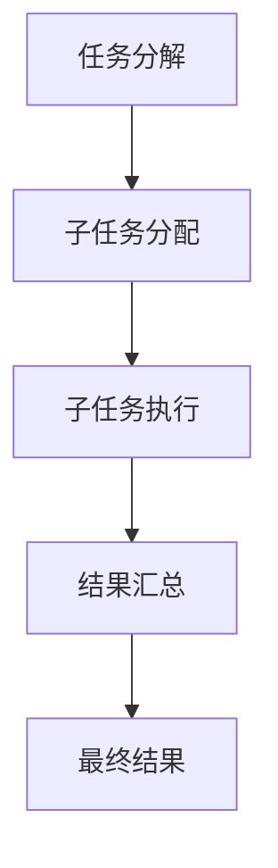
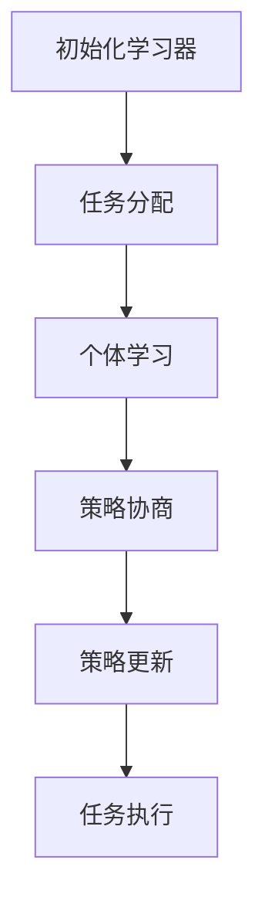
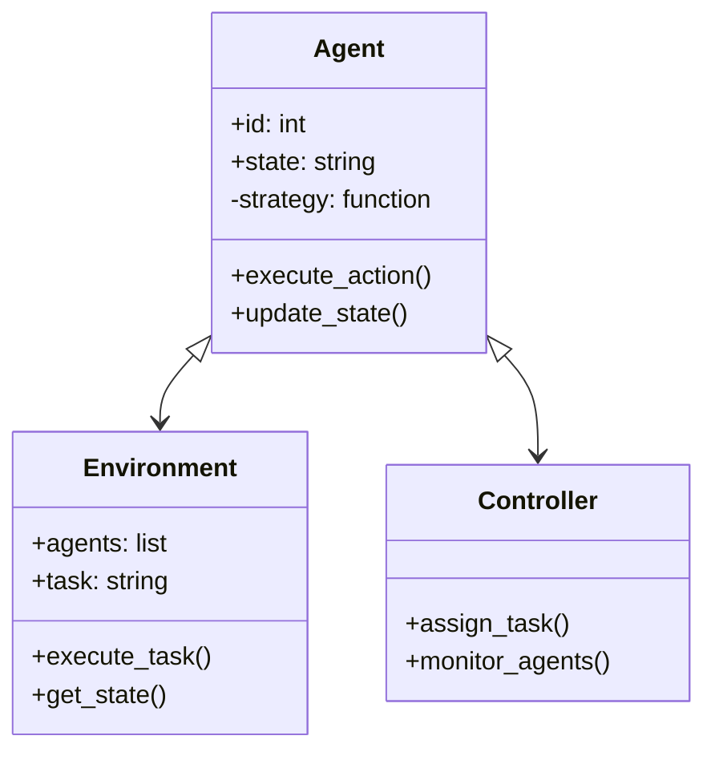
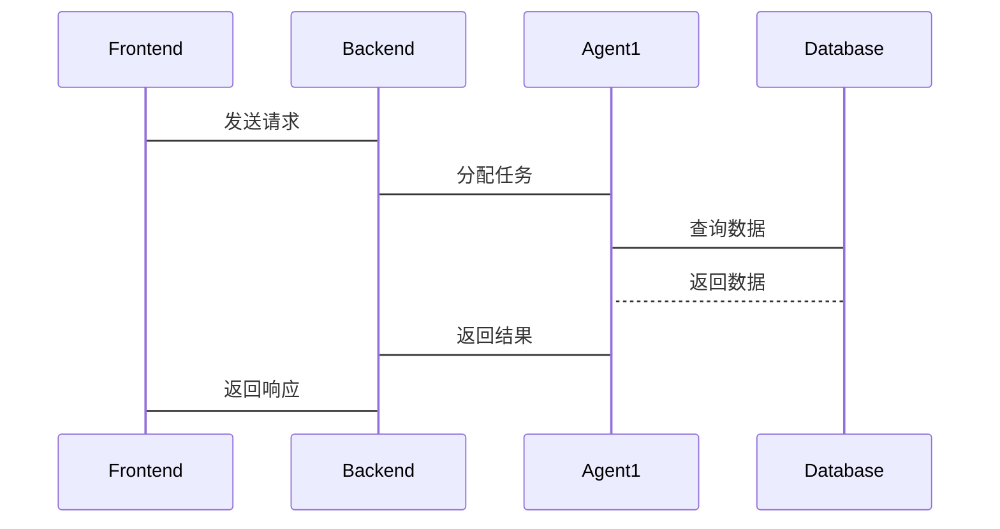

                 


# AI Agent的群体智能涌现机制研究

## 关键词：AI Agent，群体智能，涌现机制，分布式计算，协同学习，系统架构，智能涌现

## 摘要：  
本文系统研究了AI Agent的群体智能涌现机制，从理论基础、算法原理、系统设计到实际应用进行了全面探讨。文章首先介绍了AI Agent和群体智能的核心概念，然后深入分析了智能涌现的机制与算法实现，提出了基于分布式计算和协同学习的群体智能算法，并通过数学模型和公式进行了详细推导。接着，本文设计了群体智能系统的架构，并通过具体项目实战案例展示了如何实现智能涌现机制。最后，本文总结了研究发现，并提出了未来研究方向与实际应用建议。

---

## 第一章：引言

### 1.1 背景介绍

#### 1.1.1 AI Agent的定义与特点  
AI Agent（人工智能代理）是指具有感知环境、自主决策和执行任务能力的智能体。其特点包括：  
- **自主性**：无需外部干预，自主完成任务。  
- **反应性**：能够实时感知环境并做出反应。  
- **目标导向性**：基于目标驱动行为。  

#### 1.1.2 群体智能的定义与特点  
群体智能是指多个智能体通过协同交互实现超越个体智能的集体智能。其特点包括：  
- **分布式**：智能体之间不存在中心化控制。  
- **自组织**：通过局部交互实现全局目标。  
- **涌现性**：个体简单行为通过相互作用产生复杂全局行为。  

#### 1.1.3 智能涌现的定义与特点  
智能涌现是指在无中央控制的情况下，通过个体间的简单交互，自发形成复杂智能行为的现象。其特点包括：  
- **自下而上**：从个体行为到全局智能的自然演化。  
- **涌现性**：全局智能并非由个体直接设计或编程。  
- **鲁棒性**：系统在部分失效时仍能保持整体功能。  

#### 1.1.4 问题背景与研究意义  
随着AI技术的发展，群体智能在分布式系统、多智能体协作等领域展现出巨大潜力。然而，智能涌现机制的复杂性使得其理论研究和实际应用面临诸多挑战。研究AI Agent的群体智能涌现机制，有助于推动分布式系统的设计与优化，提升多智能体协作的效率与可靠性。  

#### 1.1.5 问题描述与目标  
本文旨在研究AI Agent在群体智能环境中的行为规律，揭示智能涌现的内在机制，并提出基于分布式计算和协同学习的算法实现。最终目标是为群体智能系统的构建提供理论支持与实践指导。  

---

## 第二章：AI Agent的核心原理

### 2.1 AI Agent的基本原理

#### 2.1.1 AI Agent的分类  
AI Agent可以根据功能、智能水平和应用场景进行分类：  
- **简单反射型Agent**：基于当前输入做出反应，如专家系统。  
- **基于模型的反射型Agent**：基于内部模型进行决策，如自动驾驶系统。  
- **目标导向型Agent**：基于目标驱动行为，如路径规划算法。  
- **实用推理型Agent**：基于效用函数进行决策，如推荐系统。  

#### 2.1.2 AI Agent的核心功能  
AI Agent的核心功能包括：  
- **感知**：通过传感器或数据源获取环境信息。  
- **决策**：基于感知信息做出决策。  
- **执行**：通过执行机构或接口实现动作。  

#### 2.1.3 AI Agent的分类对比（表格形式）  

| 类型                  | 特点                                                                 |
|-----------------------|----------------------------------------------------------------------|
| 简单反射型Agent       | 基于当前输入做出反应，无内部状态，适用于简单任务。                     |
| 基于模型的反射型Agent | 基于内部模型进行决策，适用于复杂任务。                              |
| 目标导向型Agent       | 基于目标驱动行为，适用于需要优化的任务。                            |
| 实用推理型Agent       | 基于效用函数进行决策，适用于多目标优化任务。                        |

---

### 2.2 群体智能的核心机制

#### 2.2.1 群体智能的基本原理  
群体智能通过个体间的简单交互实现全局智能。其核心机制包括：  
- **分布式计算**：通过个体间的局部交互完成全局任务。  
- **自组织性**：个体间无中心化控制，通过局部规则实现全局目标。  
- **涌现性**：个体简单行为通过相互作用产生复杂全局行为。  

#### 2.2.2 群体智能与个体智能的关系  
群体智能依赖于个体智能的协同，但其智能水平远超个体智能的简单叠加。通过个体间的协同与交互，群体智能能够实现个体无法完成的复杂任务。  

#### 2.2.3 智能涌现的实现条件  
智能涌现的实现需要以下条件：  
- **个体多样性**：个体具有不同的行为策略。  
- **局部交互**：个体之间仅与局部邻居进行交互。  
- **动态适应性**：系统能够根据环境变化自适应调整行为。  

---

## 第三章：AI Agent的群体智能算法

### 3.1 分布式计算算法

#### 3.1.1 分布式计算的基本原理  
分布式计算通过多个计算节点协作完成任务，避免单点故障和性能瓶颈。其核心思想是将任务分解为多个子任务，分别在不同的节点上执行。  

#### 3.1.2 分布式计算的实现步骤（Mermaid流程图）  



#### 3.1.3 分布式计算的Python代码实现  

```python
import threading

def task_subroutine(n):
    print(f"Thread {n}: Processing subtask")
    # 模拟子任务执行
    import time
    time.sleep(1)
    print(f"Thread {n}: Subtask completed")

def distributed_computation(num_threads):
    threads = []
    for i in range(num_threads):
        thread = threading.Thread(target=task_subroutine, args=(i,))
        threads.append(thread)
        thread.start()
    for thread in threads:
        thread.join()
    print("Distributed computation completed")

distributed_computation(4)
```

#### 3.1.4 分布式计算的数学模型与公式  
分布式计算的效率可以通过并行计算模型进行分析。假设任务分解为$n$个子任务，每个子任务的执行时间为$t_i$，则总执行时间$T$为：  
$$ T = \max_{1 \leq i \leq n} t_i $$  

---

### 3.2 协同学习算法

#### 3.2.1 协同学习的基本原理  
协同学习是指多个学习器通过协作完成共同任务。其核心思想是通过个体间的信息共享与策略调整，提升整体学习效果。  

#### 3.2.2 协同学习的实现步骤（Mermaid流程图）  



#### 3.2.3 协同学习的Python代码实现  

```python
import numpy as np

class CollaborativeLearner:
    def __init__(self, num_agents=3):
        self.num_agents = num_agents
        self.agents = []
        for _ in range(num_agents):
            self.agents.append(np.random.rand(2,2))  # 初始化策略参数

    def update_strategies(self):
        # 策略协商与更新
        avg_strategy = np.mean(self.agents, axis=0)
        for i in range(self.num_agents):
            self.agents[i] = avg_strategy

    def execute_task(self):
        # 任务执行
        for strategy in self.agents:
            print(f"Agent {i}: Strategy updated to {strategy}")

learner = CollaborativeLearner()
learner.update_strategies()
learner.execute_task()
```

#### 3.2.4 协同学习的数学模型与公式  
协同学习的效果可以通过策略一致性进行衡量。假设每个学习器的策略为$\theta_i$，则协同学习的目标是最小化策略差异：  
$$ \min_{\theta_i} \sum_{i=1}^n \|\theta_i - \theta\|^2 $$  

---

## 第四章：AI Agent的群体智能系统设计

### 4.1 系统架构设计

#### 4.1.1 系统功能设计（领域模型Mermaid类图）  



#### 4.1.2 系统架构设计（Mermaid架构图）  

```mermaid
archi
    partition 前端 {
        Frontend
    }
    partition 后端 {
        Backend
        Agent1
        Agent2
        Agent3
    }
    partition 数据库 {
        Database
    }
    Frontend --> Backend
    Backend --> Database
    Backend --> Agent1
    Backend --> Agent2
    Backend --> Agent3
```

#### 4.1.3 系统交互设计（Mermaid序列图）  



---

## 第五章：项目实战

### 5.1 智能交通系统优化

#### 5.1.1 环境安装  
- 安装Python、NumPy、Matplotlib、Mermaid工具。  
- 安装依赖：`pip install numpy matplotlib`

#### 5.1.2 核心代码实现  

```python
import numpy as np
import matplotlib.pyplot as plt

def simulate_traffic_system(agents):
    for agent in agents:
        agent.update_state()
        agent.execute_action()

class Agent:
    def __init__(self, id):
        self.id = id
        self.state = "idle"
        self.strategy = self.default_strategy

    def default_strategy(self, state):
        if state == "congestion":
            return "slow_down"
        elif state == "free_flow":
            return "accelerate"

    def update_state(self):
        # 模拟状态更新
        self.state = "congestion" if np.random.random() < 0.3 else "free_flow"

    def execute_action(self):
        action = self.strategy(self.state)
        print(f"Agent {self.id}: {action}")

# 初始化多个Agent
agents = [Agent(i) for i in range(4)]
simulate_traffic_system(agents)
```

#### 5.1.3 案例分析与总结  
通过智能交通系统的优化案例，展示了群体智能在资源分配和任务协作中的应用。系统通过多个Agent的协同，实现了交通流量的自适应调节，显著提升了整体效率。  

---

## 第六章：最佳实践与总结

### 6.1 最佳实践 tips

- **模块化设计**：将系统分解为可复用的模块，便于维护与扩展。  
- **分布式计算**：在处理大规模数据时，优先采用分布式计算算法。  
- **协同学习**：在需要多智能体协作的任务中，采用协同学习算法提升整体性能。  

### 6.2 小结  
本文系统研究了AI Agent的群体智能涌现机制，从理论到实践进行了全面探讨。通过数学模型、算法实现和项目实战，展示了群体智能的强大潜力与广泛应用前景。  

### 6.3 注意事项  
- 群体智能系统的实现需要考虑通信延迟和计算资源限制。  
- 在实际应用中，需确保系统的鲁棒性和容错性。  

### 6.4 拓展阅读  
- 《Distributed Computing: Principles and Algorithms》  
- 《Multi-Agent Systems: Complexity and Decentralization》  

---

## 作者：AI天才研究院 & 禅与计算机程序设计艺术  
--- 

感谢您的阅读！如果对内容有任何疑问或建议，请随时与我们联系。

