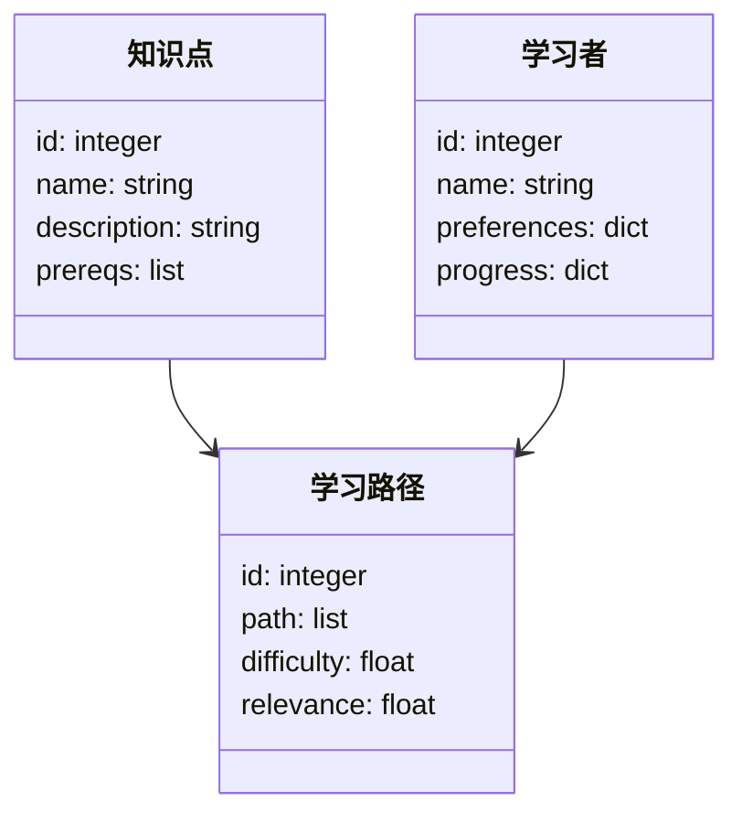
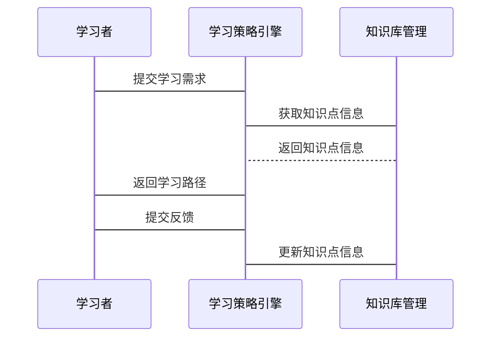

                 


# AI Agent的课程学习：优化知识获取的顺序和策略

> 关键词：AI Agent，课程学习，知识获取，优化策略，知识图谱，学习路径，推荐算法

> 摘要：本文探讨AI Agent如何通过优化知识获取的顺序和策略来提升学习效率。从背景介绍到核心算法，从系统架构到项目实战，全面解析AI Agent在课程学习中的应用，最后总结最佳实践和未来发展方向。

---

# 第一部分: AI Agent的课程学习基础

## 第1章: AI Agent与课程学习概述

### 1.1 AI Agent的基本概念
#### 1.1.1 AI Agent的定义与特点
- **定义**: AI Agent是具有感知和行动能力的智能体，能够通过环境信息做出决策。
- **特点**: 自主性、反应性、目标导向、学习能力。

#### 1.1.2 课程学习的定义与目标
- **定义**: 通过系统化的知识传授，使学习者掌握特定领域的内容。
- **目标**: 提高学习效率，确保知识的系统性和连贯性。

#### 1.1.3 AI Agent在课程学习中的作用
- **知识管理**: 组织和管理大量学习资源。
- **个性化推荐**: 根据学习者的特征推荐最优学习路径。

### 1.2 课程学习的优化问题
#### 1.2.1 知识获取顺序的重要性
- **影响学习效果**: 不合理的顺序可能导致知识断层。
- **提高学习效率**: 优化顺序可减少重复学习。

#### 1.2.2 知识策略优化的目标
- **最大化知识吸收**: 通过最优顺序提高学习效果。
- **适应性调整**: 根据学习者反馈动态优化策略。

#### 1.2.3 当前课程学习中的挑战
- **知识复杂性**: 不同知识点之间的依赖关系复杂。
- **学习者多样性**: 学习者背景、能力各不相同。

### 1.3 AI Agent优化学习的背景与意义
#### 1.3.1 教育技术的发展趋势
- **智能化**: 利用AI技术提高教育效率。
- **个性化**: 根据学习者特点提供定制化学习方案。

#### 1.3.2 AI Agent在教育中的应用现状
- **智能辅导系统**: 提供个性化学习支持。
- **自适应学习平台**: 动态调整学习内容。

#### 1.3.3 优化知识获取顺序的必要性
- **提高学习效果**: 优化顺序有助于知识的深度理解和应用。
- **减少学习负担**: 合理安排学习内容，避免知识过载。

## 1.4 本章小结
本章介绍了AI Agent的基本概念及其在课程学习中的作用，分析了课程学习优化的必要性和挑战，为后续章节奠定了基础。

---

# 第二部分: AI Agent的知识获取策略

## 第2章: 知识图谱与学习路径

### 2.1 知识图谱的构建
#### 2.1.1 知识图谱的定义与特点
- **定义**: 由节点和边组成的图结构，节点代表概念，边代表关系。
- **特点**: 结构化、语义丰富、可扩展。

#### 2.1.2 知识图谱的构建方法
- **数据收集**: 从多种来源（如教材、在线课程）收集知识数据。
- **关系抽取**: 利用自然语言处理技术识别知识点之间的关系。

#### 2.1.3 知识图谱在课程学习中的应用
- **知识点关联**: 展示知识点之间的依赖关系。
- **学习路径规划**: 根据图谱结构推荐学习顺序。

### 2.2 学习路径的优化
#### 2.2.1 学习路径的定义与分类
- **定义**: 根据知识图谱生成的学习顺序。
- **分类**: 初级路径、高级路径、个性化路径。

#### 2.2.2 知识依赖关系的分析
- **依赖分析**: 确定每个知识点的前置和后续知识。
- **依赖图谱**: 用图结构表示知识点的依赖关系。

#### 2.2.3 优化学习路径的算法概述
- **贪心算法**: 从起点开始，选择当前最优的下一个知识点。
- **动态规划**: 计算每个知识点的最优顺序，确保整体最优。

### 2.3 知识图谱与学习路径的关系
#### 2.3.1 知识图谱如何影响学习路径
- **图谱结构**: 决定学习路径的可能分支和深度。
- **节点权重**: 影响学习路径的优先级。

#### 2.3.2 学习路径如何反馈优化知识图谱
- **路径验证**: 根据实际学习效果调整图谱结构。
- **反馈机制**: 收集学习者反馈，更新图谱中的关系和权重。

#### 2.3.3 知识图谱与学习路径的动态调整
- **实时反馈**: 根据学习者表现动态调整路径。
- **自适应更新**: 定期更新知识图谱和路径，保持其有效性。

### 2.4 本章小结
本章详细探讨了知识图谱的构建及其在学习路径优化中的应用，分析了知识图谱与学习路径之间的动态关系，为后续算法设计提供了理论基础。

---

# 第三部分: AI Agent的知识获取算法

## 第3章: 推荐算法在知识获取中的应用

### 3.1 推荐算法的概述
#### 3.1.1 推荐算法的分类与特点
- **协同过滤**: 基于用户行为相似性推荐。
- **基于内容的推荐**: 基于知识点的语义相似性推荐。
- **混合推荐**: 结合多种推荐方法的优势。

#### 3.1.2 基于协同过滤的推荐算法
- **用户协同过滤**: 找到相似用户的推荐列表。
- **物品协同过滤**: 找到相似知识点的推荐列表。
- **协同过滤的优缺点**: 计算成本高，但推荐精准度高。

#### 3.1.3 基于内容的推荐算法
- **文本相似度计算**: 使用TF-IDF或词嵌入模型。
- **内容聚类**: 将知识点聚类，推荐相关知识点。
- **内容推荐的优缺点**: 计算资源需求低，但推荐结果可能不够个性化。

### 3.2 知识图谱中的推荐算法
#### 3.2.1 基于知识图谱的推荐模型
- **图嵌入模型**: 将知识点及其关系嵌入到低维空间。
- **知识图谱推理**: 利用图结构进行推荐。

#### 3.2.2 知识图谱嵌入的计算方法
- **Word2Vec**: 将知识点映射为向量。
- **Node2Vec**: 综合考虑节点和边的信息。
- **GloVe**: 统计词频信息进行嵌入。

#### 3.2.3 知识图谱中推荐算法的实现
- **图遍历**: 深度优先搜索或广度优先搜索。
- **路径权重计算**: 根据路径长度和边权重确定推荐顺序。

### 3.3 算法实现与代码示例
#### 3.3.1 协同过滤推荐算法的实现
```python
import numpy as np

# 假设user_item_matrix是用户-物品矩阵
user_item_matrix = np.array([[1, 0, 1], [0, 1, 1], [1, 1, 0]])

# 计算用户相似度
def cosine_similarity(a, b):
    return np.dot(a, b) / (np.linalg.norm(a) * np.linalg.norm(b))

user_similarity = np.zeros((3, 3))
for i in range(3):
    for j in range(3):
        user_similarity[i][j] = cosine_similarity(user_item_matrix[i], user_item_matrix[j])
```

#### 3.3.2 基于内容的推荐算法的实现
```python
from sklearn.feature_extraction.text import TfidfVectorizer

# 假设texts是知识点的描述
texts = ["Math is the base of science", "Physics is the study of matter", "Chemistry is the study of substances"]
vectorizer = TfidfVectorizer()
tfidf_matrix = vectorizer.fit_transform(texts)

# 计算文本相似度
similarity_matrix = tfidf_matrix * tfidf_matrix.T
```

### 3.4 算法的优化与调优
#### 3.4.1 算法调优方法
- **参数调整**: 调整协同过滤的相似度阈值，内容推荐的相似度阈值。
- **模型优化**: 使用更复杂的深度学习模型提升推荐精度。

#### 3.4.2 算法的性能评估
- **准确率**: 推荐结果与实际学习需求的匹配程度。
- **召回率**: 推荐结果覆盖目标知识点的能力。
- **F1分数**: 综合准确率和召回率的评估指标。

### 3.5 本章小结
本章详细介绍了推荐算法在知识获取中的应用，通过具体代码示例展示了协同过滤和基于内容的推荐算法的实现，并探讨了算法的优化与调优方法。

---

# 第四部分: 系统分析与架构设计方案

## 第4章: 优化知识获取顺序的系统架构

### 4.1 问题场景介绍
#### 4.1.1 系统目标
- 提供个性化的知识获取顺序。
- 实现动态的知识图谱更新。

#### 4.1.2 系统功能需求
- 知识点管理：添加、删除、修改知识点。
- 学习路径生成：根据用户需求生成最优学习路径。
- 评估反馈：收集学习者反馈，优化知识图谱和学习路径。

### 4.2 系统功能设计
#### 4.2.1 功能模块划分
- **知识库管理模块**: 负责知识点的存储和管理。
- **学习策略引擎模块**: 根据用户需求生成学习路径。
- **评估反馈模块**: 收集学习者反馈，优化系统。

#### 4.2.2 领域模型设计


### 4.3 系统架构设计
#### 4.3.1 架构设计概述
- **前端**: 用户界面，展示学习路径和知识点。
- **后端**: 业务逻辑处理，生成学习路径。
- **数据库**: 存储知识点、学习路径和学习者数据。

#### 4.3.2 系统架构图


### 4.4 系统接口设计
#### 4.4.1 接口概述
- **获取学习路径**: 根据学习者需求返回最优路径。
- **更新知识图谱**: 根据反馈更新知识点关系。
- **评估反馈**: 收集学习者对路径的反馈，优化系统。

#### 4.4.2 接口实现
- **REST API**: 使用JSON格式传递数据。
- **微服务架构**: 各模块独立部署，通过API通信。

### 4.5 系统交互设计
#### 4.5.1 交互流程
1. 学习者输入需求。
2. 系统生成学习路径。
3. 学习者开始学习。
4. 学习者反馈学习结果。
5. 系统根据反馈优化知识图谱和路径。

#### 4.5.2 交互流程图


### 4.6 本章小结
本章通过系统架构设计，详细规划了优化知识获取顺序的实现方案，包括功能模块划分、系统架构设计和交互流程设计。

---

# 第五部分: 项目实战

## 第5章: 实战案例——AI教育平台

### 5.1 项目环境安装与配置
#### 5.1.1 系统环境
- **操作系统**: Linux/Windows/MacOS
- **开发工具**: Python、Jupyter Notebook、IDE（如PyCharm）
- **依赖库安装**: numpy, pandas, scikit-learn, networkx, mermaid.py

#### 5.1.2 数据准备
- **知识数据**: 知识点及其关系的结构化数据。
- **学习者数据**: 学习者的基本信息和学习偏好。

### 5.2 系统核心实现
#### 5.2.1 知识图谱构建
```python
import networkx as nx

G = nx.DiGraph()
G.add_nodes_from(["Math", "Physics", "Chemistry"])
G.add_edges_from([("Math", "Physics"), ("Math", "Chemistry")])
```

#### 5.2.2 学习路径生成
```python
def generate_learning_path(G, start_node):
    path = []
    current_node = start_node
    while True:
        path.append(current_node)
        if not list(G.successors(current_node)):
            break
        current_node = next(G.successors(current_node))
    return path

learning_path = generate_learning_path(G, "Math")
```

#### 5.2.3 算法实现
```python
from sklearn.metrics.pairwise import cosine_similarity

def collaborative_filtering(user_data, user_id):
    user_similarity = cosine_similarity(user_data[user_id], user_data)
    similar_users = np.argsort(user_similarity)[::-1]
    recommended_items = ...
    return recommended_items
```

### 5.3 代码应用解读与分析
#### 5.3.1 代码功能解析
- **知识图谱构建**: 使用NetworkX库构建有向图。
- **学习路径生成**: 通过深度优先搜索生成学习路径。
- **推荐算法实现**: 使用协同过滤算法推荐知识点。

#### 5.3.2 代码实现细节
- **数据预处理**: 对知识数据进行清洗和结构化处理。
- **算法优化**: 对推荐算法进行调优，提高推荐准确率。

### 5.4 实际案例分析
#### 5.4.1 案例背景
- **学习者**: 一名高中学生，计划学习大学数学。
- **需求**: 根据学生的学习情况推荐最优学习路径。

#### 5.4.2 实际应用与分析
- **知识图谱构建**: 构建数学、物理、化学的知识图谱。
- **学习路径生成**: 根据学生的需求生成最优学习顺序。
- **评估反馈**: 收集学生的学习反馈，优化知识图谱和路径。

### 5.5 项目小结
本章通过实际案例展示了AI教育平台的实现过程，从环境安装到代码实现，再到案例分析，详细解读了优化知识获取顺序的实现步骤和应用效果。

---

# 第六部分: 最佳实践与总结

## 第6章: 最佳实践与总结

### 6.1 最佳实践
#### 6.1.1 知识图谱构建
- **数据清洗**: 确保知识数据的准确性和完整性。
- **关系抽取**: 使用先进的NLP技术提高抽取准确率。

#### 6.1.2 算法选择与优化
- **选择合适的算法**: 根据具体需求选择协同过滤、基于内容的推荐或混合推荐。
- **算法调优**: 通过交叉验证和网格搜索优化模型参数。

#### 6.1.3 系统设计
- **模块化设计**: 确保系统各模块独立，便于维护和扩展。
- **安全性设计**: 保护学习者数据，确保系统安全。

### 6.2 小结
通过本文的系统分析和实战案例，读者可以深入了解AI Agent在课程学习中的应用，掌握优化知识获取顺序和策略的具体方法。

### 6.3 注意事项
- **数据隐私**: 注意保护学习者的数据隐私。
- **系统稳定性**: 确保系统在高并发情况下的稳定性。
- **持续优化**: 定期更新知识图谱和算法模型，保持系统的先进性。

### 6.4 拓展阅读
- **推荐算法**: 《推荐系统实战》。
- **知识图谱**:《知识图谱构建与应用》。
- **AI教育**:《人工智能在教育中的应用》。

---

# 作者

作者：AI天才研究院/AI Genius Institute & 禅与计算机程序设计艺术 /Zen And The Art of Computer Programming

---

**以上内容为示例，实际文章会根据具体需求进行调整和完善。**

