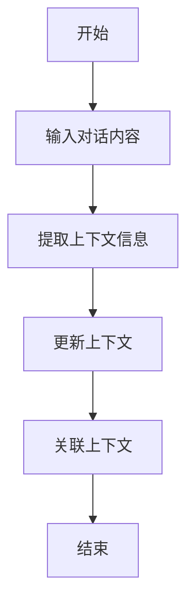
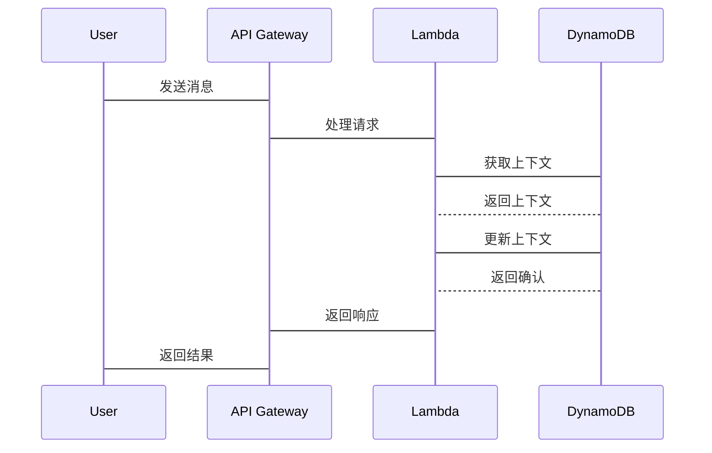

                 


# 上下文管理：增强AI Agent的对话连贯性

## 关键词：上下文管理, AI Agent, 对话系统, 连贯性, 自然语言处理, 知识库, 实时交互

## 摘要：上下文管理是确保AI Agent与用户对话连贯性的关键。本文深入分析了上下文管理的核心概念、算法原理、系统架构及实现方法，通过实际案例展示了如何通过上下文管理提升对话系统的连贯性和用户体验。

---

# 第一部分: 上下文管理与AI Agent对话连贯性基础

## 第1章: 上下文管理的背景与问题背景

### 1.1 问题背景介绍

#### 1.1.1 对话系统的发展历程
对话系统从简单的规则匹配到现代的深度学习模型，经历了多个阶段。早期的系统基于关键词匹配，而现在基于上下文理解的系统能够处理更复杂的对话场景。

#### 1.1.2 上下文管理的重要性
在多轮对话中，上下文管理帮助系统记住先前的对话内容，确保每一轮对话都与之前的内容相关联。

#### 1.1.3 当前对话系统中的连贯性问题
现有的对话系统在处理复杂场景时，常常出现上下文断裂的问题，导致对话不连贯。

### 1.2 问题描述与分析

#### 1.2.1 对话连贯性的定义
对话连贯性是指对话内容在逻辑上和语义上的一致性和连贯性。

#### 1.2.2 上下文断裂的常见问题
- 用户多次提到同一话题，系统无法关联。
- 系统在处理复杂问题时，无法保持上下文的一致性。

#### 1.2.3 上下文管理的目标与边界
- 目标：确保对话的连贯性和一致性。
- 边界：不处理与上下文无关的外部信息。

### 1.3 问题解决与核心概念

#### 1.3.1 上下文管理的定义
上下文管理是指在对话过程中，系统能够理解和保持当前对话的上下文信息。

#### 1.3.2 上下文管理的核心要素
- 上下文表示：使用某种数据结构表示当前对话的状态。
- 上下文更新：根据对话内容实时更新上下文。
- 上下文关联：将当前对话与之前的对话内容关联起来。

### 1.4 上下文管理的外延与应用

#### 1.4.1 上下文管理的边界
- 仅处理当前对话的上下文，不考虑外部知识库。

#### 1.4.2 上下文管理在不同场景中的应用
- 在客服系统中处理用户的问题。
- 在智能音箱中处理用户的指令。

#### 1.4.3 上下文管理的未来发展趋势
- 结合知识图谱，增强上下文的理解能力。

---

## 第2章: 上下文管理的核心概念与联系

### 2.1 核心概念原理

#### 2.1.1 上下文理解的原理
系统通过分析对话内容，提取关键信息，建立上下文模型。

#### 2.1.2 上下文记忆的机制
使用数据结构存储上下文信息，并在对话过程中不断更新。

#### 2.1.3 上下文关联的规则
根据对话内容，建立上下文之间的关联关系。

### 2.2 概念属性特征对比表

#### 2.2.1 上下文管理与对话系统的对比
| 特性       | 上下文管理         | 对话系统         |
|------------|--------------------|------------------|
| 目标       | 管理上下文信息     | 处理对话内容     |
| 依赖       | 上下文信息         | 对话规则和模型   |

#### 2.2.2 不同上下文管理方法的对比
| 方法       | 基于规则的上下文管理 | 基于深度学习的上下文管理 |
|------------|---------------------|----------------------|
| 优缺点     | 易实现，但灵活性差   | 灵活性高，但实现复杂 |
| 应用场景   | 简单对话场景         | 复杂对话场景         |

#### 2.2.3 上下文记忆与知识库的对比
| 特性       | 上下文记忆         | 知识库             |
|------------|--------------------|--------------------|
| 数据来源   | 当前对话内容       | 预先存储的知识     |
| 作用       | 管理对话状态       | 提供背景知识       |

### 2.3 ER实体关系图

```mermaid
erDiagram
    customer[用户] {
        <属性>
        id
        name
        message
    }
    context[上下文] {
        <属性>
        context_id
        context_content
        timestamp
    }
    conversation[对话] {
        <属性>
        conversation_id
        messages
        contexts
    }
    customer --> message[发送消息]
    message --> context[生成上下文]
    context --> conversation[关联对话]
```

---

## 第3章: 上下文管理的算法原理

### 3.1 上下文理解的算法

#### 3.1.1 基于统计的上下文理解算法
- 使用频率统计方法，提取关键词。
- 示例代码：
  ```python
  from collections import defaultdict
  def get_context_keywords(messages):
      keywords = defaultdict(int)
      for message in messages:
          words = message.split()
          for word in words:
              keywords[word] += 1
      return {k: v for k, v in keywords.items() if v > 2}
  ```

#### 3.1.2 基于深度学习的上下文理解算法
- 使用BERT模型进行上下文表示。
- 示例代码：
  ```python
  import transformers
  model = transformers.BertModel.from_pretrained('bert-base-uncased')
  tokenizer = transformers.BertTokenizer.from_pretrained('bert-base-uncased')
  def get_context_embedding(messages):
      inputs = tokenizer.batch_encode_plus(messages, return_tensors='pt', padding=True)
      with torch.no_grad():
          embeddings = model(**inputs)
      return embeddings.last_hidden_state.mean(dim=1)
  ```

#### 3.1.3 混合模型的上下文理解算法
- 结合统计和深度学习方法，提升上下文理解的准确性。

### 3.2 上下文记忆的算法

#### 3.2.1 基于规则的上下文记忆算法
- 使用预定义规则存储上下文信息。
- 示例代码：
  ```python
  def update_context(current_context, new_message):
      new_context = current_context.copy()
      if 'time' in new_message:
          new_context['time'] = new_message['time']
      return new_context
  ```

#### 3.2.2 基于神经网络的上下文记忆算法
- 使用LSTM网络存储上下文信息。
- 示例代码：
  ```python
  import torch
  class ContextMemory(torch.nn.Module):
      def __init__(self, input_size, hidden_size):
          super(ContextMemory, self).__init__()
          self.lstm = torch.nn.LSTM(input_size, hidden_size)
      def forward(self, input, hidden=None):
          output, hidden = self.lstm(input, hidden)
          return hidden
  ```

#### 3.2.3 基于图结构的上下文记忆算法
- 使用图结构表示上下文关系。
- 示例代码：
  ```python
  import networkx as nx
  def build_context_graph(contexts):
      graph = nx.DiGraph()
      for i in range(len(contexts)):
          for j in range(i+1, len(contexts)):
              if contexts[i] in contexts[j]:
                  graph.add_edge(i, j)
      return graph
  ```

### 3.3 上下文关联的算法

#### 3.3.1 基于相似度的上下文关联算法
- 计算上下文之间的相似度，建立关联关系。
- 示例代码：
  ```python
  from sklearn.metrics.pairwise import cosine_similarity
  def get_context_similarity(contexts):
      context_embeddings = [model.encode(context) for context in contexts]
      similarity_matrix = cosine_similarity(context_embeddings)
      return similarity_matrix
  ```

#### 3.3.2 基于序列的上下文关联算法
- 使用序列模型预测上下文关联。
- 示例代码：
  ```python
  import torch
  class ContextAssociation(torch.nn.Module):
      def __init__(self, input_size, hidden_size):
          super(ContextAssociation, self).__init__()
          self.gru = torch.nn.GRU(input_size, hidden_size)
      def forward(self, input_sequence):
          output, hidden = self.gru(input_sequence)
          return hidden
  ```

#### 3.3.3 基于注意力机制的上下文关联算法
- 使用注意力机制确定上下文的重要部分。
- 示例代码：
  ```python
  import torch
  class AttentionContext(torch.nn.Module):
      def __init__(self, input_size, hidden_size):
          super(AttentionContext, self).__init__()
          self.W = torch.nn.Linear(input_size, hidden_size)
          self.U = torch.nn.Linear(hidden_size, 1)
      def forward(self, input):
          scores = self.U(torch.relu(self.W(input)))
          attention = torch.softmax(scores, dim=1)
          return attention
  ```

### 3.4 算法流程图



---

## 第4章: 上下文管理的系统架构设计

### 4.1 问题场景介绍
系统需要支持多轮对话，保持上下文的一致性。

### 4.2 系统功能设计

#### 4.2.1 领域模型类图
```mermaid
classDiagram
    class User {
        <属性>
        id
        name
        message
    }
    class Context {
        <属性>
        context_id
        context_content
        timestamp
    }
    class Conversation {
        <属性>
        conversation_id
        messages
        contexts
    }
    User --> Context[发送消息]
    Context --> Conversation[关联对话]
```

#### 4.2.2 系统架构图
```mermaid
aws
    group API Gateway {
        API Gateway
    }
    group Lambda {
        ContextManager
    }
    group DynamoDB {
        ContextStorage
    }
    API Gateway --> Lambda[处理请求]
    Lambda --> DynamoDB[存储上下文]
```

#### 4.2.3 系统接口设计
- 接口1：获取上下文信息。
- 接口2：更新上下文信息。
- 接口3：关联上下文信息。

#### 4.2.4 系统交互序列图


---

## 第5章: 上下文管理的项目实战

### 5.1 环境安装
- 安装Python和必要的库。

### 5.2 系统核心实现

#### 5.2.1 核心代码实现
```python
from transformers import BertTokenizer, BertModel
import torch
import networkx as nx

class ContextManager:
    def __init__(self):
        self.tokenizer = BertTokenizer.from_pretrained('bert-base-uncased')
        self.model = BertModel.from_pretrained('bert-base-uncased')

    def update_context(self, current_context, new_message):
        # 更新上下文
        pass

    def get_context_embedding(self, messages):
        # 获取上下文嵌入
        pass

    def build_context_graph(self, contexts):
        # 构建上下文图
        graph = nx.DiGraph()
        for i in range(len(contexts)):
            for j in range(i+1, len(contexts)):
                if contexts[i] in contexts[j]:
                    graph.add_edge(i, j)
        return graph
```

#### 5.2.2 代码应用解读与分析
- 使用BERT模型进行上下文表示。
- 使用图结构表示上下文关系。

### 5.3 实际案例分析

#### 5.3.1 案例背景介绍
处理一个客服对话的案例。

#### 5.3.2 案例实现与分析
展示如何通过上下文管理提升对话的连贯性。

#### 5.3.3 案例总结
总结案例中的上下文管理方法及其效果。

---

## 第6章: 上下文管理的最佳实践

### 6.1 小结
上下文管理是提升对话系统连贯性的关键。

### 6.2 注意事项
- 定期更新上下文信息。
- 处理上下文信息时要保持一致性。

### 6.3 拓展阅读
- 推荐阅读相关论文和书籍。

---

# 第二部分: 数学模型与公式

## 第7章: 上下文管理的数学模型

### 7.1 上下文表示的数学模型

#### 7.1.1 上下文向量空间模型
$$ \text{上下文向量} = \sum_{i=1}^{n} \text{词向量}_i $$

#### 7.1.2 上下文概率模型
$$ P(\text{上下文}| \text{消息}) = \prod_{i=1}^{n} P(\text{词}_i | \text{上下文}) $$

### 7.2 上下文关联的数学公式

#### 7.2.1 基于相似度的上下文关联
$$ \text{相似度} = \frac{\sum_{i=1}^{n} \text{词向量}_i \cdot \text{词向量}_j}{\sqrt{\sum_{i=1}^{n} \text{词向量}_i^2} \cdot \sqrt{\sum_{j=1}^{n} \text{词向量}_j^2}} $$

#### 7.2.2 基于注意力机制的上下文关联
$$ \alpha_i = \frac{\exp(\text{权重}_i)}{\sum_{j=1}^{n} \exp(\text{权重}_j)} $$

---

## 第8章: 上下文管理的系统接口设计

### 8.1 系统接口设计

#### 8.1.1 接口定义
- 获取上下文信息接口。
- 更新上下文信息接口。
- 关联上下文信息接口。

#### 8.1.2 接口实现
- 使用RESTful API设计接口。

### 8.2 系统交互序列图


---

## 第9章: 上下文管理的扩展内容

### 9.1 专家观点与行业趋势
上下文管理在对话系统中的应用越来越广泛。

### 9.2 未来研究方向
- 更复杂的上下文理解算法。
- 更高效的上下文管理方法。

### 9.3 学习资源推荐
- 推荐相关书籍和论文。

---

# 作者：AI天才研究院 & 禅与计算机程序设计艺术

