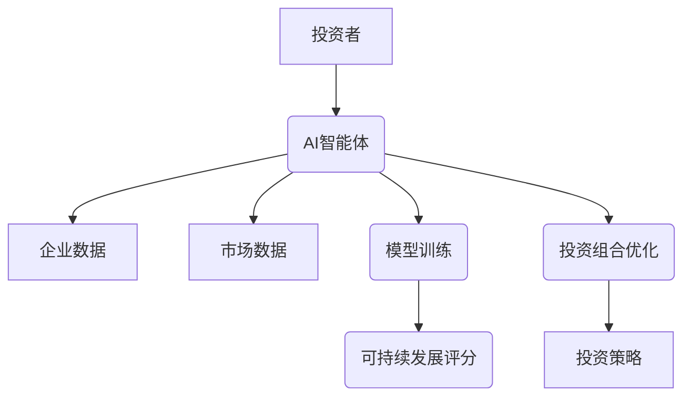
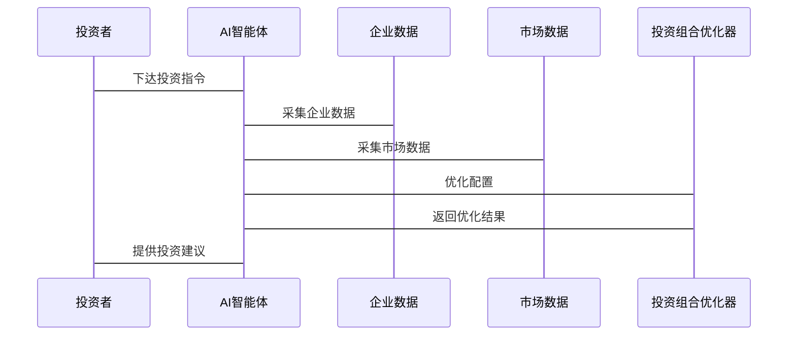
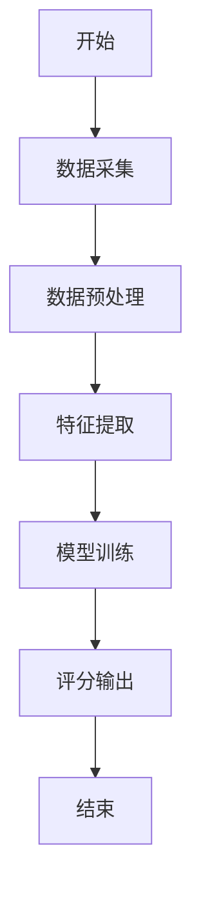
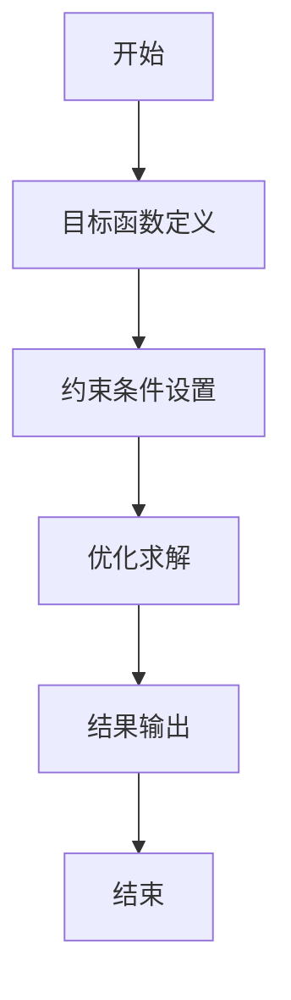
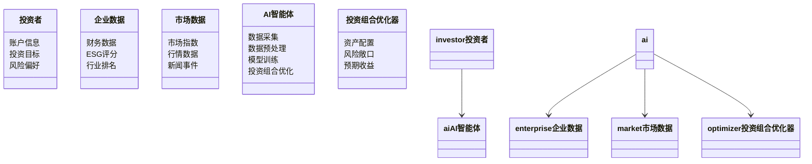
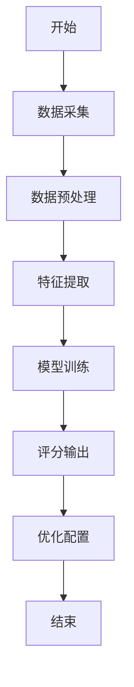

                 


# 《价值投资中的AI智能体可持续发展能力分析系统》

---

## 关键词：  
价值投资、人工智能、智能体、可持续发展、系统分析、算法优化、项目实战

---

## 摘要：  
本文深入探讨了在价值投资领域中，如何利用人工智能技术构建可持续发展能力分析系统。通过系统化的分析和设计，提出了基于AI智能体的可持续发展能力评估模型和价值投资决策优化算法。文章从背景介绍、核心概念、算法原理、系统架构到项目实战，全面解析了该系统的构建过程和应用场景，旨在为投资者提供科学、可靠的决策支持工具。

---

## 正文：  

---

## 第一部分：价值投资中的AI智能体可持续发展能力分析系统概述  

### 第1章：背景介绍  

#### 1.1 价值投资与可持续发展的概念  

##### 1.1.1 价值投资的基本定义  
价值投资是一种投资策略，旨在通过分析企业的基本面（如财务状况、行业地位、盈利能力等）来寻找被市场低估的投资标的。其核心在于长期持有的优质资产，而非短期市场波动。  

##### 1.1.2 可持续发展的核心内涵  
可持续发展是指在满足当前需求的同时，不损害后代人满足其需求的能力。在投资领域，可持续发展强调关注环境、社会和治理（ESG）因素，以实现长期的经济、社会和环境效益。  

##### 1.1.3 价值投资与可持续发展的关联性  
将可持续发展理念融入价值投资，不仅能够筛选出具有长期竞争优势的企业，还能帮助投资者规避因环境或社会问题带来的风险。AI技术的应用进一步提升了这种筛选的效率和精准度。  

---

#### 1.2 AI智能体在金融领域的应用背景  

##### 1.2.1 AI技术在金融分析中的作用  
人工智能技术（如机器学习、自然语言处理、计算机视觉等）在金融领域的应用日益广泛，特别是在数据处理、风险评估、投资组合优化等方面展现了强大的能力。  

##### 1.2.2 可持续发展能力分析的必要性  
随着全球对可持续发展的关注增加，投资者需要更高效的方法来评估企业的可持续发展能力。AI智能体能够通过大数据分析和模型构建，提供量化评估依据。  

##### 1.2.3 价值投资中的AI智能体目标  
在价值投资中，AI智能体的目标是通过分析企业的财务数据、行业动态、市场趋势等，识别具有长期投资价值的标的，并优化投资组合，降低风险。  

---

### 第2章：核心概念与联系  

#### 2.1 AI智能体的定义与属性  

##### 2.1.1 AI智能体的基本定义  
AI智能体是一种能够感知环境、自主决策并执行任务的智能系统。在价值投资中，AI智能体可以用于数据收集、分析、预测和决策支持。  

##### 2.1.2 AI智能体的核心属性特征对比  
| 特性       | 描述                                                                 |
|------------|----------------------------------------------------------------------|
| 感知能力   | 能够从数据中提取信息并理解环境特征。                                     |
| 学习能力   | 通过机器学习算法不断优化模型和决策策略。                                 |
| 决策能力   | 基于分析结果，生成最优的投资决策。                                       |
| 执行能力   | 能够通过API或其他接口与外部系统交互并执行操作。                         |

##### 2.1.3 AI智能体的ER实体关系图  

```mermaid
erDiagram
    actor 投资者 {
        <属性> 账户信息
        <属性> 投资目标
        <属性> 风险偏好
    }
    entity 企业 {
        <属性> 财务数据
        <属性> ESG评分
        <属性> 行业排名
    }
    entity 市场数据 {
        <属性> 市场指数
        <属性> 行情数据
        <属性> 新闻事件
    }
    entity 投资组合 {
        <属性> 资产配置
        <属性> 风险敞口
        <属性> 预期收益
    }
    relation 系统功能 {
        投资者 --> AI智能体 : 下达投资指令
        AI智能体 --> 企业 : 数据采集
        AI智能体 --> 市场数据 : 数据采集
        AI智能体 --> 投资组合 : 优化配置
    }
```

---

#### 2.2 可持续发展能力分析系统架构  

##### 2.2.1 系统整体架构图  



##### 2.2.2 系统功能模块划分  

| 功能模块       | 描述                                   |
|----------------|--------------------------------------|
| 数据采集       | 从企业财报、ESG报告、市场行情等获取数据。 |
| 数据预处理     | 清洗、标准化和特征提取数据。           |
| 模型训练       | 基于机器学习算法构建预测模型。         |
| 可持续发展评分 | 对企业进行ESG评分和风险评估。           |
| 投资组合优化   | 根据评分结果优化投资组合配置。         |

##### 2.2.3 系统与外部环境的交互关系  



---

### 第3章：算法原理讲解  

#### 3.1 可持续发展能力评估算法  

##### 3.1.1 算法流程图  



##### 3.1.2 算法实现代码  

```python
import pandas as pd
from sklearn.model_selection import train_test_split
from sklearn.ensemble import RandomForestRegressor

# 数据加载
data = pd.read_csv('sustainability_data.csv')

# 数据分割
X = data.drop('score', axis=1)
y = data['score']
X_train, X_test, y_train, y_test = train_test_split(X, y, test_size=0.2, random_state=42)

# 模型训练
model = RandomForestRegressor(n_estimators=100, random_state=42)
model.fit(X_train, y_train)

# 预测结果
y_pred = model.predict(X_test)
print('预测结果:', y_pred)
```

##### 3.1.3 算法数学模型  

$$ \text{预测评分} = \sum_{i=1}^{n} w_i \cdot x_i $$  

其中，$w_i$ 是特征 $x_i$ 的权重系数，通过随机森林模型训练得到。  

---

#### 3.2 价值投资决策优化算法  

##### 3.2.1 算法流程图  



##### 3.2.2 算法实现代码  

```python
import numpy as np
from scipy.optimize import minimize

# 定义目标函数
def objective(x, constraints):
    return -sum(x * np.log(x))  # 示例：最大化信息熵

# 约束条件
constraints = [
    {'type': 'eq', 'fun': lambda x: sum(x) - 1},
    {'type': 'ineq', 'fun': lambda x: x >= 0}
]

# 初始化
x0 = np.array([0.3, 0.3, 0.4])

# 求解
result = minimize(objective, x0, constraints=constraints, method='SLSQP')

# 输出结果
print('最优解:', result.x)
```

##### 3.2.3 算法数学模型  

$$ \text{最大化 } \sum_{i=1}^{n} x_i \cdot r_i - \lambda \cdot \text{风险指标} $$  

其中，$x_i$ 是投资比例，$r_i$ 是投资标的预期收益，$\lambda$ 是风险调整因子。  

---

### 第4章：数学模型与公式  

#### 4.1 可持续发展能力评估模型  

##### 4.1.1 模型公式  

$$ \text{ESG评分} = \alpha \cdot E + \beta \cdot S + \gamma \cdot G $$  

其中，$E$、$S$、$G$ 分别代表环境、社会和治理三个维度的评分，$\alpha$、$\beta$、$\gamma$ 是对应的权重系数。  

##### 4.1.2 模型变量解释  
- $E$：环境表现，包括碳排放、资源利用效率等。  
- $S$：社会责任，包括员工权益、公平劳动条件等。  
- $G$：公司治理，包括董事会结构、高管薪酬等。  

#### 4.2 价值投资决策优化模型  

##### 4.2.1 模型公式  

$$ \text{收益最大化} = \sum_{i=1}^{n} w_i \cdot r_i $$  

其中，$w_i$ 是投资权重，$r_i$ 是投资标的预期收益，满足 $\sum_{i=1}^{n} w_i = 1$。  

##### 4.2.2 模型变量解释  
- $w_i$：投资权重，表示对第 $i$ 个标的的投资比例。  
- $r_i$：预期收益，基于历史数据和模型预测得出。  

---

### 第5章：系统分析与架构设计方案  

#### 5.1 系统功能设计  

##### 5.1.1 领域模型类图  



##### 5.1.2 系统功能模块设计  

| 功能模块       | 描述                                   |
|----------------|--------------------------------------|
| 数据采集       | 从企业财报、ESG报告、市场行情等数据源获取数据。 |
| 数据预处理     | 清洗数据、特征提取和数据标准化。         |
| 模型训练       | 基于机器学习算法训练ESG评分模型和投资组合优化模型。 |
| 可持续发展评分 | 对企业进行ESG评分和风险评估。           |
| 投资组合优化   | 根据评分结果优化投资组合配置。         |

##### 5.1.3 系统功能流程图  



---

#### 5.2 系统架构设计  

##### 5.2.1 系统架构图  


##### 5.2.2 系统模块划分  

| 模块       | 描述                                   |
|------------|--------------------------------------|
| 数据采集模块 | 负责从企业财报、市场行情等数据源获取数据。 |
| 数据处理模块 | 对数据进行清洗、标准化和特征提取。       |
| 模型训练模块 | 基于机器学习算法训练ESG评分模型和投资组合优化模型。 |
| 投资组合优化模块 | 根据模型输出优化投资组合配置。         |

##### 5.2.3 系统接口设计  

- 输入接口：接受投资者的投资目标和风险偏好，获取企业数据和市场数据。  
- 输出接口：输出企业的ESG评分、投资组合优化建议和投资策略。  

---

### 第6章：项目实战  

#### 6.1 环境安装与配置  

##### 6.1.1 开发环境搭建  
- 操作系统：建议使用Linux或macOS。  
- 开发工具：推荐使用PyCharm或VS Code。  

##### 6.1.2 依赖库安装  
```bash
pip install pandas numpy scikit-learn
```

##### 6.1.3 数据集准备  
- 数据来源：企业财报、ESG报告、市场行情等。  
- 数据格式：CSV格式，字段包括企业名称、财务数据、ESG评分、市场指数等。  

---

#### 6.2 系统核心实现  

##### 6.2.1 核心算法实现  

```python
import pandas as pd
from sklearn.ensemble import RandomForestRegressor

# 数据加载
data = pd.read_csv('sustainability_data.csv')

# 数据分割
X = data.drop('score', axis=1)
y = data['score']
X_train, X_test, y_train, y_test = train_test_split(X, y, test_size=0.2, random_state=42)

# 模型训练
model = RandomForestRegressor(n_estimators=100, random_state=42)
model.fit(X_train, y_train)

# 预测结果
y_pred = model.predict(X_test)
print('预测结果:', y_pred)
```

##### 6.2.2 系统功能实现  

```python
import numpy as np
from scipy.optimize import minimize

# 定义目标函数
def objective(x, constraints):
    return -sum(x * np.log(x))  # 示例：最大化信息熵

# 约束条件
constraints = [
    {'type': 'eq', 'fun': lambda x: sum(x) - 1},
    {'type': 'ineq', 'fun': lambda x: x >= 0}
]

# 初始化
x0 = np.array([0.3, 0.3, 0.4])

# 求解
result = minimize(objective, x0, constraints=constraints, method='SLSQP')

# 输出结果
print('最优解:', result.x)
```

##### 6.2.3 代码应用解读与分析  
- 数据采集：从CSV文件中加载数据，包括企业财报、ESG评分等。  
- 数据预处理：分割数据集为训练集和测试集。  
- 模型训练：使用随机森林回归模型训练ESG评分预测模型。  
- 投资组合优化：基于优化算法，根据预测结果调整投资组合配置。  

---

### 第7章：最佳实践与总结  

#### 7.1 最佳实践 tips  

##### 7.1.1 系统设计中的注意事项  
- 确保数据来源的可靠性和及时性。  
- 在模型训练中，选择合适的特征和算法。  
- 定期更新模型参数，以应对市场变化。  

##### 7.1.2 算法实现中的常见问题  
- 数据不平衡：可以采用过采样或欠采样的方法。  
- 模型过拟合：可以通过交叉验证和正则化来优化。  
- 优化问题：确保目标函数和约束条件的定义合理。  

---

## 结语  

通过本文的详细讲解，读者可以深入了解如何在价值投资中构建基于AI智能体的可持续发展能力分析系统。从背景介绍到系统实现，再到项目实战，我们系统地展示了该系统的构建过程和应用场景。未来，随着AI技术的不断发展，此类系统将在投资领域发挥更大的作用，为投资者提供更科学、更可靠的决策支持。

---

## 作者：  
AI天才研究院/AI Genius Institute & 禅与计算机程序设计艺术/Zen And The Art of Computer Programming

