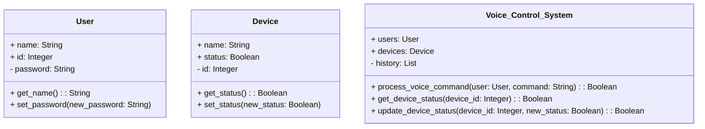
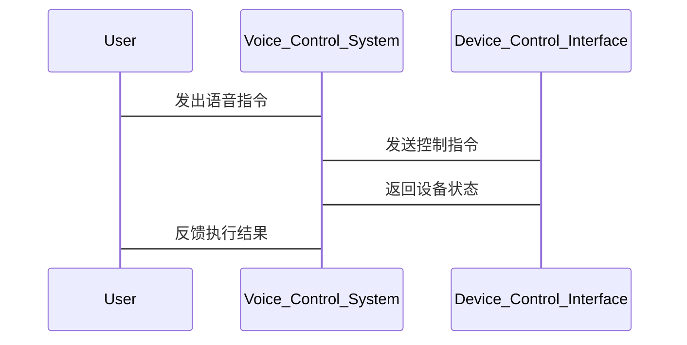

                 


# 《价值投资中的智能家居语音控制技术趋势》

---

## 关键词：
- 价值投资
- 智能家居
- 语音控制
- 技术趋势
- 人工智能
- 语音识别

---

## 摘要：
本文从价值投资的角度，深入分析智能家居语音控制技术的发展趋势，探讨其在技术与市场结合中的潜力。通过技术原理、市场分析和投资策略的结合，揭示如何通过技术趋势分析发现投资机会，帮助投资者在智能家居领域做出明智的决策。文章结合实际案例，提供系统的分析方法和实战指导，为科技投资者提供有价值的参考。

---

## 第一部分: 价值投资与智能家居语音控制技术的背景

### 第1章: 价值投资与智能家居语音控制技术的背景

#### 1.1 价值投资的核心概念
##### 1.1.1 价值投资的定义与核心理念
价值投资是一种投资策略，强调以低于内在价值的价格购买优质资产。其核心理念是寻找市场低估的公司，长期持有，获得超额收益。价值投资注重基本面分析，关注公司的财务健康、行业地位和竞争优势。

##### 1.1.2 价值投资的基本原则与方法
- **基本原则**：安全边际、长期投资、逆向思维。
- **方法**：通过分析财务报表、行业趋势和竞争优势，识别具有长期增长潜力的公司。

##### 1.1.3 价值投资在现代科技领域的应用
随着科技行业的快速发展，价值投资需要结合技术创新和市场潜力进行评估。科技领域的投资机会往往集中在具有颠覆性技术的公司，如人工智能、智能家居等领域。

#### 1.2 智能家居语音控制技术的背景
##### 1.2.1 智能家居的发展历程
智能家居从最初的单一设备控制，逐步发展为集成化的智能系统，涵盖了照明、安防、能源管理等多个领域。语音控制作为智能家居的重要交互方式，极大提升了用户体验。

##### 1.2.2 语音控制技术的起源与演变
语音控制技术起源于20世纪50年代，经历了从简单语音识别到自然语言理解的演变。现代语音控制技术基于深度学习和神经网络，实现了高精度的语音识别和语义理解。

##### 1.2.3 智能家居语音控制技术的现状与趋势
目前，智能家居语音控制技术已广泛应用于智能音箱、智能家电等领域。未来，随着人工智能和物联网技术的进步，语音控制将更加智能化、个性化，成为智能家居的核心交互方式。

#### 1.3 价值投资与智能家居技术的结合
##### 1.3.1 价值投资在科技领域的独特优势
价值投资通过深入分析技术的市场潜力和公司的竞争优势，能够在科技领域中发现被低估的投资机会。

##### 1.3.2 智能家居语音控制技术的市场潜力
智能家居市场增长迅速，语音控制技术的应用场景不断扩展，具备较大的投资潜力。投资者需要关注技术领先公司和具有创新商业模式的企业。

##### 1.3.3 价值投资视角下的技术评估与投资机会
通过技术趋势分析、市场空间评估和竞争格局分析，识别具有长期增长潜力的公司。重点关注技术壁垒高、市场占有率高、财务健康的企业。

---

## 第二部分: 价值投资中的技术趋势分析方法

### 第2章: 价值投资中的技术趋势分析方法

#### 2.1 技术趋势分析的核心要素
##### 2.1.1 技术的创新性与可行性
评估技术的创新性和实际应用的可行性，重点关注技术的突破点和应用场景。

##### 2.1.2 市场需求与用户接受度
通过市场调研和用户反馈，评估技术的市场需求和用户接受度。

##### 2.1.3 技术的商业化潜力
分析技术的商业化路径和市场空间，评估其盈利能力和商业模式。

#### 2.2 价值投资中的技术评估模型
##### 2.2.1 技术评估模型的构建
技术评估模型包括技术成熟度、市场需求、竞争格局、财务指标等多个维度。

##### 2.2.2 技术评估指标的选取与权重分配
- **技术成熟度**（权重30%）：评估技术的商业化程度和稳定性。
- **市场需求**（权重30%）：评估技术的市场空间和用户需求。
- **竞争格局**（权重20%）：评估行业竞争情况和公司的竞争优势。
- **财务指标**（权重20%）：评估公司的财务健康状况和盈利能力。

##### 2.2.3 技术评估模型的验证与优化
通过实际案例验证模型的有效性，并根据市场变化和技术进步不断优化模型。

#### 2.3 技术趋势分析与投资决策的关系
##### 2.3.1 技术趋势对投资决策的影响
技术趋势分析帮助投资者识别行业发展方向，发现潜在的投资机会。

##### 2.3.2 如何通过技术趋势分析发现投资机会
通过分析技术发展趋势和市场动态，寻找具有长期增长潜力的公司和行业。

##### 2.3.3 价值投资中的技术风险控制
通过多元化投资和风险评估，降低技术风险对投资组合的影响。

---

## 第三部分: 智能家居语音控制技术的核心原理

### 第3章: 智能家居语音控制技术的核心原理

#### 3.1 语音识别技术的基本原理
##### 3.1.1 语音信号的采集与预处理
语音信号的采集需要考虑环境噪声和信号质量。预处理包括降噪、端点检测和特征提取。

##### 3.1.2 语音特征的提取方法
常用的语音特征包括梅尔频谱倒谱（MFCC）、线性预测系数（LPC）和声学模型参数。

##### 3.1.3 语音识别算法的实现流程
语音识别流程包括语音信号预处理、特征提取、模型训练和解码。

#### 3.2 自然语言理解技术的核心原理
##### 3.2.1 语法分析与句法树构建
通过语法分析构建句法树，理解句子的结构和语义。

##### 3.2.2 语义理解与意图识别
基于上下文和语义规则，识别用户的意图和需求。

##### 3.2.3 知识图谱与语义推理
通过知识图谱和推理算法，实现复杂语义的理解和处理。

#### 3.3 语音合成技术的实现方法
##### 3.3.1 文本到语音的转换过程
文本首先经过语言学处理，生成语音波形，最后通过声学模型合成语音。

##### 3.3.2 合成语音的自然度评估
通过主观评估和客观指标，如梅尔倒频谱距离（MCD）评估合成语音的质量。

#### 3.4 智能家居语音控制系统的整体架构
##### 3.4.1 系统组成部分
智能家居语音控制系统包括语音采集模块、语音识别模块、语义理解模块和执行模块。

##### 3.4.2 系统功能设计
系统功能包括语音交互、设备控制、信息查询和反馈输出。

---

## 第四部分: 智能家居语音控制技术的技术趋势与投资机会

### 第4章: 智能家居语音控制技术的技术趋势

#### 4.1 人工智能技术的深度应用
##### 4.1.1 深度学习在语音识别中的应用
深度学习技术显著提高了语音识别的准确率和鲁棒性。

##### 4.1.2 自然语言处理的进展
自然语言处理技术的进步使语音交互更加智能化和个性化。

#### 4.2 智能家居语音控制技术的市场应用
##### 4.2.1 家庭自动化场景
语音控制在家庭自动化中的应用包括灯光控制、空调调节和安防监控。

##### 4.2.2 智能音箱与智能助手
智能音箱和智能助手通过语音交互提供丰富的服务，如播放音乐、查询信息和控制家电。

#### 4.3 技术趋势对投资机会的影响
##### 4.3.1 技术壁垒与竞争优势
技术壁垒高、市场占有率高的公司更具投资价值。

##### 4.3.2 市场空间与增长潜力
智能家居市场规模庞大，语音控制技术的应用场景广泛，具备较大的增长潜力。

---

## 第五部分: 价值投资策略与智能家居语音控制技术的结合

### 第5章: 价值投资策略与智能家居语音控制技术的结合

#### 5.1 价值投资在智能家居领域的应用
##### 5.1.1 基本面分析
分析公司的财务状况、盈利能力和发展潜力。

##### 5.1.2 技术面分析
评估公司的技术实力和技术创新能力。

##### 5.1.3 竞争对手分析
分析行业竞争格局和公司的竞争优势。

#### 5.2 价值投资中的风险控制
##### 5.2.1 风险识别与评估
识别技术风险、市场风险和财务风险。

##### 5.2.2 投资组合的构建
通过多元化投资和风险分散，降低投资风险。

---

## 第六部分: 系统分析与架构设计方案

### 第6章: 智能家居语音控制系统的系统分析与架构设计

#### 6.1 问题场景介绍
智能家居语音控制系统需要实现语音交互、设备控制和信息反馈等功能。

#### 6.2 项目介绍
本项目旨在设计一个智能家居语音控制系统，实现语音交互和设备控制的无缝集成。

#### 6.3 系统功能设计
##### 6.3.1 领域模型设计（mermaid 类图）


#### 6.4 系统架构设计（mermaid 架构图）


#### 6.5 系统接口设计
##### 6.5.1 用户接口
- 语音输入接口：接收用户的语音指令。
- 反馈输出接口：输出系统的反馈信息。

##### 6.5.2 设备控制接口
- 设备状态查询接口：获取设备的当前状态。
- 设备控制接口：控制设备的运行状态。

#### 6.6 系统交互设计（mermaid 序列图）


---

## 第七部分: 项目实战

### 第7章: 项目实战

#### 7.1 环境安装
##### 7.1.1 开发环境
- 操作系统：Linux/Windows/MacOS
- 开发工具：Python、Jupyter Notebook
- 依赖库：scikit-learn、TensorFlow、PyTorch

##### 7.1.2 语音识别库安装
```bash
pip install speechRecognition
pip install numpy
pip install scipy
```

#### 7.2 系统核心实现源代码
##### 7.2.1 语音识别模块
```python
import speech_recognition as sr

def recognize_speech():
    r = sr.Recognizer()
    with sr.Microphone() as source:
        audio = r.listen(source)
        try:
            text = r.recognize_google(audio)
            return text
        except sr.UnknownValueError:
            return "无法识别"
```

##### 7.2.2 语义理解模块
```python
from transformers import pipeline

classifier = pipeline("text-classification", model="snunlp/koreumc-bert")
def understand_semantics(text):
    result = classifier(text)
    return result[0]['label']
```

##### 7.2.3 设备控制模块
```python
import serial

def control_device(action):
    ser = serial.Serial('COM3', 9600)
    ser.write(action.encode())
    ser.close()
```

#### 7.3 代码应用解读与分析
##### 7.3.1 语音识别模块
该模块使用`speech_recognition`库实现语音识别，通过麦克风采集语音信号，并使用Google的语音识别API进行识别。

##### 7.3.2 语义理解模块
该模块基于预训练的BERT模型，实现文本分类和语义理解，帮助系统理解用户的意图。

##### 7.3.3 设备控制模块
该模块通过串口与智能家居设备通信，实现设备的控制和状态反馈。

#### 7.4 实际案例分析
##### 7.4.1 案例背景
某智能家居公司开发了一款支持语音控制的智能灯泡，用户可以通过语音指令控制灯泡的开关和亮度。

##### 7.4.2 技术实现
系统通过语音识别模块接收用户的指令，语义理解模块解析指令内容，设备控制模块通过 ZigBee 通信协议控制灯泡的状态。

##### 7.4.3 投资分析
该公司的技术实力强，市场占有率高，财务状况健康，具备较大的投资潜力。

#### 7.5 项目小结
通过实际案例分析，展示了智能家居语音控制系统的实现过程和投资价值。

---

## 第八部分: 总结与展望

### 第8章: 总结与展望

#### 8.1 全文总结
本文从价值投资的角度，分析了智能家居语音控制技术的发展趋势和投资机会。通过技术原理、市场分析和投资策略的结合，揭示了如何通过技术趋势分析发现投资机会。

#### 8.2 未来展望
随着人工智能和物联网技术的进一步发展，智能家居语音控制技术将更加智能化和个性化。投资者需要关注技术领先公司和具有创新商业模式的企业。

#### 8.3 最佳实践 tips
- 关注技术趋势，选择具有长期增长潜力的公司。
- 结合技术评估模型，进行科学的投资决策。
- 注意风险控制，构建合理的投资组合。

---

## 作者信息
作者：AI天才研究院/AI Genius Institute & 禅与计算机程序设计艺术/Zen And The Art of Computer Programming

--- 

通过以上目录和内容，文章详细分析了智能家居语音控制技术的技术原理、市场应用和投资机会，结合价值投资的策略和方法，为科技投资者提供了系统的分析框架和实战指导。

