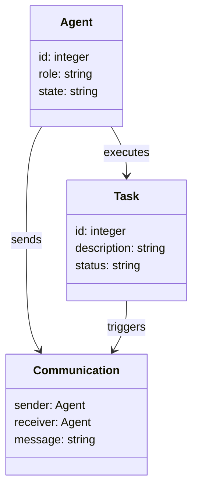
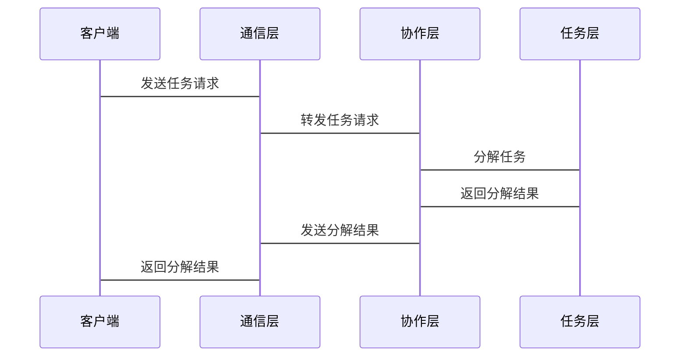

                 


# 多Agent协作：构建复杂的AI系统

## 关键词：多Agent协作、AI系统、复杂系统、分布式协作、Agent通信、系统架构

## 摘要：  
多Agent协作是构建复杂AI系统的核心技术之一。通过多个智能体的协作，可以实现任务分解、资源共享和协同决策，从而构建出高效、灵活且适应性强的AI系统。本文将从多Agent协作的基本概念、核心原理、算法实现、系统架构到实际项目案例，全面解析多Agent协作在复杂AI系统中的应用。

---

## 第1章: 多Agent协作概述

### 1.1 多Agent系统的基本概念

#### 1.1.1 Agent的定义与特征
- **Agent**：智能体，能够感知环境、自主决策并采取行动的实体。
- **特征**：
  - **自主性**：无需外部干预，自主决策。
  - **反应性**：能够实时感知环境并做出反应。
  - **协作性**：能够与其他Agent或系统进行协作。

#### 1.1.2 多Agent系统的定义
- 由多个智能体组成的系统，通过协作完成单一Agent无法完成的任务。
- 特点：
  - **分布式**：多个Agent分布在不同的节点或位置。
  - **协作性**：Agent之间通过通信和协调完成任务。
  - **动态性**：系统环境和任务需求可能动态变化。

#### 1.1.3 多Agent协作的核心要素
- **通信**：Agent之间通过消息传递进行信息共享。
- **协调**：通过协商和规划实现任务分配和资源分配。
- **决策**：基于协作信息做出最优决策。

### 1.2 多Agent协作在AI系统中的应用

#### 1.2.1 多Agent协作的典型场景
- **分布式计算**：任务分解到多个Agent，分布式处理。
- **协作决策**：多个Agent共同完成决策任务。
- **动态任务分配**：根据环境变化动态调整任务分配。

#### 1.2.2 多Agent协作与AI系统的结合
- AI系统通过多Agent协作实现复杂任务的分解和协同。
- 每个Agent负责特定任务，通过协作完成整体目标。

#### 1.2.3 多Agent协作的优势与挑战
- **优势**：
  - **任务分解**：复杂任务分解为多个简单任务。
  - **资源优化**：充分利用资源，提高效率。
  - **容错性**：单个Agent故障不影响整体系统。
- **挑战**：
  - **通信延迟**：Agent之间的通信可能带来延迟。
  - **协调复杂性**：多个Agent的协调需要复杂的算法。
  - **安全性**：通信和协作中的安全性问题。

### 1.3 复杂AI系统的构建特点

#### 1.3.1 复杂AI系统的定义
- 由多个子系统组成，具有高度复杂性和动态性的AI系统。

#### 1.3.2 复杂AI系统的构建挑战
- **任务复杂性**：任务分解和协作需要复杂的算法。
- **动态性**：环境和任务需求的动态变化。
- **资源限制**：计算资源和通信资源的限制。

#### 1.3.3 多Agent协作在复杂AI系统中的作用
- **任务分解**：将复杂任务分解为多个子任务。
- **资源优化**：充分利用资源，提高效率。
- **动态适应**：快速适应环境变化。

### 1.4 本章小结
本章介绍了多Agent协作的基本概念、在AI系统中的应用以及复杂AI系统的构建特点。多Agent协作通过任务分解和资源优化，能够有效构建复杂AI系统。

---

## 第2章: 多Agent协作的核心原理

### 2.1 多Agent协作的核心概念

#### 2.1.1 多Agent协作的定义
- 多个Agent通过通信和协作完成共同目标的技术。

#### 2.1.2 多Agent协作的基本原理
- **通信**：Agent之间通过消息传递共享信息。
- **协调**：通过协商和规划实现任务分配。
- **协作**：多个Agent共同完成任务。

#### 2.1.3 多Agent协作的关键特性
- **分布式**：Agent分布在网络中。
- **自主性**：Agent自主决策。
- **协作性**：Agent之间协作完成任务。

### 2.2 多Agent协作的核心要素

#### 2.2.1 Agent的智能性
- **智能性**：Agent能够感知环境、推理和学习。
- **实现方式**：基于规则、机器学习或强化学习。

#### 2.2.2 Agent的自主性
- **自主性**：Agent无需外部干预，自主决策。
- **实现方式**：基于自主决策算法。

#### 2.2.3 Agent的协作性
- **协作性**：Agent之间通过通信和协调完成任务。
- **实现方式**：基于协作协议和通信协议。

### 2.3 多Agent协作的协作机制

#### 2.3.1 分布式协作机制
- **定义**：多个Agent分布在不同节点，通过通信协作完成任务。
- **实现步骤**：
  1. 任务分解：将整体任务分解为子任务。
  2. 任务分配：根据Agent的能力分配任务。
  3. 协作执行：Agent协作完成子任务。
  4. 结果整合：整合各Agent的结果，完成整体任务。

#### 2.3.2 基于规则的协作机制
- **定义**：通过预定义规则实现协作。
- **实现步骤**：
  1. 定义协作规则。
  2. Agent根据规则协作。

#### 2.3.3 基于学习的协作机制
- **定义**：基于机器学习实现协作。
- **实现步骤**：
  1. 训练Agent的协作模型。
  2. Agent根据模型协作。

### 2.4 多Agent协作的通信协议

#### 2.4.1 通信协议的定义
- **定义**：Agent之间通信的规则和格式。

#### 2.4.2 常见的通信协议类型
- **HTTP**：基于请求-响应的通信。
- **WebSocket**：实时双向通信。
- **RabbitMQ**：消息队列通信。

#### 2.4.3 通信协议的选择与设计
- **选择依据**：任务需求和环境。
- **设计原则**：高效、可靠、安全。

### 2.5 本章小结
本章详细介绍了多Agent协作的核心概念、协作机制和通信协议。通过这些机制，可以实现高效、可靠的多Agent协作。

---

## 第3章: 多Agent协作算法概述

### 3.1 分布式协作算法

#### 3.1.1 分布式协作算法的定义
- **定义**：基于分布式的协作算法。

#### 3.1.2 分布式协作算法的工作流程
- **任务分解**：将任务分解为子任务。
- **任务分配**：根据Agent的能力分配任务。
- **协作执行**：Agent协作完成子任务。
- **结果整合**：整合各Agent的结果，完成整体任务。

#### 3.1.3 分布式协作算法的实现步骤
1. 任务分解：将整体任务分解为子任务。
2. 任务分配：根据Agent的能力分配任务。
3. 协作执行：Agent协作完成子任务。
4. 结果整合：整合各Agent的结果，完成整体任务。

#### 3.1.4 分布式协作算法的数学模型
$$ \text{任务分解} = \{T_1, T_2, ..., T_n\} $$
$$ \text{任务分配} = \{A_1 \rightarrow T_1, A_2 \rightarrow T_2\} $$

### 3.2 基于博弈论的协作算法

#### 3.2.1 博弈论的基本概念
- **博弈论**：研究理性决策者在策略互动中的行为。
- **纳什均衡**：博弈中的一种稳定状态。

#### 3.2.2 基于博弈论的协作算法原理
- **纳什均衡**：多个Agent在博弈中达到均衡状态，不再改变策略。

#### 3.2.3 基于博弈论的协作算法实现
1. 定义博弈规则。
2. 计算纳什均衡。
3. 根据纳什均衡分配任务。

#### 3.2.4 基于博弈论的协作算法的数学模型
$$ \text{纳什均衡} = (A_1, A_2, ..., A_n) $$
$$ \text{任务分配} = \{A_i \rightarrow T_i\} $$

### 3.3 基于学习的协作算法

#### 3.3.1 基于强化学习的协作算法
- **强化学习**：通过试错学习，Agent通过奖励机制优化行为。

#### 3.3.2 基于深度学习的协作算法
- **深度学习**：通过神经网络学习协作策略。

#### 3.3.3 基于学习的协作算法的数学模型
$$ \text{奖励函数} = R(s, a) $$
$$ \text{策略} = \pi(a|s) $$

---

## 第4章: 多Agent协作系统的架构设计

### 4.1 问题场景介绍
- **问题背景**：构建一个多Agent协作系统，完成复杂任务。
- **项目介绍**：设计一个多Agent协作系统，实现任务分解、资源分配和协作执行。

### 4.2 系统功能设计

#### 4.2.1 领域模型（mermaid类图）


#### 4.2.2 系统架构设计（mermaid架构图）


#### 4.2.3 系统接口设计
- **通信接口**：Agent之间通信接口。
- **协作接口**：任务分配和结果整合接口。

#### 4.2.4 系统交互设计（mermaid序列图）


### 4.3 系统实现

#### 4.3.1 环境安装
```bash
pip install mermaid
```

#### 4.3.2 核心实现（Python代码）
```python
class Agent:
    def __init__(self, id):
        self.id = id
        self.role = "collaborator"
        self.state = "idle"

    def send_message(self, message, receiver):
        print(f"Agent {self.id} sends {message} to Agent {receiver.id}")

    def receive_message(self, message):
        print(f"Agent {self.id} receives {message}")

class Task:
    def __init__(self, id, description):
        self.id = id
        self.description = description
        self.status = "pending"

    def update_status(self, status):
        self.status = status
```

#### 4.3.3 代码应用解读与分析
- **Agent类**：定义Agent的行为和属性。
- **Task类**：定义任务的行为和属性。
- **通信**：通过send_message和receive_message实现Agent之间的通信。

### 4.4 项目小结
本章通过系统设计和实现，展示了如何构建一个多Agent协作系统。通过任务分解、通信和协作，可以高效完成复杂任务。

---

## 第5章: 项目实战

### 5.1 环境安装
```bash
pip install mermaid
```

### 5.2 核心实现（Python代码）
```python
class Agent:
    def __init__(self, id):
        self.id = id
        self.role = "collaborator"
        self.state = "idle"

    def send_message(self, message, receiver):
        print(f"Agent {self.id} sends {message} to Agent {receiver.id}")

    def receive_message(self, message):
        print(f"Agent {self.id} receives {message}")

class Task:
    def __init__(self, id, description):
        self.id = id
        self.description = description
        self.status = "pending"

    def update_status(self, status):
        self.status = status
```

### 5.3 代码应用解读与分析
- **Agent类**：定义Agent的行为和属性。
- **Task类**：定义任务的行为和属性。
- **通信**：通过send_message和receive_message实现Agent之间的通信。

### 5.4 案例分析和详细讲解剖析
- **案例分析**：一个多Agent协作的智能交通系统。
- **详细讲解**：通过通信和协作，实现交通流量优化。

### 5.5 项目小结
本章通过实际案例展示了多Agent协作在复杂AI系统中的应用，验证了多Agent协作的有效性。

---

## 第6章: 最佳实践、小结、注意事项、拓展阅读

### 6.1 最佳实践
- **通信效率**：选择高效的通信协议。
- **协作机制**：根据任务需求选择合适的协作机制。
- **安全性**：确保通信和协作的安全性。

### 6.2 小结
多Agent协作是构建复杂AI系统的重要技术，通过任务分解、通信和协作，可以高效完成复杂任务。

### 6.3 注意事项
- **通信延迟**：注意通信延迟对系统性能的影响。
- **协调复杂性**：复杂的协调机制可能增加系统复杂性。
- **安全性**：确保通信和协作的安全性。

### 6.4 拓展阅读
- **分布式计算**：深入学习分布式计算技术。
- **博弈论**：学习博弈论在协作中的应用。
- **强化学习**：研究强化学习在协作中的应用。

---

## 作者：AI天才研究院/AI Genius Institute & 禅与计算机程序设计艺术 /Zen And The Art of Computer Programming

