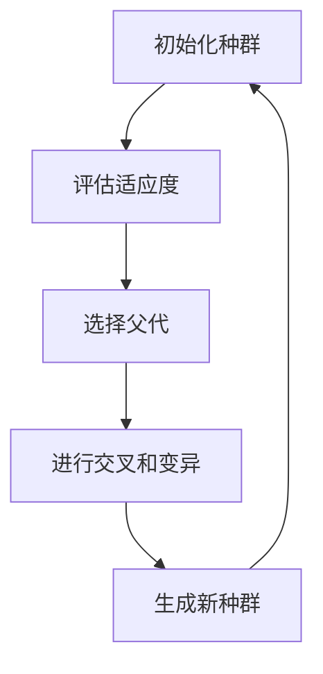
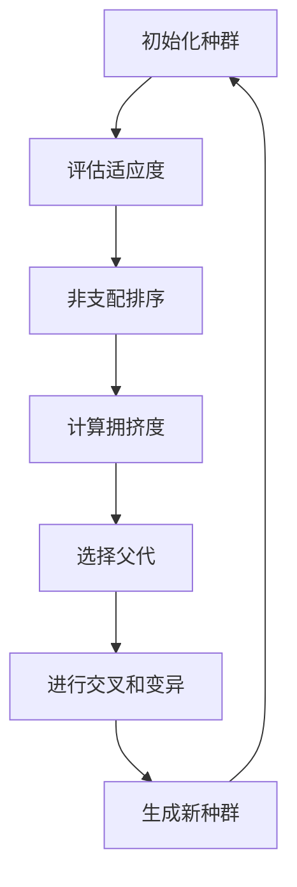
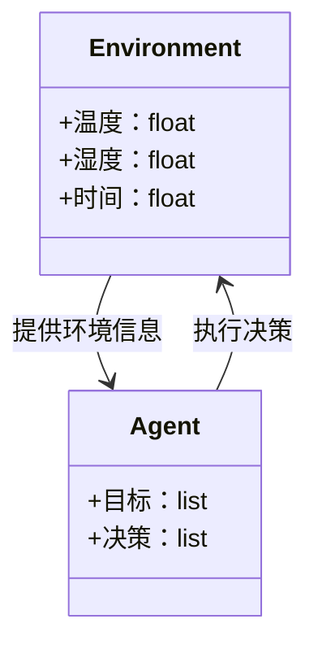
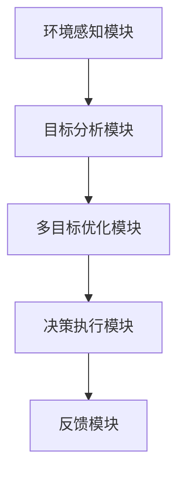
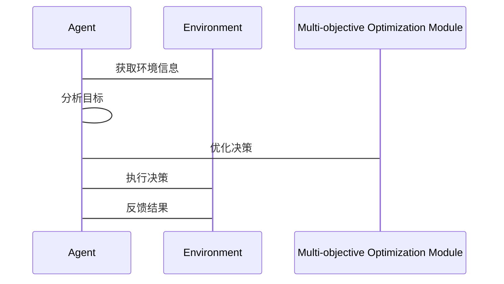

                 


# 构建具有多目标优化决策能力的AI Agent

> 关键词：多目标优化，AI Agent，决策能力，强化学习，系统架构

> 摘要：本文详细探讨了构建具有多目标优化决策能力的AI Agent的理论基础、算法原理、系统架构及实现方法。通过分析多目标优化的核心概念、AI Agent的决策机制、主流优化算法、数学模型、系统设计和项目实战，为读者提供全面的指导和实践方案。

---

# 第1章: 多目标优化与AI Agent背景介绍

## 1.1 多目标优化的背景与意义

### 1.1.1 多目标优化的基本概念
多目标优化是指在多个目标函数之间寻求平衡的过程。例如，在资源分配问题中，我们可能需要在成本、效率和公平性之间找到最优解。多目标优化的核心在于权衡不同的目标，找到帕累托最优解集。

### 1.1.2 多目标优化在AI Agent中的应用
AI Agent需要在复杂环境中做出决策，往往需要在多个目标之间进行权衡。例如，自动驾驶汽车需要在安全、速度和能耗之间找到最佳平衡。

### 1.1.3 多目标优化的挑战与机遇
多目标优化的挑战在于如何量化不同目标的重要性，并找到全局最优解。机遇在于通过多目标优化，AI Agent可以在复杂环境中实现更智能、更灵活的决策。

## 1.2 AI Agent的基本概念与特点

### 1.2.1 AI Agent的定义
AI Agent是指能够感知环境、自主决策并采取行动的智能体。它能够根据环境反馈调整策略，以实现特定目标。

### 1.2.2 AI Agent的核心特点
- **自主性**：AI Agent能够在没有外部干预的情况下自主运行。
- **反应性**：AI Agent能够根据环境反馈实时调整行为。
- **目标导向**：AI Agent的行为旨在实现特定目标。

### 1.2.3 AI Agent与传统AI的区别
传统AI通常基于规则或预定义的逻辑进行决策，而AI Agent具有更强的自主性和适应性，能够根据环境动态调整行为。

## 1.3 多目标优化与AI Agent的结合

### 1.3.1 多目标优化的基本原理
多目标优化通过优化多个目标函数，找到一组帕累托最优解。这些解在满足所有约束条件的前提下，无法在不损害其他目标的情况下进一步优化某个目标。

### 1.3.2 AI Agent的决策机制
AI Agent的决策机制包括感知、推理和行动三个步骤。感知环境、理解目标后，AI Agent通过多目标优化算法生成多个候选决策，最终选择最优行动方案。

### 1.3.3 多目标优化在AI Agent中的应用前景
随着AI Agent在自动驾驶、机器人、智能助手等领域的广泛应用，多目标优化技术将成为提升AI Agent决策能力的核心技术。

## 1.4 本章小结
本章介绍了多目标优化的基本概念、AI Agent的核心特点，以及两者结合的重要性。通过理解这些内容，读者可以为后续的算法和系统设计打下坚实的基础。

---

# 第2章: 多目标优化的核心概念与联系

## 2.1 多目标优化的基本原理

### 2.1.1 多目标优化的数学模型
多目标优化的数学模型可以表示为：
$$
\min_{x} f_1(x), f_2(x), \ldots, f_n(x)
$$
其中，$x$ 是决策变量，$f_i(x)$ 是目标函数。

### 2.1.2 多目标优化的算法框架
多目标优化算法通常包括初始化、评估、选择、交叉和变异等步骤。以下是一个简化的流程图：



### 2.1.3 多目标优化的评价指标
多目标优化的评价指标包括帕累托前沿、目标函数值、决策变量等。

## 2.2 AI Agent的决策机制

### 2.2.1 AI Agent的感知与理解
AI Agent通过传感器或API接口获取环境信息，例如温度、位置、时间等。

### 2.2.2 AI Agent的目标设定
AI Agent的目标通常由用户或系统预定义，例如自动驾驶汽车的目标可能是“安全到达目的地”。

### 2.2.3 AI Agent的决策过程
AI Agent通过多目标优化算法生成多个候选决策，并根据预定义的优先级选择最优行动方案。

## 2.3 多目标优化与AI Agent的联系

### 2.3.1 多目标优化在AI Agent决策中的作用
多目标优化帮助AI Agent在多个目标之间找到平衡，例如在自动驾驶中平衡安全性和速度。

### 2.3.2 AI Agent如何实现多目标优化
AI Agent通过多目标优化算法生成帕累托最优解集，并根据环境反馈动态调整决策。

### 2.3.3 多目标优化对AI Agent性能的影响
多目标优化能够提高AI Agent的决策效率和灵活性，使其在复杂环境中表现更佳。

## 2.4 本章小结
本章详细讲解了多目标优化的核心概念、AI Agent的决策机制，以及两者之间的联系。通过这些内容，读者可以理解多目标优化在AI Agent中的重要性。

---

# 第3章: 多目标优化算法原理

## 3.1 非支配排序遗传算法（NSGA-II）

### 3.1.1 NSGA-II算法原理
NSGA-II是一种基于种群的多目标优化算法，通过非支配排序和拥挤度计算来选择种群中的优秀个体。

### 3.1.2 NSGA-II算法流程图
以下是一个NSGA-II算法的流程图：



### 3.1.3 NSGA-II算法实现
以下是一个Python实现的NSGA-II算法示例：

```python
import random

def crossover(parent1, parent2):
    child1 = [parent1[i] if i % 2 == 0 else parent2[i] for i in range(len(parent1))]
    child2 = [parent2[i] if i % 2 == 0 else parent1[i] for i in range(len(parent1))]
    return child1, child2

def mutate(individual):
    for i in range(len(individual)):
        if random.random() < 0.1:
            individual[i] = random.random()
    return individual

# 初始化种群
population = [[random.random() for _ in range(2)] for _ in range(100)]

# 评估适应度
fitness = [sum(individual) for individual in population]

# 非支配排序
def is_dominated(individual1, individual2):
    return all(individual1[i] <= individual2[i] for i in range(len(individual1)))

# 计算拥挤度
crowding_distance = [1.0] * len(population)

# 选择父代
selected_parents = population[:50]

# 交叉和变异
children = []
for i in range(50):
    parent1 = selected_parents[i]
    parent2 = selected_parents[(i+1)%50]
    child1, child2 = crossover(parent1, parent2)
    child1 = mutate(child1)
    child2 = mutate(child2)
    children.append(child1)
    children.append(child2)

# 生成新种群
new_population = selected_parents + children
```

## 3.2 其他多目标优化算法

### 3.2.1 基于 Pareto 前沿的优化算法
基于 Pareto 前沿的优化算法通过逐步逼近 Pareto 最优解集，找到最优决策。

### 3.2.2 基于权重的优化算法
基于权重的优化算法通过调整目标函数的权重，找到最优解。

## 3.3 本章小结
本章介绍了NSGA-II算法的基本原理和实现方法，以及其他多目标优化算法的基本思想。通过这些算法，AI Agent可以实现多目标优化决策。

---

# 第4章: 多目标优化的数学模型

## 4.1 多目标优化的数学表达

### 4.1.1 多目标优化的公式表示
多目标优化的数学模型可以表示为：
$$
\min_{x} f_1(x), f_2(x), \ldots, f_n(x)
$$
$$
s.t.\quad g_1(x) \leq 0, g_2(x) \leq 0, \ldots, g_m(x) \leq 0
$$
其中，$x$ 是决策变量，$f_i(x)$ 是目标函数，$g_j(x)$ 是约束条件。

### 4.1.2 多目标优化的权重分配
多目标优化的权重分配可以通过以下公式表示：
$$
w_1f_1(x) + w_2f_2(x) + \ldots + w_nf_n(x)
$$
其中，$w_i$ 是目标函数的权重。

## 4.2 帕累托最优解的数学定义

### 4.2.1 帕累托最优解的定义
帕累托最优解是指在决策变量空间中，无法在不损害其他目标的情况下进一步优化某个目标的解。

### 4.2.2 帕累托前沿的数学表示
帕累托前沿可以通过以下公式表示：
$$
P = \{x | x \text{ 是帕累托最优解}\}
$$

## 4.3 本章小结
本章通过数学公式详细讲解了多目标优化的基本概念和数学模型，为后续的算法实现和系统设计提供了理论基础。

---

# 第5章: 系统分析与架构设计

## 5.1 问题场景介绍

### 5.1.1 多目标优化决策系统的需求分析
多目标优化决策系统需要满足以下需求：实时性、鲁棒性、可扩展性。

### 5.1.2 AI Agent的功能需求
AI Agent需要具备以下功能：感知环境、分析目标、优化决策、执行行动。

## 5.2 系统功能设计

### 5.2.1 领域模型设计
领域模型可以用以下Mermaid类图表示：



### 5.2.2 系统架构设计
系统架构可以用以下Mermaid架构图表示：



## 5.3 系统接口设计

### 5.3.1 系统输入接口
系统输入接口包括环境信息、目标设定等。

### 5.3.2 系统输出接口
系统输出接口包括优化结果、决策建议等。

## 5.4 系统交互流程设计

### 5.4.1 系统交互流程图
系统交互流程可以用以下Mermaid序列图表示：



## 5.5 本章小结
本章通过系统分析和架构设计，为多目标优化决策系统的实现提供了详细的指导。

---

# 第6章: 项目实战

## 6.1 环境安装与配置

### 6.1.1 Python环境安装
安装Python 3.8及以上版本。

### 6.1.2 依赖库安装
安装numpy、pymoo等依赖库：
```bash
pip install numpy pymoo
```

## 6.2 系统核心实现

### 6.2.1 多目标优化算法实现
以下是一个Python实现的NSGA-II算法示例：

```python
from pymoo.algorithms.nsga2 import NSGA2
from pymoo.problems import Problem
from pymoo.optimize import minimize

class MultiObjectiveProblem(Problem):
    def __init__(self, n_var=2, n_obj=2):
        super().__init__(n_var=n_var, n_obj=n_obj)
    
    def evaluate(self, x):
        f1 = x[:, 0] ** 2 + x[:, 1] ** 2
        f2 = (x[:, 0] - 1) ** 2 + (x[:, 1] - 1) ** 2
        return f1, f2
    
    def get_name(self):
        return "Multi-objective Optimization Problem"

problem = MultiObjectiveProblem()
algorithm = NSGA2(pop_size=100, mutation="gaussian", crossover="blended")
result = minimize(problem, algorithm, seed=1)
```

### 6.2.2 系统功能实现
实现AI Agent的感知、分析、优化和执行功能。

## 6.3 代码实现与解读

### 6.3.1 代码实现
以下是一个完整的AI Agent实现示例：

```python
from pymoo.algorithms.nsga2 import NSGA2
from pymoo.problems import Problem
from pymoo.optimize import minimize

class Agent:
    def __init__(self, environment):
        self.environment = environment
    
    def perceive(self):
        return self.environment.get_info()
    
    def analyze(self, info):
        pass
    
    def optimize(self, info):
        pass
    
    def execute(self, decision):
        self.environment.execute_decision(decision)

class MultiObjectiveProblem(Problem):
    def __init__(self, n_var=2, n_obj=2):
        super().__init__(n_var=n_var, n_obj=n_obj)
    
    def evaluate(self, x):
        f1 = x[:, 0] ** 2 + x[:, 1] ** 2
        f2 = (x[:, 0] - 1) ** 2 + (x[:, 1] - 1) ** 2
        return f1, f2
    
    def get_name(self):
        return "Multi-objective Optimization Problem"

environment = MultiObjectiveProblem()
agent = Agent(environment)
agent.perceive()
agent.analyze(agent.perceive())
agent.optimize(agent.perceive())
agent.execute(agent.optimize_result)
```

### 6.3.2 代码解读
上述代码实现了AI Agent的感知、分析、优化和执行功能。通过调用pymoo库的NSGA-II算法，实现多目标优化决策。

## 6.4 实际案例分析与详细讲解

### 6.4.1 案例背景
假设我们有一个智能投资组合优化问题，需要在风险和收益之间找到平衡。

### 6.4.2 案例分析
通过NSGA-II算法生成多个候选投资组合，找到帕累托最优解集。

### 6.4.3 案例实现
以下是一个具体的案例实现：

```python
from pymoo.algorithms.nsga2 import NSGA2
from pymoo.problems import Problem
from pymoo.optimize import minimize

class InvestmentProblem(Problem):
    def __init__(self, n_var=2, n_obj=2):
        super().__init__(n_var=n_var, n_obj=n_obj)
    
    def evaluate(self, x):
        f1 = -x[:, 0] ** 2 - x[:, 1] ** 2  # 最小化风险
        f2 = x[:, 0] * 10 + x[:, 1] * 15    # 最大化收益
        return f1, f2
    
    def get_name(self):
        return "Investment Problem"

problem = InvestmentProblem()
algorithm = NSGA2(pop_size=100, mutation="gaussian", crossover="blended")
result = minimize(problem, algorithm, seed=1)
```

## 6.5 本章小结
本章通过项目实战，详细讲解了多目标优化决策系统的实现过程，包括环境配置、代码实现和案例分析。

---

# 第7章: 最佳实践与总结

## 7.1 关键点总结

### 7.1.1 多目标优化的核心算法
NSGA-II算法是一种高效的多目标优化算法，适用于大多数应用场景。

### 7.1.2 AI Agent的决策机制
AI Agent需要具备感知、分析、优化和执行功能，才能实现多目标优化决策。

## 7.2 小结与展望

### 7.2.1 小结
通过本文的讲解，读者可以掌握多目标优化的基本概念、算法实现和系统设计方法。

### 7.2.2 展望
未来，随着AI技术的不断发展，多目标优化将在更多领域得到应用，推动AI Agent技术的进步。

## 7.3 注意事项

### 7.3.1 算法选择
在选择多目标优化算法时，需要根据具体问题和约束条件进行选择。

### 7.3.2 系统设计
在系统设计时，需要充分考虑系统的实时性、鲁棒性和可扩展性。

## 7.4 拓展阅读

### 7.4.1 推荐书籍
1. 《进化计算》
2. 《多目标优化算法及其应用》

### 7.4.2 推荐论文
1. "A Fast and Scalable Method for Multi-objective Optimization" (ICML 2020)
2. "Pareto Front Approximation with Evolutionary Algorithms" (IEEE TEVC 2019)

## 7.5 本章小结
本章总结了多目标优化决策系统的关键点，提出了系统设计和实现的注意事项，并为读者提供了拓展阅读的建议。

---

# 作者：AI天才研究院/AI Genius Institute & 禅与计算机程序设计艺术 /Zen And The Art of Computer Programming

