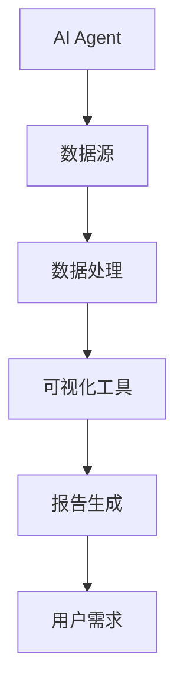

                 


# AI Agent在企业数据可视化与报告生成中的应用

> 关键词：AI Agent, 数据可视化, 报告生成, 生成式模型, 可视化工具, 报告生成系统

> 摘要：本文深入探讨了AI Agent在企业数据可视化与报告生成中的应用，从核心概念、算法原理、系统架构到项目实战，全面分析了AI Agent如何提升数据可视化的效率和报告生成的智能化水平。通过实际案例分析，展示了AI Agent在企业数据处理中的巨大潜力和应用价值。

---

## 第一部分：AI Agent与企业数据可视化概述

### 第1章：AI Agent与企业数据可视化概述

#### 1.1 问题背景与描述

企业数据可视化与报告生成是现代企业数据分析中的两大核心任务。随着企业数据量的激增，如何高效地将数据转化为直观的可视化图表，并自动生成高质量的报告，成为企业在数字化转型中面临的重大挑战。

- **问题背景**：企业在数据可视化与报告生成过程中，通常面临以下痛点：
  - 数据量大、类型多样，难以快速提取有效信息。
  - 可视化工具和报告生成系统需要高度定制化，开发成本高。
  - 人工生成报告耗时耗力，且可能存在人为错误。

- **问题描述**：AI Agent作为一种智能代理，能够通过自然语言处理、计算机视觉和生成式模型等技术，自动化完成数据处理、可视化生成和报告撰写任务。通过AI Agent，企业可以显著提高数据分析效率，降低人工成本，同时提升报告的准确性和一致性。

- **问题解决**：AI Agent通过整合多种AI技术，实现了数据到可视化的端到端自动化处理，能够根据用户需求自动生成不同类型的可视化图表和结构化报告。其核心优势在于：
  - **自动化**：从数据获取到报告生成，全程自动化处理。
  - **智能化**：基于上下文理解和用户意图，生成最优的可视化方案和报告内容。
  - **灵活性**：支持多种数据源、可视化类型和报告格式，适应不同业务场景。

- **边界与外延**：AI Agent在数据可视化与报告生成中的应用，主要聚焦于数据处理、可视化设计和报告生成三个核心环节。其外延包括数据预处理、数据清洗、数据增强等上游任务，以及报告分发、报告共享等下游任务。

- **核心要素与组成**：
  - **数据源**：包括结构化数据（如数据库、Excel文件）和非结构化数据（如文本、图像）。
  - **可视化工具**：如Matplotlib、D3.js等，用于生成图表和可视化组件。
  - **报告生成系统**：包括模板引擎、自然语言生成模块，用于生成结构化报告和文档。

#### 1.2 AI Agent的核心概念与定义

- **AI Agent**：AI Agent是一种智能代理系统，能够感知环境、理解用户需求，并通过自主决策和行动来完成特定任务。在企业数据可视化与报告生成中，AI Agent通常包括数据处理模块、可视化生成模块和报告生成模块。

- **数据可视化**：通过图形化技术将数据转化为易于理解的可视化形式，如柱状图、折线图、热力图等。

- **报告生成**：基于数据可视化结果，自动生成结构化的报告文档，包括文本描述、图表插入和结论总结。

- **关联性分析**：AI Agent通过自然语言处理技术，理解用户需求和数据内容，生成符合用户意图的可视化图表和报告内容。

---

## 第二部分：AI Agent的核心概念与联系

### 第2章：AI Agent的核心概念与联系

#### 2.1 核心概念原理

- **AI Agent的原理**：
  - 数据获取与解析：AI Agent首先从数据源获取数据，并进行解析和清洗，确保数据的完整性和准确性。
  - 数据分析与理解：通过自然语言处理和知识图谱技术，理解数据的语义和上下文。
  - 可视化生成：基于分析结果，生成最优的可视化图表，并根据用户需求进行调整和优化。
  - 报告生成：将可视化结果整合到报告模板中，自动生成结构化的报告文档。

- **数据可视化与报告生成的原理**：
  - 数据可视化：通过图形化技术将数据转化为直观的可视化形式，帮助用户快速理解和洞察数据。
  - 报告生成：基于数据可视化结果，自动生成结构化的报告文档，包括文本描述、图表插入和结论总结。

- **AI Agent与数据可视化的关联性**：
  - AI Agent通过自然语言处理和生成式模型，理解用户需求并生成符合预期的可视化图表。
  - 数据可视化为AI Agent提供了直观的反馈，帮助其优化数据分析和报告生成过程。

#### 2.2 概念属性特征对比

| 概念       | 属性特征                                                                 |
|------------|--------------------------------------------------------------------------|
| AI Agent   | 智能性：能够自主决策和行动；实时性：快速响应用户需求；适应性：适应不同数据源和业务场景。 |
| 数据可视化 | 可视化类型：支持多种图表类型；交互性：支持用户与图表的交互操作；动态性：支持实时数据更新。 |
| 报告生成   | 结构化：生成符合规范的报告文档；可定制：支持用户自定义报告模板；灵活性：适应不同业务需求。 |

#### 2.3 ER实体关系图



---

## 第三部分：AI Agent的算法原理与数学模型

### 第3章：AI Agent的算法原理与数学模型

#### 3.1 算法原理

- **基于生成式模型的AI Agent**：
  - 使用生成式模型（如GPT、Diffusion）生成文本描述和可视化方案。
  - 通过视觉模型（如CNN、Transformer）进行图像生成和图像理解。

- **数据可视化与报告生成的算法流程**：
  1. 数据预处理：清洗、归一化、特征提取。
  2. 数据分析：统计分析、趋势分析、关联分析。
  3. 可视化生成：选择图表类型、生成图表组件、优化图表布局。
  4. 报告生成：文本摘要、图表插入、报告模板生成。

- **大语言模型与视觉模型的结合**：
  - 使用大语言模型生成文本描述和可视化方案。
  - 使用视觉模型生成图表和图像，增强报告的视觉效果。

#### 3.2 数学模型与公式

- **大语言模型的数学基础**：
  $$\text{Transformer}(x) = \text{Encoder}(x) \oplus \text{Decoder}(x)$$
  - 其中，$\text{Encoder}$和$\text{Decoder}$分别表示编码器和解码器，通过自注意力机制（Self-Attention）处理输入数据。

- **视觉模型的数学基础**：
  $$\text{CNN}(x) = \text{Conv}(x) \rightarrow \text{Pool}(x) \rightarrow \text{FC}(x)$$
  - 其中，$\text{Conv}$表示卷积操作，$\text{Pool}$表示池化操作，$\text{FC}$表示全连接层。

- **生成式模型的数学基础**：
  $$\text{Diffusion}(x) = \text{Noise}(x) \rightarrow \text{Sampling}(x) \rightarrow \text{Generation}(x)$$
  - 通过逐步去噪和采样，生成高质量的图像和文本内容。

---

## 第四部分：系统分析与架构设计方案

### 第4章：系统分析与架构设计方案

#### 4.1 问题场景介绍

- **项目介绍**：本文以“企业销售数据分析与报告生成”为例，展示AI Agent在实际场景中的应用。
  - 数据来源：企业销售数据（如销售额、订单量、客户分布）。
  - 业务目标：生成销售趋势图、客户分布图，并自动生成销售分析报告。

#### 4.2 系统功能设计

- **领域模型**：
  ```mermaid
  classDiagram
      class 数据源 {
          销售数据
          客户数据
      }
      class 数据处理模块 {
          数据清洗
          数据转换
      }
      class 可视化生成模块 {
          选择图表类型
          生成图表组件
      }
      class 报告生成模块 {
          生成文本摘要
          整合图表
      }
      数据源 --> 数据处理模块
      数据处理模块 --> 可视化生成模块
      可视化生成模块 --> 报告生成模块
  ```

- **系统架构设计**：
  ```mermaid
  architecture
      client --> server: 发送数据请求
      server --> 数据源: 获取数据
      server --> 数据处理模块: 数据清洗与转换
      server --> 可视化生成模块: 生成图表组件
      server --> 报告生成模块: 整合图表与生成文本
      server --> client: 返回报告
  ```

- **系统接口设计**：
  - 输入接口：API接口接收用户请求和数据源。
  - 输出接口：API接口返回生成的可视化图表和报告文档。

- **系统交互设计**：
  ```mermaid
  sequenceDiagram
      participant 用户
      participant AI Agent
      participant 可视化工具
      participant 报告生成系统
      用户 -> AI Agent: 发送数据请求
      AI Agent -> 可视化工具: 生成图表组件
      可视化工具 -> AI Agent: 返回图表组件
      AI Agent -> 报告生成系统: 整合图表与生成文本
      报告生成系统 -> 用户: 返回报告
  ```

---

## 第五部分：项目实战

### 第5章：项目实战

#### 5.1 环境安装

- **Python环境**：
  ```bash
  pip install numpy matplotlib pandas
  ```

- **可视化工具**：
  ```bash
  pip install plotly
  ```

- **大语言模型**：
  ```bash
  pip install transformers
  ```

#### 5.2 系统核心实现源代码

```python
import matplotlib.pyplot as plt
from transformers import AutoTokenizer, AutoModelForCausalLM

# 数据预处理
data = {
    '销售额': [100, 200, 150, 300, 250],
    '订单量': [50, 70, 60, 80, 70]
}

# 数据可视化
plt.figure(figsize=(10, 6))
plt.plot(data['销售额'], label='销售额')
plt.plot(data['订单量'], label='订单量')
plt.title('销售趋势图')
plt.xlabel('时间')
plt.ylabel('数值')
plt.legend()
plt.show()

# 报告生成
tokenizer = AutoTokenizer.from_pretrained('gpt2')
model = AutoModelForCausalLM.from_pretrained('gpt2')

prompt = "根据以下数据，生成销售分析报告：\n销售额：[100, 200, 150, 300, 250]\n订单量：[50, 70, 60, 80, 70]"
inputs = tokenizer(prompt, return_tensors='np')
outputs = model.generate(inputs.input_ids, max_length=200)
report = tokenizer.decode(outputs[0].tolist())
print(report)
```

#### 5.3 代码应用解读与分析

- **数据可视化部分**：
  - 使用Matplotlib生成折线图，展示销售额和订单量的趋势。
  - 图表标题、轴标签和图例均清晰标注，便于用户理解。

- **报告生成部分**：
  - 使用GPT模型生成文本摘要，描述销售趋势和关键指标。
  - 自动生成结构化的报告文档，包括数据可视化结果和文本描述。

#### 5.4 实际案例分析

- **案例分析**：
  - 输入数据：销售额和订单量的趋势数据。
  - 可视化结果：生成折线图，展示销售额和订单量的变化趋势。
  - 报告生成：生成销售分析报告，描述销售趋势和订单量的变化。

#### 5.5 项目小结

- **项目总结**：
  - 成功实现了AI Agent在企业销售数据分析中的应用。
  - 自动生成了销售趋势图和销售分析报告，显著提高了数据分析效率。
  - 通过AI Agent的智能化处理，降低了人工成本，提升了报告的准确性和一致性。

---

## 第六部分：最佳实践与注意事项

### 第6章：最佳实践

#### 6.1 小结

- AI Agent通过整合多种AI技术，显著提升了企业数据可视化与报告生成的效率和质量。
- 通过自动化处理和智能化生成，降低了人工成本，提高了数据分析的准确性和一致性。

#### 6.2 注意事项

- **数据隐私与安全**：在处理企业数据时，必须确保数据的隐私性和安全性，避免数据泄露。
- **模型可解释性**：生成式模型的输出需要具备可解释性，便于用户理解和验证。
- **系统稳定性**：确保AI Agent的稳定运行，避免因系统故障导致数据丢失或报告生成失败。

#### 6.3 拓展阅读

- **推荐书籍**：
  - 《生成式人工智能：算法与应用》
  - 《数据可视化与信息设计》
- **推荐论文**：
  - “A Survey on Large Language Models”（《大规模语言模型综述》）
  - “Visualizing Data: A Comprehensive Guide”（《数据可视化：全面指南》）

---

## 作者信息

作者：AI天才研究院/AI Genius Institute & 禅与计算机程序设计艺术/Zen And The Art of Computer Programming

---

以上是《AI Agent在企业数据可视化与报告生成中的应用》的完整目录大纲和文章内容，涵盖了从背景介绍、核心概念、算法原理、系统架构到项目实战的全过程，旨在为企业提供一种高效、智能化的数据可视化与报告生成解决方案。

