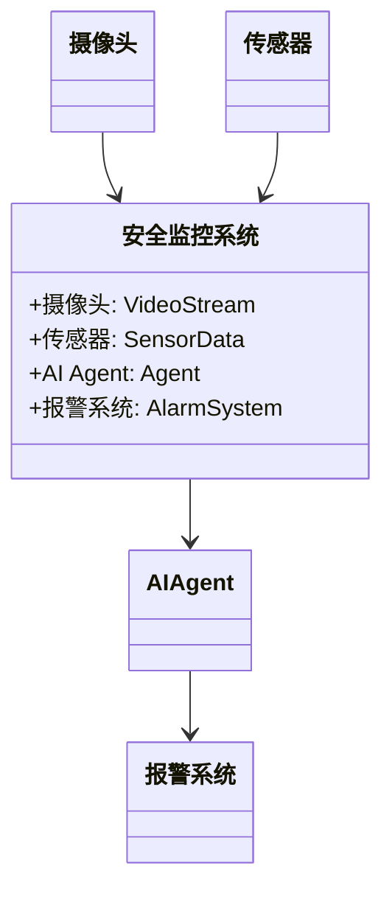
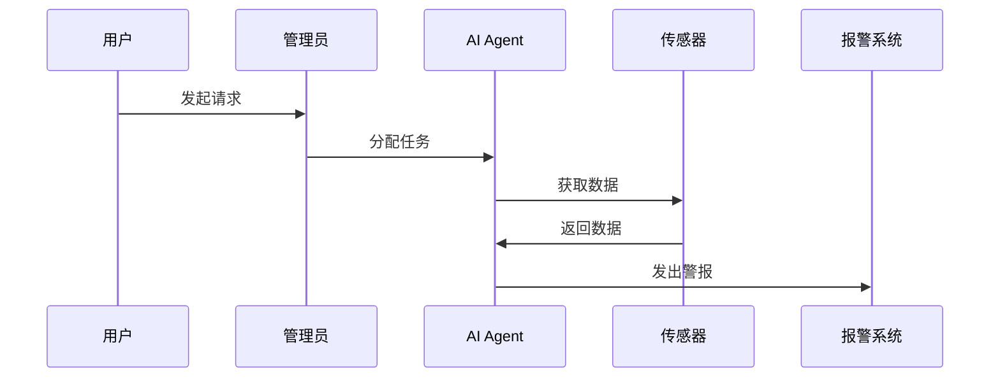

                 


```markdown
# AI Agent在智能城市安全监控中的角色

> 关键词：AI Agent, 智能城市, 安全监控, 人工智能, 物联网, 机器学习

> 摘要：本文探讨了AI Agent在智能城市安全监控中的关键角色。通过分析AI Agent的核心概念、算法原理及其在城市安全监控中的应用，本文详细阐述了AI Agent如何通过感知、决策和执行三个阶段实现对城市安全的智能化管理。文章还结合实际案例，展示了AI Agent在交通管理、环境监测和公共安全等领域的具体应用，并对未来的发展方向进行了展望。

---

# 第1章: AI Agent与智能城市概述

## 1.1 AI Agent的基本概念

### 1.1.1 AI Agent的定义与特点

AI Agent（人工智能代理）是一种能够感知环境、自主决策并采取行动的智能实体。与传统自动化系统不同，AI Agent具备学习和适应能力，能够在动态环境中优化其行为以实现目标。

- **定义**：AI Agent是一种智能系统，能够通过感知环境、分析信息、制定决策并执行动作来实现特定目标。
- **特点**：
  - 自主性：能够在没有人工干预的情况下独立运作。
  - 反应性：能够实时感知环境变化并做出响应。
  - 学习性：通过数据和经验不断优化自身的决策能力。

### 1.1.2 AI Agent与传统自动化的区别

AI Agent的核心区别在于其具备自主决策和学习能力，而传统自动化系统则依赖预定义的规则和程序。

| 特性                | AI Agent                      | 传统自动化系统             |
|---------------------|-------------------------------|--------------------------|
| 决策能力            | 具备自主决策能力               | 依赖预定义规则             |
| 学习能力            | 具备学习能力                   | 无学习能力                 |
| 环境适应能力        | 能够适应动态环境                | 适应性有限                 |

### 1.1.3 智能城市的概念与特征

智能城市是利用先进技术（如物联网、大数据、人工智能等）来优化城市运行和居民生活质量的城市形态。其主要特征包括：

- **数据驱动**：依赖大量传感器和设备收集数据。
- **实时性**：能够快速处理和响应数据。
- **智能化**：通过人工智能技术实现自动化管理。

---

## 1.2 智能城市安全监控的背景与挑战

### 1.2.1 智能城市安全监控的背景

随着城市化进程的加快，城市安全问题日益突出，传统的安全监控方式已难以应对复杂的安全威胁。AI Agent的引入为城市安全监控提供了新的解决方案。

### 1.2.2 当前城市安全监控的主要挑战

- **数据量大**：城市中分布着大量的摄像头和传感器，产生的数据量巨大。
- **实时性要求高**：安全监控需要快速响应，避免事件扩大。
- **复杂性高**：城市环境复杂，安全威胁多样化，需要具备强大的分析能力。

### 1.2.3 AI Agent在城市安全监控中的作用

AI Agent通过实时感知、分析和决策，能够在城市安全监控中发挥关键作用：

- **实时监控**：AI Agent能够实时分析视频流和传感器数据，识别异常情况。
- **智能决策**：基于分析结果，AI Agent能够快速制定应对策略。
- **自主执行**：在检测到威胁后，AI Agent能够自动触发警报或采取相应措施。

---

## 1.3 本章小结

本章介绍了AI Agent的基本概念及其在智能城市中的作用，指出了传统安全监控的局限性，并强调了AI Agent在城市安全监控中的重要性。

---

# 第2章: AI Agent的核心概念与原理

## 2.1 AI Agent的核心概念

### 2.1.1 知识表示

知识表示是AI Agent理解环境的基础，通常采用知识图谱或规则库的形式。

### 2.1.2 感知与理解

AI Agent通过传感器和摄像头等设备获取数据，并利用自然语言处理和计算机视觉技术进行分析。

### 2.1.3 决策与执行

基于感知到的信息，AI Agent通过算法制定决策，并通过执行机构（如摄像头、报警系统等）采取行动。

---

## 2.2 AI Agent的类型与特点

### 2.2.1 基于规则的AI Agent

- **特点**：依赖预定义的规则进行决策，简单且易于实现。
- **应用**：适用于规则明确的场景，如交通信号灯控制。

### 2.2.2 基于机器学习的AI Agent

- **特点**：通过数据学习，能够适应复杂环境。
- **应用**：适用于需要处理大量数据和复杂决策的场景，如智能安防。

### 2.2.3 基于知识图谱的AI Agent

- **特点**：利用知识图谱进行推理和决策，具备强大的逻辑推理能力。
- **应用**：适用于需要深度理解和推理的场景，如医疗诊断。

---

## 2.3 AI Agent的工作原理

### 2.3.1 感知阶段

AI Agent通过传感器和摄像头等设备获取环境数据，如图像、视频流和传感器读数。

### 2.3.2 决策阶段

基于感知到的数据，AI Agent利用算法进行分析和推理，制定决策方案。

### 2.3.3 执行阶段

根据决策结果，AI Agent通过执行机构（如摄像头、报警系统等）采取行动。

---

## 2.4 本章小结

本章详细介绍了AI Agent的核心概念和工作原理，分析了不同类型的AI Agent及其适用场景。

---

# 第3章: AI Agent在城市安全监控中的角色

## 3.1 城市安全监控的主要场景

### 3.1.1 公共安全监控

- **场景描述**：监控公共场所的安全，预防和应对突发事件。
- **AI Agent的作用**：实时监控视频流，识别异常行为，触发警报。

### 3.1.2 交通管理

- **场景描述**：优化交通流量，减少拥堵和事故。
- **AI Agent的作用**：分析交通数据，调整信号灯，优化路线。

### 3.1.3 环境监测

- **场景描述**：监测空气质量、污染源等环境数据。
- **AI Agent的作用**：实时分析环境数据，预测污染趋势。

---

## 3.2 AI Agent在城市安全监控中的具体角色

### 3.2.1 数据采集与处理

AI Agent通过传感器和摄像头等设备采集数据，并进行预处理和分析。

### 3.2.2 实时监控与预警

AI Agent能够实时分析数据，识别潜在威胁，并发出预警。

### 3.2.3 事件响应与决策支持

在检测到威胁后，AI Agent能够快速制定应对策略，并协助人类操作员进行事件处理。

---

## 3.3 AI Agent与其他技术的协同作用

### 3.3.1 与物联网（IoT）的协同

AI Agent通过物联网设备采集数据，并通过物联网平台进行数据传输和管理。

### 3.3.2 与大数据分析的协同

AI Agent利用大数据分析技术，从海量数据中提取有价值的信息，提升决策的准确性。

### 3.3.3 与云计算的协同

AI Agent通过云计算平台进行数据存储、计算和分析，提升系统的扩展性和灵活性。

---

## 3.4 本章小结

本章分析了AI Agent在城市安全监控中的具体角色，以及其与其他技术的协同作用。

---

# 第4章: AI Agent的算法原理与数学模型

## 4.1 AI Agent的核心算法

### 4.1.1 机器学习算法

- **监督学习**：用于分类和回归任务，如图像识别和预测模型。
- **无监督学习**：用于聚类和降维任务，如异常检测和数据压缩。
- **强化学习**：用于决策优化，如游戏AI和机器人控制。

### 4.1.2 自然语言处理算法

- **词袋模型**：用于文本表示，如垃圾邮件分类。
- **TF-IDF**：用于关键词提取，如信息检索。
- **神经网络**：用于复杂文本分析，如情感分析。

### 4.1.3 计算机视觉算法

- **边缘检测**：用于图像处理，如目标检测。
- **图像分割**：用于场景理解，如视频分析。
- **目标检测**：用于物体识别，如人脸识别。

---

## 4.2 AI Agent的决策模型

### 4.2.1 基于概率论的决策模型

- **贝叶斯定理**：用于计算条件概率，如$P(A|B) = \frac{P(B|A)P(A)}{P(B)}$。
- **马尔可夫链**：用于状态转移分析，如时间序列预测。

### 4.2.2 基于逻辑推理的决策模型

- **谓词逻辑**：用于符号推理，如专家系统。
- **规则引擎**：用于基于规则的推理，如决策树。

### 4.2.3 基于强化学习的决策模型

- **Q-learning**：用于学习最优策略，如游戏AI。
- **策略梯度法**：用于优化策略，如机器人控制。

---

## 4.3 数学模型与公式

### 4.3.1 概率论基础

- **条件概率公式**：$P(A|B) = \frac{P(A \cap B)}{P(B)}$。
- **全概率公式**：$P(A) = \sum_{i} P(A|B_i)P(B_i)$。

### 4.3.2 机器学习模型

- **线性回归**：$y = \beta x + \epsilon$。
- **逻辑回归**：$P(y=1|x) = \frac{1}{1 + e^{-\beta x}}$。

---

## 4.4 本章小结

本章详细介绍了AI Agent的核心算法及其数学模型，为后续的系统设计和实现奠定了基础。

---

# 第5章: 系统架构与设计方案

## 5.1 问题场景介绍

城市安全监控系统需要实时处理大量数据，并快速做出决策。传统的监控系统依赖人工操作，效率低下且容易出错。引入AI Agent能够显著提升系统的智能化水平。

---

## 5.2 系统功能设计

### 5.2.1 领域模型设计

以下是城市安全监控系统的领域模型：



### 5.2.2 系统架构设计

以下是系统的架构图：


### 5.2.3 系统接口设计

以下是系统接口的交互图：



---

## 5.3 本章小结

本章通过领域模型、架构图和交互图，详细描述了城市安全监控系统的架构设计。

---

# 第6章: 项目实战

## 6.1 环境安装

### 6.1.1 安装Python

```bash
# 安装Python 3.8及以上版本
sudo apt-get update
sudo apt-get install python3.8
```

### 6.1.2 安装依赖库

```bash
pip install numpy
pip install matplotlib
pip install scikit-learn
pip install opencv-python
```

---

## 6.2 核心代码实现

### 6.2.1 数据采集

```python
import cv2

def capture_video():
    cap = cv2.VideoCapture(0)
    while cap.isOpened():
        ret, frame = cap.read()
        if not ret:
            break
        # 处理视频流
        cv2.imshow('Video', frame)
        if cv2.waitKey(1) == ord('q'):
            break
    cap.release()
    cv2.destroyAllWindows()

capture_video()
```

### 6.2.2 数据分析

```python
from sklearn import svm

# 加载训练数据
X_train, y_train = load_data()

# 训练模型
clf = svm.SVC()
clf.fit(X_train, y_train)

# 预测新数据
X_test = ...
y_pred = clf.predict(X_test)
```

---

## 6.3 案例分析

### 6.3.1 公共安全监控

**案例描述**：某公共场所发生非法闯入事件，AI Agent通过视频流检测到异常行为并触发警报。

**分析过程**：
1. AI Agent采集视频流数据。
2. 利用计算机视觉技术识别异常行为。
3. 根据识别结果触发报警系统。

### 6.3.2 交通管理

**案例描述**：某路口出现严重拥堵，AI Agent通过分析交通数据调整信号灯。

**分析过程**：
1. AI Agent采集交通流量数据。
2. 利用机器学习算法预测拥堵趋势。
3. 调整信号灯配时，优化交通流量。

---

## 6.4 项目总结

通过本项目，我们展示了AI Agent在城市安全监控中的实际应用。通过安装环境、实现核心代码并进行案例分析，证明了AI Agent在提升城市安全监控效率方面的巨大潜力。

---

# 第7章: 总结与展望

## 7.1 本章总结

本文详细探讨了AI Agent在智能城市安全监控中的角色，分析了其核心概念、算法原理和系统架构，并通过实际案例展示了其应用效果。

## 7.2 未来展望

随着人工智能技术的不断发展，AI Agent在城市安全监控中的应用将更加广泛和深入。未来的研究方向包括：

- **多Agent协作**：研究多个AI Agent之间的协作机制，提升系统的整体性能。
- **边缘计算**：通过边缘计算技术，提升AI Agent的实时性和响应速度。
- **人机协作**：探索人机协作模式，充分发挥人类与AI Agent的优势。

---

# 附录: 工具安装指南

## 附录A: 安装Python和相关库

```bash
# 安装Python
sudo apt-get install python3.8

# 安装依赖库
pip install numpy
pip install matplotlib
pip install scikit-learn
pip install opencv-python
```

## 附录B: 参考文献

1. Russell, S., & Norvig, P. (2010). Artificial Intelligence: A Modern Approach.
2. Goodfellow, I., Bengio, Y., & Courville, A. (2016). Deep Learning.
3. LeCun, Y., Bengio, Y., & Hinton, G. (2015). Deep Learning and theftp://ftp.ics.uci.edu/pub/machine-learning-databases/uci-mlrepository.

---

# 作者：AI天才研究院/AI Genius Institute & 禅与计算机程序设计艺术/Zen And The Art of Computer Programming
```

