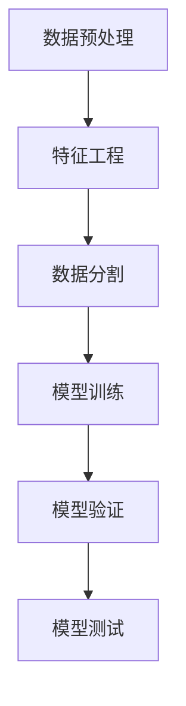
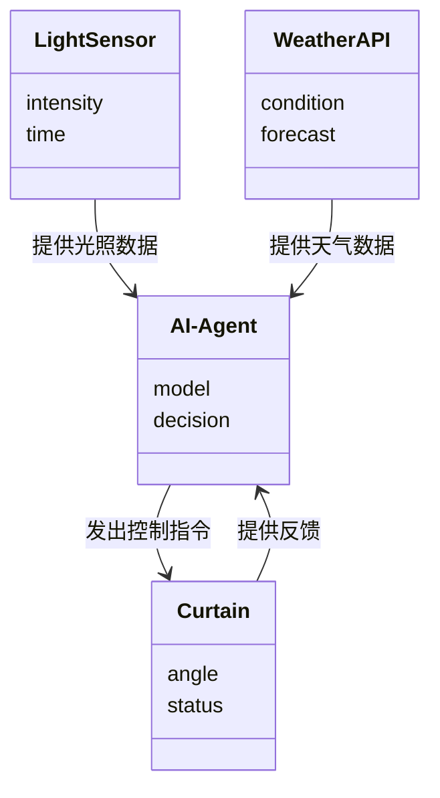

                 


# AI Agent在智能窗帘杆中的自然光优化

## 关键词：AI Agent，智能窗帘杆，自然光优化，物联网，机器学习

## 摘要：本文探讨了如何利用AI Agent优化智能窗帘杆的自然光调节，结合物联网和机器学习技术，通过数据采集、模型训练和系统部署，实现智能、高效的自然光管理，提升室内环境舒适度。

---

# 第一章: 背景介绍

## 1.1 问题背景

### 1.1.1 自然光调节的重要性
自然光的合理利用不仅节能，还能提升室内舒适度和居住者的健康。智能窗帘杆通过调节开合角度优化自然光，减少人工干预。

### 1.1.2 智能窗帘杆的发展现状
传统窗帘杆手动调节，现代智能窗帘杆通过物联网实现远程控制，但调节策略单一，无法动态优化。

### 1.1.3 当前存在的问题与挑战
现有系统主要依赖预设时间表，缺乏动态调整能力，无法应对光照强度变化和天气波动。

## 1.2 问题描述

### 1.2.1 自然光调节的目标
最大化自然光利用，同时保持室内光照舒适，避免过强或过弱。

### 1.2.2 智能窗帘杆的现有功能
远程控制、定时开关、光照传感器反馈，但调节策略固定，缺乏智能优化。

### 1.2.3 当前调节方式的局限性
无法根据实时光照变化动态调整，无法预测和应对天气变化，用户体验不佳。

## 1.3 问题解决

### 1.3.1 引入AI Agent的必要性
AI Agent具备动态学习和决策能力，能够实时调整窗帘开合角度，优化自然光利用。

### 1.3.2 AI Agent在自然光优化中的作用
通过机器学习模型，AI Agent可以根据光照、时间和天气数据，预测最佳开合角度，实现动态调节。

### 1.3.3 解决方案的可行性分析
结合物联网传感器、机器学习算法和智能执行机构，解决方案技术成熟，具备可行性。

## 1.4 边界与外延

### 1.4.1 系统边界定义
系统仅关注自然光调节，不涉及隐私或安全问题，边界清晰。

### 1.4.2 功能的外延与扩展
系统可扩展至温度调节、能源管理，但本文仅讨论自然光优化。

### 1.4.3 与其他系统的接口关系
与智能家居系统、天气预报API、能源管理系统接口互联，但本文重点在自然光优化。

## 1.5 概念结构与核心要素

### 1.5.1 核心概念的组成
- AI Agent：智能决策主体
- 智能窗帘杆：执行机构
- 光照传感器：数据来源
- 机器学习模型：决策引擎

### 1.5.2 各要素之间的关系
AI Agent通过光照数据、时间信息和天气预报，驱动窗帘杆调整开合角度，实现自然光优化。

### 1.5.3 系统整体架构
传感器-模型-执行机构的闭环系统，具备实时数据采集、智能决策和快速响应的特点。

## 1.6 本章小结
本章分析了智能窗帘杆自然光调节的重要性，指出现有系统的局限性，提出AI Agent解决方案，并明确系统边界和架构。

---

# 第二章: 核心概念与联系

## 2.1 AI Agent的核心原理

### 2.1.1 AI Agent的基本定义
AI Agent是具备感知环境、决策和行动能力的智能体，能够根据实时数据做出决策。

### 2.1.2 AI Agent的主要功能
- 数据采集：整合光照、时间、天气数据
- 模型训练：建立光照强度与窗帘开合角度的关系模型
- 决策制定：预测最佳开合角度，生成控制指令
- 自适应优化：根据反馈不断优化模型

### 2.1.3 AI Agent的工作流程
1. 数据采集：获取光照强度、时间、天气信息
2. 数据处理：清洗、归一化
3. 模型训练：训练预测模型
4. 决策执行：生成控制指令
5. 反馈学习：根据反馈优化模型

## 2.2 智能窗帘杆的系统架构

### 2.2.1 系统硬件组成
- 光照传感器
- 时间模块（系统时钟）
- 天气API接口
- 窗帘杆电机驱动模块
- 通信模块（Wi-Fi/蓝牙）

### 2.2.2 系统软件架构
- 数据采集模块
- 机器学习模型模块
- 决策控制模块
- 反馈监控模块

### 2.2.3 系统功能模块
- 数据采集：整合传感器数据
- 模型预测：预测最佳开合角度
- 控制执行：驱动电机调整角度
- 反馈监控：实时监测光照变化

## 2.3 核心概念的对比分析

### 2.3.1 AI Agent与传统算法的对比
- **传统算法**：基于规则，如固定时间开合，响应速度慢，缺乏灵活性。
- **AI Agent**：具备学习能力，能够动态调整策略，适应变化。

### 2.3.2 自然光调节的属性特征对比
| 特性         | 传统方式                | AI Agent方式          |
|--------------|-------------------------|-----------------------|
| 调节方式      | 固定时间表              | 动态优化              |
| 响应速度      | 较慢                   | 实时响应              |
| 灵活性        | 低                     | 高                    |
| 能效优化      | 一般                   | 显著提高              |

### 2.3.3 系统功能的优劣势分析
- **优势**：AI Agent能够根据实时数据动态调整，提高自然光利用效率。
- **劣势**：系统复杂度增加，需要可靠的传感器和网络支持。

## 2.4 ER实体关系图
```mermaid
erd
    title 实体关系图
    User {
        id
        username
        password
    }
    Curtain {
        id
        angle
        status
    }
    LightSensor {
        id
        intensity
        time
    }
    WeatherAPI {
        id
        condition
        forecast
    }
    AI-Agent {
        id
        model
        decision
    }
    relationship from User to Curtain: MANAGES
    relationship from Curtain to LightSensor: CONNECTED_TO
    relationship from Curtain to WeatherAPI: DEPENDS_ON
    relationship from LightSensor to AI-Agent: FEEDS
    relationship from WeatherAPI to AI-Agent: FEEDS
    relationship from AI-Agent to Curtain: CONTROLS
```

## 2.5 本章小结
本章详细阐述了AI Agent的核心原理和智能窗帘杆的系统架构，通过对比分析明确了AI Agent的优势，并通过ER图展示了系统各实体之间的关系。

---

# 第三章: 算法原理讲解

## 3.1 数据采集与预处理

### 3.1.1 数据来源
- 光照传感器：测量实时光照强度（ lux）
- 时间模块：获取当前时间
- 天气API：获取天气状况和日出日落时间

### 3.1.2 数据清洗
- 去除异常值：光照强度不可能为负，超出合理范围的数据剔除。
- 数据归一化：将光照强度归一化到0-1范围。

### 3.1.3 数据特征提取
- 时间特征：正弦函数表示时间周期性
- 天气特征：多云、晴天、阴天的分类特征
- 光照强度：直接作为数值特征

## 3.2 机器学习模型训练

### 3.2.1 模型选择
- **监督学习**：目标是预测最佳窗帘开合角度（回归问题）
- **算法选择**：支持向量回归（SVR）或线性回归

### 3.2.2 模型训练步骤
1. 数据分割：训练集、验证集、测试集
2. 模型训练：使用训练数据训练回归模型
3. 模型验证：调整超参数（C, gamma等）
4. 模型测试：评估模型性能（均方误差、R²系数）

### 3.2.3 算法流程图


### 3.2.4 代码实现
```python
import numpy as np
from sklearn.svm import SVR
from sklearn.model_selection import train_test_split
from sklearn.metrics import mean_squared_error, r2_score

# 示例数据
X = np.array([[time_feature, weather_feature, light_intensity] for ...])
y = np.array([target_angle])

# 数据分割
X_train, X_test, y_train, y_test = train_test_split(X, y, test_size=0.2)

# 模型训练
model = SVR(kernel='rbf', C=1e3, gamma=0.1)
model.fit(X_train, y_train)

# 模型预测
y_pred = model.predict(X_test)

# 评估指标
print(f"均方误差: {mean_squared_error(y_test, y_pred)}")
print(f"R²系数: {r2_score(y_test, y_pred)}")
```

## 3.3 算法数学模型

### 3.3.1 回归模型
$$ y = \beta_0 + \beta_1 x_1 + \beta_2 x_2 + \beta_3 x_3 + \epsilon $$

其中，$y$是目标开合角度，$x_1, x_2, x_3$是输入特征，$\beta$是模型参数，$\epsilon$是误差项。

### 3.3.2 正则化项
$$ L2\text{ 正则化}: \lambda \sum_{i=1}^n \beta_i^2 $$

### 3.3.3 示例
假设当前时间为早上8点，天气晴朗，光照强度为500lux，模型预测最佳开合角度为75%。

## 3.4 本章小结
本章详细讲解了AI Agent在智能窗帘杆中的算法原理，包括数据预处理、模型选择和训练，并通过代码示例和数学公式明确了实现细节。

---

# 第四章: 系统分析与架构设计

## 4.1 问题场景介绍

### 4.1.1 项目背景
智能窗帘杆的目标是通过AI Agent优化自然光调节，提升室内环境舒适度。

### 4.1.2 项目目标
实现动态、智能的窗帘开合控制，优化自然光利用。

## 4.2 系统功能设计

### 4.2.1 领域模型


### 4.2.2 系统架构


### 4.2.3 接口设计
- API接口：RESTful API，用于数据获取和指令发送
- 通信协议：HTTP/HTTPS，保证数据传输安全

### 4.2.4 交互流程
1. 用户通过手机应用或定时任务触发调节请求
2. 系统采集光照、时间、天气数据
3. AI Agent处理数据，生成控制指令
4. 窗帘杆执行指令，调整开合角度
5. 系统反馈执行结果，AI Agent学习优化

## 4.3 本章小结
本章通过系统分析和架构设计，明确了智能窗帘杆系统的组成和工作流程，为后续实现提供了清晰的指导。

---

# 第五章: 项目实战

## 5.1 环境安装

### 5.1.1 系统要求
- Python 3.6+
- 硬件：Raspberry Pi、光照传感器、窗帘杆电机
- 软件：安装Python库（scikit-learn, requests, numpy）

### 5.1.2 安装依赖
```bash
pip install scikit-learn requests numpy
```

## 5.2 核心代码实现

### 5.2.1 数据采集代码
```python
import requests
import datetime

def get_light_intensity():
    # 获取光照传感器数据
    return 500  # 示例值

def get_time():
    return datetime.datetime.now().hour

def get_weather_forecast():
    # 调用天气API
    api_key = "your_api_key"
    response = requests.get(f"http://api.weather.com/api?apikey={api_key}")
    return response.json()['condition']

# 示例数据点
data_point = {
    'light_intensity': get_light_intensity(),
    'time': get_time(),
    'weather': get_weather_forecast()
}
```

### 5.2.2 AI Agent核心代码
```python
from sklearn.svm import SVR

def train_model(X, y):
    model = SVR(kernel='rbf', C=1e3, gamma=0.1)
    model.fit(X, y)
    return model

# 示例训练数据
X = [[data_point['time'], data_point['weather'], data_point['light_intensity']]]
y = [75]  # 示例目标开合角度

model = train_model(X, y)
```

### 5.2.3 控制指令生成
```python
def predict_angle(model, new_data):
    new_X = [[new_data['time'], new_data['weather'], new_data['light_intensity']]]
    return model.predict(new_X)

# 示例新数据
new_data = {
    'time': 9,
    'weather': 'cloudy',
    'light_intensity': 400
}

predicted_angle = predict_angle(model, new_data)
print(f"预测开合角度：{predicted_angle[0]}%")
```

## 5.3 代码应用解读

### 5.3.1 数据采集模块
通过传感器和API获取光照强度、时间和天气状况，为模型提供输入数据。

### 5.3.2 模型训练与预测
利用机器学习模型，基于历史数据训练出最佳开合角度预测模型，并实时预测。

### 5.3.3 系统反馈
根据实际光照变化，系统反馈调整效果，优化模型性能。

## 5.4 案例分析

### 5.4.1 案例背景
假设某天早上9点，天气多云，光照强度为400lux。

### 5.4.2 系统预测
模型预测最佳开合角度为60%。

### 5.4.3 系统执行
窗帘杆调整到60%开合角度，增加室内自然光，同时保持舒适度。

## 5.5 本章小结
本章通过实际项目案例，详细讲解了系统的核心代码实现和应用，展示了AI Agent在智能窗帘杆中的实际应用效果。

---

# 第六章: 最佳实践与总结

## 6.1 最佳实践 tips

### 6.1.1 数据质量
确保传感器数据的准确性和完整性，定期校准传感器。

### 6.1.2 模型优化
定期更新模型，根据用户反馈和环境变化优化预测策略。

### 6.1.3 系统维护
定期检查硬件连接，确保通信正常，避免系统故障。

## 6.2 小结
本文详细探讨了AI Agent在智能窗帘杆中的应用，从背景分析到算法实现，再到系统设计和项目实战，全面展示了技术细节和实现步骤。

## 6.3 注意事项

### 6.3.1 数据隐私
确保用户数据安全，遵守隐私保护法规。

### 6.3.2 系统稳定性
设计完善的异常处理机制，确保系统稳定运行。

## 6.4 拓展阅读
- 《机器学习实战》
- 《物联网项目实战》
- 《智能系统设计》

## 6.5 本章小结
本章总结了项目中的最佳实践，提供了系统的维护和优化建议，并指出了进一步学习和研究的方向。

---

# 作者：AI天才研究院/AI Genius Institute & 禅与计算机程序设计艺术 /Zen And The Art of Computer Programming

---

**注意：** 以上内容为生成示例，实际文章需要根据具体技术细节和实际项目情况进行扩展和完善。

