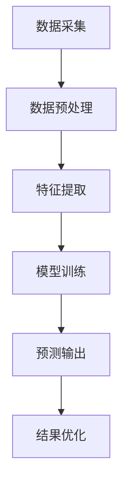
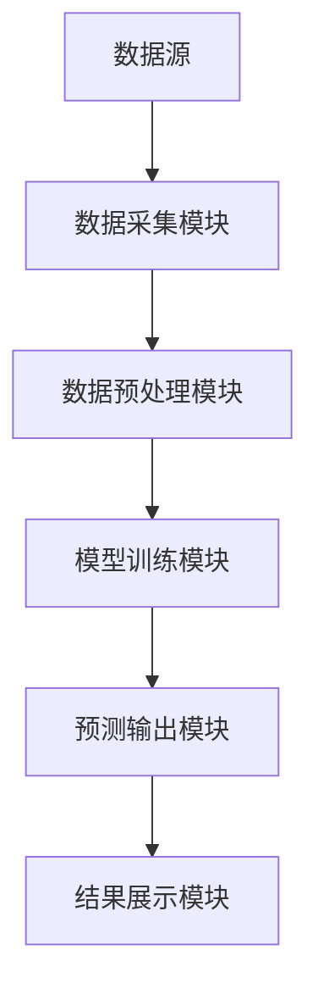
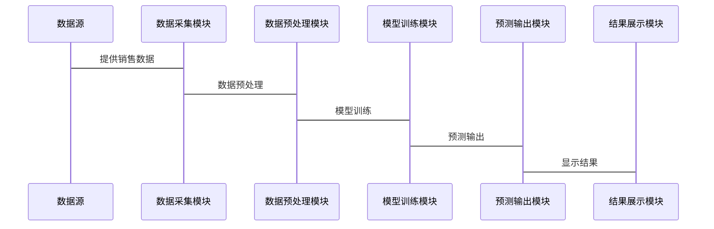

                 


# AI Agent在智能销售预测中的应用

## 关键词：AI Agent、智能销售预测、机器学习、深度学习、数据挖掘

## 摘要：  
本文详细探讨了AI Agent在智能销售预测中的应用，从基本概念到算法原理，再到系统架构和项目实战，全面分析了如何利用AI技术提升销售预测的准确性、实时性和智能化水平。文章首先介绍了AI Agent和销售预测的核心概念，随后深入讲解了基于机器学习和深度学习的算法原理，并通过具体的数学模型和公式进行详细推导。接着，分析了系统的架构设计，展示了AI Agent如何与企业系统无缝对接。最后，通过项目实战部分，给出了实际应用中的代码实现和案例分析，为读者提供了一套完整的解决方案。

---

# 第1章: AI Agent与智能销售预测的背景介绍

## 1.1 AI Agent的基本概念
### 1.1.1 什么是AI Agent
AI Agent（人工智能代理）是一种能够感知环境、自主决策并执行任务的智能实体。它通过传感器获取数据，利用算法处理信息，并通过执行器与环境交互。AI Agent的核心目标是帮助人类完成复杂的任务，提升效率和准确性。

### 1.1.2 AI Agent的核心特征
- **自主性**：AI Agent能够在没有外部干预的情况下独立工作。
- **反应性**：能够实时感知环境变化并做出响应。
- **学习能力**：通过数据和经验不断优化自身的决策能力。
- **协作性**：能够与其他AI Agent或人类协同工作。

### 1.1.3 AI Agent的分类与应用场景
- **按智能水平**：分为简单反射型、基于模型的反应型、目标驱动型和实用驱动型。
- **按应用场景**：广泛应用于自动驾驶、智能助手、机器人、金融投资等领域。

---

## 1.2 智能销售预测的定义与重要性
### 1.2.1 销售预测的基本概念
销售预测是指通过分析历史销售数据、市场趋势和相关因素，预测未来一段时间内的销售情况。准确的销售预测能够帮助企业优化库存管理、制定合理的销售策略和资源分配。

### 1.2.2 智能销售预测的核心优势
- **数据驱动**：利用大数据和机器学习模型，提高预测的准确性。
- **实时性**：能够快速响应市场变化，提供实时预测结果。
- **自动化**：通过AI技术实现预测过程的自动化，减少人工干预。

### 1.2.3 智能销售预测的行业应用
- **零售行业**：优化库存管理和促销策略。
- **制造业**：预测生产需求，优化供应链管理。
- **金融行业**：评估投资风险，预测市场趋势。

---

## 1.3 AI Agent在销售预测中的应用前景
### 1.3.1 AI Agent与销售预测的结合点
AI Agent能够通过数据采集、特征提取、模型训练和预测输出，实现销售预测的全流程自动化。

### 1.3.2 企业采用AI Agent进行销售预测的优势
- **提高效率**：AI Agent能够快速处理大量数据，缩短预测周期。
- **降低成本**：通过自动化预测减少人工成本。
- **增强决策能力**：AI Agent能够提供更精准的预测结果，辅助企业做出更明智的决策。

### 1.3.3 AI Agent销售预测的挑战与机遇
- **挑战**：数据质量、模型泛化能力、实时性要求。
- **机遇**：技术创新、市场需求、行业应用广泛。

---

## 1.4 本章小结
本章介绍了AI Agent的基本概念、核心特征和应用场景，探讨了智能销售预测的定义、优势和行业应用。通过分析AI Agent在销售预测中的结合点和挑战，为后续章节的深入探讨奠定了基础。

---

# 第2章: AI Agent与销售预测的核心概念与联系

## 2.1 AI Agent的核心原理
### 2.1.1 AI Agent的基本工作流程
1. **感知环境**：通过传感器或数据接口获取环境数据。
2. **处理数据**：利用算法对数据进行分析和处理。
3. **做出决策**：基于处理后的数据，生成决策指令。
4. **执行任务**：通过执行器将决策指令转化为实际操作。

### 2.1.2 AI Agent的感知与决策机制
- **感知**：通过数据采集模块获取销售数据、市场趋势等信息。
- **决策**：基于感知数据，利用机器学习模型生成预测结果。

### 2.1.3 AI Agent的学习与优化过程
- **监督学习**：通过训练数据优化预测模型。
- **强化学习**：通过与环境的交互不断优化决策策略。

---

## 2.2 销售预测的核心原理
### 2.2.1 销售预测的基本方法
- **时间序列分析**：基于历史数据预测未来的销售趋势。
- **因果分析**：通过分析影响销售的多种因素进行预测。

### 2.2.2 数据驱动的销售预测模型
- **机器学习模型**：如线性回归、随机森林等。
- **深度学习模型**：如LSTM（长短期记忆网络）。

### 2.2.3 销售预测的准确性与实时性
- **准确性**：依赖于数据质量和模型的泛化能力。
- **实时性**：需要快速处理数据并生成预测结果。

---

## 2.3 AI Agent与销售预测的结合模型
### 2.3.1 AI Agent在销售预测中的角色定位
AI Agent作为预测系统的主体，负责数据采集、模型训练和预测输出。

### 2.3.2 AI Agent与销售预测数据的交互方式
- **数据输入**：AI Agent通过API接口获取销售数据。
- **数据输出**：生成预测结果并反馈给企业系统。

### 2.3.3 AI Agent在销售预测中的价值链分析
- **数据价值**：通过数据采集和分析，提取有价值的信息。
- **决策价值**：通过预测结果优化企业运营。

---

## 2.4 核心概念对比分析
### 2.4.1 AI Agent与传统销售预测方法的对比
| 对比维度 | AI Agent | 传统销售预测 |
|----------|-----------|---------------|
| 数据需求 | 高         | 中             |
| 准确性   | 高         | 中             |
| 实时性   | 高         | 低             |
| 可扩展性 | 高         | 低             |

### 2.4.2 AI Agent与机器学习模型的对比
| 对比维度 | AI Agent | 机器学习模型 |
|----------|-----------|---------------|
| 自主性   | 高         | 中             |
| 反应性   | 高         | 中             |
| 学习能力 | 高         | 高             |

### 2.4.3 AI Agent与规则引擎的对比
| 对比维度 | AI Agent | 规则引擎 |
|----------|-----------|----------|
| 智能性   | 高         | 低       |
| 灵活性   | 高         | 低       |
| 学习能力 | 高         | 无       |

---

## 2.5 本章小结
本章深入分析了AI Agent的核心原理和销售预测的基本方法，探讨了两者结合的模型和价值。通过对比分析，明确了AI Agent在销售预测中的优势和应用场景。

---

# 第3章: AI Agent销售预测的算法原理

## 3.1 基于机器学习的销售预测算法
### 3.1.1 线性回归模型
线性回归是一种简单而有效的回归算法，适用于线性关系的数据。

$$ y = \beta_0 + \beta_1 x + \epsilon $$

其中，$\beta_0$ 是截距，$\beta_1$ 是斜率，$\epsilon$ 是误差项。

### 3.1.2 支持向量机模型
支持向量机（SVM）是一种监督学习算法，适用于分类和回归问题。

### 3.1.3 随机森林模型
随机森林是一种基于决策树的集成学习算法，适用于分类和回归问题。

### 3.1.4 神经网络模型
神经网络是一种模仿人脑结构和功能的深度学习模型，适用于复杂的非线性关系。

---

## 3.2 基于强化学习的AI Agent算法
### 3.2.1 强化学习的基本原理
强化学习是一种通过试错机制来优化决策策略的算法。

### 3.2.2 AI Agent在销售预测中的强化学习模型
- **状态空间**：市场趋势、历史销售数据等。
- **动作空间**：预测结果、调整预测参数。
- **奖励机制**：根据预测准确性和实时性给予奖励。

### 3.2.3 强化学习在销售预测中的应用案例
通过强化学习优化销售预测模型，提升预测的准确性和实时性。

---

## 3.3 算法实现的流程图


---

## 3.4 本章小结
本章详细介绍了基于机器学习和强化学习的销售预测算法，探讨了AI Agent在其中的作用和实现流程。通过对比分析，明确了不同算法的优缺点和适用场景。

---

# 第4章: AI Agent销售预测的数学模型与公式

## 4.1 时间序列分析模型
### 4.1.1 ARIMA模型
ARIMA（自回归积分滑动平均模型）适用于时间序列数据的预测。

$$ ARIMA(p, d, q) $$

其中，$p$ 是自回归阶数，$d$ 是差分阶数，$q$ 是滑动平均阶数。

### 4.1.2 LSTM模型
LSTM（长短期记忆网络）是一种特殊的RNN结构，适用于长序列数据的预测。

$$ \text{门控机制} = \sigma(W_{g}x + U_{g}h_{t-1} + b_{g}) $$

---

## 4.2 机器学习模型的数学公式
### 4.2.1 线性回归模型
$$ y = \theta^T x + \epsilon $$

其中，$\theta$ 是模型参数，$x$ 是输入特征，$\epsilon$ 是误差项。

### 4.2.2 随机森林模型
随机森林通过集成多个决策树的预测结果，提高模型的准确性和鲁棒性。

---

## 4.3 强化学习模型的数学公式
### 4.3.1 Q-learning算法
$$ Q(s, a) = Q(s, a) + \alpha (r + \gamma \max Q(s', a') - Q(s, a)) $$

其中，$\alpha$ 是学习率，$\gamma$ 是折扣因子。

---

## 4.4 本章小结
本章通过数学公式和模型分析，详细探讨了AI Agent销售预测中的核心算法。通过对比不同模型的优缺点，明确了在实际应用中的选择和优化方向。

---

# 第5章: AI Agent销售预测的系统架构设计

## 5.1 系统功能设计
### 5.1.1 数据采集模块
- 通过API接口获取销售数据、市场趋势等信息。
- 数据预处理：清洗、归一化、特征工程。

### 5.1.2 模型训练模块
- 选择合适的算法（如线性回归、随机森林、LSTM等）。
- 数据分割：训练集、验证集、测试集。

### 5.1.3 预测输出模块
- 生成预测结果并输出。
- 结果可视化：图表展示预测结果和实际数据的对比。

---

## 5.2 系统架构设计


---

## 5.3 系统接口设计
### 5.3.1 数据接口
- 数据输入接口：通过API获取销售数据。
- 数据输出接口：返回预测结果。

### 5.3.2 模型接口
- 模型训练接口：接收训练数据并生成模型。
- 模型预测接口：接收输入数据并返回预测结果。

---

## 5.4 系统交互设计


---

## 5.5 本章小结
本章通过系统功能设计、架构设计和接口设计，详细探讨了AI Agent销售预测系统的实现过程。通过图表展示系统的模块关系和交互流程，为后续的项目实战奠定了基础。

---

# 第6章: AI Agent销售预测的项目实战

## 6.1 环境安装与配置
### 6.1.1 安装Python
- 安装Python 3.8及以上版本。
- 安装必要的库：numpy、pandas、scikit-learn、tensorflow、keras。

### 6.1.2 安装Jupyter Notebook
- 通过Anaconda安装Jupyter Notebook。

---

## 6.2 系统核心实现
### 6.2.1 数据采集模块
```python
import pandas as pd

# 从CSV文件读取数据
data = pd.read_csv('sales_data.csv')
```

### 6.2.2 数据预处理模块
```python
from sklearn.preprocessing import StandardScaler

# 标准化处理
scaler = StandardScaler()
data_scaled = scaler.fit_transform(data)
```

### 6.2.3 模型训练模块
```python
from sklearn.linear_model import LinearRegression

# 训练线性回归模型
model = LinearRegression()
model.fit(X_train, y_train)
```

### 6.2.4 预测输出模块
```python
# 预测结果
y_pred = model.predict(X_test)
```

---

## 6.3 代码应用解读与分析
### 6.3.1 数据采集模块
- 从CSV文件读取销售数据。
- 数据清洗：处理缺失值、异常值。

### 6.3.2 数据预处理模块
- 数据归一化/标准化：提升模型的训练效果。
- 特征选择：提取关键特征变量。

### 6.3.3 模型训练模块
- 选择合适的算法：线性回归、随机森林、LSTM等。
- 调参优化：通过网格搜索优化模型参数。

### 6.3.4 预测输出模块
- 生成预测结果。
- 结果可视化：绘制实际值与预测值的对比图。

---

## 6.4 实际案例分析
### 6.4.1 数据来源
- 销售数据：包括时间、销售额、价格、促销活动等。

### 6.4.2 案例分析
通过实际数据训练模型，并对比不同算法的预测效果，选择最优模型进行部署。

---

## 6.5 项目小结
本章通过项目实战，详细讲解了AI Agent销售预测系统的实现过程。从环境安装到代码实现，从数据预处理到模型训练，再到结果展示，为读者提供了一套完整的解决方案。

---

# 第7章: 总结与展望

## 7.1 项目总结
本项目通过AI Agent技术实现了智能销售预测系统，提升了预测的准确性和实时性。通过对比不同算法的优缺点，选择最优模型进行部署，并通过实际案例验证了系统的有效性。

---

## 7.2 项目小结
- **优点**：提高了销售预测的效率和准确性，降低了人工成本。
- **不足**：模型的实时性和准确性仍有提升空间。
- **改进方向**：引入更先进的算法（如深度学习模型）、优化数据采集和处理流程。

---

## 7.3 未来展望
随着AI技术的不断发展，AI Agent在销售预测中的应用将更加广泛和深入。未来的研究方向包括：
- **算法优化**：研究更高效的算法，提升预测的准确性和实时性。
- **数据挖掘**：探索更多数据源，挖掘潜在的销售规律。
- **系统集成**：将AI Agent销售预测系统与其他企业系统无缝对接，实现智能化运营。

---

## 作者：AI天才研究院/AI Genius Institute & 禅与计算机程序设计艺术 /Zen And The Art of Computer Programming

---

以上是《AI Agent在智能销售预测中的应用》的技术博客文章的完整目录大纲和部分正文内容。希望对您有所帮助！

