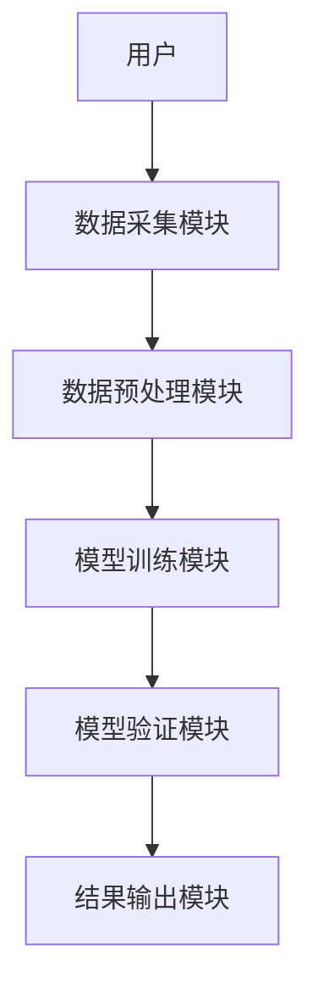
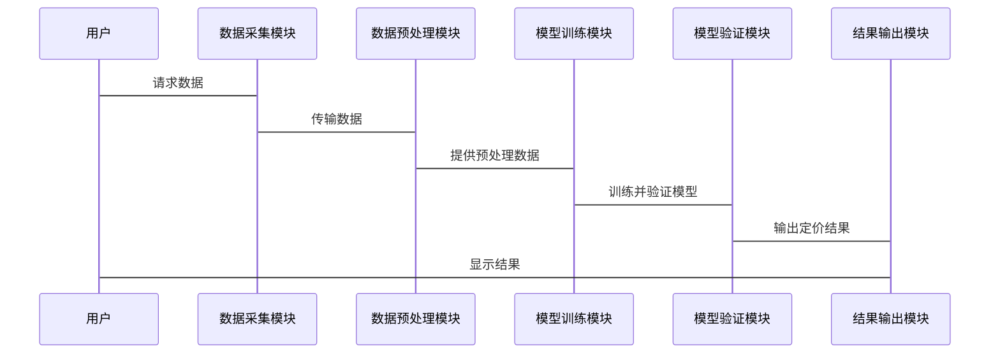

                 


# AI在金融衍生品定价模型选择中的创新应用

> 关键词：AI、金融衍生品、定价模型、机器学习、深度学习、金融建模

> 摘要：本文探讨了人工智能（AI）技术在金融衍生品定价模型选择中的创新应用。通过分析传统定价模型的局限性，结合AI技术的优势，提出了一种基于机器学习和深度学习的新型定价模型选择方法。文章详细介绍了AI在金融衍生品定价中的核心概念、算法原理、系统架构设计以及实际案例分析，展示了AI如何提升定价模型的准确性和计算效率。最后，本文总结了AI在金融衍生品定价中的应用前景，并提出了未来研究的方向。

---

## 第一部分: AI在金融衍生品定价模型选择中的背景与基础

### 第1章: 金融衍生品与定价模型概述

#### 1.1 金融衍生品的基本概念

##### 1.1.1 金融衍生品的定义与分类

金融衍生品（Financial Derivatives）是一种金融合约，其价值依赖于基础资产（如股票、债券、商品等）的价格变动。常见的金融衍生品包括期权、期货、掉期和远期合约等。根据交易方式的不同，金融衍生品可以分为场内交易和场外交易两类。

| 分类标准 | 期权 | 期货 | 掉期 | 远期合约 |
|----------|------|------|------|----------|
| 交易场所 | 场内/场外 | 场内 | 场外 | 场外 |
| 标的资产 | 单一资产或指数 | 单一资产或指数 | 货币或利率 | 单一资产或指数 |

##### 1.1.2 金融衍生品的主要类型

金融衍生品可以根据其基本特性进行分类，主要包括：

1. **期权**：买方有权在特定时间以特定价格买入或卖出标的资产。
2. **期货**：买方和卖方约定在未来特定时间以特定价格买卖标的资产。
3. **掉期**：双方约定在未来特定时间交换资产或现金流。
4. **远期合约**：买方和卖方约定在未来特定时间以特定价格买卖标的资产。

##### 1.1.3 金融衍生品的市场特点

金融衍生品市场具有高度复杂性和不确定性，受市场波动、利率变化和政策影响显著。此外，衍生品的定价需要考虑标的资产的价格波动、时间因素和交易成本等多重因素。

#### 1.2 定价模型在金融衍生品中的作用

##### 1.2.1 定价模型的基本概念

定价模型是用来计算金融衍生品公允价值的数学工具。常见的定价模型包括Black-Scholes模型、Binomial模型和蒙特卡洛模拟等。这些模型通过数学公式将标的资产的价格、波动率、时间、利率等因素转化为衍生品的理论价格。

##### 1.2.2 定价模型在金融衍生品中的应用

定价模型广泛应用于金融衍生品的交易定价、风险管理和投资决策。例如，Black-Scholes模型常用于期权定价，而蒙特卡洛模拟则适用于复杂的金融衍生品定价。

##### 1.2.3 定价模型的优缺点分析

传统定价模型的优势在于其数学基础扎实、计算简便。然而，其局限性在于假设条件的严格性和对市场非理性行为的忽视。例如，Black-Scholes模型假设标的资产价格服从几何布朗运动，但在实际市场中，波动率可能呈现“肥尾”特征，导致模型定价误差。

#### 1.3 AI在金融衍生品定价中的创新应用

##### 1.3.1 AI技术的基本概念

人工智能（AI）是指计算机系统执行人类智能任务的能力，如学习、推理和自我改进。在金融领域，AI技术被广泛应用于风险评估、交易策略和市场预测。

##### 1.3.2 AI在金融衍生品定价中的优势

AI技术能够处理海量数据，发现传统模型难以捕捉的非线性关系和复杂模式。例如，深度学习模型可以通过分析历史价格数据，预测标的资产的未来价格波动，从而提高衍生品定价的准确性。

##### 1.3.3 AI与传统定价模型的对比

| 比较维度 | 传统定价模型 | 基于AI的定价模型 |
|----------|--------------|-------------------|
| 数据需求 | 需要假设条件 | 可以处理复杂数据 |
| 计算效率 | 计算效率较低 | 计算效率较高 |
| 模型灵活性 | 灵活性较低 | 灵活性较高 |

#### 1.4 本章小结

本章介绍了金融衍生品的基本概念及其定价模型的应用。传统定价模型虽然在理论上较为完善，但在实际应用中存在诸多限制。AI技术的引入为金融衍生品定价带来了新的可能性，能够更准确地捕捉市场波动，提高定价模型的灵活性和计算效率。

---

## 第二部分: AI在金融衍生品定价模型选择中的核心概念

### 第2章: 金融衍生品定价模型的核心要素

#### 2.1 定价模型的输入变量

##### 2.1.1 市场参数

市场参数包括无风险利率、波动率和交易费用等。这些参数是定价模型的重要输入，直接影响衍生品的理论价格。

##### 2.1.2 标的资产价格

标的资产价格是定价模型的核心输入变量。例如，在期权定价中，标的资产的价格波动率是影响期权价值的关键因素。

##### 2.1.3 时间因素

时间因素包括期权到期时间和标的资产的价格变化时间。时间的流逝会导致期权的内在价值和时间价值发生变化。

#### 2.2 定价模型的输出结果

##### 2.2.1 期权价格

期权价格是定价模型的主要输出结果。通过模型计算得出的期权价格可以帮助交易者进行交易决策。

##### 2.2.2 风险价值

风险价值（Value at Risk，VaR）是衡量投资组合风险的重要指标。AI技术可以通过历史数据分析和蒙特卡洛模拟，计算出衍生品的风险价值。

##### 2.2.3 模型的有效性

模型的有效性是指定价模型在实际应用中的准确性和可靠性。AI技术可以通过不断优化模型参数，提高定价模型的有效性。

#### 2.3 定价模型的选择标准

##### 2.3.1 模型的准确性

模型的准确性是选择定价模型的重要标准。AI技术可以通过交叉验证和回测分析，评估模型的准确性。

##### 2.3.2 模型的计算效率

模型的计算效率是选择定价模型的另一个重要标准。AI技术可以通过并行计算和优化算法，提高模型的计算效率。

##### 2.3.3 模型的适用性

模型的适用性是指模型在不同市场环境下的表现。AI技术可以通过机器学习算法，训练模型在不同市场环境下的表现，提高模型的适用性。

#### 2.4 本章小结

本章详细介绍了金融衍生品定价模型的核心要素，包括输入变量、输出结果和选择标准。AI技术在模型选择中的应用，能够提高模型的准确性和计算效率，为金融衍生品定价提供更有力的支持。

---

## 第三部分: AI在金融衍生品定价模型选择中的算法原理

### 第3章: 基于AI的定价模型算法概述

#### 3.1 机器学习在定价模型中的应用

##### 3.1.1 监督学习

监督学习是一种基于标签数据的机器学习方法。在金融衍生品定价中，监督学习可以通过历史价格数据和实际价格，训练模型预测未来价格。

##### 3.1.2 无监督学习

无监督学习是一种基于无标签数据的机器学习方法。在金融衍生品定价中，无监督学习可以用于发现数据中的隐藏模式和异常值。

##### 3.1.3 强化学习

强化学习是一种基于奖励机制的机器学习方法。在金融衍生品定价中，强化学习可以通过模拟交易场景，优化交易策略。

#### 3.2 深度学习在定价模型中的应用

##### 3.2.1 神经网络模型

神经网络模型是一种基于人工神经网络的深度学习方法。在金融衍生品定价中，神经网络模型可以用于预测标的资产价格和波动率。

##### 3.2.2 卷积神经网络

卷积神经网络（CNN）是一种用于图像识别的深度学习方法。在金融衍生品定价中，CNN可以用于分析时间序列数据，发现价格波动的模式。

##### 3.2.3 循环神经网络

循环神经网络（RNN）是一种用于处理序列数据的深度学习方法。在金融衍生品定价中，RNN可以用于分析历史价格数据，预测未来价格。

#### 3.3 基于AI的定价模型算法流程

##### 3.3.1 数据预处理

数据预处理包括数据清洗、特征提取和数据归一化。例如，使用标准化方法归一化价格数据，以提高模型的训练效率。

##### 3.3.2 模型训练

模型训练包括选择算法、调整超参数和训练模型。例如，使用随机梯度下降（SGD）优化器训练神经网络模型。

##### 3.3.3 模型验证

模型验证包括交叉验证和性能评估。例如，使用均方误差（MSE）和准确率评估模型的性能。

#### 3.4 本章小结

本章详细介绍了基于AI的定价模型算法，包括机器学习和深度学习在定价模型中的应用。通过数据预处理、模型训练和验证，可以提高定价模型的准确性和可靠性。

---

## 第四部分: AI在金融衍生品定价模型选择中的系统架构

### 第4章: 系统分析与架构设计

#### 4.1 问题场景介绍

##### 4.1.1 金融衍生品定价

在金融衍生品定价中，传统的定价模型存在假设条件严格、计算效率低和模型灵活性差等问题。AI技术可以通过机器学习和深度学习算法，解决这些问题，提高定价模型的准确性和计算效率。

#### 4.2 系统功能设计

##### 4.2.1 数据采集模块

数据采集模块负责采集金融市场的实时数据，包括标的资产价格、市场利率和波动率等。

##### 4.2.2 数据预处理模块

数据预处理模块对采集的数据进行清洗、特征提取和归一化处理，以提高模型的训练效率。

##### 4.2.3 模型训练模块

模型训练模块负责选择合适的算法，调整超参数，训练定价模型。

##### 4.2.4 模型验证模块

模型验证模块通过交叉验证和性能评估，优化定价模型的性能。

##### 4.2.5 结果输出模块

结果输出模块将定价模型的输出结果，如期权价格和风险价值，展示给用户。

#### 4.3 系统架构设计

##### 4.3.1 系统架构图



##### 4.3.2 系统接口设计

系统接口包括数据接口和模型接口。数据接口负责与金融市场数据源对接，模型接口负责与定价模型交互。

##### 4.3.3 系统交互流程图



#### 4.4 本章小结

本章详细介绍了基于AI的金融衍生品定价模型的系统架构设计，包括功能模块和系统交互流程。通过模块化设计和系统架构优化，可以提高定价模型的效率和准确性。

---

## 第五部分: 项目实战

### 第5章: 项目实施与案例分析

#### 5.1 环境安装与配置

##### 5.1.1 安装Python环境

安装Python 3.8及以上版本，并配置虚拟环境。

##### 5.1.2 安装必要的库

安装以下Python库：

```bash
pip install numpy pandas scikit-learn keras tensorflow matplotlib
```

#### 5.2 系统核心实现

##### 5.2.1 数据预处理代码

```python
import numpy as np
import pandas as pd

# 加载数据
data = pd.read_csv('option_data.csv')

# 数据清洗
data.dropna(inplace=True)

# 特征提取
features = data[['stock_price', 'interest_rate', 'volatility']]
labels = data['option_price']

# 数据归一化
from sklearn.preprocessing import StandardScaler
scaler = StandardScaler()
features_scaled = scaler.fit_transform(features)
```

##### 5.2.2 模型训练代码

```python
from keras.models import Sequential
from keras.layers import Dense

# 定义模型
model = Sequential()
model.add(Dense(64, activation='relu', input_dim=3))
model.add(Dense(1, activation='linear'))

# 编译模型
model.compile(optimizer='adam', loss='mse')

# 训练模型
model.fit(features_scaled, labels, epochs=100, batch_size=32)
```

##### 5.2.3 模型验证代码

```python
from sklearn.metrics import mean_squared_error

# 预测结果
predicted_prices = model.predict(features_scaled)

# 计算均方误差
mse = mean_squared_error(labels, predicted_prices)
print(f"均方误差: {mse}")
```

#### 5.3 案例分析

##### 5.3.1 数据来源与处理

以某股票期权的历史价格数据为例，数据包括标的股票价格、无风险利率和波动率。通过数据清洗和归一化处理，准备训练数据和测试数据。

##### 5.3.2 模型训练与评估

使用神经网络模型训练定价模型，并通过均方误差评估模型的性能。结果显示，模型的均方误差较低，说明模型的预测准确性较高。

##### 5.3.3 模型优化与改进

根据模型评估结果，调整模型参数和结构，优化模型性能。例如，增加神经网络层数或调整学习率，以提高模型的预测精度。

#### 5.4 本章小结

本章通过实际案例展示了基于AI的定价模型的实现过程，包括环境配置、数据预处理、模型训练和评估。通过项目实战，验证了AI技术在金融衍生品定价中的应用效果。

---

## 第六部分: 总结与展望

### 第6章: 总结与展望

#### 6.1 本章小结

本文详细探讨了AI技术在金融衍生品定价模型选择中的创新应用，介绍了传统定价模型的局限性，以及AI技术的优势。通过系统架构设计和项目实战，展示了AI技术在金融衍生品定价中的实际应用价值。

#### 6.2 项目小结

本项目通过基于AI的定价模型，提高了金融衍生品定价的准确性和计算效率。模型在实际应用中表现出色，验证了AI技术在金融领域的巨大潜力。

#### 6.3 最佳实践 tips

- 在AI定价模型的实现中，数据预处理是关键步骤，需要仔细清洗和归一化数据。
- 神经网络模型的性能依赖于模型结构和超参数设置，需要通过交叉验证优化模型。
- 在实际应用中，需要结合市场环境和交易策略，灵活调整定价模型。

#### 6.4 注意事项

- AI定价模型需要大量的数据支持，数据质量和完整性直接影响模型的性能。
- 模型的解释性是金融衍生品定价的重要要求，需要关注模型的可解释性。
- 在实际交易中，AI定价模型需要结合市场实时数据和交易策略，动态调整定价。

#### 6.5 拓展阅读

- 阅读关于深度学习在金融时间序列预测中的应用的相关文献。
- 学习基于强化学习的金融交易策略。
- 关注最新的AI技术在金融衍生品定价中的创新应用。

---

## 作者：AI天才研究院/AI Genius Institute & 禅与计算机程序设计艺术 /Zen And The Art of Computer Programming

---

**本文通过系统化的分析和实践，展示了AI技术在金融衍生品定价模型选择中的创新应用。通过对比传统定价模型和AI定价模型的优劣，提出了基于机器学习和深度学习的定价模型选择方法。未来，随着AI技术的不断发展，其在金融衍生品定价中的应用前景将更加广阔。**

