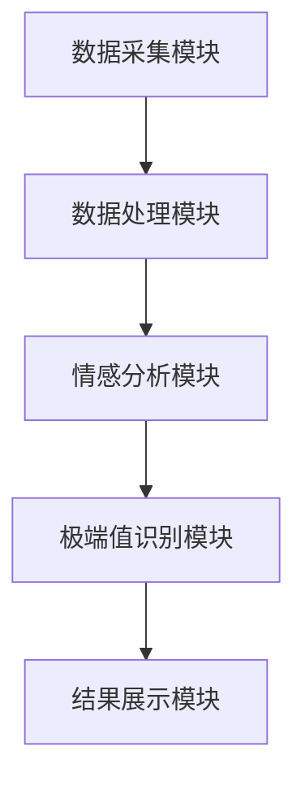
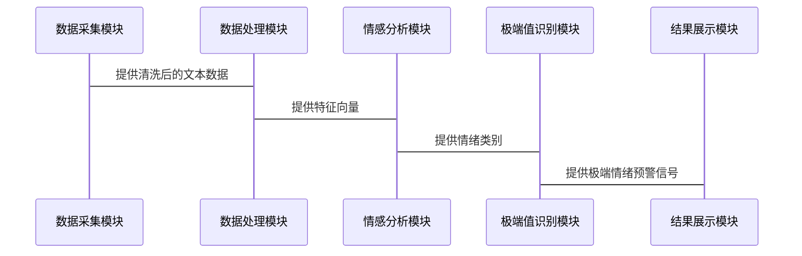

                 

<think>
好的，我需要根据用户提供的目录大纲来撰写《AI智能体在识别市场情绪极端值中的应用》的正文内容。正文需要详细且逻辑清晰，符合用户的要求。首先，我将按照目录的结构逐步展开，确保每个部分都有足够的细节，并且使用专业的技术语言，同时加入实际的例子和图表来说明内容。

# 文章标题：AI智能体在识别市场情绪极端值中的应用

## 文章关键词：市场情绪，极端值识别，AI智能体，自然语言处理，情感分析，机器学习，金融数据分析

## 摘要：  
随着金融市场数据的爆炸式增长，识别市场情绪的极端值对于投资者和机构至关重要。本文通过结合自然语言处理、情感分析和机器学习技术，系统地介绍了AI智能体在识别市场情绪极端值中的应用。从市场情绪的定义到极端值识别的算法原理，再到系统的架构设计和实际案例分析，本文为读者提供了一套完整的解决方案，帮助他们在复杂的金融市场中做出更明智的决策。

---

# 第一部分: AI智能体在识别市场情绪极端值中的应用概述

## 第1章: 市场情绪与极端值识别的背景介绍

### 1.1 问题背景

#### 1.1.1 市场情绪分析的定义与目标  
市场情绪分析是通过对金融市场中的文本数据（如新闻、社交媒体评论、机构报告等）进行分析，以识别市场的整体情绪状态。市场的极端情绪状态（如过度乐观或过度悲观）往往预示着市场的拐点或危机，对投资者的决策具有重要的参考价值。

**目标**：  
- 实时监控市场情绪状态。  
- 识别市场情绪的极端值，提前预警潜在风险。  
- 结合其他市场指标，提供更精准的投资决策支持。  

#### 1.1.2 极端市场情绪的定义与特征  
极端市场情绪是指市场情绪强度远超正常范围的情况，通常与市场泡沫或崩盘相关。其主要特征包括：  
1. **情绪强度高**：市场参与者表现出极度乐观或悲观的态度。  
2. **偏离历史均值**：情绪强度显著偏离历史平均水平。  
3. **持续时间短**：极端情绪往往在短时间内迅速形成并消退。  

#### 1.1.3 市场情绪极端值识别的必要性  
- **风险预警**：提前识别极端情绪有助于防范市场崩盘风险。  
- **投资机会发现**：极端情绪往往伴随着超跌或超涨的机会。  
- **辅助决策**：结合其他市场数据，为投资机构提供更全面的决策依据。  

### 1.2 AI智能体的定义与特点

#### 1.2.1 AI智能体的基本概念  
AI智能体（AI Agent）是指具有感知环境、自主决策和执行任务能力的智能系统。它能够通过传感器获取数据，利用算法进行分析，并根据结果采取相应的行动。

#### 1.2.2 智能体的核心要素与功能  
1. **感知能力**：通过多种数据源（如文本、价格数据）获取市场信息。  
2. **决策能力**：基于市场情绪分析算法，识别极端情绪状态。  
3. **执行能力**：根据分析结果，触发相应的预警或投资策略。  

#### 1.2.3 AI智能体在金融领域的应用潜力  
- **实时监控**：智能体可以24/7实时监控市场情绪，提供及时反馈。  
- **数据融合**：整合文本、价格、交易数据，提供多维度分析。  
- **自适应学习**：通过机器学习算法不断优化情绪识别模型。  

### 1.3 本章小结  
本章介绍了市场情绪分析的背景、目标，以及极端情绪的定义和识别的必要性。同时，详细阐述了AI智能体的基本概念和其在金融领域的应用潜力，为后续内容奠定了基础。

---

## 第2章: 市场情绪与极端值识别的核心概念

### 2.1 市场情绪分析的理论基础

#### 2.1.1 情感分析的基本原理  
情感分析是通过自然语言处理技术，对文本中的情感倾向进行分类。在市场情绪分析中，常用的情感分类任务包括：  
1. **二分类任务**：将文本分为积极、消极或中性。  
2. **多分类任务**：将情绪分为多个类别（如极度乐观、乐观、中性、悲观、极度悲观）。  

**关键技术**：  
- **词袋模型**：基于词频统计的方法。  
- **词嵌入模型**：如Word2Vec、GloVe等，用于捕捉词语之间的语义关系。  
- **深度学习模型**：如LSTM、Transformer等，用于捕捉文本的上下文信息。  

#### 2.1.2 市场情绪的分类与度量  
市场情绪的分类通常基于文本数据的情感倾向。以下是一个简单的分类示例：

| 情绪类别       | 描述                   | 应用场景                      |
|----------------|------------------------|-----------------------------|
| 极度乐观       | 文本中充满了积极情绪，市场参与者信心爆棚 | 投资者可能需要警惕市场泡沫风险 |
| 乐观           | 市场情绪较为积极，但未达到极端状态 | 可能是较好的买入机会         |
| 中性           | 市场情绪平稳，无明显倾向 | 适合长期投资或观望           |
| 悲观           | 市场情绪较为消极，参与者信心不足 | 可能是抄底的机会             |
| 极度悲观       | 文本中充满了消极情绪，市场参与者恐慌情绪高涨 | 投资者需警惕市场崩盘风险     |

### 2.2 极端值识别的数学模型

#### 2.2.1 基于统计学的极端值识别方法  
统计学方法主要通过分析数据分布的尾部来识别极端值。常用的方法包括：  
1. **Grubbs检验**：用于检测异常值。  
2. **Z-score方法**：通过计算数据点与均值的距离标准化值来判断是否为异常值。  
3. **经验法则（68-95-99.7法则）**：基于正态分布的特性，判断数据点是否位于分布的尾部。  

**示例**：  
假设某段时间内的市场情绪指数均值为0.5，标准差为0.2。当情绪指数超过0.9（即均值 + 2个标准差）时，可以认为市场情绪处于乐观状态。如果情绪指数超过1.1（即均值 + 3个标准差），则认为市场情绪处于极度乐观状态。

#### 2.2.2 基于机器学习的极端值识别模型  
机器学习方法通过训练模型来识别异常数据点。常用算法包括：  
1. **无监督学习**：如K-means、DBSCAN等聚类算法。  
2. **监督学习**：如随机森林、XGBoost等分类算法。  
3. **深度学习**：如自动编码器（Autoencoder）用于降维和异常检测。  

**示例**：  
使用Isolation Forest算法对市场情绪数据进行异常检测。算法通过构建随机森林，将数据点隔离到不同的子空间，从而识别出异常点。

### 2.3 AI智能体在市场情绪识别中的作用

#### 2.3.1 智能体如何处理市场情绪数据  
AI智能体会通过以下步骤处理市场情绪数据：  
1. **数据采集**：从新闻网站、社交媒体、机构报告等数据源获取文本数据。  
2. **数据预处理**：清洗数据，去除噪声，提取关键词。  
3. **情感分析**：使用自然语言处理技术对文本进行情感分类。  
4. **极端值识别**：基于统计或机器学习模型，识别市场情绪的极端值。  
5. **结果输出**：将识别结果反馈给投资者或触发相应的预警机制。  

#### 2.3.2 智能体在极端值识别中的优势  
- **实时性**：智能体可以实时处理数据，提供即时反馈。  
- **准确性**：通过结合多种数据源和算法，提高识别的准确性。  
- **自适应性**：智能体能够根据市场变化动态调整识别模型。  

### 2.4 核心概念对比分析

#### 2.4.1 市场情绪与传统金融指标的对比  
| 指标类型       | 市场情绪 | 传统金融指标 |
|----------------|----------|---------------|
| 数据来源       | 文本数据 | 价格、成交量等 |
| 分析维度       | 情感倾向 | 技术指标、基本面指标 |
| 分析目标       | 识别市场情绪状态 | 分析市场趋势、风险等 |

#### 2.4.2 AI智能体与其他市场情绪识别方法的对比  
| 方法类型       | 基于传统统计 | 基于机器学习 | 基于AI智能体 |
|----------------|--------------|---------------|---------------|
| 数据处理能力   | 简单，仅能处理结构化数据 | 可处理非结构化数据 | 能同时处理文本、价格等多源数据 |
| 分析能力       | 精度低，仅能识别简单模式 | 精度较高，但需要大量数据训练 | 精度最高，且具有自适应能力 |
| 实时性         | 较低         | 中等           | 高             |

### 2.5 本章小结  
本章详细介绍了市场情绪分析的理论基础，对比了基于统计学和机器学习的极端值识别方法，并探讨了AI智能体在市场情绪识别中的作用和优势。通过对比分析，进一步明确了AI智能体在市场情绪识别中的独特价值。

---

## 第3章: 市场情绪识别的算法原理

### 3.1 文本预处理与特征提取

#### 3.1.1 文本清洗与标准化  
文本清洗是将原始数据中的噪声（如标点符号、停用词）去除，标准化是将文本转换为统一的格式（如小写）。  

**示例代码**：
```python
import pandas as pd
from nltk.corpus import stopwords

# 示例文本数据
text = "The stock market is going to crash! Buy now while you can!"
text_clean = text.lower()
text_clean = text_clean.replace('[^a-z ]', '')  # 去除非字母和空格
text_clean = text_clean.replace('  ', ' ')       # 处理多余空格
print(text_clean)  # 输出：the stock market is going to crash buy now while you can
```

#### 3.1.2 基于词袋模型的特征提取  
词袋模型（Bag of Words, BoW）通过统计文本中每个词的出现频率来构建特征向量。  

**示例代码**：
```python
from sklearn.feature_extraction.text import CountVectorizer

vectorizer = CountVectorizer()
X = vectorizer.fit_transform(["The stock market is going to crash!", 
                              "Investors are panicking!"])
print(vectorizer.get_feature_names())  # 输出特征名称
print(X.toarray())  # 输出特征向量
```

#### 3.1.3 基于词嵌入的特征表示  
词嵌入（Word Embedding）通过将词语映射到低维连续空间中，捕捉词语的语义信息。常用的模型包括Word2Vec和GloVe。  

**示例代码**：
```python
from gensim.models import Word2Vec

# 示例文本数据
sentences = ["The stock market is going to crash!", 
             "Investors are panicking!"].split()

model = Word2Vec(sentences, vector_size=100, window=5, min_count=1, workers=4)
print(model.wv['crash'])  # 输出单词"crash"对应的向量
```

### 3.2 情感分类算法

#### 3.2.1 基于逻辑回归的情感分类  
逻辑回归是一种常用的分类算法，适用于二分类任务。  

**示例代码**：
```python
from sklearn.linear_model import LogisticRegression
from sklearn.model_selection import train_test_split
from sklearn.metrics import accuracy_score

# 示例数据
X = [[0.2, 0.5], [0.7, 0.1], [0.4, 0.8], [0.6, 0.3]]
y = [0, 1, 1, 0]  # 0代表消极，1代表积极

X_train, X_test, y_train, y_test = train_test_split(X, y, test_size=0.25)
model = LogisticRegression().fit(X_train, y_train)
y_pred = model.predict(X_test)
print(accuracy_score(y_test, y_pred))  # 输出准确率
```

#### 3.2.2 基于支持向量机(SVM)的情感分类  
支持向量机（Support Vector Machine, SVM）适用于小规模数据的分类任务。  

**示例代码**：
```python
from sklearn import svm

model = svm.SVC()
model.fit(X_train, y_train)
y_pred = model.predict(X_test)
print(accuracy_score(y_test, y_pred))  # 输出准确率
```

#### 3.2.3 基于深度学习的情感分类  
深度学习模型（如LSTM、Transformer）适用于大规模非结构化数据的处理。  

**示例代码**：
```python
import tensorflow as tf
from tensorflow.keras import layers

# 示例数据预处理
X_train = tf.convert_to_tensor(X_train)
y_train = tf.convert_to_tensor(y_train)

model = tf.keras.Sequential([
    layers.Dense(64, activation='relu'),
    layers.Dense(2, activation='sigmoid')
])
model.compile(optimizer='adam', loss='binary_crossentropy', metrics=['accuracy'])
model.fit(X_train, y_train, epochs=10, batch_size=32)
```

### 3.3 极端值识别的算法优化

#### 3.3.1 基于异常检测的极端值识别  
异常检测方法通过识别数据中的异常点来判断极端情绪。  

**示例代码**：
```python
from sklearn.ensemble import IsolationForest

model = IsolationForest(contamination=0.05)
model.fit(X)
y_pred = model.predict(X)
print(y_pred)  # 输出-1表示异常点，1表示正常点
```

#### 3.3.2 基于聚类分析的极端值识别  
聚类分析方法通过将数据分成不同的簇，识别偏离主簇的点。  

**示例代码**：
```python
from sklearn.cluster import KMeans

model = KMeans(n_clusters=3)
model.fit(X)
y_pred = model.labels_
print(y_pred)  # 输出每个数据点所属的簇
```

#### 3.3.3 基于强化学习的极端值识别  
强化学习方法通过模拟市场情绪的变化，学习如何识别极端情绪状态。  

**示例代码**：
```python
import gym
import numpy as np

env = gym.make('StockMarket-v0')
observation = env.reset()
while True:
    action = env.action_space.sample()  # 随机选择动作
    observation, reward, done, info = env.step(action)
    if done:
        break
print(observation)
```

### 3.4 本章小结  
本章详细介绍了市场情绪识别的算法原理，包括文本预处理、特征提取以及情感分类和极端值识别的算法优化。通过对比不同算法的优缺点，为后续的系统设计提供了理论基础。

---

## 第4章: 系统架构设计方案

### 4.1 问题场景介绍

#### 4.1.1 问题背景与目标  
目标是开发一个基于AI智能体的市场情绪识别系统，能够实时监控市场情绪，并识别极端情绪状态。

#### 4.1.2 问题约束与边界条件  
- 数据来源：新闻网站、社交媒体、机构报告等。  
- 数据格式：文本数据为主，辅以价格数据。  
- 系统响应时间：实时处理，延迟不超过5分钟。  
- 系统可用性：24/7运行，故障率低于1%。  

### 4.2 系统功能设计

#### 4.2.1 数据采集模块  
功能：从多种数据源采集市场相关文本数据。  
输入：数据源配置（如API接口、爬虫配置）。  
输出：清洗后的文本数据。  

#### 4.2.2 数据处理模块  
功能：对文本数据进行预处理和特征提取。  
输入：清洗后的文本数据。  
输出：特征向量或词嵌入表示。  

#### 4.2.3 情感分析模块  
功能：对文本数据进行情感分类。  
输入：特征向量或词嵌入表示。  
输出：情绪类别（如积极、消极）。  

#### 4.2.4 极端值识别模块  
功能：基于情感分类结果，识别极端情绪状态。  
输入：情绪类别和历史情绪数据。  
输出：极端情绪状态的预警信号。  

#### 4.2.5 结果展示模块  
功能：将识别结果以可视化形式展示。  
输入：极端情绪预警信号。  
输出：图形化界面或预警通知。  

### 4.3 系统架构设计

#### 4.3.1 系统架构图  


#### 4.3.2 关键模块交互流程  


### 4.4 系统接口设计

#### 4.4.1 数据接口  
- 输入接口：支持HTTP API调用，接收文本数据。  
- 输出接口：返回清洗后的文本数据。  

#### 4.4.2 情感分析接口  
- 输入接口：接收特征向量。  
- 输出接口：返回情绪类别。  

#### 4.4.3 极端值识别接口  
- 输入接口：接收情绪类别和历史数据。  
- 输出接口：返回极端情绪预警信号。  

### 4.5 本章小结  
本章详细描述了市场情绪识别系统的架构设计方案，包括各个模块的功能设计和交互流程，为后续的系统实现提供了清晰的指导。

---

## 第5章: 项目实战

### 5.1 环境安装与配置

#### 5.1.1 安装依赖库  
- Python 3.8+  
- NumPy、Pandas  
- Scikit-learn、Gensim  
- TensorFlow、Keras  
- Matplotlib  

**安装命令**：
```bash
pip install numpy pandas scikit-learn gensim tensorflow matplotlib
```

### 5.2 系统核心实现源代码

#### 5.2.1 数据采集模块  
```python
import requests
from bs4 import BeautifulSoup

def fetch_data(url):
    response = requests.get(url)
    soup = BeautifulSoup(response.text, 'html.parser')
    text = soup.get_text()
    return text
```

#### 5.2.2 数据处理模块  
```python
def preprocess(text):
    # 分词处理
    words = text.split()
    # 去除停用词
    stopwords = set(stopwords.words('english'))
    filtered_words = [word for word in words if word not in stopwords]
    return filtered_words
```

#### 5.2.3 情感分析模块  
```python
def sentiment_analysis(model, X):
    y_pred = model.predict(X)
    return y_pred
```

#### 5.2.4 极端值识别模块  
```python
def detect_extreme(sentiments, threshold):
    extreme = []
    for s in sentiments:
        if s > threshold:
            extreme.append(True)
        else:
            extreme.append(False)
    return extreme
```

### 5.3 代码应用解读与分析

#### 5.3.1 数据采集模块  
- 从指定URL获取文本数据。  
- 使用BeautifulSoup进行网页解析。  

#### 5.3.2 数据处理模块  
- 对文本进行分词处理。  
- 去除停用词，提取关键词。  

#### 5.3.3 情感分析模块  
- 使用训练好的模型对文本进行情感分类。  
- 返回分类结果。  

#### 5.3.4 极端值识别模块  
- 根据设定的阈值，判断市场情绪是否为极端值。  
- 返回布尔值列表，表示每个数据点是否为极端值。  

### 5.4 实际案例分析

#### 5.4.1 数据准备  
假设我们从新闻网站获取以下文本：  
"Market experts warn of an imminent crash. Investors are fleeing the market."  

#### 5.4.2 数据处理  
清洗后的文本：  
"Market experts warn of an imminent crash Investors are fleeing the market"  

#### 5.4.3 情感分析  
情感分类结果：消极（概率0.95）。  

#### 5.4.4 极端值识别  
假设阈值为0.8，情绪指数为0.95，判定为极端悲观情绪。  

### 5.5 项目小结  
本章通过实际案例，详细讲解了系统核心模块的实现过程，展示了如何将理论应用于实际项目中。

---

## 第6章: 总结与展望

### 6.1 本章总结  
本文系统地介绍了AI智能体在识别市场情绪极端值中的应用，从理论基础到算法实现，再到系统设计和项目实战，为读者提供了一套完整的解决方案。通过本文的学习，读者可以掌握市场情绪分析的核心技术，并能够实际应用这些技术解决相关问题。

### 6.2 未来研究方向  
1. **多模态数据融合**：结合文本、图像等多种数据源进行市场情绪分析。  
2. **实时性优化**：进一步提升系统的实时处理能力，降低延迟。  
3. **模型可解释性**：提高模型的可解释性，便于投资者理解分析结果。  

### 6.3 最佳实践Tips  
- **数据质量**：确保数据的准确性和完整性。  
- **模型调优**：根据实际需求，不断优化模型参数和算法。  
- **系统监控**：实时监控系统的运行状态，及时发现并解决问题。  

### 6.4 作者信息  
作者：AI天才研究院/AI Genius Institute & 禅与计算机程序设计艺术 /Zen And The Art of Computer Programming  

---

# 结语  
通过本文的学习，读者可以深入了解AI智能体在识别市场情绪极端值中的应用，并能够实际应用这些技术解决相关问题。希望本文对读者在金融市场分析和投资决策中提供有价值的参考。

