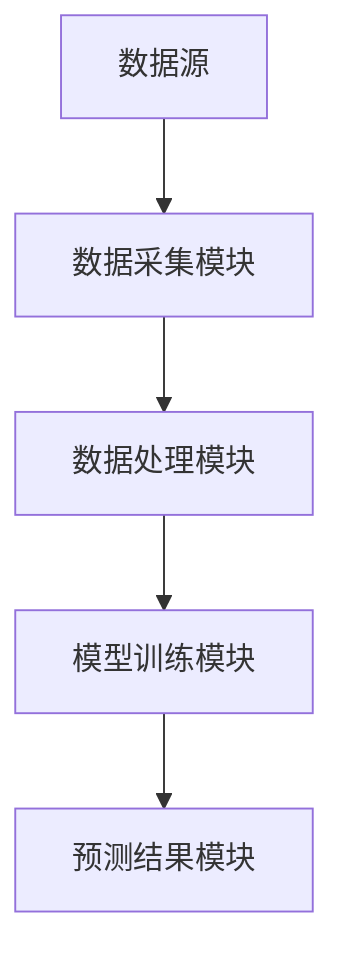

                 


# AI驱动的企业现金流预测

## 关键词：AI技术、现金流预测、机器学习、深度学习、企业财务管理

## 摘要：  
随着人工智能技术的快速发展，企业现金流预测逐渐从传统的统计模型转向基于AI的智能预测。本文详细探讨了AI在企业现金流预测中的应用，从核心概念、算法原理到系统架构设计，再到项目实战，全面解析了AI驱动现金流预测的实现过程。通过实际案例分析，展示了如何利用AI技术提高现金流预测的准确性和效率，为企业财务管理提供有力支持。

---

# 第1章: 企业现金流预测的背景与意义

## 1.1 企业现金流预测的定义与重要性

### 1.1.1 企业现金流预测的定义  
现金流预测是指通过对历史数据和相关因素的分析，预测企业在未来一段时间内的现金流入和流出情况。它是企业财务管理中的重要组成部分，直接关系到企业的资金运作、投资决策和风险控制。

### 1.1.2 现金流预测在企业财务管理中的作用  
- **资金规划**：帮助企业合理分配资金，确保日常运营和投资需求。  
- **风险控制**：通过预测潜在的资金短缺或过剩，提前制定应对策略。  
- **投资决策**：为企业的重大投资决策提供数据支持。  

### 1.1.3 AI技术如何改变现金流预测的方式  
AI技术通过大数据分析和机器学习算法，能够从海量数据中提取有用信息，发现传统方法难以捕捉的模式和趋势，从而提高预测的准确性和实时性。

---

## 1.2 传统现金流预测方法的局限性

### 1.2.1 传统统计模型的优缺点  
- **优点**：简单易懂，适用于数据量较小的情况。  
- **缺点**：预测精度有限，难以处理复杂的时间序列数据。  

### 1.2.2 人工预测的低效性与误差  
- **低效性**：人工预测依赖经验，耗时且容易出错。  
- **误差**：人为判断可能导致预测结果偏差。  

### 1.2.3 数据量与复杂性对企业预测能力的挑战  
随着企业规模的扩大，数据量急剧增加，传统方法难以处理复杂的数据关系和非线性模式。

---

## 1.3 AI驱动现金流预测的潜力与应用前景

### 1.3.1 AI技术在金融领域的应用现状  
- AI技术已在股票预测、信用评估等领域取得显著成果，为企业现金流预测提供了技术基础。

### 1.3.2 AI驱动现金流预测的核心优势  
- **高精度**：AI算法能够捕捉数据中的复杂模式，提高预测准确性。  
- **实时性**：基于实时数据的AI模型可以提供动态预测。  
- **可扩展性**：AI技术能够处理大规模数据，适用于不同规模的企业。  

### 1.3.3 企业级应用的未来发展方向  
- **智能化**：结合自然语言处理技术，实现对非结构化数据的预测。  
- **个性化**：根据企业的具体需求，定制化预测模型。  
- **实时监控**：通过实时数据流，提供动态现金流预测服务。  

---

## 1.4 本章小结  
本章介绍了企业现金流预测的定义、重要性和传统方法的局限性，重点探讨了AI技术在现金流预测中的潜力和优势，为后续章节的深入分析奠定了基础。

---

# 第2章: 现金流预测的核心概念与方法论

## 2.1 现金流预测的基本原理

### 2.1.1 现金流预测的基本流程  
1. 数据收集与清洗  
2. 特征提取与选择  
3. 模型训练与优化  
4. 预测结果分析与应用  

### 2.1.2 数据驱动的预测模型  
- **数据驱动**：基于历史数据和相关因素，构建预测模型。  
- **特征工程**：通过提取关键特征，提高模型的预测能力。  

### 2.1.3 时间序列分析的基本概念  
时间序列分析是现金流预测的核心方法，通过分析数据的时序特性，发现趋势和周期性。

---

## 2.2 现金流预测的关键指标与影响因素

### 2.2.1 主要影响现金流的因素分析  
- **销售收入**：直接影响企业的现金流入。  
- **成本与费用**：影响现金流出。  
- **市场环境**：如经济周期、行业竞争等。  
- **政策法规**：税收、货币政策等对现金流有重要影响。  

### 2.2.2 数据特征的提取与选择  
- **时间依赖性**：现金流具有较强的时间依赖性。  
- **非线性关系**：现金流的变化可能与多种因素的非线性组合有关。  
- **异常值处理**：识别并处理异常数据点，提高模型的鲁棒性。  

### 2.2.3 现金流预测的边界与外延  
- **预测范围**：短期预测与长期预测的区分。  
- **预测精度**：不同场景下的预测精度要求不同。  
- **预测结果的解释性**：模型结果的可解释性对企业决策的重要性。  

---

## 2.3 现金流预测的核心要素与概念结构

### 2.3.1 数据源与数据质量  
- **数据源**：包括财务报表、市场数据、企业内部数据等。  
- **数据质量**：数据的完整性、准确性和及时性直接影响预测结果。  

### 2.3.2 模型选择与优化  
- **模型选择**：根据数据特征选择合适的算法。  
- **模型优化**：通过调参和特征工程提高模型性能。  

### 2.3.3 预测结果的解释与应用  
- **结果解释**：将预测结果转化为可理解的业务指标。  
- **应用策略**：根据预测结果制定相应的财务策略。  

---

## 2.4 本章小结  
本章详细分析了现金流预测的核心概念、关键指标和影响因素，为后续的AI算法实现奠定了理论基础。

---

# 第3章: AI技术在现金流预测中的应用基础

## 3.1 机器学习与深度学习简介

### 3.1.1 机器学习的基本概念  
- **监督学习**：基于标签数据的学习方法。  
- **无监督学习**：通过数据内在结构发现规律。  
- **强化学习**：通过奖励机制优化决策过程。  

### 3.1.2 深度学习的核心原理  
- **神经网络**：通过多层神经元模拟人脑的学习过程。  
- **深度学习的优势**：能够自动提取数据特征，适用于复杂模式识别。  

### 3.1.3 时间序列预测的AI方法  
- **循环神经网络（RNN）**：适合处理序列数据。  
- **长短期记忆网络（LSTM）**：专门用于时间序列预测。  
- **时间卷积网络（TCN）**：通过时间依赖的卷积操作捕捉序列特征。  

---

## 3.2 现金流预测中的特征工程

### 3.2.1 数据清洗与预处理  
- **缺失值处理**：填补、删除或插值。  
- **异常值处理**：识别并修正异常数据点。  
- **标准化与归一化**：统一数据尺度，提高模型性能。  

### 3.2.2 特征选择与特征提取  
- **特征选择**：通过统计或模型方法筛选重要特征。  
- **特征提取**：利用主成分分析（PCA）等方法降低特征维度。  
- **时间特征**：提取时间相关的特征，如周期性、趋势性等。  

---

## 3.3 常见AI算法在现金流预测中的应用

### 3.3.1 线性回归模型  
- **原理**：通过最小二乘法拟合线性关系。  
- **适用场景**：数据呈现线性趋势时。  

### 3.3.2 支持向量机（SVM）  
- **原理**：通过构建超平面分割数据。  
- **适用场景**：数据非线性可分时，结合核函数提高性能。  

### 3.3.3 长短期记忆网络（LSTM）  
- **原理**：通过记忆单元（cell）捕捉长期依赖关系。  
- **适用场景**：时间序列数据，尤其是具有长期依赖性的场景。  

### 3.3.4 循环神经网络（RNN）  
- **原理**：通过循环结构处理序列数据。  
- **适用场景**：时间序列预测，尤其是短序列数据。  

---

## 3.4 传统统计方法与AI算法的对比分析

### 3.4.1 传统统计模型的优缺点  
- **优点**：简单易懂，计算效率高。  
- **缺点**：预测精度有限，难以处理复杂数据。  

### 3.4.2 AI算法的优势  
- **高精度**：能够捕捉数据中的复杂模式。  
- **可扩展性**：适用于大规模数据和复杂场景。  

---

## 3.5 本章小结  
本章介绍了机器学习和深度学习的基本概念，重点分析了常见AI算法在现金流预测中的应用，并对比了传统统计方法与AI算法的优缺点。

---

# 第4章: 基于AI的现金流预测算法实现

## 4.1 算法选择与实现步骤

### 4.1.1 算法选择  
- **LSTM网络**：适合时间序列预测。  
- **集成学习**：通过集成多个模型提高预测精度。  

### 4.1.2 实现步骤  
1. 数据预处理：清洗、归一化、分割训练集和测试集。  
2. 特征工程：提取关键特征，构建输入向量。  
3. 模型训练：选择合适的算法，调整超参数。  
4. 模型评估：通过均方误差（MSE）、平均绝对误差（MAE）等指标评估性能。  
5. 模型优化：通过交叉验证和超参数调优提高模型性能。  

---

## 4.2 LSTM网络的实现细节

### 4.2.1 LSTM网络的结构  
- **输入层**：接收时间序列数据。  
- **LSTM层**：提取长短期依赖信息。  
- **输出层**：输出预测结果。  

### 4.2.2 LSTM网络的训练过程  
1. **前向传播**：计算预测值。  
2. **计算损失**：使用均方误差（MSE）计算损失值。  
3. **反向传播**：通过梯度下降优化模型参数。  

### 4.2.3 LSTM网络的代码实现  
```python
import numpy as np
from keras.models import Sequential
from keras.layers import LSTM, Dense

# 数据准备
X_train = ...  # 归一化的训练数据
y_train = ...  # 对应的标签

# 模型构建
model = Sequential()
model.add(LSTM(50, input_shape=(timesteps, features)))
model.add(Dense(1))
model.compile(loss='mean_squared_error', optimizer='adam')

# 模型训练
model.fit(X_train, y_train, epochs=100, batch_size=32)
```

---

## 4.3 算法实现的注意事项

### 4.3.1 数据预处理的关键点  
- **时间序列分割**：将数据分割为训练集和测试集，确保时间顺序。  
- **归一化处理**：使用标准化或归一化方法处理数据。  

### 4.3.2 模型调优的技巧  
- **超参数调整**：如学习率、批量大小、 epochs 数量。  
- **早停法**：防止过拟合。  
- **模型评估**：使用交叉验证评估模型的泛化能力。  

---

## 4.4 本章小结  
本章详细介绍了基于AI的现金流预测算法实现，重点讲解了LSTM网络的结构和训练过程，并给出了代码示例。

---

# 第5章: 基于AI的现金流预测系统架构设计

## 5.1 系统架构概述

### 5.1.1 系统功能模块  
- **数据采集模块**：从企业系统中采集现金流相关数据。  
- **数据处理模块**：清洗、归一化和特征提取。  
- **模型训练模块**：训练AI预测模型。  
- **预测结果模块**：生成预测结果并输出。  

### 5.1.2 系统架构图  


---

## 5.2 系统功能设计

### 5.2.1 数据采集模块  
- **功能**：从企业财务系统、市场数据源等获取现金流相关数据。  
- **技术实现**：使用API接口或数据库连接技术。  

### 5.2.2 数据处理模块  
- **功能**：清洗数据，提取特征，归一化处理。  
- **技术实现**：使用Pandas库进行数据处理。  

### 5.2.3 模型训练模块  
- **功能**：训练AI预测模型，保存模型参数。  
- **技术实现**：使用Keras或TensorFlow框架。  

### 5.2.4 预测结果模块  
- **功能**：生成预测结果，输出可视化报告。  
- **技术实现**：使用Matplotlib或Seaborn库进行可视化。  

---

## 5.3 系统接口设计

### 5.3.1 数据接口  
- **输入接口**：接收原始数据和特征数据。  
- **输出接口**：输出处理后的数据和模型预测结果。  

### 5.3.2 模型接口  
- **输入接口**：接收训练数据和超参数配置。  
- **输出接口**：输出训练好的模型和性能指标。  

---

## 5.4 本章小结  
本章从系统架构的角度，详细设计了现金流预测系统的功能模块和接口，为后续的项目实现提供了指导。

---

# 第6章: 基于AI的现金流预测项目实战

## 6.1 项目概述

### 6.1.1 项目背景  
某企业希望通过AI技术提高现金流预测的准确性，优化财务决策。

### 6.1.2 项目目标  
构建一个基于AI的现金流预测系统，实现对企业未来现金流的智能预测。

---

## 6.2 项目实施步骤

### 6.2.1 环境安装  
- **安装Python**：选择合适的Python版本（如Python 3.8以上）。  
- **安装依赖库**：如numpy、pandas、keras、tensorflow等。  

### 6.2.2 数据处理与特征工程  
- **数据清洗**：处理缺失值和异常值。  
- **特征提取**：提取关键特征，如销售收入、成本费用、市场环境等。  

### 6.2.3 模型训练与优化  
- **选择模型**：基于实验选择最佳模型（如LSTM）。  
- **调参优化**：通过网格搜索或随机搜索优化超参数。  

### 6.2.4 模型部署与测试  
- **部署模型**：将训练好的模型部署到生产环境。  
- **测试预测结果**：使用测试数据评估模型性能。  

---

## 6.3 项目实现细节

### 6.3.1 数据处理代码  
```python
import pandas as pd
import numpy as np

# 数据加载
data = pd.read_csv('cash_flow.csv')

# 数据清洗
data.dropna(inplace=True)
data = data[~data['现金流'].isoutliner]  # 假设isoutliner是检测异常值的函数

# 归一化处理
from sklearn.preprocessing import MinMaxScaler
scaler = MinMaxScaler()
data_scaled = scaler.fit_transform(data['现金流'].values.reshape(-1,1))
```

### 6.3.2 模型训练代码  
```python
from keras.models import Sequential
from keras.layers import LSTM, Dense

# 模型构建
model = Sequential()
model.add(LSTM(50, input_shape=(timesteps, features)))
model.add(Dense(1))
model.compile(loss='mean_squared_error', optimizer='adam')

# 模型训练
model.fit(X_train, y_train, epochs=100, batch_size=32)
```

### 6.3.3 模型预测与评估  
```python
# 预测结果
y_pred = model.predict(X_test)

# 评估指标
from sklearn.metrics import mean_squared_error, mean_absolute_error
mse = mean_squared_error(y_test, y_pred)
mae = mean_absolute_error(y_test, y_pred)
print(f'MSE: {mse}, MAE: {mae}')
```

---

## 6.4 项目小结  
本章通过一个实际项目，详细展示了AI驱动现金流预测的实现过程，从环境安装到模型部署，为读者提供了实践指导。

---

# 第7章: 总结与展望

## 7.1 总结

### 7.1.1 核心内容回顾  
- AI技术在现金流预测中的应用价值。  
- 基于AI的预测算法实现。  
- 系统架构设计与项目实战经验。  

### 7.1.2 本书的主要收获  
- 掌握现金流预测的核心概念与方法论。  
- 熟悉AI技术在现金流预测中的应用。  
- 学会基于AI构建现金流预测系统的技能。  

---

## 7.2 未来展望

### 7.2.1 技术挑战  
- **模型解释性**：提高AI模型的可解释性，便于业务人员理解。  
- **数据隐私**：在数据共享和处理中，需注意数据隐私保护。  
- **实时性要求**：提高预测的实时性，满足动态业务需求。  

### 7.2.2 应用前景  
- **智能化升级**：结合自然语言处理技术，实现更智能的预测。  
- **个性化服务**：根据企业需求定制化预测模型。  
- **多场景应用**：扩展现金流预测在不同业务场景中的应用。  

---

## 7.3 最佳实践 Tips

### 7.3.1 数据处理  
- 确保数据的完整性和准确性，避免异常值影响预测结果。  
- 在特征工程中，注重时间依赖特征的提取。  

### 7.3.2 模型选择  
- 根据数据特征选择合适的算法，避免盲目追求复杂模型。  
- 通过实验验证模型性能，选择最优模型。  

### 7.3.3 系统部署  
- 确保系统架构的可扩展性，方便后续优化和功能扩展。  
- 注重系统的实时性和稳定性，确保预测结果的及时性和准确性。  

---

## 7.4 本章小结  
本章总结了全文的核心内容，并展望了AI驱动现金流预测技术的未来发展方向，为读者提供了进一步学习和实践的指导。

---

# 作者：AI天才研究院/AI Genius Institute & 禅与计算机程序设计艺术 /Zen And The Art of Computer Programming  

---

**[本文完]**

