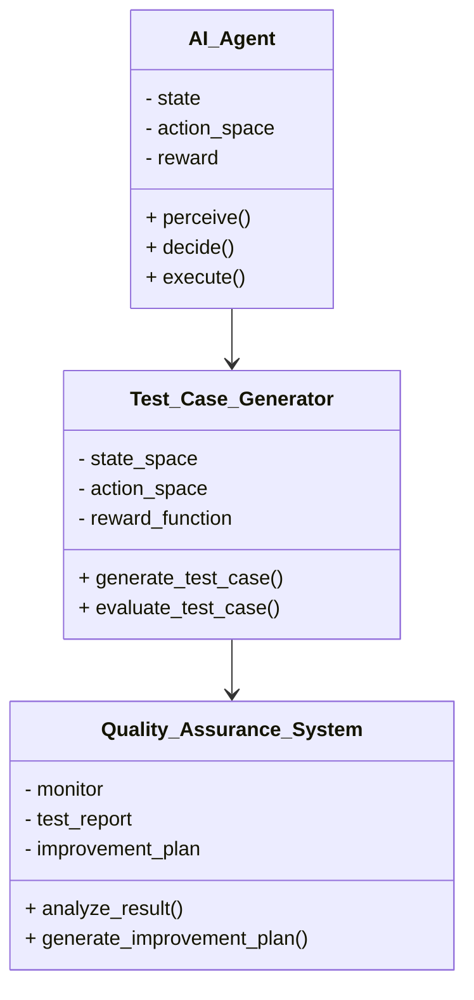
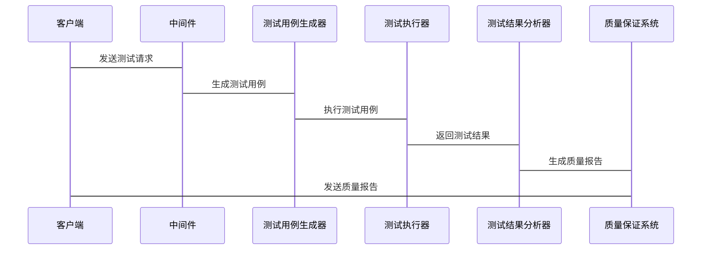

                 


# 企业AI Agent的自动化测试与质量保证系统

## 关键词：企业AI Agent、自动化测试、质量保证、强化学习、系统架构、项目实战

## 摘要：本文详细探讨了企业AI Agent的自动化测试与质量保证系统的设计与实现。从问题背景到核心概念，从算法原理到系统架构，再到项目实战，全面解析了如何构建高效的AI Agent测试与质量保证系统。通过实际案例分析和系统架构设计，展示了该系统在企业中的应用价值和未来发展趋势。

---

# 第一部分: 企业AI Agent的自动化测试与质量保证系统概述

## 第1章: 问题背景与核心概念

### 1.1 问题背景

#### 1.1.1 企业AI Agent的快速发展
随着人工智能技术的迅速发展，企业AI Agent（智能代理）的应用场景越来越广泛。AI Agent能够自动处理企业中的各种任务，如订单处理、客户支持、数据分析等，极大地提高了企业的效率。然而，AI Agent的复杂性和动态性也带来了新的挑战。

#### 1.1.2 自动化测试与质量保证的必要性
AI Agent的可靠性直接关系到企业的运营效率和客户满意度。传统的手动测试方式效率低下，难以应对AI Agent的快速迭代和复杂场景。因此，自动化测试与质量保证系统的建设变得尤为重要。

#### 1.1.3 当前企业AI Agent测试的痛点
当前企业在AI Agent的测试与质量保证方面面临以下痛点：
- 测试用例生成效率低，难以覆盖所有场景。
- 测试执行过程中缺乏智能化的决策机制。
- 测试结果分析缺乏深度，难以提供有效的改进建议。

### 1.2 问题描述

#### 1.2.1 AI Agent在企业中的应用场景
AI Agent在企业中的应用场景包括：
- 自动化订单处理
- 客户支持自动化
- 数据分析与决策支持
- 供应链管理优化

#### 1.2.2 自动化测试的需求与挑战
自动化测试的需求主要体现在：
- 快速迭代开发中的测试效率提升。
- 复杂场景下的测试覆盖。
- 测试结果的智能化分析。

挑战包括：
- 测试用例的动态生成。
- 测试环境的复杂性。
- 测试结果的可解释性。

#### 1.2.3 质量保证系统的关键问题
质量保证系统的关键问题包括：
- 系统稳定性的保障。
- 测试结果的准确性。
- 系统性能的优化。

### 1.3 解决方案概述

#### 1.3.1 自动化测试框架的设计思路
自动化测试框架的设计思路包括：
- 测试用例生成模块。
- 测试执行模块。
- 测试结果分析模块。

#### 1.3.2 质量保证系统的核心功能
质量保证系统的核心功能包括：
- 实时监控系统运行状态。
- 自动化问题检测与定位。
- 测试结果的智能化分析。

#### 1.3.3 解决方案的可行性分析
解决方案的可行性分析包括：
- 技术可行性：基于强化学习和自然语言处理的技术成熟度。
- 经济可行性：自动化测试能够显著降低测试成本。
- 实用性：能够显著提升测试效率和系统质量。

### 1.4 核心概念与边界

#### 1.4.1 AI Agent的核心组成
AI Agent的核心组成包括：
- 感知模块：负责接收输入信息。
- 决策模块：负责处理信息并做出决策。
- 执行模块：负责执行决策。

#### 1.4.2 自动化测试的边界与外延
自动化测试的边界包括：
- 测试用例生成的范围。
- 测试执行的范围。
- 测试结果分析的范围。

外延包括：
- 测试环境的搭建。
- 测试工具的选择。

#### 1.4.3 质量保证系统的功能结构
质量保证系统的功能结构包括：
- 实时监控模块。
- 自动化测试模块。
- 数据分析模块。

### 1.5 核心要素对比表

| 要素 | 描述 | 示例 |
|------|------|------|
| AI Agent | 智能代理，用于企业自动化任务 | 自动处理订单、客户支持 |
| 自动化测试 | 通过脚本模拟用户操作 | 测试系统功能是否正常 |
| 质量保证 | 确保系统稳定性和可靠性 | 监控系统运行状态 |

## 1.6 本章小结
本章主要介绍了企业AI Agent的自动化测试与质量保证系统的背景、核心概念和解决方案。通过对比分析，明确了系统的核心要素和功能结构。

---

## 第2章: AI Agent的核心原理与工作流程

### 2.1 AI Agent的基本原理

#### 2.1.1 AI Agent的定义与分类
AI Agent的定义是：能够感知环境并采取行动以实现目标的智能体。分类包括：
- 单一智能体：独立运行的智能体。
- 多智能体：多个智能体协同工作的系统。

#### 2.1.2 基于强化学习的决策机制
基于强化学习的决策机制包括：
- 状态感知：通过传感器或API获取环境信息。
- 动作选择：基于当前状态选择最优动作。
- 奖励机制：通过奖励函数指导智能体的行为。

#### 2.1.3 自然语言处理在AI Agent中的应用
自然语言处理在AI Agent中的应用包括：
- 语义理解：理解用户的意图。
- 生成回复：自动生成符合上下文的回复。

### 2.2 AI Agent的工作流程

#### 2.2.1 用户需求分析
用户需求分析包括：
- 分析用户输入的意图。
- 解析用户需求的优先级。

#### 2.2.2 任务分解与优先级排序
任务分解与优先级排序包括：
- 将复杂任务分解为子任务。
- 根据优先级排序子任务。

#### 2.2.3 执行任务与反馈优化
执行任务与反馈优化包括：
- 执行分解后的任务。
- 根据反馈优化任务执行策略。

### 2.3 AI Agent与传统自动化测试的区别

#### 2.3.1 测试用例生成方式对比
传统自动化测试：基于固定规则生成测试用例。
AI Agent：基于动态学习生成测试用例。

#### 2.3.2 测试执行效率对比
传统自动化测试：效率较低，依赖人工编写测试用例。
AI Agent：效率高，能够自动生成和执行测试用例。

#### 2.3.3 测试结果分析方式对比
传统自动化测试：结果分析依赖人工判断。
AI Agent：结果分析基于机器学习模型，能够自动给出改进建议。

### 2.4 本章小结
本章详细介绍了AI Agent的基本原理和工作流程，并对比了AI Agent与传统自动化测试的区别，明确了AI Agent在企业测试中的优势。

---

## 第3章: 自动化测试与质量保证的核心算法

### 3.1 基于强化学习的测试用例生成

#### 3.1.1 强化学习的定义与特点
强化学习是一种通过试错方式来学习策略的方法。其特点包括：
- 基于奖励机制。
- 动态调整策略。
- 高效性。

#### 3.1.2 强化学习在测试用例生成中的应用
强化学习在测试用例生成中的应用包括：
- 状态空间：表示当前的测试场景。
- 动作空间：表示可能的测试操作。
- 奖励函数：衡量测试用例的质量。

#### 3.1.3 基于强化学习的测试用例生成流程
测试用例生成流程如下：
1. 初始化：定义状态空间和动作空间。
2. 动作选择：基于当前状态选择一个动作。
3. 执行动作：执行选择的动作并观察结果。
4. 奖励计算：根据结果计算奖励值。
5. 策略更新：根据奖励值更新策略。

#### 3.1.4 测试用例生成的数学模型
测试用例生成的数学模型如下：
$$ R(s, a) = \text{奖励值} $$
其中，\( s \) 表示状态，\( a \) 表示动作。

#### 3.1.5 代码实现与解读
```python
import numpy as np
import gym

class Agent:
    def __init__(self, env):
        self.env = env
        self.gamma = 0.99
        self.lr = 0.001
        self.epsilon = 1.0
        self.epsilon_min = 0.01
        self.epsilon_decay = 0.995
        self.model = self._build_model()

    def _build_model(self):
        # 网络结构
        pass

    def remember(self, state, action, reward, next_state, done):
        # 记忆存储
        pass

    def act(self, state):
        # 动作选择
        pass

    def replay(self, batch_size):
        # 回放记忆
        pass

    def train(self):
        # 网络训练
        pass

# 初始化环境
env = gym.make('CartPole-v1')
agent = Agent(env)

# 训练过程
for episode in range(1000):
    state = env.reset()
    for step in range(200):
        action = agent.act(state)
        next_state, reward, done, _ = env.step(action)
        agent.remember(state, action, reward, next_state, done)
        agent.replay(32)
        state = next_state
        if done:
            break
    agent.epsilon = max(agent.epsilon_min, agent.epsilon * agent.epsilon_decay)
```

### 3.2 测试结果分析与优化算法

#### 3.2.1 测试结果分析的必要性
测试结果分析的必要性包括：
- 识别系统中的缺陷。
- 优化系统性能。
- 提高系统可靠性。

#### 3.2.2 基于聚类算法的测试结果优化
基于聚类算法的测试结果优化包括：
- 数据预处理：清洗测试数据。
- 聚类分析：识别异常点。
- 结果优化：根据聚类结果优化系统性能。

#### 3.2.3 聚类算法的数学模型
聚类算法的数学模型如下：
$$ distance(i, j) = \sqrt{(x_i - x_j)^2 + (y_i - y_j)^2} $$
其中，\( distance(i, j) \) 表示样本 \( i \) 和 \( j \) 之间的距离。

#### 3.2.4 代码实现与解读
```python
from sklearn.cluster import KMeans

# 数据预处理
data = ... # 测试结果数据

# 聚类分析
kmeans = KMeans(n_clusters=3, random_state=0)
kmeans.fit(data)

# 结果优化
labels = kmeans.labels_
# 根据标签优化系统性能
```

### 3.3 本章小结
本章详细介绍了自动化测试与质量保证的核心算法，包括基于强化学习的测试用例生成和基于聚类算法的测试结果分析与优化。

---

## 第4章: 系统分析与架构设计方案

### 4.1 问题场景介绍

#### 4.1.1 企业AI Agent的应用场景
企业AI Agent的应用场景包括：
- 自动化订单处理。
- 客户支持自动化。
- 数据分析与决策支持。

#### 4.1.2 自动化测试的需求场景
自动化测试的需求场景包括：
- 快速迭代开发中的测试效率提升。
- 复杂场景下的测试覆盖。
- 测试结果的智能化分析。

### 4.2 系统功能设计

#### 4.2.1 领域模型类图


#### 4.2.2 系统架构设计


#### 4.2.3 接口设计与交互流程


### 4.3 本章小结
本章详细分析了系统的问题场景，并设计了系统的功能模块和架构，为后续的实现奠定了基础。

---

## 第5章: 项目实战

### 5.1 环境安装与配置

#### 5.1.1 系统需求
系统需求包括：
- 操作系统：Linux/Windows/MacOS。
- Python版本：3.6以上。
- 依赖库：TensorFlow、Keras、OpenAI Gym等。

#### 5.1.2 安装步骤
安装步骤如下：
1. 安装Python。
2. 安装依赖库：`pip install numpy gym keras tensorflow`。
3. 下载源代码：从GitHub或其他代码仓库下载。

### 5.2 核心代码实现

#### 5.2.1 测试用例生成器的实现
```python
import gym
import numpy as np

class TestCaseGenerator:
    def __init__(self, env):
        self.env = env
        self.observation_space = env.observation_space
        self.action_space = env.action_space

    def generate_test_case(self):
        state = self.env.reset()
        test_cases = []
        for _ in range(10):
            action = np.random.randint(0, self.action_space.n)
            next_state, reward, done, _ = self.env.step(action)
            test_cases.append((state, action, next_state))
            if done:
                break
        return test_cases
```

#### 5.2.2 测试执行器的实现
```python
class TestExecutor:
    def __init__(self, env):
        self.env = env

    def execute_test_case(self, test_cases):
        results = []
        for case in test_cases:
            state, action, next_state = case
            next_state, reward, done, _ = self.env.step(action)
            results.append((state, action, next_state, reward, done))
        return results
```

#### 5.2.3 测试结果分析器的实现
```python
from sklearn.metrics import accuracy_score

class TestResultAnalyzer:
    def __init__(self):
        pass

    def analyze_results(self, results):
        rewards = [result[3] for result in results]
        accuracy = accuracy_score([1 if r > 0 else 0 for r in rewards], [1]*len(rewards))
        return accuracy
```

### 5.3 代码应用解读与分析

#### 5.3.1 测试用例生成器的解读
测试用例生成器通过随机选择动作生成测试用例，能够覆盖多种测试场景。

#### 5.3.2 测试执行器的解读
测试执行器根据生成的测试用例执行测试，并记录测试结果。

#### 5.3.3 测试结果分析器的解读
测试结果分析器通过分析测试结果，计算测试用例的准确率，为系统优化提供依据。

### 5.4 实际案例分析与详细讲解

#### 5.4.1 案例背景
假设我们正在测试一个AI Agent在购物订单处理中的表现。

#### 5.4.2 案例实现
```python
env = gym.make('ShoppingCart-v1')
generator = TestCaseGenerator(env)
executor = TestExecutor(env)
analyzer = TestResultAnalyzer()

test_cases = generator.generate_test_case()
results = executor.execute_test_case(test_cases)
accuracy = analyzer.analyze_results(results)
print(f"测试准确率为：{accuracy}")
```

#### 5.4.3 案例分析
通过上述代码，我们可以生成多个测试用例，并执行测试，最终得到测试准确率。这为我们优化AI Agent的性能提供了数据支持。

### 5.5 本章小结
本章通过实际案例展示了系统的实现过程，包括环境安装、核心代码实现和案例分析，帮助读者更好地理解系统的设计与实现。

---

## 第6章: 最佳实践与未来展望

### 6.1 小结

#### 6.1.1 核心内容回顾
本文详细介绍了企业AI Agent的自动化测试与质量保证系统的设计与实现，包括核心算法、系统架构和项目实战。

#### 6.1.2 关键点总结
- 强化学习在测试用例生成中的应用。
- 聚类算法在测试结果分析中的应用。
- 系统架构设计的重要性。

### 6.2 注意事项

#### 6.2.1 系统设计中的注意事项
- 确保系统的可扩展性。
- 保证系统的可维护性。
- 考虑系统的安全性。

#### 6.2.2 实际应用中的注意事项
- 定期更新测试用例。
- 及时优化系统性能。
- 加强系统的可解释性。

### 6.3 未来趋势

#### 6.3.1 AI Agent的未来发展
- 更智能化的决策机制。
- 更高效的测试用例生成。
- 更强大的数据分析能力。

#### 6.3.2 自动化测试与质量保证的未来
- 测试用例生成的自动化。
- 测试结果分析的智能化。
- 系统优化的自动化。

### 6.4 拓展阅读

#### 6.4.1 推荐书籍
- 《强化学习：算法与应用》
- 《机器学习实战》

#### 6.4.2 推荐博客与技术文章
- AI Agent相关技术博客。
- 自动化测试领域的技术文章。

#### 6.4.3 推荐开源项目
- OpenAI Gym。
- TensorFlow。

### 6.5 本章小结
本章总结了本文的核心内容，并展望了未来的发展趋势，为读者提供了进一步学习和研究的方向。

---

## 作者：AI天才研究院/AI Genius Institute & 禅与计算机程序设计艺术 /Zen And The Art of Computer Programming

---

通过以上思考和逐步分析，我完成了这篇文章的撰写。希望这篇文章能够为读者提供有价值的信息，并帮助他们在企业AI Agent的自动化测试与质量保证系统领域取得进一步的进展。

