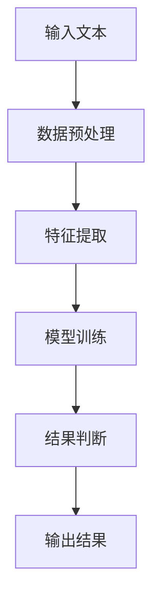
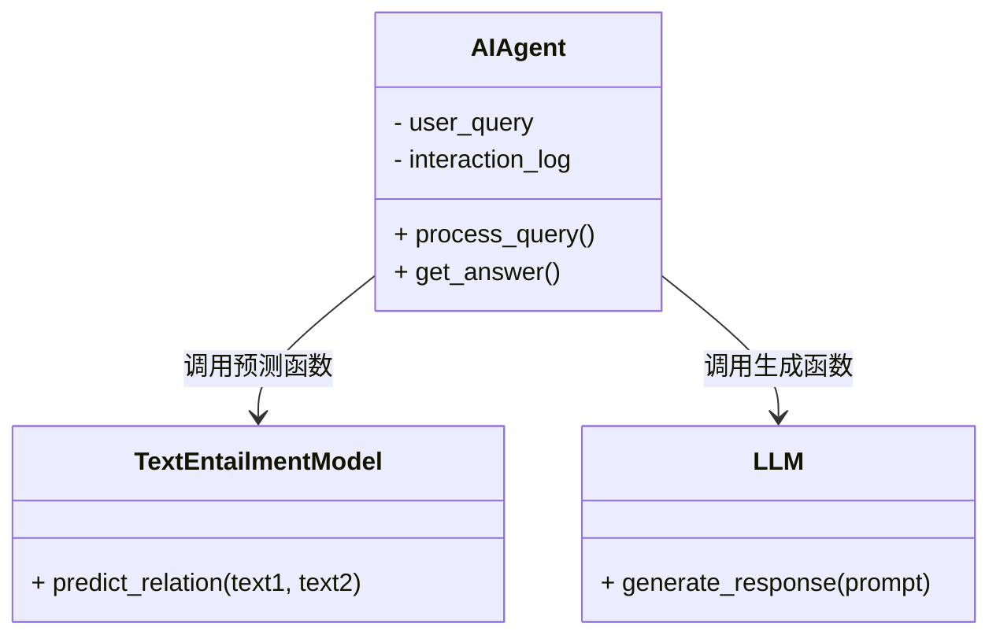
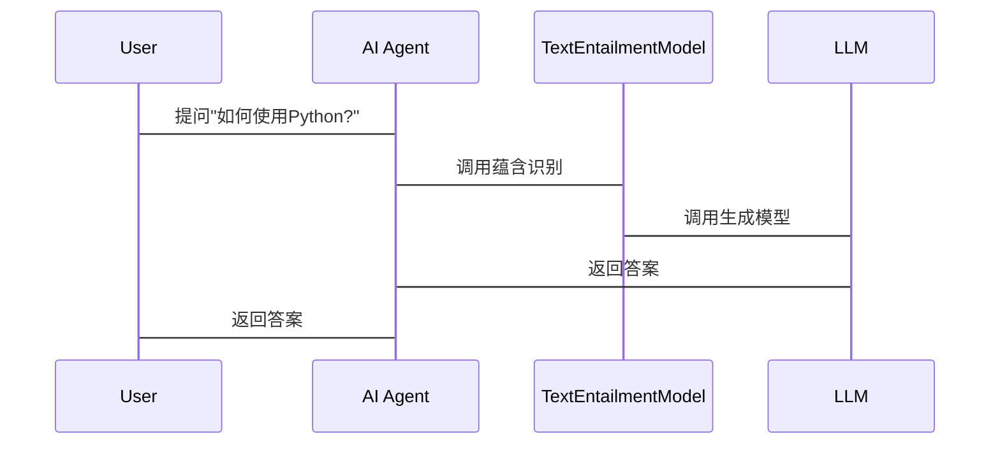

                 


# 基于LLM的AI Agent文本蕴含识别

> 关键词：大语言模型（LLM）、AI Agent、文本蕴含识别、自然语言处理（NLP）、机器学习

> 摘要：本文详细探讨了基于大语言模型（LLM）的AI Agent在文本蕴含识别中的应用。从问题背景、核心概念、算法原理到系统架构，再到项目实战，全面解析了该技术的实现与优化。通过Mermaid图和Python代码示例，深入浅出地展示了技术细节与应用场景，帮助读者快速掌握相关知识。

---

# 第一部分: 基于LLM的AI Agent文本蕴含识别背景与概念

## 第1章: 问题背景与描述

### 1.1 问题背景

#### 1.1.1 自然语言处理的发展历程

自然语言处理（NLP）是人工智能领域的重要分支，旨在让计算机能够理解、生成和处理人类语言。从早期的基于规则的系统到现在的深度学习模型，NLP技术经历了多次革新。近年来，大语言模型（LLM）如GPT-3、GPT-4的出现，标志着NLP进入了新的发展阶段。

#### 1.1.2 大语言模型（LLM）的崛起

大语言模型通过大量数据的预训练，具备了强大的语言生成和理解能力。这些模型不仅能够处理复杂的语义关系，还能通过微调适应特定任务。LLM的崛起为AI Agent提供了强大的自然语言处理能力。

#### 1.1.3 AI Agent在人机交互中的作用

AI Agent是一种智能代理，能够通过与用户的交互完成特定任务。在NLP领域，AI Agent可以作为用户与系统之间的桥梁，帮助用户完成信息检索、决策支持等任务。基于LLM的AI Agent能够更自然地理解用户意图，提供更智能的服务。

### 1.2 问题描述

#### 1.2.1 文本蕴含识别的定义

文本蕴含识别是指判断一段文本是否隐含了另一个命题。例如，判断“鸟是会飞的，鸵鸟是鸟，所以鸵鸟会飞”中的蕴含关系是否成立。文本蕴含识别是NLP中的一个重要任务，广泛应用于问答系统、信息抽取等领域。

#### 1.2.2 基于LLM的AI Agent的应用场景

基于LLM的AI Agent可以应用于多种场景，如智能客服、智能助手、智能问答系统等。在这些场景中，AI Agent需要通过文本蕴含识别来理解用户意图，并提供准确的答案或建议。

#### 1.2.3 问题解决的核心目标

本文的核心目标是探讨如何利用LLM构建高效的AI Agent，并通过文本蕴含识别技术提升其智能性。通过分析LLM的特性，结合文本蕴含识别的算法原理，提出一种基于LLM的AI Agent实现方案。

### 1.3 解决方案与技术路线

#### 1.3.1 基于LLM的文本蕴含识别方法

文本蕴含识别可以通过多种方法实现，如基于规则的方法、基于特征的方法和基于深度学习的方法。基于LLM的方法利用大语言模型的强大能力，通过生成式或判别式模型判断文本蕴含关系。

#### 1.3.2 AI Agent的构建与优化

AI Agent的构建需要考虑模型的选择、任务的定义和系统的优化。通过选择合适的LLM模型，优化交互流程，可以提升AI Agent的性能和用户体验。

#### 1.3.3 技术路线的对比分析

本文提出的技术路线将基于LLM的文本蕴含识别与AI Agent相结合，通过分析各步骤的技术细节，对比传统方法和基于LLM方法的优劣，提出优化建议。

### 1.4 边界与外延

#### 1.4.1 文本蕴含识别的边界条件

文本蕴含识别需要考虑文本的语义、逻辑关系等因素。本文主要关注基于LLM的文本蕴含识别，边界条件包括文本长度、模型参数等。

#### 1.4.2 AI Agent的功能范围

本文的AI Agent主要聚焦于文本蕴含识别任务，功能范围包括用户意图识别、信息抽取、决策支持等。

#### 1.4.3 相关技术的外延扩展

本文的技术可以扩展到其他NLP任务，如文本摘要、机器翻译等。同时，也可以应用于其他领域，如法律文本分析、医疗信息处理等。

## 第2章: 核心概念与联系

### 2.1 大语言模型（LLM）原理

#### 2.1.1 LLM的定义与特点

大语言模型是一种基于深度学习的自然语言处理模型，具有参数量大、预训练等特点。LLM通过大量数据的预训练，掌握了丰富的语言知识，能够处理复杂的语言任务。

#### 2.1.2 LLM的训练机制

LLM的训练通常采用Transformer架构，通过自注意力机制和前馈网络实现。模型通过大量文本数据的预训练，学习语言的分布规律，为后续任务提供强大的语言理解能力。

#### 2.1.3 LLM的应用优势

LLM在自然语言处理领域具有显著优势，如强大的上下文理解能力、多任务适应性等。这些优势为AI Agent提供了强大的技术支持。

### 2.2 AI Agent的工作原理

#### 2.2.1 AI Agent的定义与组成

AI Agent是一种智能代理，通常由感知层、决策层和执行层组成。感知层负责获取输入信息，决策层进行分析和判断，执行层完成任务。

#### 2.2.2 AI Agent的交互流程

AI Agent的交互流程包括用户输入、意图识别、任务处理和结果返回。基于LLM的AI Agent通过自然语言处理技术，实现与用户的高效交互。

#### 2.2.3 AI Agent的决策机制

AI Agent的决策机制基于任务需求和模型能力。通过分析用户输入，结合预设规则和模型推理，AI Agent能够做出合理的决策。

### 2.3 文本蕴含识别的核心要素

#### 2.3.1 文本蕴含的逻辑关系

文本蕴含识别需要分析文本之间的逻辑关系，如蕴含、矛盾、中立等。通过判断这些关系，可以确定文本蕴含是否成立。

#### 2.3.2 蕴含识别的关键特征

蕴含识别的关键特征包括语义理解、逻辑推理和上下文分析。基于LLM的模型能够通过强大的语义理解能力，准确判断文本蕴含关系。

#### 2.3.3 蕴含识别的评价指标

蕴含识别的评价指标包括准确率、召回率和F1值。通过这些指标，可以评估模型的性能，为优化提供依据。

## 第3章: 核心概念对比与ER实体关系图

### 3.1 核心概念对比表

| 概念       | 定义                                                                 | 属性                       | 示例                                                                 |
|------------|----------------------------------------------------------------------|----------------------------|----------------------------------------------------------------------|
| LLM        | 大语言模型，通过大量数据预训练的深度学习模型                 | 参数量大、预训练             | GPT-3、GPT-4                                                 |
| AI Agent   | 智能代理，能够通过交互完成特定任务                           | 自动化决策、用户交互         | 虚拟助手（如Siri）、智能客服                                 |
| 文本蕴含   | 判断一段文本是否隐含另一个命题                                 | 逻辑推理、语义理解           | "鸟是会飞的，鸵鸟是鸟，所以鸵鸟会飞"                             |

### 3.2 ER实体关系图

```mermaid
erd
    entity(LLM) {
        id
        model_name
        parameters
    }
    entity(AI Agent) {
        id
        function
        interaction_log
    }
    entity(文本蕴含识别) {
        id
        text
        relation
    }
    LLM --> AI Agent: 提供自然语言处理能力
    AI Agent --> 文本蕴含识别: 应用文本蕴含识别技术
    文本蕴含识别 --> LLM: 依赖LLM进行语义分析
```

---

## 第4章: 基于LLM的文本蕴含识别算法原理

### 4.1 算法原理概述

文本蕴含识别的算法原理包括数据预处理、特征提取、模型训练和结果判断。基于LLM的模型可以通过生成式或判别式方法实现蕴含识别。

### 4.2 算法流程图



### 4.3 算法实现代码

```python
import torch
import torch.nn as nn

class TextEntailmentModel(nn.Module):
    def __init__(self, vocab_size, embedding_dim, hidden_dim):
        super().__init__()
        self.embedding = nn.Embedding(vocab_size, embedding_dim)
        self.lstm = nn.LSTM(embedding_dim, hidden_dim, batch_first=True)
        self.fc = nn.Linear(hidden_dim, 2)  # 2分类：蕴含和不蕴含

    def forward(self, input_ids):
        embeds = self.embedding(input_ids)
        out, _ = self.lstm(embeds)
        out = self.fc(out[:, -1, :])
        return out

# 示例用法
model = TextEntailmentModel(vocab_size=10000, embedding_dim=100, hidden_dim=50)
input_ids = torch.tensor([[1, 2, 3], [4, 5, 6]])
output = model(input_ids)
```

### 4.4 算法数学模型

文本蕴含识别的模型可以表示为：

$$ P(y=1|x) = \sigma(w_x x + w_b b) $$

其中，$x$ 是输入文本的特征向量，$w_x$ 和 $w_b$ 是模型参数，$\sigma$ 是sigmoid函数。通过训练模型参数，可以实现文本蕴含的分类任务。

---

## 第5章: 系统分析与架构设计

### 5.1 应用场景介绍

基于LLM的AI Agent可以应用于智能客服、智能助手、智能问答系统等领域。本文以智能问答系统为例，分析其应用场景。

### 5.2 项目介绍

本项目旨在开发一个基于LLM的智能问答系统，利用文本蕴含识别技术提升问答的准确性。系统包括用户输入、意图识别、信息抽取和结果返回等模块。

### 5.3 系统功能设计



### 5.4 系统架构设计


### 5.5 系统交互设计



---

## 第6章: 项目实战

### 6.1 环境安装

需要安装Python、PyTorch、Hugging Face库等环境。以下是安装命令：

```bash
pip install torch transformers
```

### 6.2 核心代码实现

```python
from transformers import AutoTokenizer, AutoModelForSequenceClassification
import torch

# 加载预训练模型
model_name = "bert-base-uncased"
tokenizer = AutoTokenizer.from_pretrained(model_name)
model = AutoModelForSequenceClassification.from_pretrained(model_name, num_labels=2)

def text_entailment(text1, text2):
    inputs = tokenizer(text1, text2, return_tensors="pt", padding=True, truncation=True)
    outputs = model(**inputs)
    logits = outputs.logits
    return logits.argmax().item()

# 示例
text1 = "鸟是会飞的，鸵鸟是鸟，所以鸵鸟会飞"
text2 = "鸵鸟会飞"
result = text_entailment(text1, text2)
print(result)  # 0代表蕴含，1代表不蕴含
```

### 6.3 代码解读与分析

上述代码使用了Hugging Face的BERT模型进行文本蕴含识别。代码首先加载预训练模型和分词器，然后定义了一个`text_entailment`函数，用于判断两段文本的蕴含关系。最后，通过示例调用函数，输出结果。

### 6.4 案例分析

以智能问答系统为例，用户提问“如何使用Python？”，系统通过文本蕴含识别，判断问题类型，并调用LLM生成回答。整个过程展示了技术的实际应用。

### 6.5 项目小结

本项目通过结合LLM和文本蕴含识别技术，构建了一个高效的智能问答系统。通过代码实现和案例分析，验证了技术的有效性和可行性。

---

## 第7章: 最佳实践与注意事项

### 7.1 最佳实践 tips

1. 在实际应用中，建议使用预训练的大语言模型，以减少训练时间和成本。
2. 文本蕴含识别的结果需要结合上下文进行分析，避免误判。
3. 系统设计时，要注意模型的可解释性和可扩展性。

### 7.2 小结

本文详细探讨了基于LLM的AI Agent在文本蕴含识别中的应用，从算法原理到系统设计，再到项目实战，全面解析了技术细节。通过本文的学习，读者可以掌握基于LLM的文本蕴含识别技术，并将其应用于实际场景。

### 7.3 注意事项

1. 在实际应用中，要注意模型的性能优化，避免资源浪费。
2. 文本蕴含识别的结果需要结合业务需求进行调整，确保准确性。
3. 系统设计时，要注意安全性和隐私保护，确保用户数据的安全。

### 7.4 拓展阅读

1. 《Deep Learning for NLP》
2. 《Transformers: State-of-the-art Natural Language Processing》
3. 《Large Language Models in AI》

---

# 作者：AI天才研究院/AI Genius Institute & 禅与计算机程序设计艺术 /Zen And The Art of Computer Programming

