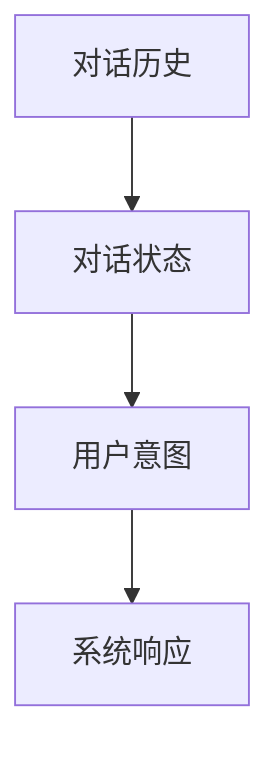
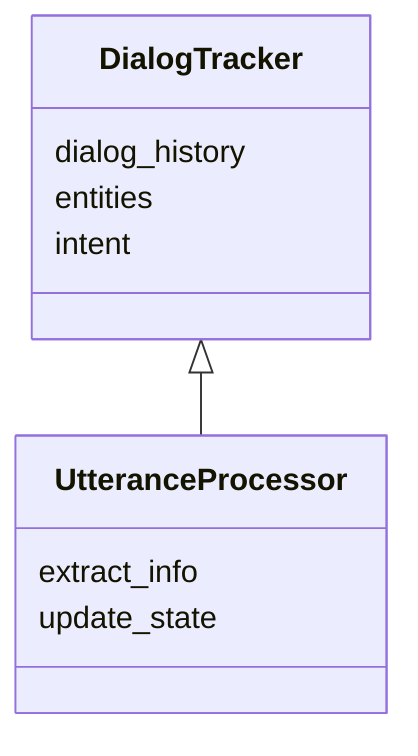
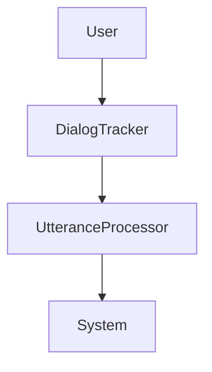
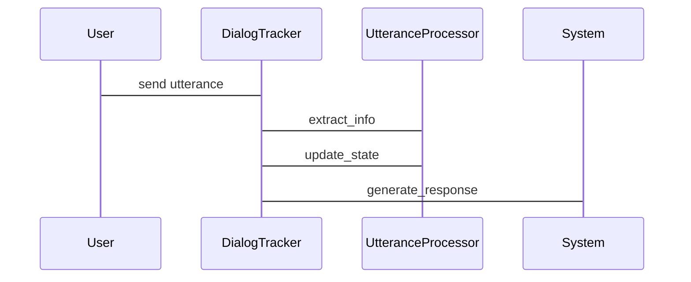

                 


# 实现AI Agent的多轮对话状态跟踪

## 关键词：AI Agent、多轮对话、状态跟踪、对话系统、自然语言处理

## 摘要：  
在实现AI Agent的多轮对话系统中，对话状态跟踪是确保系统能够理解和维护对话上下文的关键技术。本文系统地探讨了多轮对话状态跟踪的核心概念、算法原理、系统架构设计及项目实战，旨在为读者提供全面的技术指导。通过详细的背景介绍、核心概念分析、算法实现、系统设计和项目案例，本文帮助读者深入理解并掌握AI Agent多轮对话状态跟踪的实现方法。

---

# 第1章: 背景介绍

## 1.1 问题背景  
多轮对话是指用户与AI Agent之间通过多条消息进行交互的过程。在这样的对话中，AI Agent需要理解并记忆每一条消息的含义，并根据上下文生成合适的回复。然而，对话的复杂性随着轮数的增加而迅速上升，如果不能有效跟踪对话状态，AI Agent将无法准确理解用户的需求，导致对话失败。

### 1.1.1 多轮对话的定义与特点  
多轮对话是指用户与系统之间通过多条消息进行交互的过程。其特点包括：  
1. **上下文依赖性**：每一条消息都与之前的对话内容相关。  
2. **动态性**：对话状态会随着每一条消息的输入而变化。  
3. **不确定性**：用户的表达可能存在歧义，需要系统进行推理和判断。  

### 1.1.2 状态跟踪在对话系统中的重要性  
状态跟踪是多轮对话系统的核心功能，它确保系统能够理解和维护对话的上下文。没有有效的状态跟踪，AI Agent将无法准确理解用户的需求，导致对话失败。

### 1.1.3 当前对话系统的主要挑战  
1. **信息抽取的准确性**：如何从用户的消息中准确提取有用的信息。  
2. **状态表示的合理性**：如何将提取的信息转化为系统可以理解的状态表示。  
3. **状态更新的及时性**：如何快速更新状态以应对对话的动态变化。  

## 1.2 问题描述  
对话状态跟踪的核心问题是如何从用户的输入中提取信息，并将其转化为系统可以理解的状态表示。具体问题包括：  
1. 如何处理用户的模糊表达？  
2. 如何确保状态表示的准确性和完整性？  
3. 如何高效地更新和维护对话状态？  

## 1.3 问题解决  
对话状态跟踪的实现思路包括：  
1. **信息抽取**：从用户的消息中提取关键信息。  
2. **状态表示**：将提取的信息转化为系统可以理解的状态表示。  
3. **状态更新**：根据新的输入更新对话状态。  

## 1.4 概念结构与核心要素组成  
### 1.4.1 对话状态的定义  
对话状态是指在当前对话中所有与用户需求相关的信息的集合。它包括用户的目标、当前的对话历史、用户的意图等。  

### 1.4.2 状态跟踪的组成部分  
状态跟踪系统通常包括以下部分：  
1. **信息抽取模块**：从用户的消息中提取关键信息。  
2. **状态表示模块**：将提取的信息转化为系统可以理解的状态表示。  
3. **状态更新模块**：根据新的输入更新对话状态。  

### 1.4.3 状态跟踪的核心要素  
1. **对话历史**：用户和系统之前的对话记录。  
2. **用户意图**：用户在当前对话中的目标。  
3. **系统响应**：系统对用户输入的回复。  

---

# 第2章: 核心概念与联系  

## 2.1 状态跟踪的核心原理  
### 2.1.1 信息抽取与状态更新  
信息抽取是从用户的消息中提取关键信息，例如实体、关系和意图。状态更新是根据提取的信息更新对话状态。  

### 2.1.2 状态表示与存储  
状态表示是将提取的信息转化为系统可以理解的形式，例如向量或符号。状态存储是将状态表示存储起来以便后续使用。  

### 2.1.3 状态推理与预测  
状态推理是根据对话历史推断用户的意图和需求。状态预测是根据当前状态和对话历史预测下一步的状态变化。  

## 2.2 核心概念属性特征对比  
### 2.2.1 对比表格: 状态跟踪与信息抽取的特征对比  

| 特性               | 状态跟踪                | 信息抽取               |
|--------------------|-------------------------|------------------------|
| 目标               | 维护对话上下文           | 提取关键信息            |
| 输入               | 对话历史                | 用户的消息             |
| 输出               | 状态表示                | 实体、关系、意图        |
| 关键技术           | 状态表示、状态更新       | 正则表达式、NLP模型     |

### 2.2.2 对比表格: 状态跟踪与对话管理的特征对比  

| 特性               | 状态跟踪                | 对话管理               |
|--------------------|-------------------------|------------------------|
| 目标               | 维护对话上下文           | 管理对话流程           |
| 输入               | 对话历史                | 对话状态、用户意图     |
| 输出               | 状态表示                | 系统响应              |
| 关键技术           | 状态表示、状态更新       | 对话策略、响应生成     |

## 2.3 ER实体关系图架构  


---

# 第3章: 算法原理讲解  

## 3.1 算法原理概述  
### 3.1.1 基于规则的状态跟踪算法  
基于规则的算法通过预定义的规则来提取信息并更新状态。例如，使用正则表达式从用户的消息中提取实体。  

### 3.1.2 基于模型的状态跟踪算法  
基于模型的算法使用机器学习模型来自动学习状态表示。例如，使用循环神经网络（RNN）来生成状态表示。  

### 3.1.3 混合模型的状态跟踪算法  
混合模型结合了基于规则和基于模型的方法，利用规则处理确定性信息，使用模型处理不确定性信息。  

## 3.2 算法实现流程  
### 3.2.1 信息抽取与处理  
1. 使用正则表达式或NLP模型从用户的消息中提取实体、关系和意图。  
2. 将提取的信息转化为系统可以理解的形式，例如向量或符号。  

### 3.2.2 状态表示与更新  
1. 将提取的信息与对话历史结合，生成状态表示。  
2. 根据新的输入更新状态表示。  

### 3.2.3 状态推理与预测  
1. 根据对话历史推断用户的意图。  
2. 根据当前状态和对话历史预测下一步的状态变化。  

## 3.3 算法实现代码示例  

### 3.3.1 信息抽取与状态更新  
```python
def extract_info(utterance):
    # 使用正则表达式提取实体
    import re
    entities = re.findall(r'\b[A-Z]+\b', utterance)
    return entities

# 示例对话历史
dialog_history = [
    "I want to book a flight to Paris.",
    "What is your departure date?",
    "September 15th."
]

# 提取信息
extracted_info = [extract_info utterance) for utterance in dialog_history]
```

### 3.3.2 状态表示与推理  
```python
def update_state(state, extracted_info):
    # 更新状态
    new_state = state.copy()
    new_state['entities'].extend(extracted_info)
    return new_state

# 示例状态表示
current_state = {
    'entities': [],
    'intent': 'book_flight',
    'dialog_history': dialog_history
}

# 更新状态
updated_state = update_state(current_state, extracted_info)
```

## 3.4 算法的数学模型与公式  

### 3.4.1 基于概率论的状态推理  
使用概率论模型来推断用户的意图。例如，可以使用贝叶斯定理来计算用户的意图概率。  

$$ P(\text{intent} | \text{utterance}) = \frac{P(\text{utterance} | \text{intent}) \cdot P(\text{intent})}{P(\text{utterance})} $$  

### 3.4.2 基于序列模型的状态预测  
使用循环神经网络（RNN）来预测下一步的状态。  

$$ \text{state}_{t+1} = \text{RNN}(\text{state}_t, \text{utterance}_t) $$  

---

# 第4章: 系统分析与架构设计  

## 4.1 问题场景介绍  
AI Agent需要与用户进行多轮对话，理解并维护对话状态。  

## 4.2 系统功能设计  
### 4.2.1 领域模型设计  


### 4.2.2 系统架构设计  


### 4.2.3 系统交互设计  


## 4.3 系统接口设计  
1. **输入接口**：接收用户的输入消息。  
2. **输出接口**：生成系统的回复消息。  
3. **状态接口**：维护对话状态。  

---

# 第5章: 项目实战  

## 5.1 项目介绍  
本项目实现一个简单的多轮对话系统，能够跟踪对话状态。  

## 5.2 环境配置  
1. Python 3.8+  
2. 基本的NLP库（如re、NLTK）  

## 5.3 系统核心实现  

### 5.3.1 信息抽取  
```python
import re

def extract_entities(utterance):
    # 提取实体
    entities = re.findall(r'\b[A-Z]+\b', utterance)
    return entities

# 示例对话历史
dialog_history = [
    "I want to book a flight to Paris.",
    "What is your departure date?",
    "September 15th."
]

# 提取信息
extracted_info = [extract_entities(utterance) for utterance in dialog_history]
```

### 5.3.2 状态更新  
```python
def update_state(state, extracted_info):
    # 更新状态
    new_state = state.copy()
    new_state['entities'].extend(extracted_info)
    return new_state

# 示例初始状态
current_state = {
    'entities': [],
    'intent': 'book_flight',
    'dialog_history': dialog_history
}

# 更新状态
updated_state = update_state(current_state, extracted_info)
```

### 5.3.3 系统响应生成  
```python
def generate_response(state):
    # 生成系统响应
    response = "Based on your input, I will help you book a flight to Paris on September 15th."
    return response

# 生成响应
response = generate_response(updated_state)
```

## 5.4 项目小结  
通过本项目，我们实现了一个简单的多轮对话系统，能够跟踪对话状态。实际应用中，可以进一步优化信息抽取和状态更新的算法，例如引入更复杂的NLP模型。

---

# 第6章: 总结与展望  

## 6.1 总结  
本文系统地探讨了AI Agent多轮对话状态跟踪的核心概念、算法原理、系统架构设计及项目实战。通过详细的背景介绍、核心概念分析、算法实现、系统设计和项目案例，本文帮助读者深入理解并掌握AI Agent多轮对话状态跟踪的实现方法。  

## 6.2 未来展望  
1. **算法优化**：引入更复杂的NLP模型，如Transformer，提高信息抽取和状态更新的准确性。  
2. **系统扩展**：增加多语言支持，实现跨语言的多轮对话状态跟踪。  
3. **应用场景**：将多轮对话状态跟踪技术应用于更多领域，如智能客服、虚拟助手等。  

## 6.3 最佳实践 tips  
1. 在实际应用中，建议使用更复杂的NLP模型来提高信息抽取的准确性。  
2. 状态表示的设计要尽量简洁明了，避免过于复杂的结构。  
3. 定期更新和优化对话系统，以适应用户需求的变化。  

---

# 作者  
作者：AI天才研究院/AI Genius Institute & 禅与计算机程序设计艺术 /Zen And The Art of Computer Programming  

---

通过以上目录大纲，我们可以系统地讲解实现AI Agent的多轮对话状态跟踪的相关知识，从基础概念到算法实现，再到系统设计和项目实战，帮助读者全面掌握这一技术的核心内容。

