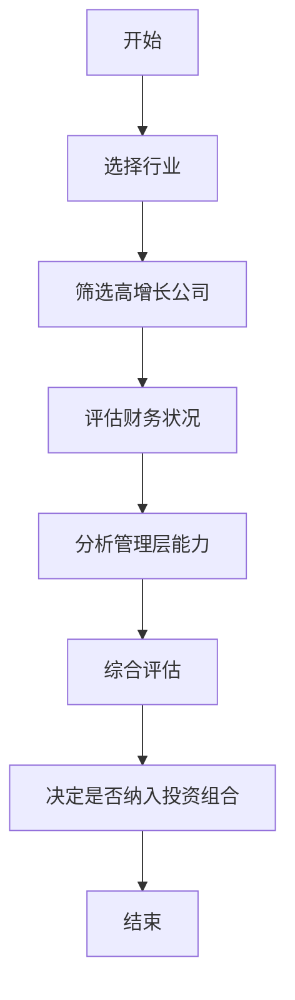

                 


# 彼得·林奇的十倍股选股法则

## 关键词：彼得·林奇，十倍股，选股法则，投资策略，股票分析，风险管理

## 摘要：本文详细介绍了彼得·林奇的十倍股选股法则，分析了其背后的逻辑和策略，并结合实际案例进行深入讲解。通过本文，读者将了解如何识别具有高增长潜力的公司，并构建有效的投资组合。

---

## 第一部分：背景介绍

### 第1章：彼得·林奇的投资理念与背景

#### 1.1 彼得·林奇的生平与投资风格

- **1.1.1 彼得·林奇的早期经历**
  - 出生与教育背景
  - 初入金融行业经历
  - 富达基金的职业生涯

- **1.1.2 彼得·林奇的投资哲学与理念**
  - 价值投资的核心理念
  - 长期投资的重要性
  - 风险管理与分散投资

- **1.1.3 林奇在富达基金的成就**
  - 管理基金的表现
  - 投资策略的成功案例
  - 在行业中的影响力

#### 1.2 十倍股的定义与特点

- **1.2.1 十倍股的定义**
  - 十倍股的定义与标准
  - 十倍股的长期增长潜力

- **1.2.2 十倍股的核心特征**
  - 高增长行业的选择
  - 强大的竞争优势
  - 优秀的管理层能力

- **1.2.3 十倍股与普通股票的区别**
  - 市场规模与增长潜力
  - 财务健康状况评估
  - 风险与回报的平衡

#### 1.3 为什么寻找十倍股

- **1.3.1 十倍股的投资价值**
  - 高回报潜力
  - 市场领导地位的优势
  - 创新驱动的增长动力

- **1.3.2 十倍股在投资组合中的作用**
  - 提供高增长的引擎
  - 分散投资风险
  - 增加长期收益的稳定性

- **1.3.3 十倍股的长期收益潜力**
  - 市场趋势的把握
  - 企业竞争优势的持续性
  - 经济周期中的表现

---

## 第二部分：核心概念与联系

### 第2章：十倍股的选股标准

#### 2.1 市场规模与增长潜力

- **2.1.1 行业市场规模的评估**
  - 市场容量的估算
  - 市场增长率的预测
  - 市场潜力的评估

- **2.1.2 公司增长性的判断**
  - 收入增长率分析
  - 净利润增长趋势
  - 市场份额的扩张

- **2.1.3 市场领先地位的重要性**
  - 市场领导者的优势
  - 新进入者的挑战
  - 行业集中度的影响

#### 2.2 核心竞争优势

- **2.2.1 技术优势**
  - 技术创新的能力
  - 知识产权的保护
  - 技术团队的实力

- **2.2.2 产品差异化**
  - 产品的独特性
  - 品牌影响力
  - 产品生命周期的管理

- **2.2.3 成本优势**
  - 生产成本的控制
  - 供应链管理的优化
  - 规模效应的利用

#### 2.3 管理层能力

- **2.3.1 管理层的背景与经验**
  - 领导者的行业经验
  - 管理团队的稳定性
  - 经验对决策的影响

- **2.3.2 管理层的战略眼光**
  - 长期战略规划
  - 战略执行的能力
  - 适应市场变化的灵活性

- **2.3.3 管理层的诚信与责任感**
  - 企业治理结构
  - 内部控制机制
  - 透明度与责任感

---

### 2.4 十倍股与其他股票的对比

- **对比表格：十倍股与普通股票的核心区别**
  | 特征       | 十倍股                     | 普通股票                  |
  |------------|---------------------------|--------------------------|
  | 市场规模     | 大，且持续增长             | 一般，增长缓慢或稳定      |
  | 竞争优势     | 强大，具有独特性           | 一般，竞争优势不明显       |
  | 管理层能力   | 高效，战略清晰             | 管理层能力一般            |
  | 财务状况     | 健康，增长性强             | 财务状况稳定，增长有限     |

- **ER实体关系图：十倍股的核心要素**
  ```mermaid
  erDiagram
    actor 投资者 {
      <属性> 资金需求
      <属性> 风险承受能力
    }
    actor 市场分析员 {
      <属性> 市场数据
      <属性> 财务分析
    }
    entity 十倍股公司 {
      <属性> 公司名称
      <属性> 行业分类
      <属性> 市场规模
      <属性> 竞争优势
      <属性> 管理层能力
      <属性> 财务状况
    }
    relationship 投资者 --> 十倍股公司 : 选择
    relationship 市场分析员 --> 十倍股公司 : 分析
  ```

---

## 第三部分：算法原理讲解

### 第3章：十倍股的财务指标分析

#### 3.1 财务健康状况评估

- **3.1.1 净利润与盈利能力**
  - 净利润的计算公式：$$ \text{净利润} = \text{营业收入} - \text{成本} - \text{费用} $$
  - 净利润率的计算公式：$$ \text{利润率} = \frac{\text{净利润}}{\text{营业收入}} \times 100\% $$
  - 盈利能力的评估标准：$$ \text{高利润率} \Rightarrow \text{高盈利能力} $$

- **3.1.2 营业收入增长率**
  - 增长率的计算公式：$$ \text{增长率} = \frac{\text{今年营业收入} - \text{去年营业收入}}{\text{去年营业收入}} \times 100\% $$
  - 高增长率的行业优势

- **3.1.3 负债与偿债能力**
  - 负债率的计算公式：$$ \text{负债率} = \frac{\text{总负债}}{\text{总资产}} \times 100\% $$
  - 偿债能力的评估标准：$$ \text{低负债率} \Rightarrow \text{较强的偿债能力} $$

#### 3.2 资产评估与现金流

- **3.2.1 资产结构分析**
  - 流动资产与非流动资产的比例
  - 资产周转率的计算：$$ \text{周转率} = \frac{\text{营业收入}}{\text{平均资产总额}} $$
  - 高周转率的意义

- **3.2.2 现金流的稳定性**
  - 经营活动现金流的正负分析
  - 自由现金流的重要性：$$ \text{自由现金流} = \text{净利润} - \text{资本支出} $$
  - 现金流预测模型

- **3.2.3 自由现金流的重要性**
  - 自由现金流的用途：$$ \text{用于再投资}、\text{偿还债务}、\text{分红派息} $$
  - 现金流充裕的企业的优势

#### 3.3 盈利能力与估值指标

- **3.3.1 市盈率与市净率**
  - 市盈率的计算公式：$$ \text{市盈率} = \frac{\text{股价}}{\text{每股收益}} $$
  - 市净率的计算公式：$$ \text{市净率} = \frac{\text{股价}}{\text{每股净资产}} $$
  - 市盈率与市净率的对比分析

- **3.3.2 股息率与分红政策**
  - 股息率的计算公式：$$ \text{股息率} = \frac{\text{每股股息}}{\text{股价}} \times 100\% $$
  - 高股息率的优缺点
  - 分红政策与企业发展的关系

- **3.3.3 估值的合理性分析**
  - 市场平均市盈率的比较
  - 市净率与行业平均水平的对比
  - 估值的修正与调整

---

### 3.4 十倍股选股算法的流程图



---

## 第四部分：系统分析与架构设计方案

### 第4章：十倍股选股系统的架构设计

#### 4.1 系统功能设计

- **4.1.1 系统概述**
  - 系统的目标：筛选十倍股公司
  - 系统的输入：市场数据、财务数据、公司信息
  - 系统的输出：符合条件的十倍股公司列表

- **4.1.2 领域模型**
  ```mermaid
  classDiagram
    class 十倍股公司 {
      公司名称
      行业分类
      市场规模
      竞争优势
      管理层能力
      财务状况
    }
    class 数据源 {
      市场数据
      财务数据
      公司信息
    }
    class 系统 {
      输入: 数据源
      输出: 十倍股公司列表
    }
    数据源 --> 系统
    系统 --> 十倍股公司
  ```

- **4.1.3 功能模块**
  - 数据采集模块：收集市场数据、财务数据、公司信息
  - 数据处理模块：清洗、转换、分析数据
  - 筛选模块：根据选股标准筛选公司
  - 输出模块：生成十倍股公司列表

#### 4.2 系统架构设计

- **4.2.1 架构类型**
  - 单体架构
  - 微服务架构

- **4.2.2 系统架构图**
  ```mermaid
  context 十倍股选股系统 {
    前端 --> 后端
    后端 --> 数据库
    后端 --> 分析模块
    分析模块 --> 筛选模块
    筛选模块 --> 输出模块
  }
  ```

- **4.2.3 系统接口设计**
  - API接口：RESTful API
  - 数据接口：数据库连接

#### 4.3 系统交互设计

- **4.3.1 交互流程图**
  ```mermaid
  sequenceDiagram
    participant 投资者
    participant 系统
    participant 数据源
    投资者 -> 系统: 请求筛选十倍股公司
    系统 -> 数据源: 获取市场数据
    数据源 --> 系统: 返回市场数据
    系统 -> 数据源: 获取财务数据
    数据源 --> 系统: 返回财务数据
    系统 -> 数据源: 获取公司信息
    数据源 --> 系统: 返回公司信息
    系统 -> 分析模块: 进行数据分析
    分析模块 --> 系统: 返回筛选结果
    系统 -> 投资者: 返回十倍股公司列表
  ```

---

## 第五部分：项目实战

### 第5章：十倍股选股系统实现

#### 5.1 环境安装

- **5.1.1 系统环境要求**
  - 操作系统：Windows/Mac/Linux
  - 开发工具：Python、Jupyter Notebook、VS Code
  - 数据库：MySQL/PostgreSQL
  - 依赖库：pandas、numpy、matplotlib、scikit-learn

#### 5.2 系统核心实现

- **5.2.1 数据采集模块**
  ```python
  import pandas as pd

  def fetch_data(ticker):
      # 数据获取逻辑
      pass

  if __name__ == "__main__":
      data = fetch_data("AAPL")
      print(data)
  ```

- **5.2.2 数据处理模块**
  ```python
  def preprocess_data(data):
      # 数据清洗和转换逻辑
      return processed_data

  processed_data = preprocess_data(data)
  ```

- **5.2.3 筛选模块**
  ```python
  def screen_stocks(processed_data):
      selected_stocks = []
      for stock in processed_data:
          if stock.growth_potential > 10 and stock.roe > 20:
              selected_stocks.append(stock)
      return selected_stocks

  selected = screen_stocks(processed_data)
  ```

- **5.2.4 输出模块**
  ```python
  def output_results(selected_stocks):
      for stock in selected_stocks:
          print(f"{stock.name} is a potential ten-bagger.")

  output_results(selected)
  ```

#### 5.3 代码应用解读与分析

- **代码功能分析**
  - 数据采集模块：从指定数据源获取股票数据
  - 数据处理模块：清洗和转换数据，确保数据质量
  - 筛选模块：根据预设的选股标准筛选十倍股公司
  - 输出模块：将筛选结果输出为可读的格式

- **代码实现细节**
  - 数据源的多样性：包括财务报表、市场数据、公司新闻等
  - 数据清洗的必要性：处理缺失值、异常值、重复值
  - 筛选标准的可调性：可以根据不同市场环境调整参数

#### 5.4 案例分析

- **5.4.1 案例背景**
  - 美国科技行业，寻找具有高增长潜力的公司

- **5.4.2 案例实现**
  ```python
  import pandas as pd
  from datetime import date

  def main():
      start_date = date(2020, 1, 1)
      end_date = date(2023, 12, 31)
      data = fetch_data("AAPL", start_date, end_date)
      processed_data = preprocess_data(data)
      selected = screen_stocks(processed_data)
      output_results(selected)

  if __name__ == "__main__":
      main()
  ```

- **5.4.3 案例分析结果**
  - 筛选出的十倍股公司：如苹果、谷歌、亚马逊等
  - 筛选标准的有效性：高增长、高利润率、强大的竞争优势

#### 5.5 项目小结

- **项目目标达成情况**
  - 成功筛选出符合十倍股标准的公司
  - 系统运行稳定，结果准确

- **项目经验总结**
  - 数据质量的重要性
  - 筛选标准的可调性
  - 系统架构的合理性

---

## 第六部分：最佳实践

### 第6章：十倍股投资策略的优化与风险控制

#### 6.1 小结

- 十倍股的选股法则的核心在于：寻找具有高增长潜力、强大竞争优势和优秀管理层的公司
- 投资者需要结合市场环境和公司具体情况，灵活调整选股标准

#### 6.2 注意事项

- **市场风险**：经济周期波动对十倍股的影响
- **行业风险**：行业政策变化对十倍股的影响
- **公司风险**：管理层变动、财务状况恶化等内部风险

#### 6.3 拓展阅读

- 彼得·林奇的书籍：《彼得·林奇的成功投资》、《彼得·林奇谈投资》
- 相关投资策略：价值投资、成长投资、股息投资
- 风险管理技巧：分散投资、止损策略、资产配置

---

## 作者：AI天才研究院/AI Genius Institute & 禅与计算机程序设计艺术 /Zen And The Art of Computer Programming

