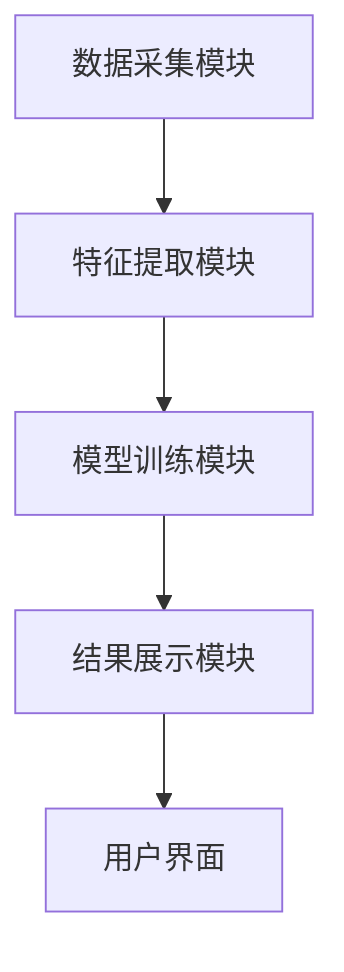

                 


# 机器学习优化价值投资退出决策

> **关键词**：机器学习、价值投资、退出决策、特征工程、算法优化

> **摘要**：本文探讨了机器学习在优化价值投资退出决策中的应用。通过分析机器学习算法的核心原理和价值投资的特征工程，结合实际案例，展示了如何利用机器学习模型优化投资退出决策，提升投资收益。

---

# 第一部分: 机器学习与价值投资概述

## 第1章: 机器学习与价值投资的结合

### 1.1 机器学习的基本概念

#### 1.1.1 机器学习的定义与特点
机器学习（Machine Learning）是一种人工智能技术，通过数据训练模型，使其能够从数据中学习并做出预测或决策。其核心特点包括数据驱动、自动学习和泛化能力。

- 数据驱动：机器学习依赖大量数据进行训练，而不是基于规则编程。
- 自动学习：模型能够自动调整参数，适应数据的变化。
- 泛化能力：通过训练，模型可以对未见数据做出预测。

#### 1.1.2 机器学习的核心算法简介
机器学习算法可分为监督学习、无监督学习和深度学习等：

- **监督学习**：如线性回归、支持向量机（SVM）。
- **无监督学习**：如聚类算法（K-means、DBSCAN）。
- **深度学习**：如神经网络（CNN、RNN）。

#### 1.1.3 机器学习在金融领域的应用潜力
金融领域是机器学习的重要应用场景，包括股票预测、风险评估和投资组合优化等。

### 1.2 价值投资的基本概念

#### 1.2.1 价值投资的定义与特点
价值投资是一种投资策略，强调通过分析企业的基本面，寻找被市场低估的投资标的。其核心在于长期投资、安全边际和价值发现。

- 长期投资：关注企业的长期价值，而非短期波动。
- 安全边际：买入价格低于内在价值。
- 价值发现：通过分析财务数据发现潜在投资机会。

#### 1.2.2 价值投资的分析框架
价值投资的分析框架通常包括以下几个方面：
1. **基本面分析**：分析企业的财务报表、盈利能力、成长能力等。
2. **行业分析**：研究企业所在行业的竞争格局、发展趋势等。
3. **管理团队**：考察企业管理层的能力和诚信。
4. **估值指标**：如市盈率（P/E）、市净率（P/B）等。

#### 1.2.3 价值投资在退出决策中的作用
退出决策是投资过程中的关键环节，决定何时卖出投资标的以实现收益最大化。传统的退出决策依赖经验丰富的投资经理，但存在主观性高、决策效率低的问题。

### 1.3 机器学习优化价值投资退出决策的背景

#### 1.3.1 传统价值投资退出决策的局限性
- **主观性强**：依赖个体经验，存在主观判断偏差。
- **决策效率低**：依赖人工分析，耗时且效率低。
- **数据维度有限**：传统分析方法难以充分利用大数据。

#### 1.3.2 机器学习在退出决策中的优势
- **数据驱动**：利用大数据分析，提供客观依据。
- **自动化**：自动化分析和预测，提高决策效率。
- **精准预测**：通过模型优化，提高预测准确性。

#### 1.3.3 机器学习优化价值投资退出决策的必要性
随着金融市场的复杂化和数据量的增加，传统的退出决策方法难以应对日益复杂的市场环境。机器学习通过高效的数据分析和建模能力，能够显著提升退出决策的科学性和准确性。

### 1.4 本章小结
本章介绍了机器学习的基本概念和价值投资的基本理论，阐述了机器学习在优化价值投资退出决策中的潜力和必要性。接下来的章节将深入探讨机器学习算法和价值投资特征工程，结合实际案例，展示如何利用机器学习优化退出决策。

---

## 第2章: 机器学习与价值投资的结合原理

### 2.1 机器学习的核心原理

#### 2.1.1 数据驱动的决策模式
机器学习通过大量数据训练模型，使其能够识别数据中的模式和特征，从而做出预测和决策。

#### 2.1.2 机器学习算法的基本流程
1. 数据预处理：清洗、特征提取、数据标准化。
2. 模型训练：选择算法，训练模型。
3. 模型评估：验证模型性能，调整参数。
4. 模型部署：应用模型进行预测。

#### 2.1.3 机器学习模型的训练与评估
- **训练**：通过优化目标函数，调整模型参数。
- **评估**：通过准确率、召回率、F1分数等指标评估模型性能。

### 2.2 价值投资的核心原理

#### 2.2.1 价值投资的假设与框架
价值投资的核心假设是市场存在非有效性和价格偏离价值的情况。通过深入分析企业的基本面，寻找具有长期竞争优势和良好治理结构的企业。

#### 2.2.2 价值投资的分析框架
- **基本面分析**：分析企业的财务状况、盈利能力、成长能力。
- **行业分析**：研究行业的发展趋势、竞争格局。
- **管理团队**：评估管理层的能力和诚信。
- **估值指标**：通过市盈率、市净率等指标评估企业的内在价值。

### 2.3 机器学习优化价值投资退出决策的结合点

#### 2.3.1 数据驱动的特征提取
机器学习能够从大量数据中提取特征，帮助投资者发现潜在的市场信号。

#### 2.3.2 模型驱动的决策优化
通过机器学习模型，优化投资组合和退出时机，提高投资收益。

#### 2.3.3 结果驱动的策略改进
机器学习模型可以提供实时反馈，帮助投资者不断优化投资策略。

### 2.4 本章小结
本章分析了机器学习和价值投资的核心原理，探讨了两者结合的可能点。接下来的章节将详细介绍机器学习算法和价值投资特征工程，为优化退出决策提供理论基础。

---

## 第3章: 机器学习算法基础

### 3.1 监督学习算法

#### 3.1.1 线性回归
线性回归是一种简单而强大的回归算法，适用于预测连续型变量。

- **模型公式**：$y = \beta_0 + \beta_1 x + \epsilon$
- **应用**：预测股票价格、回归分析。

#### 3.1.2 支持向量机（SVM）
SVM是一种分类算法，适用于高维数据分类。

- **模型公式**：最大化间隔的优化问题。
- **应用**：股票涨跌分类、客户划分。

#### 3.1.3 随机森林
随机森林是一种基于决策树的集成算法，适用于分类和回归问题。

- **模型公式**：多棵决策树投票结果。
- **应用**：信用评分、欺诈检测。

### 3.2 非监督学习算法

#### 3.2.1 K均值聚类
K均值聚类是一种划分数据点到K个簇的算法。

- **模型公式**：目标函数为最小化簇内距离。
- **应用**：客户细分、市场分群。

#### 3.2.2 层次聚类
层次聚类是一种通过层次分解数据的算法。

- **模型公式**：通过距离矩阵构建树状结构。
- **应用**：产品分组、市场趋势分析。

#### 3.2.3 DBSCAN
DBSCAN是一种基于密度的聚类算法。

- **模型公式**：基于密度和距离的簇定义。
- **应用**：异常检测、图像分割。

### 3.3 神经网络与深度学习

#### 3.3.1 多层感知机（MLP）
MLP是一种简单的神经网络模型。

- **模型公式**：多层非线性激活函数。
- **应用**：图像识别、自然语言处理。

#### 3.3.2 卷积神经网络（CNN）
CNN是一种专门处理图像数据的神经网络。

- **模型公式**：卷积层、池化层、全连接层。
- **应用**：图像识别、视频分析。

#### 3.3.3 循环神经网络（RNN）
RNN是一种处理序列数据的神经网络。

- **模型公式**：循环层、门控机制。
- **应用**：时间序列分析、自然语言处理。

### 3.4 机器学习算法的选择与优化

#### 3.4.1 算法选择的准则
- 数据类型：回归、分类、聚类。
- 数据量：小数据集选择简单模型，大数据集选择复杂模型。
- 计算资源：训练时间、硬件要求。

#### 3.4.2 算法调优的策略
- 参数调整：学习率、正则化系数。
- 数据预处理：归一化、标准化。
- 模型评估：交叉验证、ROC曲线。

#### 3.4.3 算法评估的指标
- 分类指标：准确率、召回率、F1分数。
- 回归指标：均方误差（MSE）、平均绝对误差（MAE）。

### 3.5 本章小结
本章详细介绍了机器学习的核心算法，包括监督学习、无监督学习和深度学习。这些算法为优化价值投资退出决策提供了丰富的工具和方法。

---

## 第4章: 价值投资特征工程

### 4.1 价值投资特征的定义与分类

#### 4.1.1 基本面特征
基本面特征主要来源于企业的财务报表，包括：

- **盈利能力**：净利润率、ROE。
- **成长能力**：收入增长率、净利润增长率。
- **财务健康状况**：资产负债率、流动比率。

#### 4.1.2 技术面特征
技术面特征主要来源于股票价格和成交量等市场数据，包括：

- **趋势指标**：移动平均线、RSI。
- **成交量指标**：成交量、成交额。
- **波动率**：标准差、波动率。

#### 4.1.3 市场情绪特征
市场情绪特征反映了市场参与者的心理和行为，包括：

- **情绪指标**：新闻情感分析、社交媒体情绪。
- **市场参与度**：换手率、活跃度。

### 4.2 机器学习特征工程的步骤

#### 4.2.1 数据清洗与预处理
- **数据清洗**：处理缺失值、异常值。
- **数据标准化**：归一化、标准化。
- **特征提取**：从文本、图像等数据中提取特征。

#### 4.2.2 特征选择
- **特征重要性分析**：使用特征重要性评分。
- **特征筛选**：基于统计方法或模型选择。

### 4.3 本章小结
本章探讨了价值投资特征工程的关键步骤，包括特征分类和特征工程的具体实施方法。通过有效的特征工程，可以显著提升机器学习模型的性能。

---

## 第5章: 机器学习优化价值投资退出决策的系统架构设计

### 5.1 系统功能设计

#### 5.1.1 数据采集模块
- **数据源**：股票价格数据、财务报表、新闻数据。
- **数据格式**：结构化数据、文本数据、图像数据。

#### 5.1.2 特征提取模块
- **特征工程**：基于价值投资特征工程的方法。
- **特征存储**：将特征存储为可训练的格式。

#### 5.1.3 模型训练模块
- **算法选择**：根据数据特点选择合适的算法。
- **模型训练**：使用训练数据训练模型。
- **模型优化**：调整参数，提升性能。

#### 5.1.4 结果展示模块
- **结果可视化**：展示模型预测结果。
- **决策支持**：提供基于模型的决策建议。

### 5.2 系统架构设计

#### 5.2.1 系统架构图


#### 5.2.2 系统接口设计
- **数据接口**：与数据源对接。
- **模型接口**：与其他系统模块对接。
- **用户接口**：提供用户交互界面。

### 5.3 本章小结
本章设计了一个完整的系统架构，涵盖了数据采集、特征提取、模型训练和结果展示的全过程，为优化价值投资退出决策提供了技术支持。

---

## 第6章: 项目实战——基于机器学习的股票退出决策系统

### 6.1 项目背景与目标
本项目旨在利用机器学习技术，构建一个股票退出决策系统，帮助投资者优化退出决策，提高投资收益。

### 6.2 项目实施步骤

#### 6.2.1 环境安装
- **安装Python**：确保安装了Python 3.6以上版本。
- **安装依赖库**：如NumPy、Pandas、Scikit-learn、XGBoost等。
- **安装可视化工具**：如Matplotlib、Seaborn。

#### 6.2.2 数据采集
- **股票数据**：从Yahoo Finance获取股票价格数据。
- **财务数据**：从公司财报获取财务数据。
- **新闻数据**：从新闻网站获取相关文本数据。

#### 6.2.3 特征工程
- **数据清洗**：处理缺失值、异常值。
- **特征提取**：提取基本面、技术面和市场情绪特征。
- **数据标准化**：归一化处理。

#### 6.2.4 模型训练
- **算法选择**：选择合适的机器学习算法。
- **模型训练**：使用训练数据训练模型。
- **模型评估**：使用验证集评估模型性能。
- **模型优化**：调整参数，提升性能。

#### 6.2.5 模型部署
- **部署环境**：搭建一个Web应用，提供用户交互界面。
- **接口设计**：设计REST API，供前端调用。
- **结果展示**：将模型预测结果以可视化方式展示。

### 6.3 项目实现代码

#### 6.3.1 数据采集与处理
```python
import pandas as pd
import numpy as np
import requests
from bs4 import BeautifulSoup

# 从Yahoo Finance获取股票数据
def get_stock_data(ticker):
    url = f"https://query1.finance.yahoo.com/v8/finance/chart/{ticker}"
    response = requests.get(url)
    data = response.json()
    df = pd.DataFrame(data['chart']['result'][0]['prices'])
    df['Date'] = pd.to_datetime(df[0])
    df = df.set_index('Date')
    df = df[['close', 'open', 'high', 'low']]
    return df

# 从公司财报获取财务数据
def get_financial_data(ticker):
    url = f"https://finance.yahoo.com/quote/{ticker}/key-statistics"
    response = requests.get(url)
    soup = BeautifulSoup(response.text, 'html.parser')
    data = {}
    # 提取财务数据
    # 这里简化处理，提取部分指标
    data['PE'] = float(soup.find('div', {'data-testid': 'PE'}).text)
    data['ROE'] = float(soup.find('div', {'data-testid': 'ROE'}).text)
    return data
```

#### 6.3.2 特征工程
```python
import pandas as pd
from sklearn.preprocessing import StandardScaler

def feature_engineering(data):
    # 提取基本面特征
    financial_features = data[['PE', 'ROE']]
    # 提取技术面特征
    technical_features = data[['close', 'open', 'high', 'low']]
    # 组合特征
    df = pd.concat([financial_features, technical_features], axis=1)
    # 标准化处理
    scaler = StandardScaler()
    df_scaled = pd.DataFrame(scaler.fit_transform(df), columns=df.columns)
    return df_scaled
```

#### 6.3.3 模型训练与评估
```python
from sklearn.ensemble import RandomForestClassifier
from sklearn.metrics import accuracy_score, classification_report

def train_model(X_train, y_train, X_test, y_test):
    # 训练模型
    model = RandomForestClassifier(n_estimators=100, max_depth=5, random_state=42)
    model.fit(X_train, y_train)
    # 预测
    y_pred = model.predict(X_test)
    # 评估
    print("Accuracy:", accuracy_score(y_test, y_pred))
    print(classification_report(y_test, y_pred))
```

#### 6.3.4 模型部署
```python
from flask import Flask, request, jsonify
import joblib

app = Flask(__name__)
model = joblib.load('model.pkl')
scaler = joblib.load('scaler.pkl')

@app.route('/predict', methods=['POST'])
def predict():
    data = request.json
    df = pd.DataFrame([data])
    df_scaled = feature_engineering(df)
    prediction = model.predict(df_scaled)
    return jsonify({'prediction': int(prediction[0])})

if __name__ == '__main__':
    app.run(debug=True)
```

### 6.4 项目小结
本项目展示了如何利用机器学习技术构建一个股票退出决策系统。通过数据采集、特征工程、模型训练和部署，实现了一个能够提供退出决策建议的系统。

---

## 第7章: 最佳实践与注意事项

### 7.1 最佳实践
- **数据质量**：确保数据的完整性和准确性。
- **特征工程**：精心设计特征，避免信息冗余。
- **模型选择**：根据数据特点选择合适的算法。
- **模型评估**：使用交叉验证等方法评估模型性能。
- **持续优化**：定期更新模型，适应市场变化。

### 7.2 注意事项
- **数据隐私**：确保数据的隐私和安全。
- **模型解释性**：选择可解释的模型，便于分析和调整。
- **风险管理**：建立风险控制机制，避免过度依赖模型。

### 7.3 拓展阅读
- 《机器学习实战》
- 《Python机器学习》
- 《价值投资入门》

### 7.4 本章小结
本章总结了机器学习优化价值投资退出决策的最佳实践和注意事项，为读者提供了实用的建议和指导。

---

## 作者：AI天才研究院（AI Genius Institute） & 禅与计算机程序设计艺术（Zen And The Art of Computer Programming）

---

# 结语
通过本文的探讨，我们可以看到，机器学习在优化价值投资退出决策中具有巨大的潜力。结合机器学习算法和价值投资的特征工程，投资者可以更科学地做出退出决策，提升投资收益。未来，随着技术的不断发展，机器学习在金融领域的应用将更加广泛和深入。

--- 

**版权声明**：本文章版权归作者所有，转载请注明出处。

