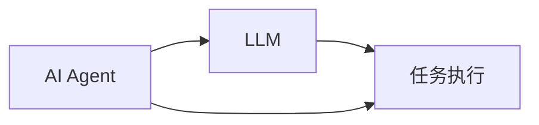
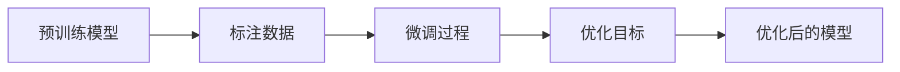
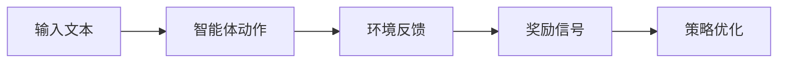
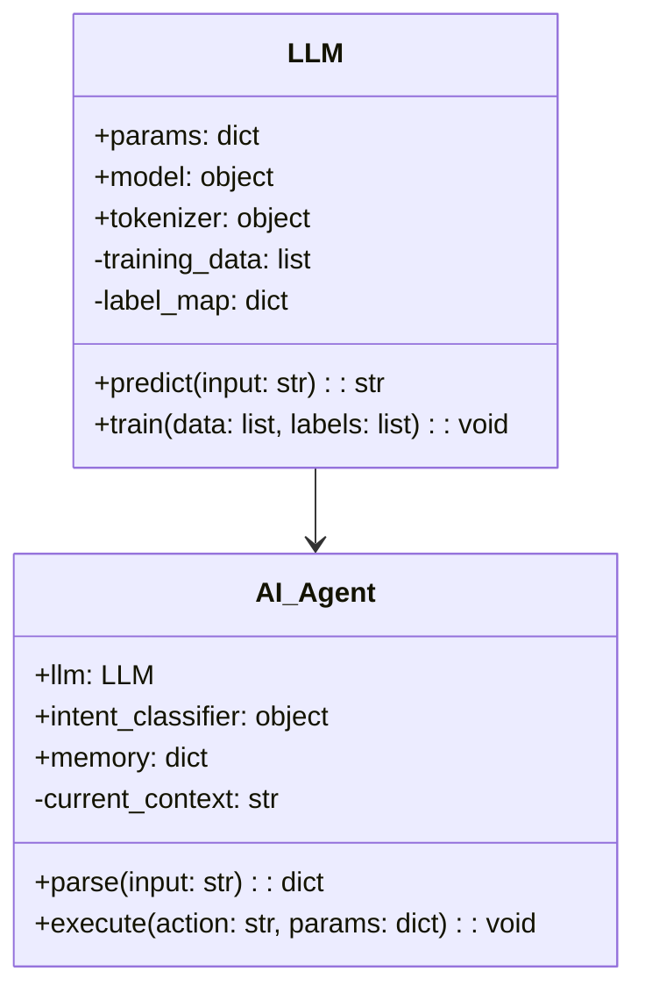
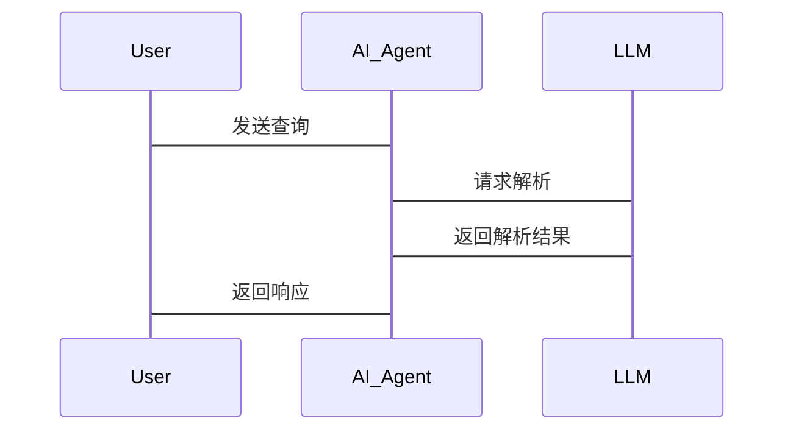

                 


# AI Agent 的语言理解：提升 LLM 的语义解析能力

> 关键词：AI Agent, LLM, 语义解析, 自然语言处理, 语义理解

> 摘要：本文深入探讨了AI Agent在语言理解中的核心作用，分析了如何通过AI Agent提升大语言模型（LLM）的语义解析能力。文章从背景介绍、核心概念、算法原理、系统架构到项目实战，全面解析了AI Agent与LLM的结合与优化，为读者提供了从理论到实践的详细指导。

---

# 第一部分: 背景介绍

## 第1章: 问题背景

### 1.1 问题背景

#### 1.1.1 当前自然语言处理的挑战
- 语言理解的复杂性：歧义性、上下文依赖性。
- 语义解析的局限性：传统NLP方法的不足。
- 大语言模型的崛起：LLM的潜力与挑战。

#### 1.1.2 AI Agent 在语言理解中的作用
- AI Agent 的定义与特点：自主性、反应性、社会性。
- AI Agent 与 LLM 的结合：从理解到行动的桥梁。

#### 1.1.3 提升 LLM 语义解析能力的必要性
- 提升语义解析能力的核心目标。
- AI Agent 在语义解析中的关键作用。

### 1.2 问题描述

#### 1.2.1 LLM 的语义解析能力现状
- 当前 LLM 在语义解析中的表现。
- 现有技术的局限性与改进方向。

#### 1.2.2 AI Agent 在语言理解中的目标
- AI Agent 的语言理解能力优化目标。
- AI Agent 与 LLM 的协同优化。

#### 1.2.3 提升语义解析能力的技术实现边界与外延
- 技术实现的边界：功能范围、性能指标。
- 外延：应用场景、未来发展方向。

### 1.3 核心要素组成

#### 1.3.1 语言理解的构成要素
- 语义解析的核心要素：词汇理解、句法分析、语义推理。
- AI Agent 的能力分解：输入解析、意图识别、上下文记忆。

#### 1.3.2 AI Agent 的核心能力分解
- 输入解析：文本解析、语音识别。
- 意图识别：意图分类、情感分析。
- 上下文记忆：知识库构建、记忆管理。

#### 1.3.3 语义解析的关键技术与工具
- 关键技术：分词、句法分析、语义解析。
- 工具：NLP 库（如spaCy、NLTK）、深度学习框架（如TensorFlow、PyTorch）。

---

# 第二部分: 核心概念与联系

## 第2章: AI Agent 与 LLM 的核心概念

### 2.1 AI Agent 的定义与特点

#### 2.1.1 AI Agent 的定义
- AI Agent 的定义：智能体的定义与分类。
- AI Agent 的特点：自主性、反应性、目标导向性。

#### 2.1.2 AI Agent 的核心能力
- 语言理解能力：文本解析、语音识别。
- 决策能力：意图识别、知识推理。
- 行为能力：任务执行、人机交互。

#### 2.1.3 AI Agent 与传统程序的区别
- 传统程序的特点：输入-输出模式。
- AI Agent 的智能性：自主决策、学习能力。

### 2.2 LLM 的定义与特点

#### 2.2.1 LLM 的定义
- 大语言模型的定义：基于深度学习的自然语言处理模型。
- LLM 的特点：大规模参数、多任务学习能力。
- LLM 的优势：上下文理解、生成能力。

#### 2.2.2 LLM 与小语言模型的对比
- 参数规模：小模型的轻量化与大模型的复杂性。
- 任务能力：小模型的专用性与大模型的通用性。
- 计算资源需求：小模型的低资源消耗与大模型的高资源需求。

### 2.3 AI Agent 与 LLM 的关系

#### 2.3.1 AI Agent 的语言理解能力依赖 LLM
- LLM 为 AI Agent 提供语言理解能力。
- AI Agent 通过 LLM 进行意图识别和语义解析。

#### 2.3.2 LLM 通过 AI Agent 提升语义解析能力
- AI Agent 为 LLM 提供上下文和任务目标。
- AI Agent 的反馈机制优化 LLM 的性能。

#### 2.3.3 两者结合的实现机制
- 数据流：LLM 接收输入，AI Agent 处理输出。
- 控制流：AI Agent 调控 LLM 的推理过程。

---

## 第3章: 核心概念的联系与对比

### 3.1 AI Agent 与 LLM 的属性特征对比

#### 3.1.1 表格对比
| 属性 | AI Agent | LLM |
|------|-----------|-----|
| 核心能力 | 语言理解与执行 | 语言生成与理解 |
| 独特性 | 自主决策能力 | 大规模语料库训练能力 |
| 优化目标 | 提升交互体验 | 提升语义理解准确性 |

#### 3.1.2 图形化对比（Mermaid）


---

# 第三部分: 算法原理

## 第4章: LLM 的语义解析算法

### 4.1 基于监督微调的语义解析算法

#### 4.1.1 监督微调的定义
- 监督微调的定义：在预训练模型基础上，使用标注数据进行微调。
- 微调的目标：提升模型在特定任务上的性能。

#### 4.1.2 算法实现步骤（Mermaid 流程图）


#### 4.1.3 代码实现（Python）
```python
import torch
from torch import nn
import transformers

# 加载预训练模型
model = transformers.AutoModelForMaskedLM.from_pretrained('bert-base-uncased')
tokenizer = transformers.AutoTokenizer.from_pretrained('bert-base-uncased')

# 定义微调任务
class SemanticsParsingModel(nn.Module):
    def __init__(self, model):
        super().__init__()
        self.model = model
        self.dropout = nn.Dropout(0.1)
        self.classifier = nn.Linear(model.config.hidden_size, num_labels)
    
    def forward(self, input_ids, attention_mask, token_type_ids, labels):
        outputs = self.model(input_ids, attention_mask=attention_mask, token_type_ids=token_type_ids)
        sequence_output = outputs.last_hidden_state
        sequence_output = self.dropout(sequence_output)
        logits = self.classifier(sequence_output)
        return logits

# 训练过程
optimizer = torch.optim.AdamW(model.parameters(), lr=1e-5)
criterion = nn.CrossEntropyLoss()
```

#### 4.1.4 数学模型与公式
- 预训练模型的损失函数：
  $$ L_{\text{pre}} = \sum_{i=1}^{N} (-\log p(y_i|x_i)) $$
- 微调任务的损失函数：
  $$ L_{\text{finetune}} = L_{\text{pre}} + \lambda L_{\text{task}} $$
  其中，$L_{\text{task}}$ 是特定任务的损失函数，$\lambda$ 是调节系数。

---

## 第5章: 基于强化学习的语义解析优化

### 5.1 强化学习在语义解析中的应用

#### 5.1.1 强化学习的基本概念
- 强化学习的定义：智能体通过与环境交互，学习最优策略。
- 奖励机制：定义奖励函数，指导智能体的行为。

#### 5.1.2 在语义解析中的应用
- 强化学习优化语义解析的目标。
- 奖励函数的设计：准确率、召回率、F1值。

#### 5.1.3 算法实现步骤（Mermaid 流程图）


#### 5.1.4 代码实现（Python）
```python
import torch
import torch.nn as nn
import transformers

# 定义强化学习策略
class Policy(nn.Module):
    def __init__(self, model):
        super().__init__()
        self.model = model
        self.classifier = nn.Linear(model.config.hidden_size, 1)
    
    def forward(self, input_ids, attention_mask):
        outputs = self.model(input_ids, attention_mask=attention_mask)
        sequence_output = outputs.last_hidden_state[:, 0, :]
        logits = self.classifier(sequence_output)
        return logits

# 强化学习训练过程
optimizer = torch.optim.Adam(policy.parameters(), lr=1e-4)
for batch in batches:
    inputs, labels = batch
    outputs = policy(inputs)
    loss = criterion(outputs, labels)
    loss.backward()
    optimizer.step()
```

#### 5.1.5 数学模型与公式
- 基于策略梯度的方法：
  $$ J(\theta) = \mathbb{E}_{\tau}[ \sum_{t} r_t \log \pi_\theta(a_t|s_t)] $$
  其中，$\theta$ 是模型参数，$\tau$ 是轨迹，$r_t$ 是奖励函数。

---

# 第四部分: 系统分析与架构设计

## 第6章: 系统分析与架构设计

### 6.1 问题场景介绍

#### 6.1.1 问题场景描述
- 语义解析的场景：文本分类、信息提取、对话理解。
- AI Agent 的应用场景：智能客服、智能助手、智能教育。

### 6.2 系统功能设计

#### 6.2.1 领域模型设计（Mermaid 类图）


#### 6.2.2 系统架构设计（Mermaid 架构图）


#### 6.2.3 系统接口设计
- 输入接口：文本输入、语音输入。
- 输出接口：文本输出、动作执行。

### 6.3 交互流程设计（Mermaid 序列图）


---

# 第五部分: 项目实战

## 第7章: 项目实战

### 7.1 环境安装

#### 7.1.1 安装 Python 和依赖
```bash
pip install python==3.8
pip install torch transformers
```

### 7.2 核心代码实现

#### 7.2.1 AI Agent 的实现
```python
class AI_Agent:
    def __init__(self, llm):
        self.llm = llm
        self.memory = {}
    
    def parse(self, input_str):
        # 调用 LLM 进行解析
        parsed_result = self.llm.predict(input_str)
        return parsed_result
    
    def execute(self, action, params):
        # 根据解析结果执行动作
        pass
```

#### 7.2.2 LLM 的实现
```python
class LLM:
    def __init__(self, model_name):
        self.model = AutoModelForMaskedLM.from_pretrained(model_name)
        self.tokenizer = AutoTokenizer.from_pretrained(model_name)
    
    def predict(self, input_str):
        # 处理输入并返回解析结果
        pass
```

### 7.3 代码解读与分析

#### 7.3.1 AI Agent 的代码解读
- 初始化：加载 LLM 模型。
- parse 方法：接收输入，调用 LLM 进行解析。
- execute 方法：根据解析结果执行具体动作。

#### 7.3.2 LLM 的代码解读
- 初始化：加载预训练模型和分词器。
- predict 方法：处理输入文本，返回解析结果。

### 7.4 实际案例分析

#### 7.4.1 案例 1：文本分类
- 输入：用户查询：“我需要帮助查询天气。”
- 解析：分类为“天气查询”。
- 执行：调用天气 API 获取天气信息。

#### 7.4.2 案例 2：对话理解
- 输入：用户对话：“我想预订明天的机票。”
- 解析：识别意图“机票预订”。
- 执行：查询航班信息并返回结果。

---

# 第六部分: 总结与最佳实践

## 第8章: 总结与最佳实践

### 8.1 小结
- 本文总结了 AI Agent 在语言理解中的核心作用。
- 提升 LLM 语义解析能力的关键方法包括：监督微调、强化学习优化。

### 8.2 最佳实践 Tips
- 选择合适的模型：根据任务需求选择模型大小。
- 数据质量：高质量标注数据提升性能。
- 持续优化：通过反馈机制不断优化模型。

### 8.3 注意事项
- 模型的可解释性：确保解析过程透明。
- 安全性：防止滥用，确保数据隐私。

### 8.4 拓展阅读
- 推荐阅读《Large Language Models：A Comprehensive Survey》。
- 关注最新研究：arXiv 上的相关论文。

---

# 作者信息

作者：AI天才研究院/AI Genius Institute & 禅与计算机程序设计艺术 /Zen And The Art of Computer Programming

---

感谢您的耐心阅读，希望本文对您理解 AI Agent 的语言理解能力有所帮助！

