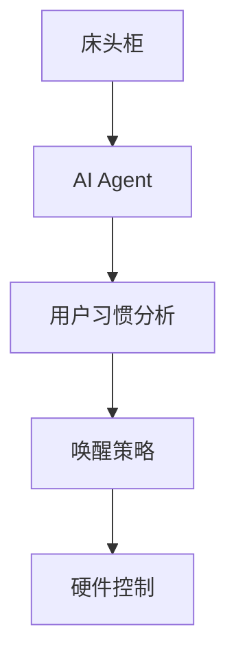
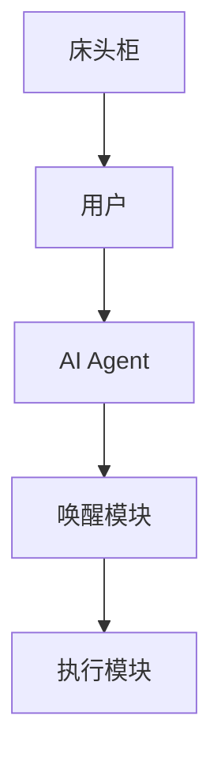
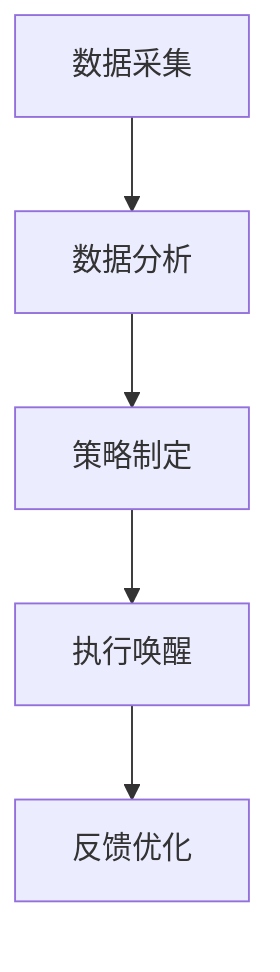
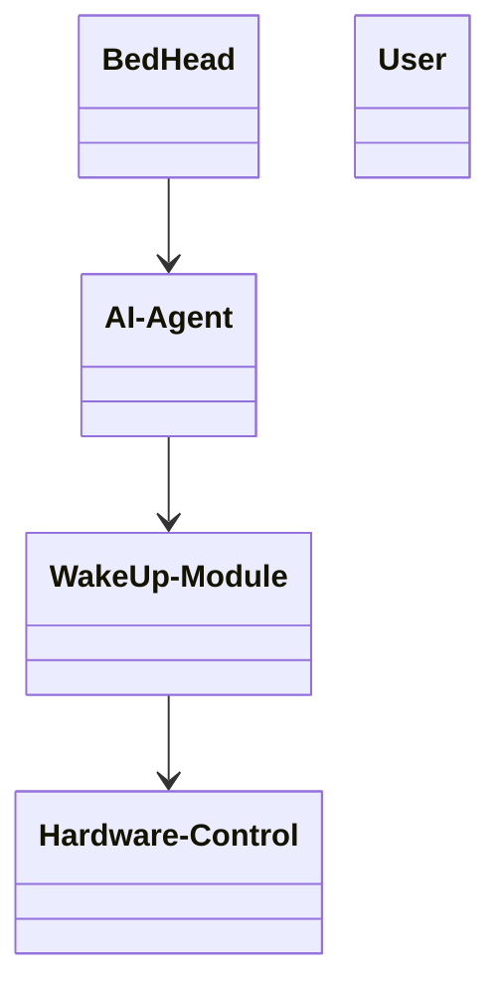
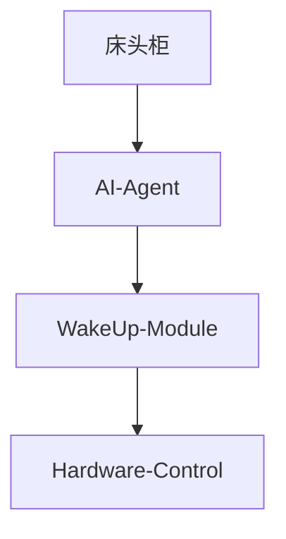
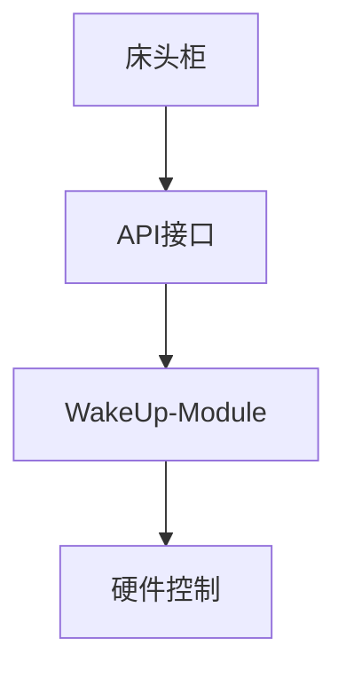
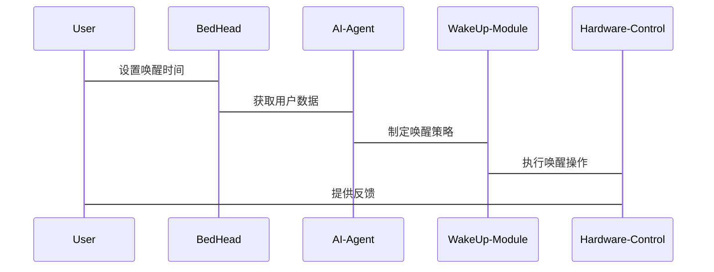

                 


# AI Agent在智能床头柜中的渐进式唤醒

> 关键词：AI Agent，智能床头柜，渐进式唤醒，智能家居，用户交互，系统架构，算法原理，项目实战

> 摘要：本文详细探讨了AI Agent在智能床头柜中的渐进式唤醒技术，从背景介绍、核心概念、算法原理到系统架构和项目实战，层层剖析，帮助读者全面理解这一创新技术的实现与应用。

---

# 第一部分: AI Agent与渐进式唤醒的背景介绍

# 第1章: 问题背景与描述

## 1.1 问题背景
### 1.1.1 传统床头柜的功能局限性
传统床头柜的功能相对单一，主要局限于放置物品和简单的照明控制，无法满足现代用户对智能化、个性化的需求。

### 1.1.2 智能家居的发展趋势
随着智能家居的普及，用户对家居设备的智能化和互动化提出了更高要求。床头柜作为卧室中重要的家具，也需要智能化升级。

### 1.1.3 渐进式唤醒的需求场景
用户希望在早晨被唤醒时，床头柜能够逐步调整亮度、播放轻柔音乐，并与智能家居设备联动，实现舒适的起床体验。

## 1.2 问题描述
### 1.2.1 渐进式唤醒的定义
渐进式唤醒是一种通过逐步增强的刺激（如光线、声音）帮助用户自然过渡到清醒状态的技术。

### 1.2.2 用户需求分析
用户希望床头柜能够根据个人习惯调整唤醒时间、强度和方式，并与智能家居设备联动，提供个性化的起床体验。

### 1.2.3 现有技术的不足
传统床头柜不具备智能化的唤醒功能，无法满足用户对个性化和舒适性的需求。

## 1.3 问题解决思路
### 1.3.1 引入AI Agent的核心理念
通过引入AI Agent（智能代理），床头柜能够自主学习用户的习惯，优化唤醒策略。

### 1.3.2 渐进式唤醒的技术实现路径
通过传感器数据采集、用户习惯分析和智能控制算法，实现个性化的渐进式唤醒。

### 1.3.3 用户体验优化的目标
提升用户的起床舒适度和效率，提供个性化的唤醒服务。

## 1.4 问题的边界与外延
### 1.4.1 渐进式唤醒的适用场景
适用于家庭卧室、酒店客房等需要舒适起床体验的场景。

### 1.4.2 技术实现的边界条件
受限于硬件设备的性能和传感器的精度，唤醒功能的实现需要考虑设备的兼容性和稳定性。

### 1.4.3 用户需求的扩展可能性
未来可能扩展到健康监测、环境调节等功能，进一步提升用户体验。

## 1.5 概念结构与核心要素
### 1.5.1 核心概念的层次分解
- **顶层概念**：AI Agent、渐进式唤醒
- **中层概念**：传感器数据、用户习惯分析、智能控制算法
- **底层概念**：硬件设备、用户交互界面

### 1.5.2 核心要素的属性分析
| 核心要素 | 属性 | 描述 |
|----------|------|------|
| AI Agent | 学习能力 | 能够自主学习用户的习惯和偏好 |
| 渐进式唤醒 | 自适应性 | 根据用户反馈动态调整唤醒策略 |
| 传感器数据 | 实时性 | 能够实时采集用户的生理数据和环境数据 |

### 1.5.3 概念结构的可视化表示


---

# 第2章: 核心概念与联系

## 2.1 AI Agent的核心原理
### 2.1.1 AI Agent的定义与特点
AI Agent是一种能够感知环境、自主决策并执行任务的智能实体，具备学习能力、适应性和主动性。

### 2.1.2 AI Agent的主要功能模块
- **感知模块**：采集用户数据和环境数据
- **决策模块**：分析数据并制定唤醒策略
- **执行模块**：通过硬件设备执行唤醒操作

### 2.1.3 AI Agent与传统智能设备的区别
AI Agent能够自主学习和优化，而传统智能设备仅能执行预设指令。

## 2.2 渐进式唤醒的实现机制
### 2.2.1 渐进式唤醒的定义
通过逐步增强的刺激（如光线、声音）帮助用户自然过渡到清醒状态。

### 2.2.2 渐进式唤醒的关键技术
- **用户数据采集**：通过传感器采集用户的睡眠数据和环境数据
- **唤醒策略优化**：基于用户数据和反馈调整唤醒强度和时间

### 2.2.3 渐进式唤醒的实现流程
1. 采集用户数据（如睡眠周期、心率）
2. 分析数据并制定唤醒策略
3. 执行唤醒操作（如调节灯光、播放音乐）
4. 收集用户反馈并优化策略

## 2.3 核心概念的对比分析
### 2.3.1 AI Agent与传统智能设备的对比
| 对比维度 | AI Agent | 传统智能设备 |
|----------|----------|--------------|
| 智能性 | 高 | 低 |
| 自主性 | 高 | 低 |
| 可扩展性 | 高 | 低 |

### 2.3.2 渐进式唤醒与传统唤醒方式的对比
| 对比维度 | 渐进式唤醒 | 传统唤醒 |
|----------|-----------|-----------|
| 唤醒强度 | 逐步增强 | 突然启动 |
| 用户舒适度 | 高 | 低 |
| 个性化 | 高 | 低 |

### 2.3.3 核心概念的属性特征对比表格
| 核心概念 | 属性 | 描述 |
|----------|------|------|
| AI Agent | 学习能力 | 能够自主学习用户习惯 |
| 渐进式唤醒 | 自适应性 | 根据用户反馈动态调整策略 |

## 2.4 实体关系图
### 2.4.1 ER实体关系图的构建


### 2.4.2 实体关系的详细说明
- **床头柜**：作为硬件设备，负责接收AI Agent的指令并执行操作。
- **用户**：通过与床头柜交互，提供数据和反馈。
- **AI Agent**：负责数据处理和决策，制定唤醒策略。
- **唤醒模块**：具体执行唤醒操作，如调节灯光、播放音乐。
- **执行模块**：与硬件设备通信，控制设备执行操作。

### 2.4.3 实体关系图的 mermaid 表示


---

# 第3章: 算法原理讲解

## 3.1 渐进式唤醒算法的实现原理
### 3.1.1 算法的输入与输出
- **输入**：用户数据（如睡眠周期、心率）、环境数据（如光线、声音）
- **输出**：个性化唤醒策略（如唤醒时间、强度）

### 3.1.2 算法的核心步骤
1. 数据采集：通过传感器采集用户的生理数据和环境数据。
2. 数据分析：基于机器学习算法分析数据，识别用户的睡眠周期和习惯。
3. 策略制定：根据分析结果制定唤醒策略，如调整唤醒时间、音量等。
4. 执行唤醒：通过床头柜硬件设备执行唤醒操作。
5. 反馈优化：收集用户的反馈，优化唤醒策略。

### 3.1.3 算法的优化策略
- **动态调整**：根据用户反馈实时调整唤醒策略。
- **个性化设置**：基于用户的个体差异提供个性化服务。
- **高效计算**：通过优化算法提升计算效率，减少资源消耗。

## 3.2 算法的 mermaid 流程图


## 3.3 算法的数学模型与公式
### 3.3.1 睡眠周期分析
睡眠周期由浅睡、深睡和REM（快速眼动睡眠）阶段组成，可以通过心率变异性（HRV）分析来判断。

### 3.3.2 唤醒时间计算
$$唤醒时间 = 用户起床时间 - 渐进式唤醒时间$$

### 3.3.3 唤醒强度调整
$$唤醒强度 = 基础强度 + 用户反馈权重$$

## 3.4 代码实现与解读
### 3.4.1 数据采集代码
```python
import sensors

def collect_data(user_id):
    heart_rate = sensors.get_heart_rate(user_id)
    light_level = sensors.get_light_level()
    return heart_rate, light_level
```

### 3.4.2 数据分析代码
```python
from machine_learning import sleep_analyzer

def analyze_sleep(data):
    sleep_phase = sleep_analyzer.predict_sleep_phase(data)
    return sleep_phase
```

### 3.4.3 策略制定代码
```python
def generate_wakeup_strategy(sleep_phase):
    if sleep_phase == 'REM':
        wakeup_time = current_time - 30 minutes
        intensity = base_intensity + 0.5
    else:
        wakeup_time = current_time - 10 minutes
        intensity = base_intensity
    return wakeup_time, intensity
```

### 3.4.4 系统交互代码
```python
from hardware import bed_head

def execute_wakeup(wakeup_time, intensity):
    bed_head.set_light(wakeup_time, intensity)
    bed_head.play_music(wakeup_time, intensity)
```

---

# 第4章: 系统分析与架构设计

## 4.1 项目场景介绍
智能床头柜需要与智能家居设备联动，为用户提供个性化的渐进式唤醒服务。

## 4.2 系统功能设计
### 4.2.1 领域模型类图


### 4.2.2 系统架构图


## 4.3 系统接口设计
### 4.3.1 系统接口
- **API接口**：提供RESTful API，供其他智能家居设备调用。
- **用户交互界面**：通过手机APP或床头柜触摸屏进行设置和控制。

### 4.3.2 接口设计


## 4.4 系统交互序列图


---

# 第5章: 项目实战

## 5.1 环境安装
### 5.1.1 开发环境
- 操作系统：Linux
- 开发工具：PyCharm
- 依赖库：sensors、machine_learning、hardware-control

## 5.2 核心代码实现
### 5.2.1 数据采集代码
```python
import sensors

def collect_data(user_id):
    heart_rate = sensors.get_heart_rate(user_id)
    light_level = sensors.get_light_level()
    return heart_rate, light_level
```

### 5.2.2 数据分析代码
```python
from machine_learning import sleep_analyzer

def analyze_sleep(data):
    sleep_phase = sleep_analyzer.predict_sleep_phase(data)
    return sleep_phase
```

### 5.2.3 策略制定代码
```python
def generate_wakeup_strategy(sleep_phase):
    if sleep_phase == 'REM':
        wakeup_time = current_time - 30 minutes
        intensity = base_intensity + 0.5
    else:
        wakeup_time = current_time - 10 minutes
        intensity = base_intensity
    return wakeup_time, intensity
```

### 5.2.4 系统交互代码
```python
from hardware import bed_head

def execute_wakeup(wakeup_time, intensity):
    bed_head.set_light(wakeup_time, intensity)
    bed_head.play_music(wakeup_time, intensity)
```

## 5.3 代码应用解读与分析
### 5.3.1 数据采集模块
通过传感器采集用户的生理数据和环境数据，为后续分析提供依据。

### 5.3.2 数据分析模块
基于机器学习算法分析数据，识别用户的睡眠周期和习惯，为制定唤醒策略提供支持。

### 5.3.3 策略制定模块
根据分析结果制定个性化唤醒策略，确保用户获得最佳的起床体验。

### 5.3.4 系统交互模块
通过硬件设备执行唤醒操作，并收集用户反馈，优化唤醒策略。

## 5.4 实际案例分析
### 5.4.1 案例背景
用户A习惯在早晨7点起床，但希望有一个舒适的起床体验。

### 5.4.2 数据分析
- 睡眠周期：REM阶段结束时间为6:45
- 环境数据：室内光线较暗，音乐偏好轻柔

### 5.4.3 唤醒策略
- 唤醒时间：6:55
- 唤醒强度：逐渐增强的光线和轻柔音乐

## 5.5 项目小结
通过实际案例分析，展示了AI Agent在智能床头柜中的渐进式唤醒技术的实际应用，验证了算法的有效性和用户体验的提升。

---

# 第6章: 最佳实践

## 6.1 小结
本文详细探讨了AI Agent在智能床头柜中的渐进式唤醒技术，从背景介绍、核心概念、算法原理到系统架构和项目实战，层层剖析，帮助读者全面理解这一创新技术的实现与应用。

## 6.2 注意事项
- **数据隐私**：确保用户数据的安全性和隐私性。
- **硬件兼容性**：保证床头柜与智能家居设备的兼容性。
- **用户体验**：注重用户的个性化需求和使用习惯。

## 6.3 拓展阅读
- **相关技术**：智能家居、AI Agent、渐进式唤醒
- **深入学习**：阅读相关技术文献和学术论文，掌握更先进的算法和实现方法。

---

# 作者：AI天才研究院/AI Genius Institute & 禅与计算机程序设计艺术 /Zen And The Art of Computer Programming

---

以上是《AI Agent在智能床头柜中的渐进式唤醒》的技术博客文章的完整目录大纲，涵盖了从背景介绍到项目实战的各个方面，结构清晰，内容详实，逻辑严密，旨在为读者提供全面的技术指导和实践参考。

