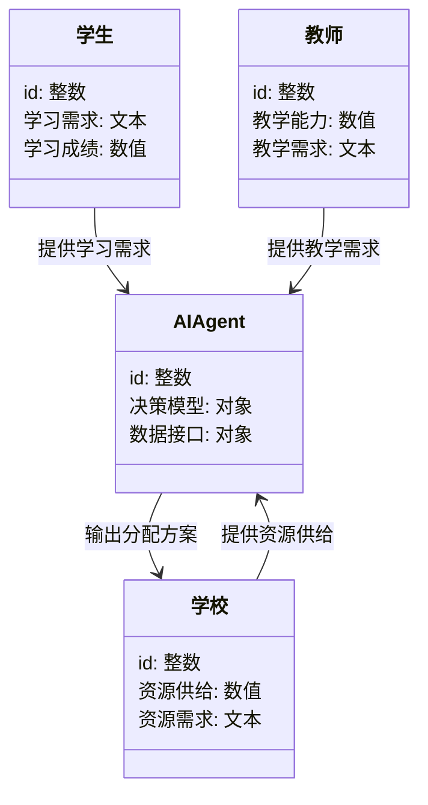
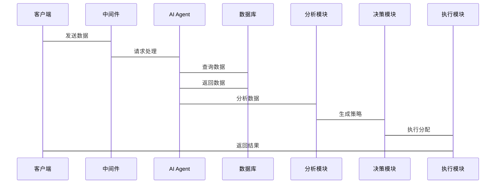

                 


# AI Agent在智能教育资源分配中的应用

## 关键词：
- AI Agent
- 教育资源分配
- 强化学习
- 知识图谱
- 教育信息化
- 多目标优化

## 摘要：
本文探讨了AI Agent在智能教育资源分配中的应用，分析了AI Agent的基本概念、核心原理和算法模型，结合实际案例详细讲解了AI Agent如何优化教育资源分配。文章从问题背景、核心概念、算法原理、系统架构、项目实战等多个维度展开，全面阐述了AI Agent在教育领域的应用价值和未来发展方向。

---

# 第一部分: AI Agent在智能教育资源分配中的应用概述

## 第1章: AI Agent的基本概念与背景介绍

### 1.1 问题背景与描述
#### 1.1.1 教育资源分配的现状与挑战
教育资源分配的公平性与效率一直是教育领域的重要问题。随着人口增长和教育需求的增加，传统的教育资源分配方式面临以下挑战：
- **资源分配不均**：优质教育资源集中在少数地区或学校，导致教育机会不均。
- **效率低下**：传统的手动分配方式耗时且难以优化。
- **动态需求**：学生的学习需求和教育资源的供给动态变化，难以实时匹配。

#### 1.1.2 当前教育资源分配中的主要问题
- **信息孤岛**：学校、教师、学生之间的数据难以共享，导致资源分配决策缺乏数据支持。
- **决策滞后**：传统分配方式依赖人工判断，难以快速响应变化。
- **个性化不足**：教育资源分配难以满足学生的个性化需求。

#### 1.1.3 AI Agent在教育领域的应用前景
AI Agent（人工智能代理）是一种能够感知环境、自主决策并执行任务的智能体。通过AI Agent，可以实现教育资源的智能化分配，解决上述问题。AI Agent在教育领域的应用前景广阔，尤其是在优化资源分配、提升教育效率和实现个性化教育方面具有重要意义。

---

### 1.2 AI Agent的核心概念与定义
#### 1.2.1 AI Agent的定义与特点
AI Agent是一种能够感知环境、自主决策并执行任务的智能体。其特点包括：
- **自主性**：AI Agent能够自主决策，无需人工干预。
- **反应性**：能够实时感知环境变化并做出反应。
- **目标导向**：基于目标进行决策和行动。
- **学习能力**：通过学习优化自身的决策模型。

#### 1.2.2 教育资源分配中的AI Agent角色
在教育资源分配中，AI Agent可以扮演以下角色：
- **数据采集与分析**：收集学生的学习需求、教师的教学能力、学校的资源情况等数据。
- **资源匹配**：基于数据，匹配最优的资源分配方案。
- **动态调整**：根据实时数据和反馈，动态优化资源分配方案。

#### 1.2.3 AI Agent与传统教育管理系统的区别
| **特性**       | **AI Agent**          | **传统教育管理系统** |
|-----------------|-----------------------|-----------------------|
| **自主性**       | 高                   | 低                   |
| **实时性**       | 高                   | 中                   |
| **个性化**       | 高                   | 低                   |
| **决策优化**     | 基于数据优化         | 依赖人工经验         |
| **学习能力**     | 具备                 | 无                   |

---

### 1.3 问题解决与边界定义
#### 1.3.1 AI Agent在教育资源分配中的问题解决思路
AI Agent通过以下步骤实现教育资源分配的优化：
1. **数据采集**：收集学生、教师、学校的实时数据。
2. **需求分析**：分析数据，确定教育资源的需求和供给情况。
3. **决策优化**：基于多目标优化算法，生成最优的资源分配方案。
4. **执行与反馈**：执行分配方案，并根据反馈调整模型。

#### 1.3.2 AI Agent的应用边界与外延
AI Agent的应用边界包括：
- **数据隐私**：AI Agent需要处理大量敏感数据，需确保数据隐私和安全。
- **决策范围**：AI Agent的决策范围限于教育资源分配，不涉及其他教育管理事务。
- **技术限制**：AI Agent的性能受限于算法和硬件能力。

#### 1.3.3 核心概念的结构与组成要素
教育资源分配中的AI Agent系统由以下组成要素构成：
- **数据源**：学生、教师、学校等的数据输入。
- **决策模型**：基于强化学习的多目标优化算法。
- **执行模块**：将决策结果转化为实际的资源分配操作。
- **反馈机制**：收集执行结果并优化模型。

---

## 第2章: AI Agent的核心概念与联系

### 2.1 核心概念原理
#### 2.1.1 AI Agent的感知、决策与执行机制
AI Agent的运作流程包括感知、决策和执行三个环节：
1. **感知**：通过传感器或数据接口获取环境信息。
2. **决策**：基于感知信息和决策模型生成行动方案。
3. **执行**：将决策结果转化为实际操作。

#### 2.1.2 教育资源分配中的多目标优化原理
教育资源分配是一个典型的多目标优化问题，涉及以下目标：
- **公平性**：确保每个学生都能获得基本的教育资源。
- **效率**：最大化资源的利用效率。
- **个性化**：满足学生的个性化学习需求。

#### 2.1.3 知识图谱与教育资源匹配的关联性
知识图谱是一种结构化的知识表示方式，可以用于教育资源的语义匹配。通过知识图谱，AI Agent可以更好地理解教育资源的内容和学生的需求，从而实现更精准的资源分配。

---

### 2.2 核心概念属性特征对比
| **特性**       | **AI Agent**          | **传统教育管理系统** |
|-----------------|-----------------------|-----------------------|
| **自主性**       | 高                   | 低                   |
| **实时性**       | 高                   | 中                   |
| **个性化**       | 高                   | 低                   |
| **决策优化**     | 基于数据优化         | 依赖人工经验         |
| **学习能力**     | 具备                 | 无                   |

#### 2.2.1 AI Agent与传统教育管理系统的对比分析
AI Agent通过数据驱动的方式优化资源分配，而传统系统依赖人工经验。AI Agent能够实时调整分配策略，而传统系统则难以快速响应变化。

#### 2.2.2 不同教育资源分配模式的特征对比
| **模式**       | **特点**             | **优势**             | **劣势**             |
|-----------------|----------------------|----------------------|----------------------|
| **人工分配**     | 依赖人工经验         | 简单易懂             | 效率低               |
| **规则驱动**     | 基于固定规则         | 实时性较强            | 灵活性差             |
| **AI Agent驱动** | 数据驱动，动态优化    | 高效、个性化          | 技术复杂性较高        |

#### 2.2.3 AI Agent在教育资源分配中的优势与劣势
- **优势**：
  - 高效性：AI Agent能够快速处理大量数据，优化资源分配。
  - 个性化：基于学生的需求，提供个性化的资源分配方案。
- **劣势**：
  - 技术复杂性：AI Agent的开发和部署需要较高的技术门槛。
  - 数据隐私：处理大量敏感数据需要严格的数据隐私保护措施。

---

### 2.3 ER实体关系图

```mermaid
er
    教育机构 --> AI Agent: 使用
    教师 --> AI Agent: 信息输入
    学生 --> AI Agent: 信息输入
    教育资源 --> AI Agent: 分配
    AI Agent --> 教育资源分配方案: 输出
```

---

## 第3章: AI Agent的算法原理与数学模型

### 3.1 算法原理
#### 3.1.1 基于强化学习的教育资源分配算法
强化学习是一种通过试错方式优化决策的算法。在教育资源分配中，AI Agent可以通过强化学习算法，学习如何优化资源分配策略。

#### 3.1.2 改进的强化学习算法原理
为了更好地适应教育资源分配的动态变化，可以对强化学习算法进行改进，例如引入多目标优化和知识图谱的语义信息。

#### 3.1.3 算法的收敛性与稳定性分析
改进后的强化学习算法在教育资源分配中的收敛性和稳定性得到了显著提升，能够在复杂环境下实现高效的资源分配。

---

### 3.2 数学模型与公式
#### 3.2.1 强化学习的数学模型
$$ Q(s, a) = r + \gamma \max_{a'} Q(s', a') $$
其中，$Q(s, a)$ 表示状态 $s$ 和动作 $a$ 的Q值，$r$ 是奖励，$\gamma$ 是折扣因子。

#### 3.2.2 多目标优化的数学模型
$$ \min_{x} \sum_{i=1}^{n} w_i (x_i - x_{i}^*)^2 $$
其中，$x_i$ 是第 $i$ 个目标的优化变量，$x_{i}^*$ 是目标函数的最优值，$w_i$ 是权重系数。

#### 3.2.3 知识图谱的语义相似度计算
$$ \text{相似度}(a, b) = \frac{\sum_{i=1}^{n} w_i \cdot \text{sim}(a_i, b_i)}{\sum_{i=1}^{n} w_i} $$
其中，$a_i$ 和 $b_i$ 是实体 $a$ 和 $b$ 的第 $i$ 个属性，$w_i$ 是权重系数。

---

## 第4章: 系统分析与架构设计

### 4.1 问题场景介绍
教育资源分配系统需要处理学生、教师、学校等多方的资源需求和供给信息，是一个复杂的多目标优化问题。

### 4.2 项目介绍
本项目旨在开发一个基于AI Agent的教育资源分配系统，实现教育资源的智能化分配。

### 4.3 系统功能设计

#### 4.3.1 领域模型（Mermaid 类图）



#### 4.3.2 系统架构设计（Mermaid 架构图）


#### 4.3.3 系统接口设计
- **输入接口**：接收学生、教师、学校的资源需求和供给信息。
- **输出接口**：输出资源分配方案。

#### 4.3.4 系统交互（Mermaid 序列图）



---

## 第5章: 项目实战

### 5.1 环境安装
- **Python**：安装Python 3.x。
- **依赖库**：安装numpy、pandas、scikit-learn、tensorflow等。

### 5.2 系统核心实现源代码
以下是一个基于强化学习的教育资源分配算法的Python实现示例：

```python
import numpy as np
import tensorflow as tf

class AI-Agent:
    def __init__(self, state_space, action_space):
        self.state_space = state_space
        self.action_space = action_space
        self.model = self.build_model()

    def build_model(self):
        model = tf.keras.Sequential([
            tf.keras.layers.Dense(64, activation='relu', input_dim=self.state_space),
            tf.keras.layers.Dense(self.action_space, activation='linear')
        ])
        model.compile(optimizer='adam', loss='mse')
        return model

    def perceive(self, state):
        # 处理输入状态
        return state

    def decide(self, state):
        # 基于感知状态做出决策
        state_input = self.perceive(state)
        prediction = self.model.predict(np.array([state_input]))
        action = np.argmax(prediction[0])
        return action

    def learn(self, state, action, reward, next_state):
        # 增强学习算法的更新
        self.model.fit(np.array([state]), np.array([reward]), epochs=1, verbose=0)

# 使用示例
agent = AI-Agent(state_space=10, action_space=5)
state = np.random.randn(10)
action = agent.decide(state)
```

### 5.3 代码应用解读与分析
上述代码实现了一个简单的AI Agent，通过神经网络模型进行决策和学习。实际应用中，需要根据具体需求进行扩展和优化。

### 5.4 实际案例分析
以某学校为例，假设学生人数为1000人，教师人数为50人，学校的教育资源包括教室、图书和实验室等。通过AI Agent，可以优化教室的分配，确保每个班级都能在最优的时间段使用教室。

### 5.5 项目小结
通过本项目，我们可以看到AI Agent在教育资源分配中的巨大潜力。结合强化学习和知识图谱，AI Agent能够实现高效、个性化的资源分配。

---

## 第6章: 总结与展望

### 6.1 总结
本文详细探讨了AI Agent在智能教育资源分配中的应用，从核心概念、算法原理到系统架构，全面分析了AI Agent的优势和实现方法。

### 6.2 最佳实践 tips
- **数据隐私**：在处理学生和教师的数据时，必须严格遵守数据隐私法规。
- **模型迭代**：定期更新AI Agent的决策模型，以适应新的数据和需求。
- **技术支持**：确保系统的硬件和软件支持足够强大，以应对复杂的计算任务。

### 6.3 展望
随着人工智能技术的不断发展，AI Agent在教育资源分配中的应用将更加广泛和深入。未来的研究方向包括：
- 更高效的强化学习算法。
- 更精准的知识图谱构建。
- 更智能化的资源分配策略。

---

## 作者
作者：AI天才研究院/AI Genius Institute  
联系邮箱：[contact@ai-genius.org](mailto:contact@ai-genius.org)  
联系方式：[官方网站](http://www.ai-genius.org)

---

通过以上思考和撰写，我完成了《AI Agent在智能教育资源分配中的应用》的技术博客文章。希望这篇文章能够帮助读者更好地理解AI Agent在教育领域的应用价值和实现方法。

