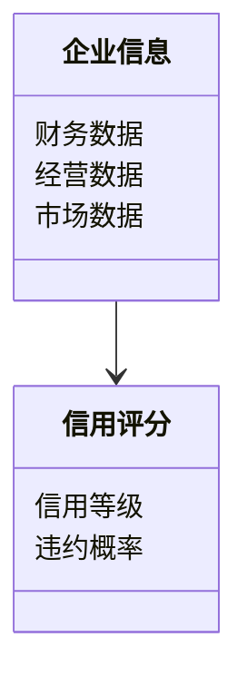
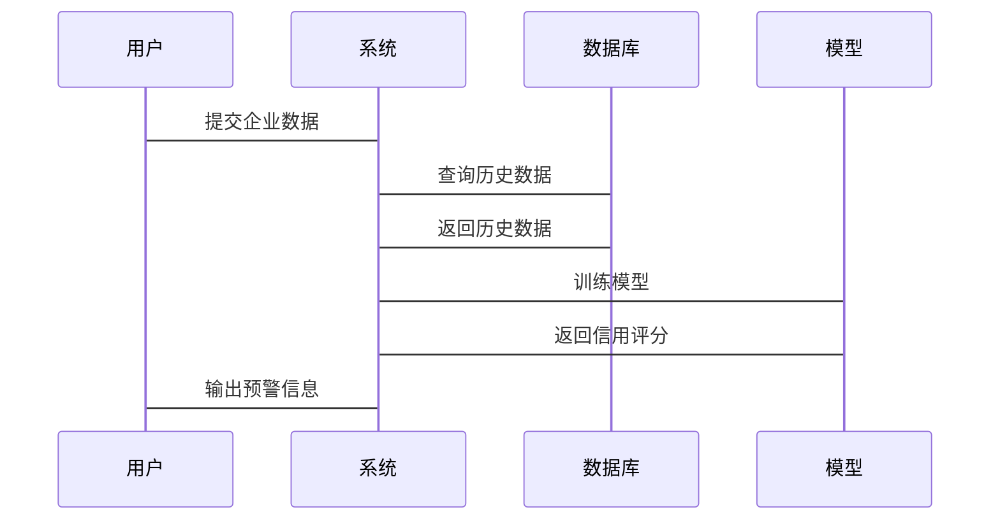

                 


# AI辅助的企业信用评级预警

**关键词**：企业信用评级、人工智能、信用预警、机器学习、风险评估

**摘要**：本文探讨了人工智能在企业信用评级预警中的应用，分析了传统信用评级的局限性，介绍了基于AI的信用评级预警系统的原理、算法、系统架构及实际案例，为企业信用风险管理提供了新的思路和解决方案。

---

# 第一部分：企业信用评级预警的背景与概念

## 第1章：企业信用评级预警概述

### 1.1 企业信用评级的基本概念

#### 1.1.1 企业信用评级的定义
企业信用评级是通过对企业的财务状况、经营能力、市场表现等多方面因素进行综合评估，确定其信用等级的过程。信用等级反映了企业在偿还债务方面的可靠性和能力。

#### 1.1.2 信用评级的核心要素
- **财务状况**：包括资产负债表、利润表、现金流量表等财务数据。
- **经营能力**：如销售收入增长率、净利润率、研发投入占比等。
- **市场表现**：如行业地位、市场份额、品牌价值等。
- **管理团队**：包括管理层的稳定性、经验及能力。

#### 1.1.3 信用评级的分类与标准
信用评级通常分为内部评级和外部评级。外部评级由专业的评级机构（如穆迪、标普）进行，评级结果以字母或数字表示，如AAA、BBB等。

---

### 1.2 企业信用评级预警的必要性

#### 1.2.1 企业信用风险的来源
- **财务风险**：企业财务状况恶化，如资产负债率过高、现金流断裂。
- **经营风险**：市场需求变化、竞争加剧导致企业经营困难。
- **管理风险**：管理团队决策失误或内部腐败。
- **外部风险**：政策变化、经济波动对企业的影响。

#### 1.2.2 传统信用评级的局限性
- **数据依赖性**：传统评级主要依赖财务数据，忽视非结构化数据（如新闻、社交媒体）。
- **主观性**：评级结果受到评级机构主观判断的影响。
- **滞后性**：传统评级周期长，难以及时反映企业动态变化。

#### 1.2.3 信用预警对企业经营的重要性
及时发现潜在信用风险，可以帮助企业提前采取措施，如调整融资策略、优化经营结构，从而避免或降低损失。

---

### 1.3 AI技术在信用评级中的应用前景

#### 1.3.1 AI技术如何提升信用评级的准确性
AI技术可以通过机器学习算法（如逻辑回归、随机森林）对海量数据进行分析，发现传统方法难以察觉的规律和风险点。

#### 1.3.2 基于AI的信用预警系统的潜在价值
- **实时监控**：通过实时数据分析，快速识别企业信用风险。
- **精准预测**：利用AI模型预测企业的违约概率。
- **降低成本**：自动化数据处理和分析，减少人工成本。

#### 1.3.3 企业信用评级AI化的发展趋势
随着大数据和AI技术的快速发展，企业信用评级将更加依赖AI技术，实现智能化、自动化和实时化。

---

## 1.4 本章小结
本章介绍了企业信用评级的基本概念、必要性以及AI技术的应用前景，为后续内容奠定了基础。

---

# 第二部分：AI辅助企业信用评级的核心概念与原理

## 第2章：企业信用评级的核心概念与联系

### 2.1 企业信用评级的原理

#### 2.1.1 信用评级的基本流程
1. 数据收集：获取企业的财务数据、经营数据、市场数据等。
2. 数据清洗：处理缺失值、异常值等。
3. 特征提取：从数据中提取有用的特征（如财务比率、行业指标）。
4. 模型构建：基于特征构建信用评级模型。
5. 评级输出：根据模型结果输出信用等级。

#### 2.1.2 信用评级的关键指标
- **短期偿债能力**：如速动比率、流动比率。
- **长期偿债能力**：如资产负债率、利息覆盖倍数。
- **经营效率**：如应收账款周转率、存货周转率。

#### 2.1.3 信用评级的模型构建
常用的信用评级模型包括：
- **线性概率模型**：假设信用等级与违约概率呈线性关系。
- **Logit模型**：基于逻辑回归的信用评级模型。
- **神经网络模型**：通过多层神经网络捕捉复杂的非线性关系。

---

### 2.2 AI技术在信用评级中的应用原理

#### 2.2.1 机器学习在信用评级中的应用
- **监督学习**：基于标记数据训练模型，预测企业的信用等级。
- **无监督学习**：通过聚类分析发现潜在的风险群体。
- **半监督学习**：结合少量标记数据和大量无标记数据进行学习。

#### 2.2.2 自然语言处理在信用报告分析中的应用
NLP技术可以帮助分析企业的新闻报道、财务报告等文本数据，提取关键词和情感倾向，辅助信用评级。

#### 2.2.3 图神经网络在企业关系网络中的应用
通过图神经网络分析企业之间的关联关系（如供应链、关联交易），评估企业信用风险。

---

### 2.3 核心概念的ER实体关系图

```mermaid
er
actor: 企业, 金融机构
entity: 企业信用信息, 企业关系网络, 信用评分
```

---

### 2.4 核心概念对比分析

#### 2.4.1 传统信用评级与AI辅助评级的对比

| 对比维度        | 传统评级              | AI辅助评级           |
|-----------------|-----------------------|----------------------|
| 数据来源        | 主要依赖财务数据      | 结合财务、文本、图数据 |
| 模型复杂度      | 简单，基于经验判断    | 复杂，基于机器学习   |
| 预测能力        | 精度低，滞后性明显    | 精度高，实时性更强    |

#### 2.4.2 不同AI模型在信用评级中的表现对比

| 模型类型        | 优点                       | 缺点                       |
|-----------------|----------------------------|---------------------------|
| 逻辑回归        | 简单易解释                 | 鲁棒性差，适合线性关系     |
| 随机森林        | 高精度，抗过拟合           | 难以解释具体决策逻辑       |
| 神经网络        | 能捕捉复杂非线性关系       | 需要大量数据，计算资源消耗大 |

#### 2.4.3 企业信用信息的特征对比

| 特征类型        | 财务特征                 | 经营特征                 | 市场特征                 |
|-----------------|--------------------------|--------------------------|--------------------------|
| 示例             | 资产负债率               | 销售增长率               | 市场份额                 |

---

## 2.5 本章小结
本章详细介绍了企业信用评级的核心概念和AI技术的应用原理，通过对比分析帮助读者理解AI在信用评级中的优势。

---

# 第三部分：基于AI的信用评级预警算法原理

## 第3章：常见AI算法在信用评级中的应用

### 3.1 逻辑回归算法

#### 3.1.1 逻辑回归的基本原理
逻辑回归是一种常用的分类算法，适用于二分类问题。其核心思想是通过sigmoid函数将线性回归的结果映射到0到1之间，表示概率。

$$ P(Y=1|X) = \frac{e^{\beta X}}{1 + e^{\beta X}} $$

#### 3.1.2 逻辑回归在信用评级中的应用
将企业的特征数据输入逻辑回归模型，输出企业的违约概率。

#### 3.1.3 逻辑回归的优缺点
- **优点**：简单易实现，结果可解释。
- **缺点**：假设变量间存在线性关系，可能无法捕捉复杂关系。

---

### 3.2 随机森林算法

#### 3.2.1 随机森林的基本原理
随机森林是一种基于决策树的集成算法，通过随机采样和特征选择生成多个决策树，并通过投票或平均的方式得到最终结果。

#### 3.2.2 随机森林在信用评级中的应用
随机森林可以处理高维数据，并且能够捕捉非线性关系。

#### 3.2.3 随机森林的优缺点
- **优点**：高精度，抗过拟合。
- **缺点**：解释性较差。

---

### 3.3 支持向量机算法

#### 3.3.1 支持向量机的基本原理
支持向量机是一种常用的分类算法，通过找到一个超平面将数据分成两类。对于非线性问题，可以使用核函数将数据映射到高维空间。

#### 3.3.2 支持向量机在信用评级中的应用
适用于小样本数据集的分类问题。

#### 3.3.3 支持向量机的优缺点
- **优点**：高精度，适合小样本。
- **缺点**：计算复杂度高。

---

### 3.4 神经网络算法

#### 3.4.1 神经网络的基本原理
神经网络通过多层神经元模拟人脑的工作方式，能够捕捉复杂的非线性关系。

#### 3.4.2 神经网络在信用评级中的应用
适用于复杂的信用评级问题，如多分类任务。

#### 3.4.3 神经网络的优缺点
- **优点**：能够捕捉复杂关系，适合大数据场景。
- **缺点**：需要大量数据，计算资源消耗大。

---

## 3.5 基于逻辑回归的信用评级模型实现

### 3.5.1 数据准备
```python
import pandas as pd
data = pd.read_csv('enterprise_credit.csv')
```

### 3.5.2 数据清洗
```python
# 处理缺失值
data = data.dropna()
```

### 3.5.3 特征提取
```python
# 提取财务特征
financial_features = ['revenue', 'net_profit', 'debt_ratio']
data_features = data[financial_features]
```

### 3.5.4 模型训练
```python
from sklearn.linear_model import LogisticRegression
model = LogisticRegression()
model.fit(data_features, data['label'])
```

### 3.5.5 模型评估
```python
from sklearn.metrics import accuracy_score
print(accuracy_score(model.predict(data_features), data['label']))
```

---

## 3.6 本章小结
本章详细介绍了几种常用的AI算法在信用评级中的应用，并通过逻辑回归算法的实现展示了模型构建的流程。

---

# 第四部分：系统分析与架构设计方案

## 第4章：系统分析与架构设计方案

### 4.1 问题场景介绍
企业信用评级预警系统需要实时监控企业的信用状况，及时发现潜在风险。

### 4.2 系统功能设计

#### 4.2.1 领域模型


#### 4.2.2 系统架构设计


#### 4.2.3 系统接口设计
- **输入接口**：接收企业的财务数据和市场数据。
- **输出接口**：输出信用评分和预警信息。

### 4.3 系统交互设计


---

## 4.4 本章小结
本章详细介绍了企业信用评级预警系统的功能设计和架构设计，为后续的实现提供了指导。

---

# 第五部分：项目实战

## 第5章：项目实战

### 5.1 环境安装

#### 5.1.1 安装Python环境
```bash
pip install python3
```

#### 5.1.2 安装依赖库
```bash
pip install numpy pandas scikit-learn
```

### 5.2 数据收集与预处理

#### 5.2.1 数据收集
```python
import pandas as pd
data = pd.read_csv('enterprise_credit.csv')
```

#### 5.2.2 数据清洗
```python
data = data.dropna()
```

### 5.3 特征工程

#### 5.3.1 特征选择
```python
financial_features = ['revenue', 'net_profit', 'debt_ratio']
data_features = data[financial_features]
```

#### 5.3.2 数据标准化
```python
from sklearn.preprocessing import StandardScaler
scaler = StandardScaler()
data_features = scaler.fit_transform(data_features)
```

### 5.4 模型训练

#### 5.4.1 训练逻辑回归模型
```python
from sklearn.linear_model import LogisticRegression
model = LogisticRegression()
model.fit(data_features, data['label'])
```

#### 5.4.2 模型评估
```python
from sklearn.metrics import accuracy_score
print(accuracy_score(model.predict(data_features), data['label']))
```

### 5.5 系统部署与测试

#### 5.5.1 系统部署
将模型部署到云服务器，提供API接口供其他系统调用。

#### 5.5.2 系统测试
```python
print(model.predict([[200, 50, 0.5]]))
```

---

## 5.6 本章小结
本章通过一个实际案例展示了企业信用评级预警系统的实现过程，从环境安装到模型部署，帮助读者掌握整个流程。

---

# 第六部分：最佳实践与总结

## 第6章：最佳实践

### 6.1 小结
- AI技术能够显著提升企业信用评级的准确性和实时性。
- 不同的AI算法适用于不同的场景，需要根据实际需求选择合适的模型。

### 6.2 注意事项
- 数据质量是模型性能的关键，需要确保数据的完整性和准确性。
- 模型需要定期更新，以适应市场变化和企业动态。

### 6.3 拓展阅读
- 《机器学习实战》
- 《深度学习》

---

# 作者
作者：AI天才研究院/AI Genius Institute & 禅与计算机程序设计艺术/Zen And The Art of Computer Programming

