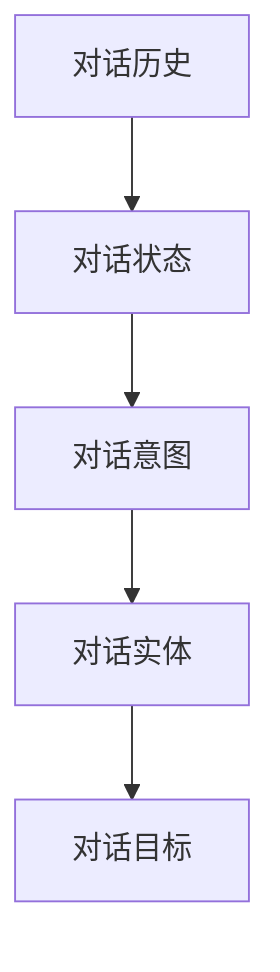
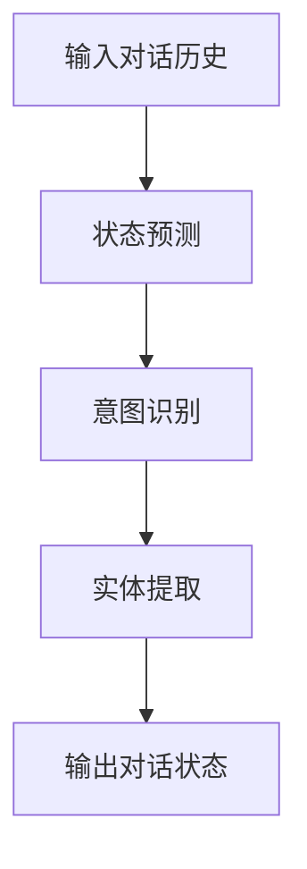
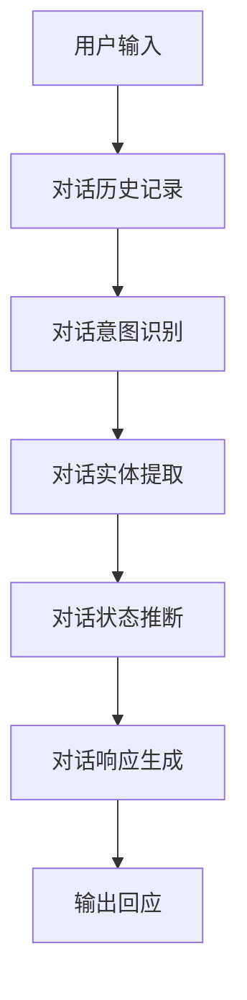
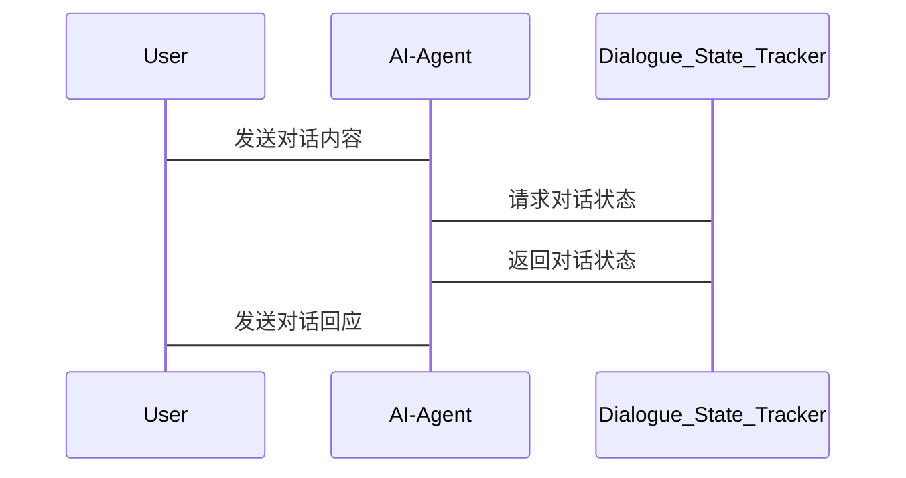

                 


# LLM支持的AI Agent对话状态跟踪

## 关键词：LLM，AI Agent，对话状态跟踪，HMM，DST

## 摘要：  
本文深入探讨了大语言模型（LLM）支持的AI Agent对话状态跟踪的核心原理、算法实现及系统架构。通过分析对话状态跟踪的定义、分类及其实现方法，结合HMM和DST算法，详细阐述了LLM在对话状态跟踪中的应用，并通过实际案例展示了系统的实现与优化。本文旨在为开发者和研究人员提供全面的技术指导，帮助他们更好地理解和应用LLM支持的AI Agent对话状态跟踪技术。

---

# 第1章: 问题背景与核心概念

## 1.1 问题背景

### 1.1.1 对话状态跟踪的定义  
对话状态跟踪（Dialogue State Tracking，DST）是自然语言处理中的一个关键任务，旨在通过分析对话历史，推断当前对话的状态，包括对话意图、实体信息和上下文等。它是实现智能对话系统的基础，能够帮助AI Agent理解对话进展并做出合理的回应。

### 1.1.2 LLM在对话状态跟踪中的作用  
大语言模型（LLM）通过其强大的语言理解和生成能力，为对话状态跟踪提供了新的可能性。LLM可以自动提取对话中的关键信息，并结合上下文推断对话的状态，从而提高对话系统的智能化水平。

### 1.1.3 当前技术的局限性与挑战  
尽管LLM在对话状态跟踪中表现出色，但仍然面临一些挑战，例如对话历史的复杂性、多意图识别的困难以及模型的可解释性问题。这些挑战需要我们在技术实现中加以优化。

## 1.2 核心概念与问题描述

### 1.2.1 对话状态跟踪的定义与分类  
对话状态跟踪可以分为基于规则的方法、基于统计的方法和基于模型的方法。其中，基于模型的方法（如HMM和DST）利用LLM的强大能力，能够更准确地推断对话状态。

### 1.2.2 LLM支持的AI Agent的特点  
LLM支持的AI Agent具有以下特点：  
1. 自然语言理解能力强，能够处理复杂的对话场景。  
2. 实时更新对话状态，保持对话的连贯性。  
3. 支持多轮对话，能够根据对话历史动态调整响应策略。

### 1.2.3 对话状态跟踪的核心问题与边界  
对话状态跟踪的核心问题是如何准确地识别对话意图和提取对话实体。其边界包括对话历史的长度、对话上下文的深度以及对话目标的明确性。

## 1.3 问题解决与技术路线

### 1.3.1 对话状态跟踪的目标与方法  
对话状态跟踪的目标是通过分析对话历史，推断当前对话的状态，从而帮助AI Agent生成合适的回应。常用方法包括基于规则的匹配、统计模型和深度学习模型。

### 1.3.2 LLM在对话状态跟踪中的应用  
LLM通过其强大的语义理解能力，能够自动提取对话中的关键信息，并结合上下文推断对话的状态。例如，可以利用LLM生成对话历史的语义表示，并将其输入到DST模型中进行状态跟踪。

### 1.3.3 技术路线与实现框架  
技术路线包括以下几个步骤：  
1. 收集对话历史数据。  
2. 利用LLM提取对话意图和实体信息。  
3. 基于DST算法推断对话状态。  
4. 输出对话状态并反馈给AI Agent。

## 1.4 本章小结  
本章介绍了对话状态跟踪的定义、核心概念和实现方法，并分析了LLM在对话状态跟踪中的作用和挑战。接下来，我们将深入探讨对话状态跟踪的核心原理和算法实现。

---

# 第2章: 对话状态跟踪的核心概念与联系

## 2.1 对话状态跟踪的原理

### 2.1.1 对话历史的特征提取  
对话历史的特征提取是对话状态跟踪的关键步骤。通过分析对话历史中的关键词、句式和语义信息，可以提取出对话的意图和实体信息。

### 2.1.2 状态表示的方法  
状态表示是对话状态跟踪的核心，常用的表示方法包括向量表示和符号表示。向量表示能够更好地捕捉语义信息，而符号表示则更易于理解和处理。

### 2.1.3 状态更新的机制  
状态更新是对话状态跟踪的核心机制。通过不断更新对话状态，AI Agent能够保持对对话进展的准确理解。

## 2.2 对话状态跟踪与任务规划的关系

### 2.2.1 对话状态对任务规划的影响  
对话状态直接影响任务规划。例如，如果对话状态表明用户需要预订机票，任务规划系统将根据对话状态生成相应的机票预订流程。

### 2.2.2 任务规划对对话状态的反馈  
任务规划的反馈会进一步优化对话状态跟踪。通过分析任务规划的结果，可以动态调整对话状态，以更好地满足用户需求。

### 2.2.3 两者的协同优化  
对话状态跟踪与任务规划的协同优化能够提高对话系统的整体性能。例如，通过结合对话状态和任务规划的结果，可以实现更智能的对话管理和任务执行。

## 2.3 核心概念的属性对比

### 2.3.1 对话状态与对话历史的对比  
对话状态是对对话历史的总结，而对话历史是对话状态的来源。对话状态关注的是当前对话的核心信息，而对话历史则是对话的详细记录。

### 2.3.2 对话意图与对话实体的对比  
对话意图是指用户通过对话想要达到的目标，而对话实体是指对话中涉及的具体信息。例如，在预订机票的对话中，意图是“预订机票”，实体是“日期”、“地点”等。

### 2.3.3 对话上下文与对话目标的对比  
对话上下文是指当前对话的背景信息，而对话目标是指用户通过对话想要实现的具体目标。对话上下文影响对话状态的推断，而对话目标则是对话状态的核心内容。

## 2.4 ER实体关系图



## 2.5 本章小结  
本章通过对比分析对话状态跟踪的核心概念，展示了对话状态跟踪与任务规划的协同关系。接下来，我们将深入探讨对话状态跟踪的算法原理。

---

# 第3章: 对话状态跟踪的算法原理

## 3.1 算法原理概述

### 3.1.1 基于规则的对话状态跟踪  
基于规则的对话状态跟踪通过预定义的规则匹配对话内容，推断对话状态。这种方法简单易实现，但在复杂对话场景中表现有限。

### 3.1.2 基于统计的对话状态跟踪  
基于统计的对话状态跟踪利用统计模型（如马尔可夫模型）推断对话状态。这种方法能够捕捉对话的动态变化，但需要大量训练数据。

### 3.1.3 基于LLM的对话状态跟踪  
基于LLM的对话状态跟踪利用大语言模型的强大能力，自动提取对话信息并推断对话状态。这种方法具有较高的准确性和可扩展性。

## 3.2 基于HMM的对话状态跟踪算法

### 3.2.1 隐马尔可夫模型的基本原理  
隐马尔可夫模型（HMM）是一种常用的统计模型，通过状态转移和观测概率推断隐藏状态。在对话状态跟踪中，HMM可以用来建模对话状态的动态变化。

### 3.2.2 对话状态跟踪的HMM建模  
在对话状态跟踪中，HMM的观测是对话内容，隐藏状态是对话状态。通过训练HMM模型，可以实现对话状态的自动推断。

### 3.2.3 算法实现与优化  
HMM的实现包括状态转移矩阵和观测概率矩阵的训练。优化方法包括参数初始化、训练数据增强和模型剪枝。

## 3.3 基于DST的对话状态跟踪算法

### 3.3.1 DST算法的基本原理  
DST（Dialogue State Tracking）算法通过分析对话内容，推断对话状态。DST的核心是通过对话历史和当前对话内容，推断对话意图和实体信息。

### 3.3.2 LLM在DST中的应用  
LLM通过生成对话内容的语义表示，帮助DST算法更准确地推断对话状态。例如，可以利用LLM生成对话内容的向量表示，作为DST的输入。

### 3.3.3 算法流程图



## 3.4 数学模型与公式

### 3.4.1 HMM模型的概率公式  
$$ P(y_t | y_{t-1}) $$  
其中，$y_t$表示当前状态，$y_{t-1}$表示前一状态。

### 3.4.2 DST算法的条件概率公式  
$$ P(s_t | s_{t-1}, u_t) $$  
其中，$s_t$表示当前状态，$s_{t-1}$表示前一状态，$u_t$表示当前对话内容。

## 3.5 举例说明与实现

### 3.5.1 示例对话场景  
用户：“我需要预订一张从北京到上海的机票。”  
AI Agent：“请提供您的出发日期。”  
用户：“出发日期是2023年10月1日。”  
AI Agent：“机票已经预订成功。”

### 3.5.2 算法实现步骤  
1. 收集对话历史数据。  
2. 利用LLM提取对话意图和实体信息。  
3. 基于HMM或DST算法推断对话状态。  
4. 输出对话状态并反馈给AI Agent。

### 3.5.3 实现代码示例  

```python
# 示例代码：基于LLM的对话状态跟踪
def track_dialogue_state(dialogue_history):
    # 利用LLM提取对话意图和实体
    intent, entities = llm.generate_intent_entities(dialogue_history)
    # 推断对话状态
    state = infer_state(intent, entities)
    return state
```

## 3.6 本章小结  
本章详细介绍了对话状态跟踪的算法原理，包括HMM和DST算法的实现方法。接下来，我们将探讨对话状态跟踪的系统架构设计和项目实现。

---

# 第4章: 对话状态跟踪的系统架构设计

## 4.1 系统功能设计

### 4.1.1 对话历史记录与存储  
系统需要记录和存储对话历史，以便后续分析和处理。

### 4.1.2 对话意图识别  
通过NLP技术，识别对话中的意图信息。

### 4.1.3 对话实体提取  
通过NLP技术，提取对话中的实体信息。

### 4.1.4 对话状态推断  
基于对话意图和实体信息，推断对话状态。

## 4.2 系统架构设计



## 4.3 系统接口设计

### 4.3.1 对话历史接口  
对话历史接口用于获取对话历史数据。

### 4.3.2 对话意图识别接口  
意图识别接口返回对话意图。

### 4.3.3 对话实体提取接口  
实体提取接口返回对话实体。

### 4.3.4 对话状态推断接口  
状态推断接口返回对话状态。

## 4.4 系统交互设计



## 4.5 本章小结  
本章通过系统架构设计，展示了对话状态跟踪在实际应用中的实现方式。接下来，我们将通过项目实战，详细展示对话状态跟踪的具体实现过程。

---

# 第5章: 对话状态跟踪的项目实战

## 5.1 项目环境安装

### 5.1.1 安装Python环境  
确保Python环境已安装，推荐使用Python 3.8或更高版本。

### 5.1.2 安装依赖库  
安装必要的依赖库，例如：`transformers`, `numpy`, `scikit-learn`。

## 5.2 系统核心实现

### 5.2.1 对话历史记录与存储  
实现对话历史的记录和存储功能。

### 5.2.2 对话意图识别  
利用NLP库实现对话意图识别。

### 5.2.3 对话实体提取  
利用NLP库实现对话实体提取。

### 5.2.4 对话状态推断  
基于HMM或DST算法推断对话状态。

## 5.3 代码实现与解读

### 5.3.1 对话状态跟踪主程序  
```python
# 主程序代码
from transformers import pipeline
import numpy as np

# 初始化LLM模型
llm = pipeline("text-classification", model="bert-base")

# 对话状态跟踪函数
def track_state(dialogue_history):
    intent = llm(Dialogue_classification)(dialogue_history)
    entities = extract_entities(dialogue_history)
    state = infer_state(intent, entities)
    return state

# 实现对话状态推断
def infer_state(intent, entities):
    return {"intent": intent, "entities": entities}
```

### 5.3.2 对话意图识别与实体提取  
```python
# 对话意图识别函数
def get_intent(text):
    return llm(Dialogue_classification)(text)

# 实体提取函数
def extract_entities(text):
    return entity_extractor(text)
```

## 5.4 项目小结  
本章通过具体的代码实现，展示了对话状态跟踪的实现过程。对话状态跟踪的核心是准确识别对话意图和提取对话实体，这需要结合LLM和NLP技术实现。

---

# 第6章: 对话状态跟踪的最佳实践

## 6.1 小结与总结

### 6.1.1 对话状态跟踪的核心总结  
对话状态跟踪是实现智能对话系统的关键技术，通过分析对话历史，推断对话意图和实体信息，从而实现对话状态的准确跟踪。

### 6.1.2 LLM在对话状态跟踪中的重要性  
LLM通过强大的语义理解和生成能力，为对话状态跟踪提供了新的技术手段，显著提高了对话系统的智能化水平。

## 6.2 注意事项与建议

### 6.2.1 对话历史的长度控制  
对话历史的长度会影响对话状态的准确性，建议控制在合理的范围内。

### 6.2.2 对话意图的多样性处理  
针对多样化的对话意图，建议采用多模型融合的方法，提高意图识别的准确率。

### 6.2.3 对话实体的准确性优化  
通过优化实体提取算法，提高对话实体的准确性，从而提高对话状态跟踪的效果。

## 6.3 拓展阅读与推荐

### 6.3.1 推荐论文  
1. "A survey on dialogue state tracking"  
2. "Neural dialogue state tracking with attention-based models"

### 6.3.2 推荐书籍  
1. 《对话系统与自然语言处理》  
2. 《大语言模型与对话系统》

## 6.4 本章小结  
本章总结了对话状态跟踪的核心内容，并提出了实际应用中的注意事项和建议。对话状态跟踪是实现智能对话系统的关键技术，未来的研究方向将集中在模型优化和应用创新上。

---

# 作者：AI天才研究院/AI Genius Institute & 禅与计算机程序设计艺术 /Zen And The Art of Computer Programming

