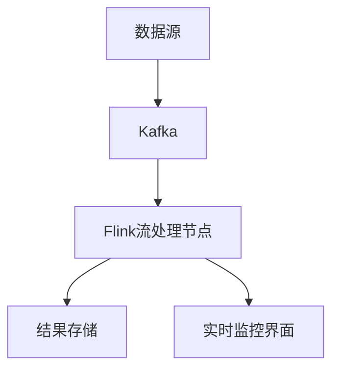

                 


# 企业AI Agent的实时数据流处理与分析架构

## 关键词：企业AI Agent、实时数据流、流数据处理、分布式系统、Flink、机器学习

## 摘要：  
本文深入探讨了企业AI Agent在实时数据流处理与分析中的架构设计与实现方法。通过分析实时数据流处理的核心算法、系统架构以及实际应用场景，本文为企业AI Agent的实时数据流处理提供了全面的技术解析和实践指导。文章内容涵盖流数据处理的基本原理、分布式流处理框架的选择与实现、系统架构设计以及项目实战案例，旨在帮助读者理解并掌握企业级AI Agent在实时数据流处理中的应用。

---

# 第1章: AI Agent与实时数据流处理概述

## 1.1 AI Agent的基本概念

### 1.1.1 什么是AI Agent
AI Agent（人工智能代理）是一种能够感知环境、自主决策并执行任务的智能实体。它通过接收输入数据、分析信息、做出决策并输出结果，能够在各种场景中实现自动化操作。

### 1.1.2 AI Agent的核心特征
- **自主性**：无需外部干预，自主完成任务。
- **反应性**：能够实时感知环境变化并做出响应。
- **目标导向**：基于目标驱动行为。
- **学习能力**：通过数据和经验不断优化性能。

### 1.1.3 企业级AI Agent的应用场景
- **金融行业**：实时监控交易数据，防范欺诈行为。
- **制造业**：实时分析生产线数据，优化生产流程。
- **零售行业**：实时分析客户行为数据，提升用户体验。
- **医疗行业**：实时分析患者数据，辅助诊断决策。

## 1.2 实时数据流处理的背景与意义

### 1.2.1 数据流处理的基本概念
数据流处理是指对实时生成的连续数据流进行采集、分析和处理的过程。其核心目标是快速响应数据变化，提供实时洞察。

### 1.2.2 实时数据流处理的重要性
- **快速响应**：实时处理数据能够迅速做出决策，提升企业竞争力。
- **数据价值**：实时数据能够捕捉瞬时变化，为企业提供更精准的决策依据。
- **系统稳定性**：实时处理能够及时发现并解决系统异常，保障系统稳定运行。

### 1.2.3 企业AI Agent中的数据流处理需求
- **高效性**：需要在极短时间内完成数据处理。
- **准确性**：确保数据处理结果的准确性。
- **可扩展性**：支持大规模数据流的处理。

---

# 第2章: 企业AI Agent的实时数据流处理架构

## 2.1 数据流处理的总体架构

### 2.1.1 数据流处理的分层架构
- **数据采集层**：负责采集实时数据流。
- **数据预处理层**：对数据进行清洗、转换和标准化处理。
- **数据分析层**：对数据进行实时分析和处理。
- **结果反馈层**：将处理结果反馈给系统或用户。

### 2.1.2 企业AI Agent的架构特点
- **分布式架构**：支持大规模数据流的并行处理。
- **高可用性**：系统能够在部分节点故障时仍能正常运行。
- **可扩展性**：能够根据数据量的增加动态扩展计算资源。

### 2.1.3 数据流处理的流程概述
1. 数据采集：通过传感器、API或其他数据源实时获取数据。
2. 数据预处理：对数据进行清洗、去重和标准化处理。
3. 数据分析：使用流处理算法对数据进行实时分析。
4. 结果反馈：将处理结果传递给下游系统或用户。

---

# 第3章: 流数据处理算法原理

## 3.1 流数据处理的基本算法

### 3.1.1 基于滑动窗口的流数据处理
滑动窗口是一种常用的流数据处理方法，用于在有限时间范围内对数据进行分析。窗口大小可以根据需求动态调整。

#### 代码示例：滑动窗口实现
```python
from datetime import datetime, timedelta

class SlidingWindow:
    def __init__(self, window_size=60):
        self.window_size = window_size
        self.data = []
    
    def add(self, timestamp, value):
        current_time = datetime.now()
        if timestamp > current_time - timedelta(seconds=self.window_size):
            self.data.append(value)
        else:
            pass
    
    def get_average(self):
        return sum(self.data) / len(self.data) if self.data else 0
```

### 3.1.2 基于事件时间的流数据处理
事件时间是指数据生成的时间，而不是数据到达处理系统的时间。基于事件时间的处理能够更准确地反映数据生成的时序关系。

#### 代码示例：事件时间处理
```python
from pydantic import BaseModel
import pandas as pd

class Event(BaseModel):
    timestamp: int
    value: float

def process_events(events):
    df = pd.DataFrame([e.dict() for e in events])
    df['timestamp'] = pd.to_datetime(df['timestamp'])
    df.set_index('timestamp', inplace=True)
    return df.resample('1T').mean()
```

### 3.1.3 基于时间戳的流数据处理
时间戳是一种精确标记时间的方法，常用于分布式系统中。基于时间戳的处理可以确保数据的时序一致性。

---

# 第4章: 分布式流数据处理框架

## 4.1 Flink流处理框架

### 4.1.1 Flink的核心特点
- **事件时间与处理时间**：支持基于事件时间和处理时间的流数据处理。
- **窗口机制**：支持多种窗口类型，如滚动窗口、滑动窗口和会话窗口。
- **检查点机制**：用于保证数据处理的容错性。

#### 代码示例：Flink流处理
```python
from pyflink.datastream import StreamExecutionEnvironment
from pyflink.table import *

env = StreamExecutionEnvironment.get_execution_environment()
env.set_parallelism(4)

t_env = TableEnvironment.create(env)

# 定义输入数据源
source = t_env.from_path("input.txt", "string")

# 定义数据处理逻辑
t = source.select("s.value")
t = t.window(TumblingWindow(5, 5), "s.value")
t = t.select("s.value")

# 注册表
t.execute_insert("output.txt").print()
```

### 4.1.2 Flink的窗口机制
Flink提供了多种窗口类型，适用于不同的实时数据处理场景。

#### 代码示例：Flink窗口实现
```python
from pyflink.datastream import TimeWindow

# 滑动窗口处理
t = source.select("s.value")
t = t.window(TimeWindow.of(5, 2), "s.value")
t = t.select("s.value")

# 会话窗口处理
t = source.select("s.value")
t = t.window(TimeWindow.session_gap(10), "s.value")
t = t.select("s.value")
```

---

# 第5章: 系统分析与架构设计方案

## 5.1 项目背景与目标

### 5.1.1 项目背景
在企业级AI Agent的应用中，实时数据流处理是核心功能之一。本文以一个实时股票交易监控系统为例，详细阐述系统的架构设计与实现过程。

### 5.1.2 项目目标
- 实现实时股票数据的采集与处理。
- 实现交易数据的实时分析与异常检测。
- 提供实时监控界面，展示交易数据的处理结果。

## 5.2 系统功能设计

### 5.2.1 数据采集模块
- **功能描述**：实时采集股票市场的交易数据。
- **技术选型**：使用Kafka作为数据源，通过Kafka消费者实现数据采集。

#### 代码示例：Kafka消费者实现
```python
from kafka import KafkaConsumer

consumer = KafkaConsumer('stock_trades', bootstrap_servers='localhost:9092')
for message in consumer:
    print(f"收到消息：{message.value}")
```

### 5.2.2 数据预处理模块
- **功能描述**：对采集到的交易数据进行清洗和标准化处理。
- **技术选型**：使用Flux或RxJava进行异步数据处理。

#### 代码示例：数据预处理实现
```python
import rx
from rx import Observable

# 创建一个异步数据流
source = Observable.from_iterable(consumer)

# 对数据流进行映射处理
source.map(lambda x: {'symbol': x['symbol'], 'price': x['price']}).subscribe(
    on_next=lambda x: print(f"处理后的数据：{x}"),
    on_error=lambda e: print(f"处理错误：{e}"),
    on_completed=lambda: print("处理完成")
)
```

## 5.3 系统架构设计

### 5.3.1 系统架构图


### 5.3.2 系统交互流程
1. 数据源（如Kafka）接收实时股票交易数据。
2. Flink流处理节点对数据进行实时分析。
3. 处理结果存储到数据库或实时监控界面展示。

---

# 第6章: 项目实战与案例分析

## 6.1 项目环境安装

### 6.1.1 安装Flink
```bash
# 下载并安装Flink
wget https://mirror.foobar.com/apache/flink/flink-1.12/flink-1.12-bin-scala_2.12.tgz
tar -xzvf flink-1.12-bin-scala_2.12.tgz
```

### 6.1.2 安装Kafka
```bash
# 下载并安装Kafka
wget https://mirror.foobar.com/apache/kafka/2.8.0/kafka_2.13-2.8.0.tgz
tar -xzvf kafka_2.13-2.8.0.tgz
```

## 6.2 系统核心实现

### 6.2.1 Flink流处理代码
```python
from pyflink.datastream import StreamExecutionEnvironment
from pyflink.table import *

env = StreamExecutionEnvironment.get_execution_environment()
env.set_parallelism(4)

t_env = TableEnvironment.create(env)

# 定义输入数据源
source = t_env.from_path("input.txt", "string")

# 定义数据处理逻辑
t = source.select("s.value")
t = t.window(TumblingWindow(5, 5), "s.value")
t = t.select("s.value")

# 注册表
t.execute_insert("output.txt").print()
```

### 6.2.2 实时监控界面实现
```python
import rx
from rx import Observable
from flask import Flask

app = Flask(__name__)

@app.route('/realtime')
def realtime():
    # 获取实时数据
    data = get_realtime_data()
    return f"实时数据：{data}"

if __name__ == '__main__':
    app.run(debug=True)
```

## 6.3 案例分析与总结

### 6.3.1 案例分析
以实时股票交易监控为例，详细分析系统的数据流处理过程和结果展示。

### 6.3.2 项目小结
通过本项目，我们实现了企业AI Agent在实时数据流处理中的核心功能，验证了架构设计的可行性和有效性。

---

# 第7章: 总结与展望

## 7.1 总结
本文详细探讨了企业AI Agent在实时数据流处理中的架构设计与实现方法。通过分析流数据处理的核心算法、系统架构以及实际应用场景，本文为企业AI Agent的实时数据流处理提供了全面的技术解析和实践指导。

## 7.2 展望
随着AI技术的不断发展，企业AI Agent的实时数据流处理将更加智能化和高效化。未来的研究方向包括：
- 更高效的流数据处理算法。
- 更智能的实时数据分析方法。
- 更强大的分布式流处理框架。

---

# 作者：AI天才研究院/AI Genius Institute & 禅与计算机程序设计艺术 /Zen And The Art of Computer Programming

