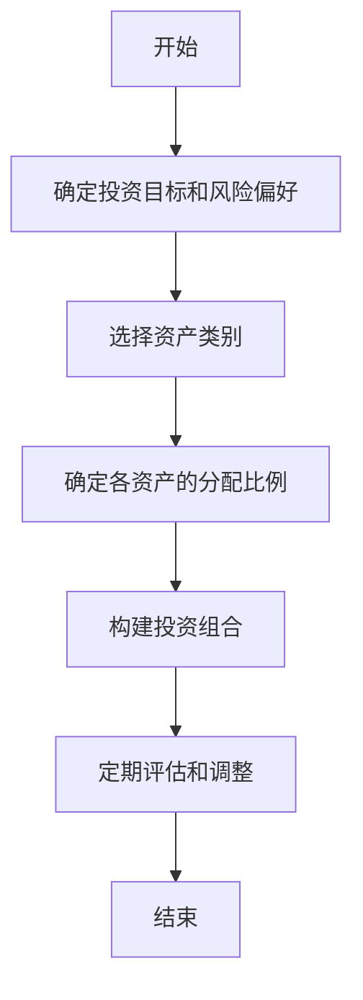

                 


# 大卫·斯文森的机构投资者长期价值创造

> 关键词：机构投资者，长期价值，大卫·斯文森，投资策略，价值投资

> 摘要：本文详细探讨了大卫·斯文森作为耶鲁大学首席投资官的机构投资者长期价值创造方法。通过分析其投资策略、资产配置模型和风险管理原则，揭示了如何通过长期价值投资实现稳健收益。

---

## 第一部分：机构投资者与长期价值创造的背景

### 第1章：机构投资者的基本概念

#### 1.1 机构投资者的定义与特点
- **1.1.1 机构投资者的定义**  
  机构投资者是指由法人实体或组织构成的投资者，包括养老基金、保险公司、主权财富基金、捐赠基金等。这类投资者通常拥有大量资金，通过专业化的投资管理实现资产增值。

- **1.1.2 机构投资者的主要特点**  
  - 投资规模大：机构投资者通常管理的资金规模庞大，能够对市场产生显著影响。  
  - 投资期限长：机构投资者通常追求长期收益，而非短期波动。  
  - 投资策略专业化：机构投资者依赖专业的投资团队和 sophisticated的投资策略。  
  - 风险管理严格：机构投资者注重分散风险，避免过度集中投资。

- **1.1.3 机构投资者在金融市场中的作用**  
  机构投资者是金融市场的重要参与者，通过长期投资和价值发现，稳定市场波动，促进市场健康发展。

#### 1.2 大卫·斯文森与耶鲁大学捐赠基金
- **1.2.1 大卫·斯文森的背景介绍**  
  大卫·斯文森（David F. Swensen）是耶鲁大学首席投资官，以其卓越的投资业绩和创新的投资策略闻名。他在耶鲁大学捐赠基金的投资管理中引入了长期价值投资的理念，成为机构投资领域的经典案例。

- **1.2.2 耶鲁大学捐赠基金的投资理念**  
  耶鲁大学捐赠基金的投资理念以长期价值创造为核心，注重资产配置、精选个股和长期持有。斯文森通过分散投资、低 turnover 和注重基本面分析，实现了捐赠基金的长期稳健增长。

- **1.2.3 斯文森投资法的核心思想**  
  斯文森投资法强调通过合理的资产配置和长期持有优质资产，实现稳定的超额收益。他注重控制投资成本，避免短期市场波动的干扰，专注于寻找具有持续竞争优势的企业。

### 第2章：长期价值创造的背景与意义

#### 2.1 长期价值投资的定义与特点
- **2.1.1 长期价值投资的定义**  
  长期价值投资是指投资者通过深入分析企业基本面，选择具有持续竞争优势和良好管理的公司，长期持有，以获得企业价值增长的投资方式。

- **2.1.2 长期价值投资的核心特点**  
  - 长期持有：投资者不因短期市场波动而改变投资策略，注重企业的长期价值。  
  - 深入分析：通过研究企业的财务报表、行业地位和管理层能力，选择具有竞争优势的公司。  
  - 风险控制：通过分散投资和合理的资产配置，降低投资组合的风险。

- **2.1.3 长期价值投资与短期投资的区别**  
  长期价值投资注重企业的内在价值和长期增长潜力，而短期投资则关注市场波动和短期收益。长期投资更注重风险管理，而短期投资更关注市场趋势和技术分析。

#### 2.2 机构投资者在长期价值创造中的角色
- **2.2.1 机构投资者在长期价值创造中的作用**  
  机构投资者通过长期投资和价值发现，帮助企业和市场实现长期稳定发展。他们通过专业的投资策略和风险管理，为投资者创造可持续的收益。

- **2.2.2 机构投资者如何实现长期价值创造**  
  - 通过合理的资产配置，分散投资风险，降低波动性。  
  - 通过精选个股，投资于具有持续竞争优势和良好治理的企业。  
  - 通过长期持有，避免频繁交易带来的成本和税收损失。

- **2.2.3 机构投资者对市场的长期影响**  
  机构投资者通过长期投资和价值发现，促进市场的健康发展，提高资源配置效率，降低市场波动性。

---

## 第二部分：长期价值创造的核心概念与联系

### 第3章：长期价值创造的核心概念

#### 3.1 长期价值创造的定义与构成
- **3.1.1 长期价值创造的定义**  
  长期价值创造是指通过长期投资和价值管理，实现资产的持续增值，为投资者创造超过市场平均水平的收益。

- **3.1.2 长期价值创造的核心构成**  
  - 资产配置：通过合理的资产分配，平衡风险和收益。  
  - 个股选择：通过深入分析，选择具有持续竞争优势的企业。  
  - 风险管理：通过分散投资和严格的风险控制，降低投资组合的波动性。

- **3.1.3 长期价值创造的实现路径**  
  - 制定明确的投资目标和策略。  
  - 选择具有竞争优势的企业进行投资。  
  - 长期持有，避免频繁交易。  
  - 定期评估和调整投资组合。

#### 3.2 大卫·斯文森投资法的核心要素
- **3.2.1 资产配置的核心作用**  
  资产配置是斯文森投资法的核心，通过将资金分配到不同资产类别（股票、债券、房地产等），降低投资组合的波动性，提高收益。

- **3.2.2 投资组合的构建原则**  
  斯文森的投资组合构建原则包括：分散化、低 turnover、注重基本面分析和长期持有。

- **3.2.3 风险管理的重要性**  
  风险管理是长期价值创造的关键，通过合理的资产配置和严格的风险控制，降低投资组合的波动性，保护投资者的本金安全。

### 第4章：长期价值创造与机构投资者的联系

#### 4.1 机构投资者如何实现长期价值创造
- **4.1.1 通过资产配置实现长期价值**  
  机构投资者通过合理的资产配置，平衡风险和收益，实现长期价值创造。

- **4.1.2 通过精选个股实现长期价值**  
  机构投资者通过深入分析企业基本面，选择具有持续竞争优势的个股，实现超额收益。

- **4.1.3 通过长期持有实现价值增长**  
  机构投资者通过长期持有优质资产，避免短期市场波动的影响，实现资产的长期增值。

#### 4.2 机构投资者在长期价值创造中的独特优势
- **4.2.1 资源优势**  
  机构投资者通常管理大量资金，能够获得更多的投资机会和更低的交易成本。

- **4.2.2 专业优势**  
  机构投资者拥有专业的投资团队和 sophisticated的投资策略，能够更好地识别和管理投资风险。

- **4.2.3 长期视角**  
  机构投资者能够保持长期视角，不受短期市场波动的干扰，专注于实现长期价值创造。

---

## 第三部分：长期价值创造的系统架构与实现

### 第4章：长期价值创造的系统架构设计

#### 4.1 问题场景介绍
- 投资者需要一个系统化的投资框架，实现长期价值创造，抵御短期市场波动的风险。

#### 4.2 系统功能设计
- **4.2.1 领域模型（Mermaid 类图）**  
  ```mermaid
  classDiagram
      class 投资者 {
          资产配置
          投资组合
          风险管理
      }
      class 资产配置 {
          分配比例
          资产类别
      }
      class 投资组合 {
          个股选择
          持股比例
      }
      class 风险管理 {
          风险评估
          风险控制
      }
      投资者 --> 资产配置
      投资者 --> 投资组合
      投资者 --> 风险管理
  ```

- **4.2.2 系统架构（Mermaid 架构图）**  
  ```mermaid
  architecture
      客户端
      服务器端
      数据库
      API Gateway
  ```

- **4.2.3 系统接口设计**  
  - API 接口：提供资产配置、个股选择、风险管理等功能的调用接口。  
  - 数据接口：连接外部数据源，获取实时市场数据和企业基本面信息。

- **4.2.4 系统交互（Mermaid 序列图）**  
  ```mermaid
  sequenceDiagram
      投资者 -> API Gateway: 请求资产配置建议
      API Gateway -> 资产配置模块: 获取资产配置方案
      资产配置模块 -> 数据库: 查询历史数据
      资产配置模块 -> API Gateway: 返回资产配置方案
      投资者 -> API Gateway: 请求个股分析
      API Gateway -> 个股分析模块: 获取个股报告
      个股分析模块 -> 数据库: 查询企业基本面数据
      个股分析模块 -> API Gateway: 返回个股分析结果
  ```

### 第5章：长期价值创造的算法原理

#### 5.1 资产配置模型（Mermaid 流程图）


#### 5.2 资产配置的数学模型
- **5.2.1 配置比例计算**  
  使用均值-方差优化模型，根据风险偏好和市场预期收益，确定各资产的配置比例。  
  $$ \text{Minimize} \sum_{i=1}^n w_i^2 \times \sigma_i^2 $$  
  $$ \text{Subject to} \sum_{i=1}^n w_i = 1 $$

- **5.2.2 投资组合优化**  
  使用马科维茨有效前沿模型，寻找最优资产组合，实现收益和风险的平衡。  
  $$ \text{Maximize} \sum_{i=1}^n w_i \times r_i $$  
  $$ \text{Subject to} \sum_{i=1}^n w_i = 1 $$  
  $$ \text{和} \sum_{i=1}^n w_i^2 \times \sigma_i^2 \leq \text{风险容忍度} $$

#### 5.3 个股选择算法
- **5.3.1 基于基本面分析的选股策略**  
  - 市盈率（P/E）：选择低于行业平均水平的企业。  
  - 市净率（P/B）：选择低于行业平均水平的企业。  
  - 净利润增长率：选择过去三年净利润年均增长率超过行业平均水平的企业。  

- **5.3.2 基于技术分析的选股策略**  
  - 移动平均线（MA）：选择股价站上20日均线的股票。  
  - 相对强弱指数（RSI）：选择RSI低于30的股票。  

### 第6章：长期价值创造的项目实战

#### 6.1 环境安装
- **Python 环境**  
  安装 Python 3.8 或更高版本，安装必要的库：pandas、numpy、matplotlib。

#### 6.2 核心代码实现
- **资产配置模块**  
  ```python
  import pandas as pd
  import numpy as np

  def calculate_asset_allocation(portfolio_value, risk_tolerance):
      # 假设资产类别和预期收益已知
      assets = ['股票', '债券', '现金']
      expected_returns = [0.1, 0.05, 0.01]
      cov_matrix = np.array([[0.16, 0.05, 0.01],
                             [0.05, 0.04, 0.005],
                             [0.01, 0.005, 0.001]])

      # 均值-方差优化
      n = len(assets)
      inv_cov = np.linalg.inv(cov_matrix)
      ones = np.ones(n)
      denominator = np.dot(ones.T, inv_cov).dot(ones)
      weights = np.dot(inv_cov, ones) / denominator

      return weights * portfolio_value
  ```

- **个股选择模块**  
  ```python
  def select_stocks(portfolio_value, universe):
      selected_stocks = []
      for stock in universe:
          # 计算基本面指标
          pe = stock.pe
          pb = stock.pb
          growth = stock.net_profit_growth

          # 选股标准
          if pe < universe.pe_mean and pb < universe.pb_mean and growth > universe.growth_mean:
              selected_stocks.append(stock)
      return selected_stocks[:int(len(universe) * 0.3)]
  ```

#### 6.3 案例分析
- **案例：假设一个机构投资者有 $100 万的资产，风险容忍度为 15%。**  
  使用上述代码，计算出资产配置比例为：股票 60%，债券 30%，现金 10%。  
  个股选择模块筛选出 10 只具有竞争优势的股票，构建投资组合。

#### 6.4 项目小结
- **项目总结**  
  通过代码实现资产配置和个股选择，投资者能够根据自身风险偏好和市场环境，构建长期稳健的投资组合。  
- **项目启示**  
  长期价值创造需要结合定量分析和定性分析，注重基本面研究和风险管理。

---

## 第四部分：总结与展望

### 第7章：总结与展望

#### 7.1 全文总结
- 本文详细探讨了大卫·斯文森的机构投资者长期价值创造方法，包括资产配置、个股选择和风险管理的核心要素。通过系统的分析和实战案例，揭示了长期价值创造的实现路径和关键成功因素。

#### 7.2 最佳实践 tips
- **坚持长期投资**：避免短期市场波动的干扰，专注于企业的长期价值。  
- **分散投资风险**：通过合理的资产配置和个股选择，降低投资组合的波动性。  
- **注重基本面分析**：深入研究企业的财务状况、行业地位和管理层能力，选择具有持续竞争优势的企业。  
- **定期评估和调整**：根据市场变化和个人风险偏好，定期评估投资组合，并进行必要的调整。

#### 7.3 小结
- 长期价值创造需要投资者具备耐心、纪律和专业的知识。通过系统的投资框架和科学的投资方法，投资者能够在复杂多变的市场环境中实现稳健的长期收益。

#### 7.4 注意事项
- **避免过度集中投资**：集中投资会增加风险，降低投资组合的稳定性。  
- **警惕短期市场波动**：短期市场波动可能会干扰长期投资策略的执行。  
- **保持持续学习**：市场环境不断变化，投资者需要不断学习和调整投资策略。

#### 7.5 拓展阅读
- 《机构投资的创新之路》——大卫·斯文森的经典著作，深入阐述了机构投资的策略和方法。  
- 《投资之道》——彼得·林奇的投資哲学，分享了长期投资的成功经验。  
- 《价值投资实战》——巴菲特和芒格的投资思想，为长期价值创造提供了丰富的理论支持。

---

## 作者：AI天才研究院/AI Genius Institute & 禅与计算机程序设计艺术 /Zen And The Art of Computer Programming

---

## 版权声明
本文版权归作者所有，转载请注明出处。

