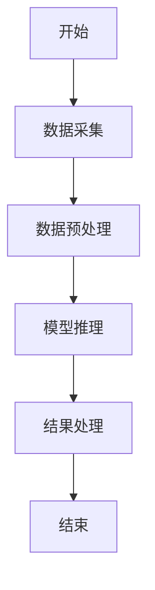
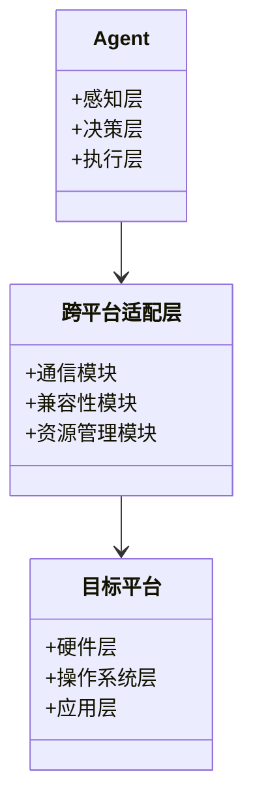
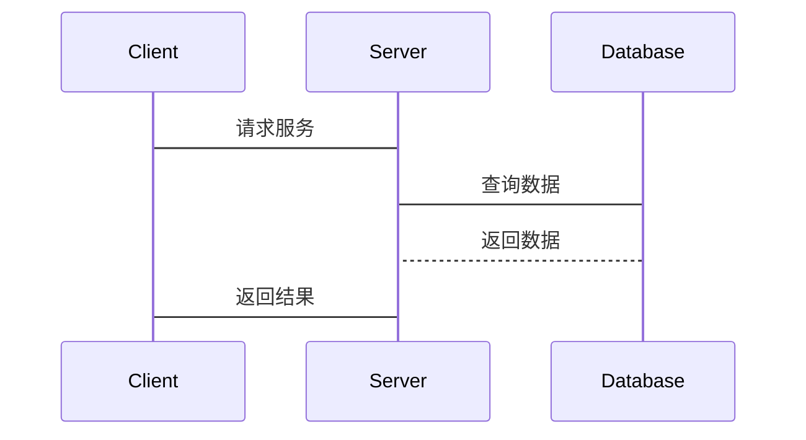

                 


# 构建跨平台AI Agent的技术挑战

> 关键词：AI Agent, 跨平台, 技术挑战, 系统架构, 算法原理, 项目实战

> 摘要：构建跨平台AI Agent是一项复杂的技术任务，涉及多平台兼容性、算法优化和系统架构设计等多个方面。本文将从背景介绍、核心概念、算法原理、系统架构设计、项目实战等多个维度，详细探讨构建跨平台AI Agent的技术挑战，并提供具体的实现案例和最佳实践建议。

## 第一部分：跨平台AI Agent的背景与挑战

### 第1章：跨平台AI Agent的背景介绍

#### 1.1 AI Agent的基本概念

##### 1.1.1 AI Agent的定义与核心要素

AI Agent（智能代理）是指能够感知环境、自主决策并执行任务的智能体。它通常由感知层、决策层和执行层构成，能够根据环境反馈动态调整行为。跨平台AI Agent则需要在多种平台上运行，适应不同的操作系统和硬件环境。

##### 1.1.2 跨平台AI Agent的必要性

随着智能设备的多样化和应用场景的扩展，跨平台AI Agent的需求日益增长。例如，同一个AI Agent可能需要在手机、网页、物联网设备等多个平台上运行，以实现统一的服务和用户体验。

##### 1.1.3 跨平台AI Agent的应用场景

跨平台AI Agent广泛应用于智能家居、智能助手、智能客服等领域。例如，一个智能助手需要在手机、网页和桌面应用上运行，为用户提供一致的服务体验。

#### 1.2 跨平台技术的核心挑战

##### 1.2.1 不同平台的差异性分析

不同平台（如iOS、Android、Web、物联网设备）在硬件性能、操作系统、API接口等方面存在显著差异，这增加了跨平台开发的复杂性。

##### 1.2.2 跨平台开发的主要难点

跨平台开发需要处理多平台兼容性问题，包括代码复用、性能优化、用户体验一致性等。此外，不同平台的安全性和隐私要求也不同，增加了开发难度。

##### 1.2.3 跨平台AI Agent的实现路径

通过使用跨平台开发框架（如React Native、Flutter）和通用AI算法，可以在多个平台上高效实现AI Agent的功能。

### 第2章：跨平台AI Agent的核心概念与联系

#### 2.1 AI Agent的构成与功能模块

##### 2.1.1 感知层：数据采集与处理

AI Agent通过传感器、API或其他数据源获取环境信息，进行数据清洗和特征提取。

##### 2.1.2 决策层：智能推理与决策

基于感知层的数据，决策层通过机器学习模型进行推理和决策，生成执行指令。

##### 2.1.3 执行层：任务执行与反馈

执行层根据决策层的指令，调用相应的API或控制硬件执行任务，并将反馈传递给感知层。

#### 2.2 跨平台技术的关键要素

##### 2.2.1 跨平台通信机制

通过标准化接口和协议实现不同平台之间的通信，确保数据的准确传递和交互。

##### 2.2.2 跨平台兼容性设计

在设计AI Agent时，需要考虑不同平台的兼容性，确保功能在各种平台上都能正常运行。

##### 2.2.3 跨平台资源管理

合理分配和管理跨平台资源，优化性能和资源利用率，避免资源冲突和浪费。

#### 2.3 核心概念的ER实体关系图

```mermaid
er
  actor(Agent,跨平台适配层,目标平台)
  relation(拥有,支持,依赖)
```

## 第3章：跨平台AI Agent的算法原理

### 3.1 跨平台适配算法

#### 3.1.1 动态适配算法

动态适配算法根据目标平台的特征动态调整AI Agent的行为，确保其在不同平台上都能高效运行。

#### 3.1.2 基于特征的适配算法

基于目标平台的特征（如硬件性能、操作系统版本）进行适配，优化AI Agent的运行效率和用户体验。

#### 3.1.3 跨平台优化算法

通过算法优化，减少跨平台开发的复杂性，提高代码复用性和性能。

### 3.2 多模态模型的构建与优化

#### 3.2.1 多模态数据的融合方法

将来自不同模态（如文本、图像、语音）的数据进行融合，提升AI Agent的感知和决策能力。

#### 3.2.2 模型的轻量化设计

通过模型剪枝、知识蒸馏等技术，降低模型的计算复杂度，使其能够在资源受限的平台上运行。

#### 3.2.3 模型的可移植性优化

优化模型结构和参数，使其能够在不同平台上高效运行，减少平台依赖性。

### 3.3 跨平台AI Agent的算法流程图



## 第4章：跨平台AI Agent的系统分析与架构设计

### 4.1 问题场景介绍

#### 4.1.1 跨平台AI Agent的典型应用场景

例如，一个智能助手需要在手机、网页和物联网设备上运行，提供一致的服务体验。

#### 4.1.2 跨平台系统的主要问题

不同平台的差异性导致开发和维护成本增加，用户体验不一致，性能差异显著。

### 4.2 系统功能设计

#### 4.2.1 领域模型设计

使用Mermaid类图展示系统的核心模块及其交互关系。



### 4.3 系统架构设计

#### 4.3.1 系统架构图

使用Mermaid架构图展示系统的整体架构。


#### 4.3.2 接口设计

定义系统各模块之间的接口，确保模块间的高效通信和协作。

#### 4.3.3 交互流程图

使用Mermaid序列图展示系统交互流程。



## 第5章：跨平台AI Agent的项目实战

### 5.1 环境配置

#### 5.1.1 开发工具安装

安装必要的开发工具，如React Native、Flutter、Python开发环境等。

#### 5.1.2 依赖库安装

安装所需的AI算法库和跨平台开发库，如TensorFlow、PyTorch、React、Vue.js等。

### 5.2 核心代码实现

#### 5.2.1 AI Agent的核心代码

以下是一个简单的跨平台AI Agent的Python实现示例：

```python
import torch
import numpy as np

class AI-Agent:
    def __init__(self):
        self.model = self._build_model()

    def _build_model(self):
        # 简单的神经网络模型
        return torch.nn.Sequential(
            torch.nn.Linear(2, 4),
            torch.nn.ReLU(),
            torch.nn.Linear(4, 1)
        )

    def perceive(self, data):
        # 数据处理和特征提取
        return self.model(torch.FloatTensor(data))

    def decide(self, features):
        # 智能决策
        return features.argmax().item()

    def execute(self, action):
        # 执行任务
        print(f"执行动作：{action}")
```

#### 5.2.2 跨平台适配层的代码实现

以下是一个跨平台适配层的示例代码：

```python
class PlatformAdapter:
    def __init__(self, platform):
        self.platform = platform
        self.adapter = self._get_adapter()

    def _get_adapter(self):
        if self.platform == 'android':
            return AndroidAdapter()
        elif self.platform == 'ios':
            return IOSAdapter()
        else:
            return DefaultAdapter()

    def adapt(self, data):
        return self.adapter.adapt(data)
```

### 5.3 代码解读与分析

#### 5.3.1 核心代码解读

AI-Agent类包含感知、决策和执行三个核心功能。perceive方法处理输入数据，decide方法进行决策，execute方法执行任务。

#### 5.3.2 跨平台适配层代码解读

PlatformAdapter类根据目标平台选择相应的适配器，通过适配器实现数据的适配和转换。

### 5.4 实际案例分析

#### 5.4.1 案例背景

假设我们需要开发一个跨平台智能助手，支持手机、网页和物联网设备。

#### 5.4.2 系统实现

使用React Native开发移动应用，Vue.js开发Web应用，Python开发后端服务，并通过RESTful API进行通信。

#### 5.4.3 代码实现

移动应用部分：

```javascript
import React, { useState, useEffect } from 'react';
import { Text, View, StyleSheet } from 'react-native';

function App() {
    const [message, setMessage] = useState('');

    const handleSendMessage = () => {
        fetch('http://backend:8080/api', {
            method: 'POST',
            headers: {
                'Content-Type': 'application/json',
            },
            body: JSON.stringify({ message }),
        })
            .then(response => response.json())
            .then(data => {
                setMessage(data.response);
            });
    };

    return (
        <View style={styles.container}>
            <Text>AI助手</Text>
            <TextInput
                value={message}
                onChangeText={(text) => setMessage(text)}
                placeholder="输入消息..."
                onSubmitEditing={handleSendMessage}
            />
        </View>
    );
}

export default App;
```

后端服务部分：

```python
from flask import Flask, request, jsonify
import torch
import numpy as np

app = Flask(__name__)

@app.route('/api', methods=['POST'])
def process_request():
    data = request.json
    message = data['message']
    # 处理消息并返回响应
    response = "你发送的消息是：" + message
    return jsonify({'response': response})

if __name__ == '__main__':
    app.run(debug=True)
```

#### 5.4.4 案例分析

通过上述实现，AI助手可以在不同平台上运行，用户在手机或网页上输入消息，后端服务处理并返回响应。跨平台适配层确保了不同平台之间的通信和数据转换。

### 5.5 项目小结

通过本案例，我们展示了如何构建一个简单的跨平台AI Agent，包括前端和后端的实现。实际应用中，还需要考虑更多的细节，如性能优化、安全性、用户体验等。

## 第6章：最佳实践与小结

### 6.1 最佳实践

#### 6.1.1 技术选型

选择合适的跨平台开发框架和AI算法库，确保代码复用性和性能。

#### 6.1.2 模块化设计

将系统划分为独立的功能模块，便于维护和扩展。

#### 6.1.3 测试与优化

进行全面的测试，包括单元测试、集成测试和性能测试，及时发现和解决问题。

### 6.2 小结

构建跨平台AI Agent是一项复杂但 rewarding 的任务，需要综合考虑技术、架构和用户体验等多个方面。通过合理的系统设计和最佳实践，可以高效地实现跨平台AI Agent。

### 6.3 注意事项

#### 6.3.1 跨平台开发的复杂性

不同平台的差异可能导致开发和维护成本增加，需要充分考虑平台兼容性。

#### 6.3.2 安全性和隐私保护

在跨平台开发中，需要特别注意数据的安全性和隐私保护，避免数据泄露和滥用。

#### 6.3.3 用户体验一致性

确保AI Agent在不同平台上的用户体验一致，提升用户满意度。

### 6.4 拓展阅读

#### 6.4.1 跨平台开发框架

- React Native
- Flutter
- Xamarin

#### 6.4.2 AI算法资源

- TensorFlow
- PyTorch
- scikit-learn

#### 6.4.3 系统架构设计

- DDD（领域驱动设计）
- Clean Architecture
- Microservices Architecture

---

## 作者

作者：AI天才研究院（AI Genius Institute） & 禅与计算机程序设计艺术（Zen And The Art of Computer Programming）

---

通过本文的详细讲解，我们全面探讨了构建跨平台AI Agent的技术挑战，从背景介绍、核心概念、算法原理到系统架构设计和项目实战，提供了丰富的技术细节和实际案例。希望本文能为读者在跨平台AI Agent的开发中提供有价值的参考和指导。

