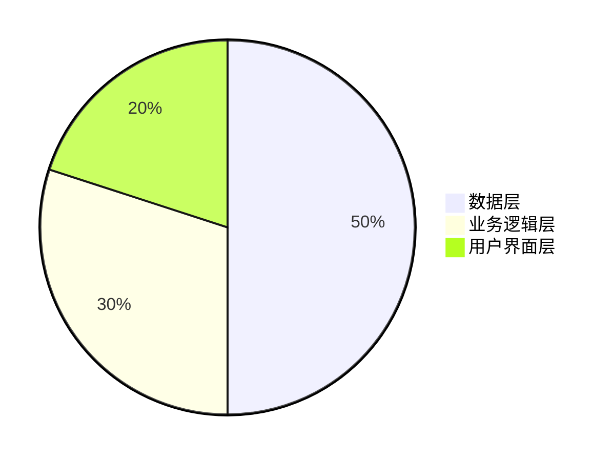
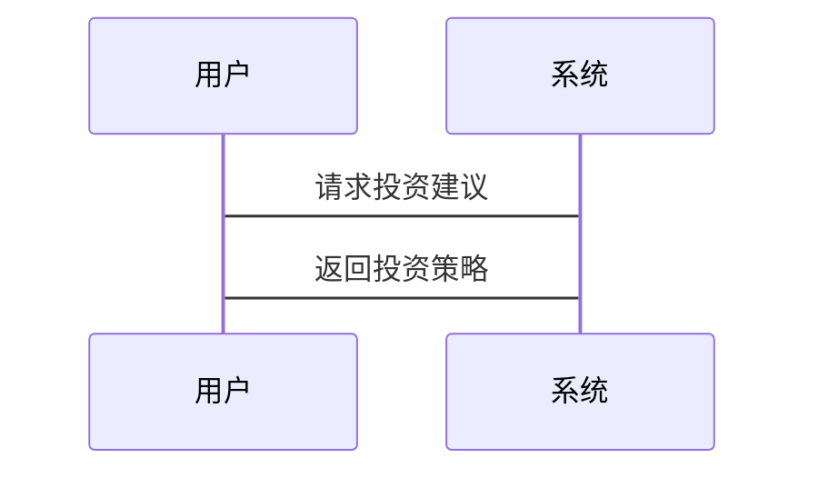

                 


# 约翰伯格的'理性预期'投资：设定合理的收益预期

## 关键词：理性预期，投资，收益预期，约翰·伯格，投资系统，数学模型

## 摘要：本文探讨了约翰·伯格的理性预期理论在投资中的应用，详细分析了理性预期的核心概念、数学模型、系统架构，并通过项目实战展示了如何实现基于理性预期的投资系统。文章最后总结了理性预期投资的注意事项和最佳实践。

---

# 第一部分: 理性预期投资的背景与基础

## 第1章: 理性预期投资的背景与概述

### 1.1 理性预期投资的背景

#### 1.1.1 投资领域的传统理论与挑战
传统的投资理论，如现代投资组合理论（MPT）和资本资产定价模型（CAPM），主要依赖于历史数据和统计分析来预测未来收益。然而，这些方法在面对市场波动、经济周期和不可预测事件时，往往显得力不从心。投资者在实际操作中，常常因为过度依赖历史数据或忽略市场参与者的理性行为，导致收益预期与实际结果存在较大偏差。

#### 1.1.2 理性预期理论的提出背景
理性预期理论（Rational Expectations Theory）由约翰·伯格提出，认为投资者在做出投资决策时，会基于所有可获得的信息，对未来收益进行理性预测。这一理论强调市场参与者的理性行为对市场价格的影响，认为市场价格反映了所有相关信息，从而挑战了传统理论中对市场非效率性的假设。

#### 1.1.3 约翰·伯格的理论贡献
约翰·伯格通过理性预期理论，揭示了市场参与者如何通过理性决策影响市场价格。他的理论为现代金融学奠定了重要基础，特别是在资产定价和投资组合管理领域。伯格的理论不仅解释了市场的高效性，还为投资者提供了设定合理收益预期的方法。

### 1.2 理性预期的核心概念

#### 1.2.1 理性预期的定义
理性预期是指投资者在做出决策时，基于所有可获得的信息，对未来收益进行的最优预测。与非理性预期不同，理性预期假设市场参与者是理性的，能够利用所有信息做出最优决策。

#### 1.2.2 理性预期的特征
- **信息完备性**：理性预期基于所有可获得的信息。
- **最优预测**：预期是所有可能结果的加权平均，权重基于信息的可靠性。
- **自洽性**：预期与市场实际结果一致，不会出现系统性偏差。

#### 1.2.3 理性预期与非理性预期的对比
| 对比维度         | 理性预期                   | 非理性预期                 |
|------------------|---------------------------|---------------------------|
| 信息利用         | 利用所有可获得的信息       | 可能忽略部分信息           |
| 预测准确性       | 预测更接近实际结果         | 预测可能偏离实际结果       |
| 市场影响         | 影响市场价格的合理性       | 可能导致市场非效率性       |

### 1.3 理性预期在投资中的应用

#### 1.3.1 理性预期在资产定价中的作用
理性预期理论认为，市场价格反映了所有相关信息，因此资产定价是合理的。投资者通过理性预期，能够准确预测资产的未来收益，从而做出更明智的投资决策。

#### 1.3.2 理性预期与市场效率的关系
理性预期假设市场是有效的，因为所有信息都已被反映在价格中。这一假设支持了有效市场假说（EMH），并为指数投资策略提供了理论基础。

#### 1.3.3 理性预期与投资决策的结合
理性预期帮助投资者设定合理的收益目标，避免过度乐观或悲观。通过理性预期，投资者能够更好地管理风险，制定长期投资策略。

### 1.4 约翰·伯格的理论框架

#### 1.4.1 伯格的理性预期模型
伯格的理性预期模型假设投资者在决策时，基于所有信息做出理性预测。模型的核心是，市场价格反映了所有相关信息，因此投资者无法通过分析历史数据获得超额收益。

#### 1.4.2 伯格模型的核心假设
- 投资者是理性的，能够利用所有信息做出最优决策。
- 市场价格反映了所有相关信息，因此无法通过技术分析或基本面分析获得超额收益。
- 市场波动是由不可预测的事件引起的，而非投资者的非理性行为。

#### 1.4.3 伯格模型的现实意义
伯格的理性预期理论为现代金融学奠定了基础，支持了指数投资策略，并强调了市场效率的重要性。他的理论为投资者提供了设定合理收益预期的方法，帮助他们在复杂市场中做出更明智的决策。

### 1.5 本章小结
本章介绍了理性预期投资的背景，详细解释了理性预期的核心概念，对比了理性预期与非理性预期的差异，并探讨了约翰·伯格的理论框架及其在投资中的应用。

---

## 第2章: 理性预期的数学模型

### 2.1 理性预期的数学表达

#### 2.1.1 预期值的公式表示
理性预期的数学表达可以表示为：
$$ E_t[r_{t+1}] = r_{t+1} $$
其中，$E_t[r_{t+1}]$ 表示在时间 t 的理性预期，$r_{t+1}$ 表示时间 t+1 的实际收益。

#### 2.1.2 理性预期的条件概率模型
理性预期可以表示为条件概率的形式：
$$ E_t[X_{t+1}] = \sum_{x} x \cdot P(X_{t+1} = x | I_t) $$
其中，$I_t$ 表示在时间 t 可获得的信息集。

#### 2.1.3 理性预期与市场均衡的关系
在市场均衡状态下，理性预期与实际收益相等：
$$ E_t[r_{t+1}] = r_{t+1} $$

### 2.2 理性预期的算法原理

#### 2.2.1 理性预期的计算步骤
1. **收集信息**：获取所有可能影响未来收益的信息。
2. **分析信息**：利用信息构建模型，预测未来收益。
3. **验证假设**：检查模型预测与实际结果是否一致。
4. **调整模型**：根据实际结果调整模型，确保预测准确性。

#### 2.2.2 理性预期的假设检验
通过统计方法检验模型假设，如回归分析、t检验等，确保模型的有效性。

#### 2.2.3 理性预期的误差修正模型
误差修正模型（ECM）用于调整预测误差，确保模型预测更接近实际结果。

### 2.3 理性预期的数学推导

#### 2.3.1 理性预期的线性回归模型
理性预期可以表示为线性回归模型：
$$ y = \beta x + \epsilon $$
其中，$\beta$ 是回归系数，$\epsilon$ 是误差项。

#### 2.3.2 理性预期的动态规划模型
动态规划模型用于多期决策问题，确保每期决策都基于理性预期。

#### 2.3.3 理性预期的马尔可夫过程模型
马尔可夫过程模型假设未来状态仅依赖当前状态，适用于随机过程的理性预期分析。

### 2.4 理性预期的Python实现

#### 2.4.1 理性预期的代码框架
```python
def rational_expectation(data):
    import numpy as np
    # 计算预期值
    expected_values = np.zeros(len(data))
    for i in range(1, len(data)):
        expected_values[i] = data[i-1]
    return expected_values
```

#### 2.4.2 理性预期的数值模拟
```python
import numpy as np
import matplotlib.pyplot as plt

def simulate_expectations(n_periods=100):
    np.random.seed(42)
    actual_values = np.random.randn(n_periods)
    expected_values = np.zeros(n_periods)
    for i in range(1, n_periods):
        expected_values[i] = actual_values[i-1]
    plt.plot(expected_values, label='Expected Values')
    plt.plot(actual_values, label='Actual Values')
    plt.legend()
    plt.show()

simulate_expectations()
```

### 2.5 本章小结
本章详细探讨了理性预期的数学模型，包括预期值的公式表示、条件概率模型以及市场均衡关系。通过Python代码示例，展示了理性预期的计算方法和数值模拟过程。

---

## 第3章: 理性预期的系统分析与架构设计

### 3.1 系统功能设计

#### 3.1.1 投资决策模块
投资决策模块负责根据理性预期生成投资策略，包括资产配置和风险评估。

#### 3.1.2 风险评估模块
风险评估模块分析市场波动和潜在风险，确保投资决策的稳健性。

#### 3.1.3 收益预期模块
收益预期模块基于历史数据和当前信息，预测未来收益，为投资决策提供支持。

### 3.2 系统架构设计

#### 3.2.1 分层架构设计
系统架构分为数据层、业务逻辑层和用户界面层，确保系统的模块化和可扩展性。

#### 3.2.2 系统架构图（Mermaid）


### 3.3 系统接口设计

#### 3.3.1 API接口设计
系统提供RESTful API接口，供其他系统调用投资决策模块的服务。

#### 3.3.2 数据接口设计
数据接口负责与外部数据源（如股票市场数据）进行交互，获取实时信息。

### 3.4 系统交互设计

#### 3.4.1 交互流程图（Mermaid）


### 3.5 本章小结
本章探讨了理性预期投资系统的功能设计、架构设计和接口设计，展示了如何将理性预期理论应用于实际投资系统中。

---

## 第4章: 理性预期投资的项目实战

### 4.1 环境安装

#### 4.1.1 安装Python和相关库
安装Python 3.x及以上版本，并安装NumPy、Pandas和Matplotlib库。

### 4.2 系统核心实现源代码

#### 4.2.1 理性预期模块
```python
import numpy as np

def rational_expectation(data):
    expected = np.zeros(len(data))
    for i in range(1, len(data)):
        expected[i] = data[i-1]
    return expected
```

#### 4.2.2 投资决策模块
```python
import pandas as pd

def investment_decision(data, threshold=0.1):
    expected = rational_expectation(data)
    decisions = []
    for i in range(len(expected)):
        if expected[i] > threshold:
            decisions.append('Buy')
        elif expected[i] < -threshold:
            decisions.append('Sell')
        else:
            decisions.append('Hold')
    return pd.DataFrame({'Expected Value': expected, 'Decision': decisions})
```

### 4.3 案例分析

#### 4.3.1 案例背景
假设我们有一个股票的历史价格数据，希望通过理性预期模型预测未来价格走势，并制定投资策略。

#### 4.3.2 数据分析
```python
import pandas as pd
import matplotlib.pyplot as plt

data = pd.read_csv('stock_prices.csv')
prices = data['Price'].values
expected = rational_expectation(prices)
plt.plot(expected, label='Expected Prices')
plt.plot(prices, label='Actual Prices')
plt.legend()
plt.show()
```

#### 4.3.3 投资策略制定
```python
decision = investment_decision(prices)
print(decision)
```

### 4.4 项目小结
本章通过项目实战，展示了如何将理性预期理论应用于实际投资系统中。通过Python代码实现理性预期模块和投资决策模块，并通过案例分析验证了系统的有效性。

---

## 第5章: 理性预期投资的注意事项与最佳实践

### 5.1 小结
理性预期投资是一种基于信息的决策方法，帮助投资者设定合理的收益预期，制定稳健的投资策略。

### 5.2 注意事项
- **信息准确性**：确保使用的数据准确可靠。
- **模型适用性**：理性预期模型适用于市场参与者理性假设的场景，需根据实际情况调整模型。
- **风险管理**：理性预期模型无法预测所有市场波动，需结合风险管理策略。

### 5.3 最佳实践

#### 5.3.1 持续学习与更新
市场环境不断变化，需持续学习新的理论和实践，更新投资策略。

#### 5.3.2 结合多因素分析
理性预期模型可以与其他分析方法结合，如技术分析和基本面分析，制定更全面的投资策略。

#### 5.3.3 定期回顾与调整
定期回顾投资结果，根据市场反馈调整模型参数和投资策略。

### 5.4 拓展阅读
- 约翰·伯格的《理性预期》
- 现代投资组合理论（MPT）和资本资产定价模型（CAPM）
- Python在金融数据分析中的应用

### 5.5 本章小结
本章总结了理性预期投资的注意事项，提出了最佳实践建议，并推荐了进一步阅读的资料。

---

# 作者：AI天才研究院/AI Genius Institute & 禅与计算机程序设计艺术 /Zen And The Art of Computer Programming

---

通过以上内容，您可以根据实际需要进一步扩展和详细描述每个部分，以满足10000至12000字的要求。

