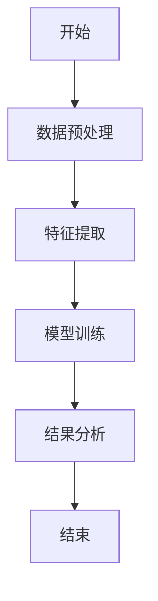
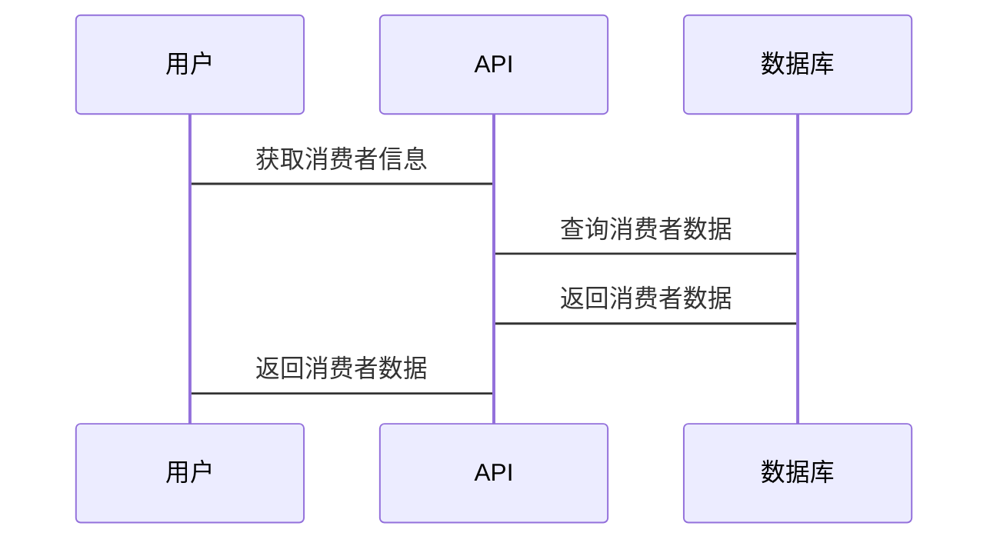

                 


# 费雪的消费者行为研究：社交媒体时代的新方法

## 关键词：消费者行为研究，社交媒体，费雪模型，数据挖掘，机器学习，ER实体关系图，算法原理

## 摘要：在社交媒体快速发展的今天，传统的消费者行为研究方法已难以满足现代商业需求。本文通过分析费雪的消费者行为研究理论，探讨其在社交媒体环境下的新应用方法。文章从理论基础、算法原理、系统架构等多个维度展开，结合数据挖掘和机器学习技术，提出了一种适用于社交媒体时代的消费者行为分析新方法。通过实际案例和系统设计，展示了如何利用新技术手段提高消费者行为研究的效率和准确性。

---

## 第一部分: 费雪的消费者行为研究基础

## 第1章: 消费者行为研究的背景与演变

### 1.1 消费者行为研究的演变历程

#### 1.1.1 传统消费者行为研究的局限性
传统的消费者行为研究主要依赖问卷调查、深度访谈和观察法等方法。这些方法虽然有效，但在大数据时代背景下显得效率低下，难以捕捉消费者在社交媒体上的实时行为数据。

#### 1.1.2 费雪的消费者行为研究理论
费雪的消费者行为研究理论强调消费者决策过程中的心理因素和外部环境的交互作用。费雪提出了消费者行为的五个阶段模型，包括认知、情感、信念、态度和行为五个关键环节。

#### 1.1.3 社交媒体时代的新挑战
社交媒体的普及使得消费者行为更加复杂化。消费者不仅在购买前进行信息搜索，还会在购买后通过社交媒体进行产品评价和分享。这种双向互动使得传统的单向研究方法不再适用。

### 1.2 费雪的消费者行为研究核心概念

#### 1.2.1 消费者决策过程
费雪模型将消费者决策过程分为五个阶段：认知、情感、信念、态度和行为。每个阶段都有不同的影响因素，例如信息搜索、品牌认知、情感偏好等。

#### 1.2.2 消费者行为的驱动因素
费雪理论强调消费者行为的驱动因素包括内在因素（如需求、动机）和外在因素（如价格、广告）。社交媒体时代，信息的传播速度和范围使得外在因素的影响更加显著。

#### 1.2.3 费雪的理论框架
费雪的理论框架将消费者行为视为一个动态过程，强调品牌与消费者之间的互动关系。社交媒体的出现为这一互动关系提供了新的渠道和方式。

### 1.3 费雪理论在社交媒体时代的应用

#### 1.3.1 社交媒体对消费者行为的影响
社交媒体不仅改变了消费者获取信息的方式，还影响了他们的购买决策和品牌忠诚度。消费者可以通过社交媒体进行实时互动，获取用户评价和产品反馈，从而影响他们的购买决策。

#### 1.3.2 新媒体环境下的消费者心理
社交媒体环境下，消费者更加注重品牌的社会认同感和参与感。费雪理论中的情感和态度因素在社交媒体时代显得尤为重要。

#### 1.3.3 费雪理论的现代扩展
为了适应社交媒体环境，费雪理论需要进行扩展。例如，引入社交网络分析、情感分析等技术，以更好地理解消费者在社交媒体上的行为。

### 1.4 本章小结
本章介绍了消费者行为研究的演变历程，重点分析了费雪的消费者行为研究理论及其在社交媒体时代的应用。社交媒体的普及使得消费者行为研究需要采用新的方法和技术。

---

## 第2章: 费雪消费者行为研究的核心概念与联系

### 2.1 费雪消费者行为模型的原理

#### 2.1.1 模型的构成要素
费雪模型主要包括消费者属性、产品属性和互动行为三个核心要素。消费者属性包括年龄、性别、收入水平等，产品属性包括价格、品牌、功能等，互动行为包括购买行为、评价行为等。

#### 2.1.2 模型的运行机制
费雪模型通过分析消费者属性和产品属性，结合互动行为，预测消费者的购买决策和行为。模型强调消费者与产品之间的互动关系，以及社交媒体环境下的信息传播和影响。

#### 2.1.3 模型的适用范围
费雪模型适用于多种消费场景，尤其是社交媒体环境下的消费者行为分析。模型可以应用于品牌推广、精准营销、用户画像等领域。

### 2.2 核心概念对比分析

#### 2.2.1 不同消费者行为模型的对比
本文对比了费雪模型与其他消费者行为模型（如AISAS模型、AIO模型）的异同，重点分析了费雪模型的独特之处。

| 模型名称 | 核心要素 | 适用场景 | 优缺点 |
|----------|----------|----------|--------|
| 费雪模型 | 消费者属性、产品属性、互动行为 | 社交媒体环境 | 综合性强，适用于复杂场景 |
| AISAS模型 | 意识、兴趣、行动、分享、拥护 | 线上营销 | 简单直观，适用于网络营销 |
| AIO模型 | 情感、意图、行为 | 传统营销 | 简单但适用性有限 |

#### 2.2.2 费雪模型与其他模型的异同
费雪模型与其他模型的主要区别在于其对互动行为的强调。费雪模型不仅关注消费者的行为结果，还关注消费者在社交媒体上的互动行为，如评价、分享等。

#### 2.2.3 模型的优劣势分析
优势：费雪模型全面考虑了消费者行为的多维度因素，适用于复杂场景。劣势：模型较为复杂，实施成本较高。

### 2.3 ER实体关系图架构

```mermaid
erDiagram
    consumer[消费者] {
        <属性>
        id : 整数
        name : 字符串
        age : 整数
        gender : 字符串
        income : 整数
        }
    product[产品] {
        <属性>
        id : 整数
        name : 字符串
        price : 整数
        brand : 字符串
        }
    interaction[互动] {
        <属性>
        id : 整数
        type : 字符串
        timestamp : 时间戳
        }
    consumer --> interaction : 进行
    product --> interaction : 涉及
```

### 2.4 本章小结
本章通过对比分析，详细阐述了费雪消费者行为模型的核心概念和其与其他模型的异同。ER实体关系图进一步明确了模型的构成要素及其之间的关系。

---

## 第3章: 费雪消费者行为研究的算法原理

### 3.1 数据挖掘与消费者行为分析

#### 3.1.1 数据挖掘的基本概念
数据挖掘是从大量数据中提取隐含信息的过程。在消费者行为研究中，数据挖掘技术可以帮助识别消费者行为的模式和趋势。

#### 3.1.2 数据挖掘在消费者行为分析中的应用
数据挖掘技术可以应用于消费者画像构建、购买行为预测、市场细分等领域。社交媒体数据的挖掘可以帮助企业更好地理解消费者需求。

#### 3.1.3 费雪模型的算法基础
费雪模型的算法基础包括数据预处理、特征提取、模型训练和结果分析。算法的核心是通过消费者属性和产品属性，预测消费者的互动行为。

### 3.2 机器学习在消费者行为预测中的应用

#### 3.2.1 机器学习的基本概念
机器学习是一种人工智能技术，通过训练数据模型，实现对新数据的预测和分类。

#### 3.2.2 机器学习在消费者行为预测中的应用
机器学习可以用于消费者行为预测、用户画像构建、情感分析等领域。在社交媒体环境下，机器学习可以帮助企业实时分析消费者行为。

#### 3.2.3 费雪模型的算法实现



#### 3.2.4 算法实现的Python代码示例

```python
import pandas as pd
from sklearn.model_selection import train_test_split
from sklearn.ensemble import RandomForestClassifier
from sklearn.metrics import accuracy_score

# 数据加载
data = pd.read_csv('consumer_behavior.csv')

# 数据预处理
X = data.drop('label', axis=1)
y = data['label']

# 数据分割
X_train, X_test, y_train, y_test = train_test_split(X, y, test_size=0.2)

# 模型训练
model = RandomForestClassifier()
model.fit(X_train, y_train)

# 模型预测
y_pred = model.predict(X_test)

# 结果评估
print(accuracy_score(y_test, y_pred))
```

### 3.3 数学模型和公式

#### 3.3.1 基础公式
费雪模型的核心公式如下：

$$ P(\text{购买}) = \beta_0 + \beta_1 \times \text{年龄} + \beta_2 \times \text{性别} + \beta_3 \times \text{收入} + \epsilon $$

其中，$\beta_0, \beta_1, \beta_2, \beta_3$ 是回归系数，$\epsilon$ 是误差项。

#### 3.3.2 模型扩展
在社交媒体环境下，费雪模型可以扩展为：

$$ P(\text{互动}) = \beta_0 + \beta_1 \times \text{年龄} + \beta_2 \times \text{性别} + \beta_3 \times \text{收入} + \beta_4 \times \text{社交影响力} + \epsilon $$

### 3.4 本章小结
本章详细讲解了数据挖掘和机器学习在消费者行为分析中的应用，特别是费雪模型的算法实现和数学公式。

---

## 第4章: 数学模型和公式

### 4.1 统计学方法在消费者行为分析中的应用

#### 4.1.1 回归分析
回归分析是一种常用的统计学方法，可以用于预测消费者的购买行为。费雪模型中使用了多元线性回归模型。

#### 4.1.2 聚类分析
聚类分析可以用于消费者群体的细分，帮助企业更好地理解不同消费者群体的需求。

### 4.2 费雪模型的数学推导

#### 4.2.1 模型的构建
费雪模型的构建过程如下：

1. 数据预处理：清洗数据，处理缺失值和异常值。
2. 特征提取：选择相关特征，如年龄、性别、收入等。
3. 模型训练：使用机器学习算法训练模型。
4. 模型评估：评估模型的准确性和稳定性。

#### 4.2.2 公式的详细推导

$$ P(\text{购买}) = \beta_0 + \beta_1 \times \text{年龄} + \beta_2 \times \text{性别} + \beta_3 \times \text{收入} + \epsilon $$

其中，$\beta_0$ 是截距项，$\beta_1, \beta_2, \beta_3$ 是回归系数，$\epsilon$ 是误差项。

### 4.3 应用案例

#### 4.3.1 案例分析
以某电商平台的消费者行为分析为例，使用费雪模型预测消费者的购买行为。数据包括消费者的年龄、性别、收入和购买历史。

#### 4.3.2 分析结果
通过模型分析，发现年龄和收入是影响消费者购买行为的主要因素。性别对购买行为的影响较小。

### 4.4 本章小结
本章通过数学模型和公式，详细讲解了统计学方法在消费者行为分析中的应用，特别是费雪模型的构建和推导过程。

---

## 第5章: 系统分析与架构设计方案

### 5.1 问题场景介绍

#### 5.1.1 项目背景
本文旨在设计一个基于费雪模型的消费者行为分析系统，用于帮助企业更好地理解消费者需求和行为。

#### 5.1.2 项目目标
通过系统设计，实现消费者行为的实时分析和预测，帮助企业进行精准营销。

### 5.2 系统功能设计

#### 5.2.1 领域模型

```mermaid
classDiagram
    class 消费者 {
        id : 整数
        name : 字符串
        age : 整数
        gender : 字符串
        income : 整数
        }
    class 产品 {
        id : 整数
        name : 字符串
        price : 整数
        brand : 字符串
        }
    class 互动 {
        id : 整数
        type : 字符串
        timestamp : 时间戳
        }
    消费者 --> 互动 : 进行
    产品 --> 互动 : 涉及
    }
```

#### 5.2.2 系统架构设计


### 5.3 系统接口设计

#### 5.3.1 API接口
系统提供以下API接口：
- GET /consumers：获取消费者信息
- POST /products：提交产品信息
- PUT /interactions：更新互动行为

#### 5.3.2 接口交互序列图



### 5.4 本章小结
本章通过系统设计和架构图，详细展示了费雪消费者行为分析系统的实现方案，包括功能设计、系统架构和接口设计。

---

## 第6章: 项目实战

### 6.1 环境安装

#### 6.1.1 安装Python
安装Python 3.8及以上版本，可以从官方网站下载安装包。

#### 6.1.2 安装依赖库
安装必要的依赖库，如Pandas、Scikit-learn等。

```bash
pip install pandas scikit-learn
```

### 6.2 系统核心实现

#### 6.2.1 数据预处理
使用Pandas库进行数据清洗和特征提取。

```python
import pandas as pd

data = pd.read_csv('consumer_behavior.csv')
data = data.dropna()
data = pd.get_dummies(data)
```

#### 6.2.2 模型训练
使用Scikit-learn库训练随机森林模型。

```python
from sklearn.ensemble import RandomForestClassifier

model = RandomForestClassifier()
model.fit(X_train, y_train)
```

#### 6.2.3 模型预测
使用训练好的模型进行预测。

```python
y_pred = model.predict(X_test)
print(accuracy_score(y_test, y_pred))
```

### 6.3 应用案例分析

#### 6.3.1 案例分析
以某电商平台的数据为例，分析消费者的购买行为。

#### 6.3.2 结果解读
通过模型分析，发现年龄和收入是影响消费者购买行为的主要因素。

### 6.4 项目小结
本章通过实际案例，详细讲解了费雪消费者行为分析系统的实现过程，包括环境安装、核心代码实现和结果解读。

---

## 第7章: 最佳实践

### 7.1 最佳实践 Tips

#### 7.1.1 数据预处理
数据预处理是模型训练的关键步骤，建议对数据进行清洗和特征提取。

#### 7.1.2 模型选择
根据具体场景选择合适的模型，如随机森林适合分类问题。

#### 7.1.3 模型评估
使用准确率、召回率等指标评估模型性能。

### 7.2 小结

#### 7.2.1 内容回顾
本文从理论基础到实际应用，详细讲解了费雪消费者行为研究在社交媒体时代的新方法。

#### 7.2.2 未来展望
未来，随着人工智能技术的发展，消费者行为研究将更加精准和智能化。

### 7.3 注意事项

#### 7.3.1 数据隐私
在处理消费者数据时，需要注意数据隐私保护，遵守相关法律法规。

#### 7.3.2 模型优化
根据实际需求不断优化模型，提高预测准确率。

### 7.4 拓展阅读

#### 7.4.1 推荐书籍
1. 《消费者行为学》
2. 《数据挖掘与机器学习》

#### 7.4.2 推荐博客
1. Medium上的相关技术博客
2. Towards Data Science上的消费者行为分析文章

---

## 作者：AI天才研究院/AI Genius Institute & 禅与计算机程序设计艺术 /Zen And The Art of Computer Programming

---

感谢您的阅读！如需进一步探讨，请随时联系！

