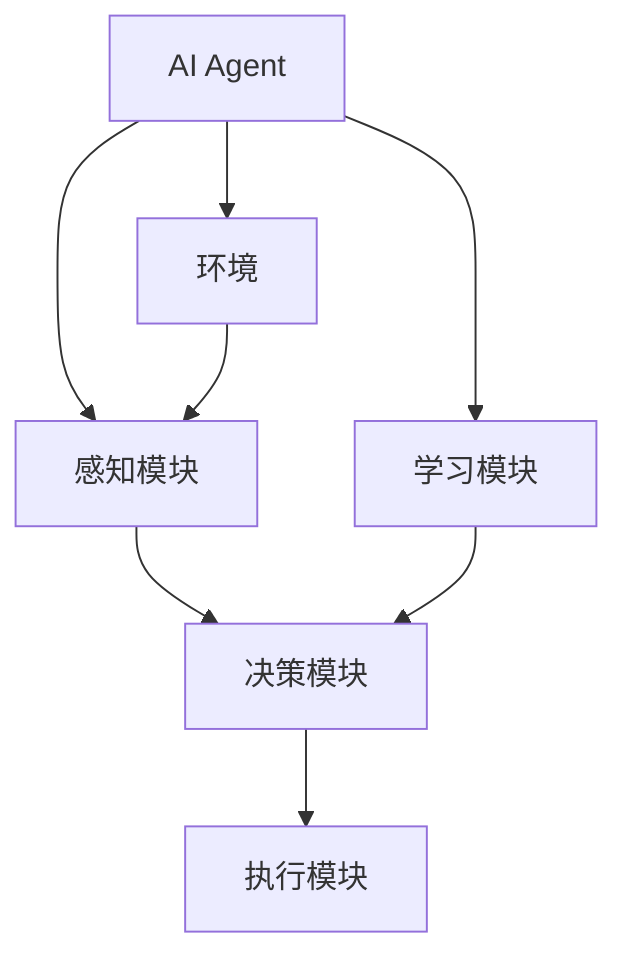
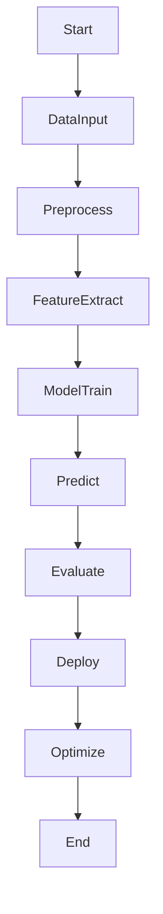
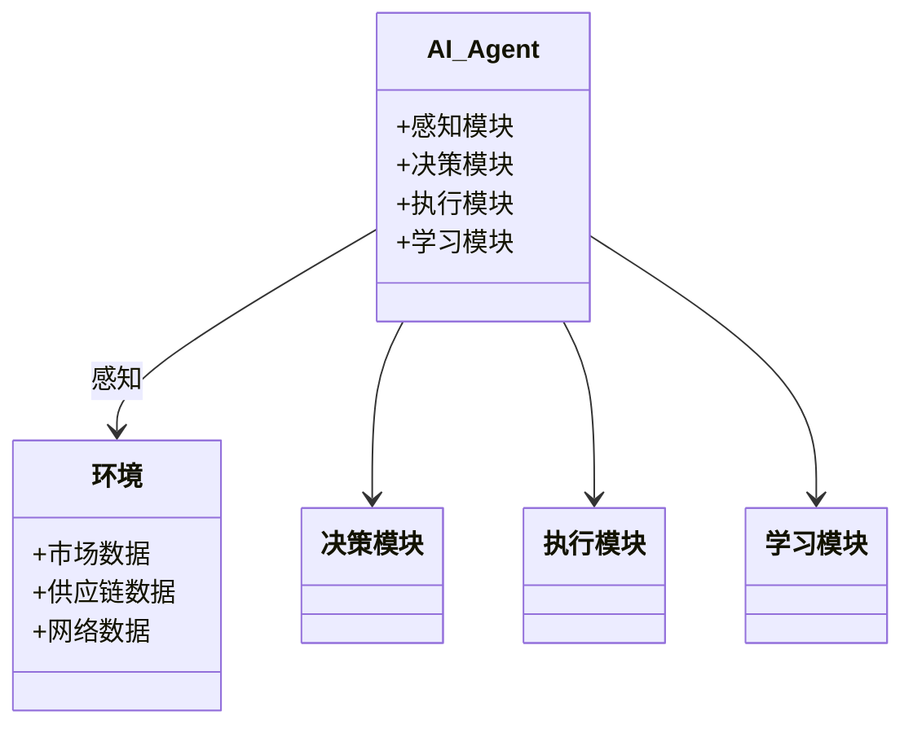
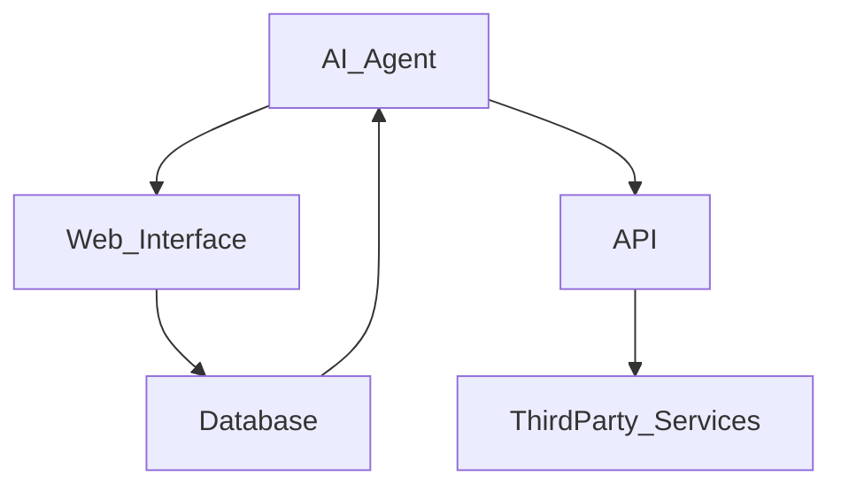
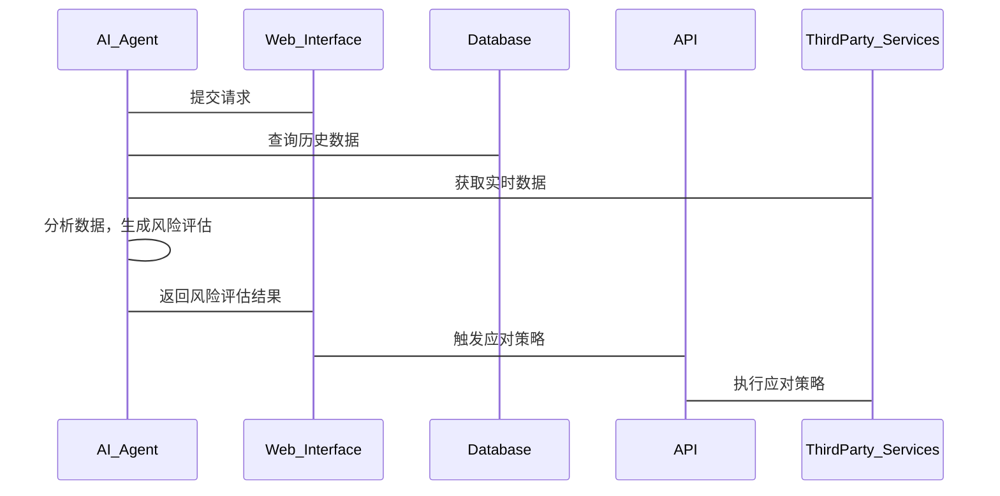

                 


# AI Agent在企业危机预警与应急响应中的应用

> 关键词：AI Agent, 危机预警, 应急响应, 企业风险管理, 人工智能

> 摘要：本文探讨了AI Agent在企业危机预警与应急响应中的应用，详细分析了AI Agent的核心概念、算法原理、系统架构及项目实战，结合实际案例，总结了最佳实践和注意事项，为企业在危机管理中的智能化转型提供了参考。

---

## 第1章: 问题背景与需求分析

### 1.1 问题背景

#### 1.1.1 企业危机管理的现状与挑战
企业面临着复杂多变的内外部环境，危机事件（如市场波动、供应链中断、网络安全攻击等）对企业的影响日益显著。传统的危机管理依赖人工判断和经验，存在响应速度慢、效率低、漏报误报等问题。企业在危机管理中需要更加智能化、数据化的解决方案。

#### 1.1.2 传统危机预警与应急响应的局限性
传统的危机预警系统通常依赖于固定的规则和预设的阈值，难以应对复杂多变的危机场景。应急响应过程往往依赖于人工协调，存在信息孤岛、资源浪费和决策延迟等问题。

#### 1.1.3 AI Agent在危机管理中的潜在价值
AI Agent（人工智能代理）具备自主性、反应性、目标导向性和社会性等特性，能够实时感知环境、分析风险、制定策略并执行任务。AI Agent可以显著提升危机预警的准确性、应急响应的及时性和资源利用的效率。

### 1.2 问题描述

#### 1.2.1 危机预警与应急响应的核心问题
危机预警的核心问题是如何实时发现潜在风险并准确预测危机的可能性；应急响应的核心问题是如何快速制定和执行应对策略，最大限度地减少损失。

#### 1.2.2 企业危机管理中的关键环节
- **风险识别**：识别潜在的危机因素。
- **风险评估**：评估危机的严重性和影响范围。
- **应急响应**：制定和执行应对策略。
- **资源协调**：协调人力、物力和财力资源。

#### 1.2.3 AI Agent在危机管理中的应用场景
- **实时监控**：实时监控企业内外部数据，识别潜在风险。
- **智能决策**：基于实时数据和历史数据，辅助决策者制定最优应对策略。
- **自动响应**：在危机发生时，AI Agent可以自动触发预设的应对措施。

### 1.3 问题解决思路

#### 1.3.1 AI Agent的核心能力与优势
- **自主性**：能够独立感知环境并采取行动。
- **反应性**：能够实时响应环境变化。
- **目标导向性**：能够根据目标优化行动策略。
- **社会性**：能够与其他系统、人员协同工作。

#### 1.3.2 基于AI Agent的危机预警与应急响应方案
- **实时数据采集与分析**：通过传感器、数据库等多源数据输入，实时分析潜在风险。
- **风险评估与预警**：基于机器学习模型评估风险等级，及时发出预警。
- **应急响应策略制定与执行**：根据风险评估结果，自动制定并执行应对策略。

#### 1.3.3 方案的可行性分析与实施路径
- **技术可行性**：AI Agent技术已经成熟，可以应用于危机管理。
- **经济可行性**：相对于传统方法，AI Agent可以显著降低成本，提升效率。
- **实施路径**：从局部试点开始，逐步推广到全企业范围。

### 1.4 边界与外延

#### 1.4.1 AI Agent在危机管理中的适用范围
- **适用范围**：适用于需要实时监控和快速响应的场景。
- **不适用范围**：对于需要严格遵循固定规则的场景，AI Agent可能不如传统方法有效。

#### 1.4.2 相关概念的区分与联系
- **区分**：AI Agent与传统规则引擎的区别在于，AI Agent具备自主性和适应性。
- **联系**：AI Agent可以与传统规则引擎结合使用，形成更加智能的系统。

#### 1.4.3 解决方案的边界条件与限制
- **边界条件**：AI Agent需要依赖高质量的数据输入和完善的算法模型。
- **限制**：在极端情况下（如数据缺失或模型失效），AI Agent可能无法正常工作。

### 1.5 概念结构与核心要素

#### 1.5.1 AI Agent的定义与组成要素
- **定义**：AI Agent是一种能够感知环境、自主决策并采取行动的智能体。
- **组成要素**：
  - **感知模块**：负责采集和解析环境数据。
  - **决策模块**：基于感知数据，制定行动策略。
  - **执行模块**：执行决策模块制定的策略。
  - **学习模块**：通过反馈不断优化自身的模型和策略。

#### 1.5.2 危机预警与应急响应的流程模型
- **流程模型**：
  1. **风险识别**：识别潜在的危机因素。
  2. **风险评估**：评估危机的严重性和影响范围。
  3. **应急响应**：制定和执行应对策略。
  4. **资源协调**：协调人力、物力和财力资源。

#### 1.5.3 核心概念之间的关系
- **关系**：
  - AI Agent通过感知模块获取环境数据。
  - 决策模块基于感知数据制定应对策略。
  - 执行模块根据决策模块的指令采取行动。
  - 学习模块通过反馈不断优化自身的模型和策略。

---

## 第2章: AI Agent的核心概念与原理

### 2.1 AI Agent的基本原理

#### 2.1.1 AI Agent的核心概念
- **核心概念**：
  - **感知**：通过传感器、数据库等多源数据输入，实时感知环境。
  - **决策**：基于感知数据，利用机器学习模型进行分析和预测。
  - **行动**：根据决策结果，采取相应的行动。

#### 2.1.2 AI Agent的特征对比
| 特征       | 传统规则引擎 | AI Agent       |
|------------|--------------|----------------|
| 自主性     | 低           | 高             |
| 反应性     | 低           | 高             |
| 目标导向性 | 低           | 高             |
| 社会性     | 低           | 高             |

#### 2.1.3 AI Agent的实体关系模型



---

## 第3章: AI Agent的算法原理

### 3.1 算法原理概述

#### 3.1.1 监督学习算法
- **监督学习算法**：
  - **输入**：多源数据输入，包括历史数据和实时数据。
  - **输出**：风险等级预测。
  - **流程**：
    1. 数据预处理：清洗和归一化数据。
    2. 特征提取：提取关键特征。
    3. 模型训练：基于训练数据训练机器学习模型。
    4. 预测与评估：基于测试数据评估模型性能。
    5. 部署与优化：部署模型并持续优化。

#### 3.1.2 强化学习算法
- **强化学习算法**：
  - **输入**：环境状态和动作。
  - **输出**：最优动作策略。
  - **流程**：
    1. 状态感知：感知当前环境状态。
    2. 动作选择：基于当前状态选择最优动作。
    3. 反馈接收：接收环境的反馈。
    4. 策略优化：根据反馈优化策略。

#### 3.1.3 算法流程图



#### 3.1.4 算法实现代码

```python
# 示例代码：基于监督学习的风险评估模型
import pandas as pd
from sklearn.model_selection import train_test_split
from sklearn.ensemble import RandomForestClassifier
from sklearn.metrics import accuracy_score

# 数据加载
data = pd.read_csv('risk_data.csv')
X = data.drop('label', axis=1)
y = data['label']

# 数据分割
X_train, X_test, y_train, y_test = train_test_split(X, y, test_size=0.2)

# 模型训练
model = RandomForestClassifier()
model.fit(X_train, y_train)

# 模型预测
y_pred = model.predict(X_test)

# 模型评估
print("Accuracy:", accuracy_score(y_test, y_pred))
```

---

## 第4章: 系统分析与架构设计

### 4.1 系统分析

#### 4.1.1 问题场景介绍
- **问题场景**：
  - 企业需要实时监控市场、供应链、网络等多方面的数据，及时发现潜在风险。
  - 在危机发生时，需要快速制定和执行应对策略，最大限度地减少损失。

#### 4.1.2 项目介绍
- **项目名称**：企业危机预警与应急响应系统。
- **项目目标**：通过AI Agent实现企业危机的智能化预警与应急响应。

### 4.2 系统功能设计

#### 4.2.1 领域模型设计



#### 4.2.2 系统架构设计



#### 4.2.3 系统接口设计
- **接口名称**：AI Agent API
- **接口描述**：
  - **输入**：环境数据和用户请求。
  - **输出**：风险评估结果和应对策略。

#### 4.2.4 系统交互设计



---

## 第5章: 项目实战

### 5.1 环境安装

#### 5.1.1 系统要求
- **操作系统**：Linux/Windows/MacOS
- **Python版本**：3.6+
- **依赖库**：scikit-learn、pandas、numpy、mermaid、graphviz

#### 5.1.2 安装步骤
```bash
pip install scikit-learn pandas numpy mermaid graphviz
```

### 5.2 系统核心实现

#### 5.2.1 核心代码实现
```python
# 示例代码：AI Agent的核心实现
import pandas as pd
from sklearn.ensemble import RandomForestClassifier

class AI_Agent:
    def __init__(self, data_path):
        self.data = pd.read_csv(data_path)
        self.model = self.train_model()
    
    def train_model(self):
        # 数据预处理
        X = self.data.drop('label', axis=1)
        y = self.data['label']
        # 模型训练
        model = RandomForestClassifier()
        model.fit(X, y)
        return model
    
    def predict_risk(self, input_data):
        # 风险预测
        return self.model.predict(input_data)
    
    def execute_strategy(self, strategy):
        # 策略执行
        pass
```

#### 5.2.2 代码应用解读
- **代码解读**：
  - `AI_Agent`类初始化时加载数据并训练模型。
  - `train_model`方法进行模型训练。
  - `predict_risk`方法基于输入数据进行风险预测。
  - `execute_strategy`方法执行应对策略。

### 5.3 案例分析与实际应用

#### 5.3.1 案例背景
- **案例名称**：某企业供应链中断预警。
- **案例描述**：
  - 数据来源：市场数据、供应链数据、网络数据。
  - 预测结果：预测供应链中断的可能性。
  - 应对策略：调整供应链策略，减少中断风险。

#### 5.3.2 实际应用
- **实际应用**：
  - 通过AI Agent实时监控供应链数据。
  - 预测供应链中断的可能性。
  - 自动调整供应链策略，减少中断风险。

### 5.4 项目小结

#### 5.4.1 项目总结
- **项目成果**：成功实现了企业危机预警与应急响应系统。
- **经验总结**：
  - 数据质量对模型性能影响重大。
  - 模型需要不断优化和更新。
  - 系统需要与企业现有系统无缝集成。

---

## 第6章: 最佳实践与注意事项

### 6.1 最佳实践

#### 6.1.1 系统设计
- **系统设计**：
  - 确保系统的高可用性和可扩展性。
  - 系统需要具备良好的可维护性和可扩展性。

#### 6.1.2 算法选择
- **算法选择**：
  - 根据具体场景选择合适的算法。
  - 组合使用多种算法，提高系统的鲁棒性。

#### 6.1.3 数据管理
- **数据管理**：
  - 确保数据的实时性和准确性。
  - 数据需要经过清洗和归一化处理。

### 6.2 注意事项

#### 6.2.1 数据隐私与安全
- **数据隐私**：
  - 确保数据的安全性，防止数据泄露。
  - 遵守相关法律法规，保护用户隐私。

#### 6.2.2 系统容错性
- **系统容错性**：
  - 系统需要具备容错能力，防止因单点故障导致系统崩溃。
  - 系统需要具备快速恢复能力，减少因故障导致的损失。

#### 6.2.3 模型优化
- **模型优化**：
  - 模型需要不断优化和更新，以适应环境的变化。
  - 定期进行模型评估和调优。

### 6.3 拓展阅读

#### 6.3.1 推荐书籍
- 《AI Agent与智能系统设计》
- 《机器学习实战》

#### 6.3.2 推荐博客
- [AI Agent技术博客](https://example.com)
- [机器学习与数据分析博客](https://example.com)

---

## 作者：AI天才研究院/AI Genius Institute & 禅与计算机程序设计艺术 /Zen And The Art of Computer Programming

---

以上是完整的文章大纲和内容结构，您可以根据需要进一步扩展或调整每个部分的具体内容。

