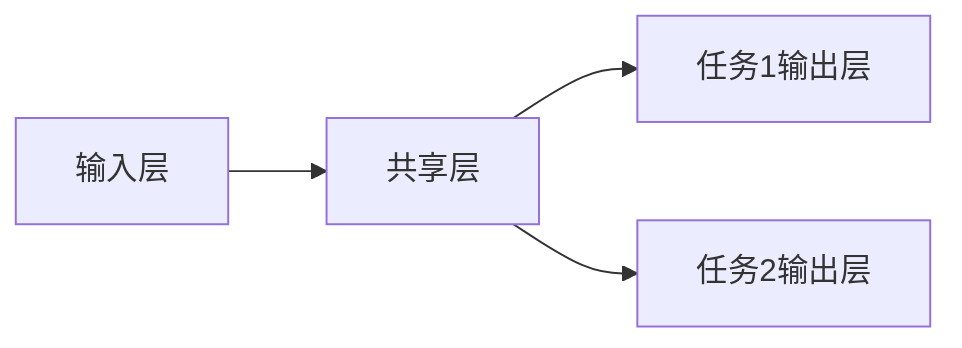
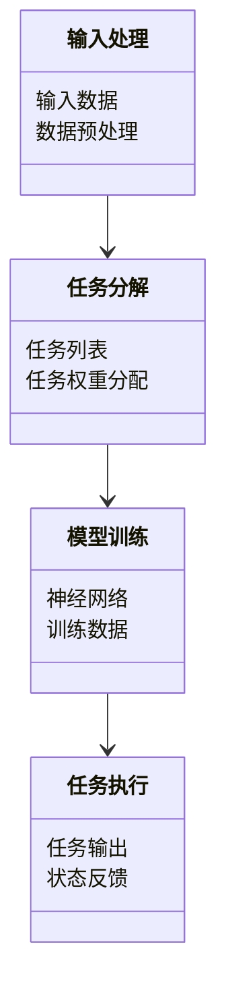
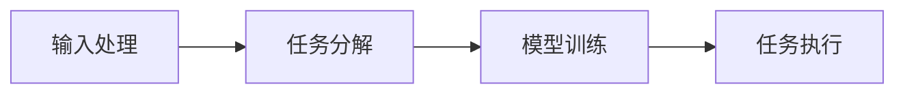
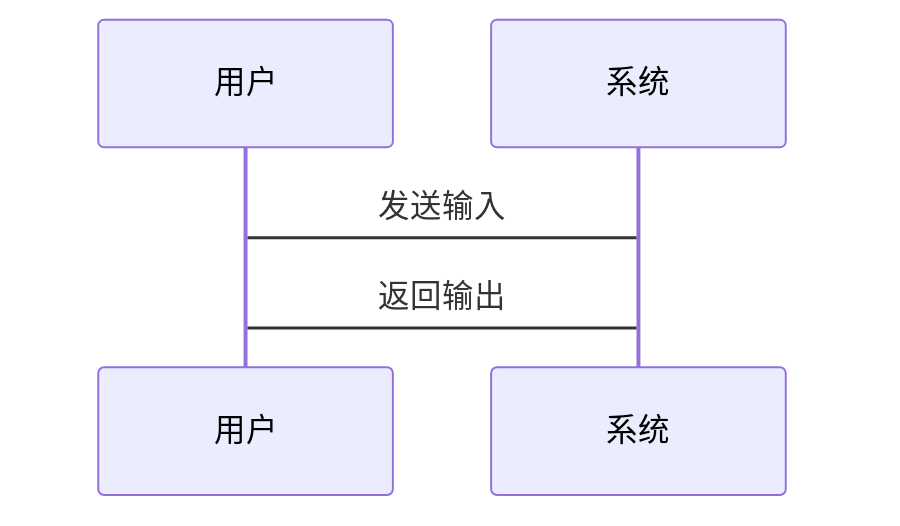

                 


# AI Agent的多任务学习：构建通用智能助手

## 关键词：
AI Agent, 多任务学习, 通用智能助手, 人工智能, 智能系统, 机器学习

## 摘要：
本文深入探讨了AI Agent的多任务学习方法，旨在构建一个能够执行多种任务的通用智能助手。通过分析多任务学习的核心概念、算法原理和系统架构，结合实际项目案例，为读者提供从理论到实践的全面指导。文章内容涵盖背景介绍、核心概念、算法实现、系统设计、项目实战以及最佳实践，帮助读者系统性地理解和掌握AI Agent多任务学习的关键技术。

---

# 第1章: AI Agent与多任务学习概述

## 1.1 AI Agent的基本概念

### 1.1.1 AI Agent的定义与特点
AI Agent（人工智能代理）是指能够感知环境、自主决策并执行任务的智能系统。其特点包括：
- **自主性**：能够在没有外部干预的情况下自主运行。
- **反应性**：能够实时感知环境并做出响应。
- **目标导向性**：以目标为导向，通过优化目标函数来驱动行为。
- **学习能力**：能够通过数据和经验不断优化自身的性能。

### 1.1.2 多任务学习的定义与目标
多任务学习（Multi-Task Learning, MTL）是指在一个统一的模型中同时学习多个任务，使得模型能够共享任务之间的共性特征，从而提高学习效率和泛化能力。其目标是通过共享参数或策略，使模型在多个任务上同时达到较好的性能。

### 1.1.3 AI Agent在多任务学习中的作用
AI Agent通过多任务学习可以同时执行多种任务，例如自然语言处理、图像识别、推理和规划等。这种能力使得AI Agent能够更全面地理解用户需求，并提供更智能的服务。

## 1.2 多任务学习的背景与意义

### 1.2.1 多任务学习的背景介绍
随着人工智能技术的快速发展，单任务模型的局限性逐渐显现。多任务学习通过共享任务之间的信息，能够在减少计算资源消耗的同时提高模型的泛化能力。

### 1.2.2 多任务学习在AI Agent中的应用价值
在AI Agent中应用多任务学习，可以使其具备更强的通用性和适应性，能够处理复杂的现实场景中的多种任务，例如智能客服、自动驾驶和智能家居等。

### 1.2.3 当前研究现状与挑战
当前，多任务学习在AI Agent中的研究主要集中在算法优化和任务协调方面。然而，任务之间的不平衡、参数共享的有效性以及模型的可解释性等问题仍然是研究的难点。

## 1.3 本书的核心目标与结构

### 1.3.1 本书的核心目标
本书旨在系统性地介绍AI Agent的多任务学习方法，帮助读者从理论到实践全面掌握构建通用智能助手的技术。

### 1.3.2 本书的结构安排
本书分为七章，内容涵盖多任务学习的背景、核心概念、算法原理、系统架构、项目实战、最佳实践以及未来展望。

### 1.3.3 本书的读者群体
本书适合人工智能领域的研究人员、开发者以及对AI Agent技术感兴趣的读者阅读。

## 1.4 本章小结
本章主要介绍了AI Agent和多任务学习的基本概念、背景意义以及本书的结构安排，为后续章节的学习奠定了基础。

---

# 第2章: 多任务学习的核心概念与原理

## 2.1 多任务学习的基本原理

### 2.1.1 多任务学习的数学模型
多任务学习的数学模型通常表示为一个优化问题，目标是最小化多个任务的损失函数之和或加权和：

$$ \min_{\theta} \sum_{i=1}^{n} \lambda_i L_i(\theta) $$

其中，$\theta$ 是模型参数，$L_i$ 是第i个任务的损失函数，$\lambda_i$ 是任务权重。

### 2.1.2 任务之间的关系与依赖
任务之间的关系可以通过共享参数或任务分解来实现。共享参数能够捕获任务之间的共性特征，而任务分解则有助于处理任务之间的差异性。

### 2.1.3 多任务学习的优化目标
多任务学习的优化目标是在多个任务之间找到一个平衡点，使得模型在所有任务上都表现良好。

## 2.2 多任务学习的算法框架

### 2.2.1 基于共享参数的多任务学习
基于共享参数的多任务学习通过共享部分网络层来实现任务之间的知识共享。例如，可以在网络的中间层共享参数，而任务特定的层则独立设计。

### 2.2.2 基于任务分解的多任务学习
任务分解方法将多任务学习问题分解为多个子任务，每个子任务负责学习特定的特征或任务。这种方法能够更好地处理任务之间的差异性。

### 2.2.3 基于任务权重的多任务学习
基于任务权重的多任务学习通过动态调整任务权重来平衡任务之间的贡献。任务权重可以根据任务的重要性或数据分布进行调整。

## 2.3 多任务学习的挑战与解决方案

### 2.3.1 任务之间的不平衡问题
当任务之间存在不平衡时，某些任务可能被忽视。解决方案包括任务权重调整和数据采样。

### 2.3.2 参数共享的优化策略
参数共享的有效性取决于任务之间的相似性。可以通过逐步共享参数或分层共享参数来优化共享策略。

### 2.3.3 模型的泛化能力提升
通过引入正则化项或设计更复杂的网络结构，可以提升模型的泛化能力。

## 2.4 本章小结
本章详细讲解了多任务学习的基本原理、算法框架以及面临的挑战和解决方案，为后续章节的实现奠定了理论基础。

---

# 第3章: AI Agent的多任务学习模型

## 3.1 基于神经网络的多任务学习模型

### 3.1.1 神经网络的基本结构
神经网络通常包括输入层、隐藏层和输出层。多任务学习可以通过共享隐藏层的参数来实现。

### 3.1.2 多任务学习中的神经网络架构
多任务学习的神经网络架构可以采用共享层、任务特定层或混合架构。例如：



### 3.1.3 模型的训练与优化
多任务学习模型的训练需要同时优化多个任务的损失函数，通常使用梯度下降等优化算法。

## 3.2 基于注意力机制的多任务学习

### 3.2.1 注意力机制的基本原理
注意力机制通过计算输入序列中各个位置的重要性来选择性关注关键信息。

### 3.2.2 注意力机制在多任务学习中的应用
在多任务学习中，注意力机制可以帮助模型关注与当前任务相关的特征。

### 3.2.3 基于Transformer的多任务学习模型
Transformer模型通过自注意力机制能够有效处理序列数据，适用于多任务学习场景。

## 3.3 基于强化学习的多任务学习

### 3.3.1 强化学习的基本原理
强化学习通过智能体与环境的交互，通过奖励机制来优化策略。

### 3.3.2 强化学习在多任务学习中的应用
多任务强化学习可以通过共享策略或任务分解来实现多个任务的联合优化。

### 3.3.3 基于策略梯度的多任务学习算法
策略梯度方法通过优化策略的参数来最大化累计奖励，适用于多任务场景。

## 3.4 本章小结
本章介绍了几种基于神经网络的多任务学习模型，包括注意力机制和强化学习方法，并讨论了它们在AI Agent中的应用。

---

# 第4章: 多任务学习的数学模型与公式

## 4.1 多任务学习的数学模型

### 4.1.1 多任务学习的损失函数
多任务学习的损失函数通常是一个加权和：

$$ L(\theta) = \sum_{i=1}^{n} \lambda_i L_i(\theta) $$

其中，$\lambda_i$ 是任务权重，$L_i(\theta)$ 是第i个任务的损失函数。

### 4.1.2 任务权重的分配策略
任务权重可以根据任务的重要性或数据分布进行动态调整：

$$ \lambda_i = \frac{1}{\sum_{j=1}^{n} L_j(\theta)} $$

### 4.1.3 参数共享的数学表达
参数共享可以通过共享部分参数来实现：

$$ \theta = \{ \theta_{\text{shared}}, \theta_{\text{task}} \} $$

其中，$\theta_{\text{shared}}$ 是共享参数，$\theta_{\text{task}}$ 是任务特定参数。

## 4.2 基于神经网络的多任务学习公式

### 4.2.1 前馈神经网络的数学表达
前馈神经网络的输出可以表示为：

$$ y = \sigma(Wx + b) $$

其中，$W$ 是权重矩阵，$b$ 是偏置向量，$\sigma$ 是激活函数。

### 4.2.2 多任务学习的联合优化公式
多任务学习的联合优化公式可以表示为：

$$ \min_{\theta} \sum_{i=1}^{n} \lambda_i L_i(\theta) $$

### 4.2.3 注意力机制的数学公式
注意力机制的计算公式为：

$$ \alpha_i = \frac{\exp(e_i)}{\sum_{j=1}^{m} \exp(e_j)} $$

其中，$e_i$ 是第i个位置的注意力得分。

## 4.3 基于强化学习的多任务学习

### 4.3.1 强化学习的损失函数
强化学习的损失函数通常包括策略梯度和值函数：

$$ L(\theta) = \mathbb{E}_{\tau} \left[ -\nabla_{\theta} \log \pi_\theta(a|s) Q(s,a) \right] $$

其中，$\tau$ 是轨迹，$\pi_\theta$ 是策略函数，$Q$ 是值函数。

### 4.3.2 多任务强化学习的优化目标
多任务强化学习的目标是优化多个任务的联合奖励：

$$ \max_{\theta} \sum_{i=1}^{n} \lambda_i R_i(\theta) $$

其中，$R_i(\theta)$ 是第i个任务的奖励函数。

## 4.4 本章小结
本章通过数学公式详细讲解了多任务学习的核心概念和算法原理，为后续章节的实现提供了理论支持。

---

# 第5章: 系统分析与架构设计

## 5.1 项目介绍

### 5.1.1 项目背景
本项目旨在构建一个能够执行多种任务的AI Agent，例如自然语言理解、图像识别和推理等。

### 5.1.2 项目目标
通过多任务学习方法，构建一个通用智能助手，能够同时处理多种任务。

## 5.2 系统功能设计

### 5.2.1 功能模块划分
系统功能模块包括输入处理、任务分解、模型训练和任务执行等。

### 5.2.2 领域模型类图
领域模型类图展示了系统各模块之间的关系：



### 5.2.3 系统架构图
系统架构图展示了系统的整体架构：



### 5.2.4 系统接口设计
系统接口设计包括输入接口、输出接口和训练接口。

### 5.2.5 系统交互序列图
系统交互序列图展示了用户与系统之间的交互流程：



## 5.3 本章小结
本章通过系统分析与架构设计，详细讲解了AI Agent多任务学习项目的实现过程。

---

# 第6章: 项目实战

## 6.1 环境安装

### 6.1.1 安装Python
安装Python 3.8及以上版本。

### 6.1.2 安装依赖库
安装必要的依赖库，例如TensorFlow、Keras和Scikit-learn。

## 6.2 系统核心实现

### 6.2.1 多任务学习模型实现
以下是多任务学习模型的Python代码示例：

```python
import tensorflow as tf
from tensorflow import keras

def create_model():
    input_layer = keras.Input(shape=(input_dim,))
    shared_layer = keras.Dense(64, activation='relu')(input_layer)
    task1_output = keras.Dense(task1_output_dim, activation='softmax')(shared_layer)
    task2_output = keras.Dense(task2_output_dim, activation='softmax')(shared_layer)
    model = keras.Model(inputs=input_layer, outputs=[task1_output, task2_output])
    return model
```

### 6.2.2 任务权重分配实现
任务权重可以通过数据分布或手动调整来实现。

### 6.2.3 模型训练与评估
训练过程包括数据预处理、模型编译和训练。

## 6.3 代码应用解读与分析

### 6.3.1 代码功能解读
代码实现了一个共享层的多任务学习模型。

### 6.3.2 代码优化建议
可以通过调整任务权重或引入正则化项来优化模型性能。

### 6.3.3 模型评估
可以通过准确率、F1分数等指标来评估模型的性能。

## 6.4 实际案例分析

### 6.4.1 案例背景
以自然语言处理和图像识别任务为例。

### 6.4.2 案例实现
实现一个多任务学习模型，同时处理文本分类和图像分类任务。

### 6.4.3 案例分析
分析模型在不同任务上的表现，并总结经验教训。

## 6.5 本章小结
本章通过项目实战，详细讲解了AI Agent多任务学习模型的实现过程，并通过实际案例进行了分析和总结。

---

# 第7章: 最佳实践与注意事项

## 7.1 最佳实践 tips

### 7.1.1 任务权重的调整
根据任务的重要性和数据分布动态调整任务权重。

### 7.1.2 模型的可解释性
通过可视化技术提高模型的可解释性，有助于调试和优化。

### 7.1.3 数据的平衡性
通过数据采样和预处理，确保任务之间的数据平衡。

## 7.2 小结与注意事项

### 7.2.1 小结
本章总结了AI Agent多任务学习项目中的最佳实践和注意事项。

### 7.2.2 注意事项
在实际项目中，需要注意任务之间的依赖关系和模型的泛化能力。

## 7.3 拓展阅读

### 7.3.1 推荐书籍
推荐《Deep Learning》和《Hands-on Machine Learning with Scikit-Learn, Keras, and TensorFlow》。

### 7.3.2 推荐论文
推荐阅读相关领域的最新论文，例如《Multi-Task Learning: A Review》。

## 7.4 本章小结
本章提供了AI Agent多任务学习项目中的最佳实践和注意事项，并推荐了进一步学习的资料。

---

# 第8章: 总结与展望

## 8.1 全书总结
本书系统性地介绍了AI Agent的多任务学习方法，从理论到实践，全面讲解了构建通用智能助手的关键技术。

## 8.2 未来展望
未来，随着人工智能技术的不断发展，多任务学习将在AI Agent中发挥更重要的作用，例如更加复杂的任务协调和更高效的模型优化。

## 8.3 本章小结
本章总结了全书内容，并展望了AI Agent多任务学习的未来发展方向。

---

# 作者：AI天才研究院/AI Genius Institute & 禅与计算机程序设计艺术 /Zen And The Art of Computer Programming

---

以上是《AI Agent的多任务学习：构建通用智能助手》的技术博客文章的完整目录和内容框架，涵盖了从理论到实践的各个方面，希望对读者有所帮助。

