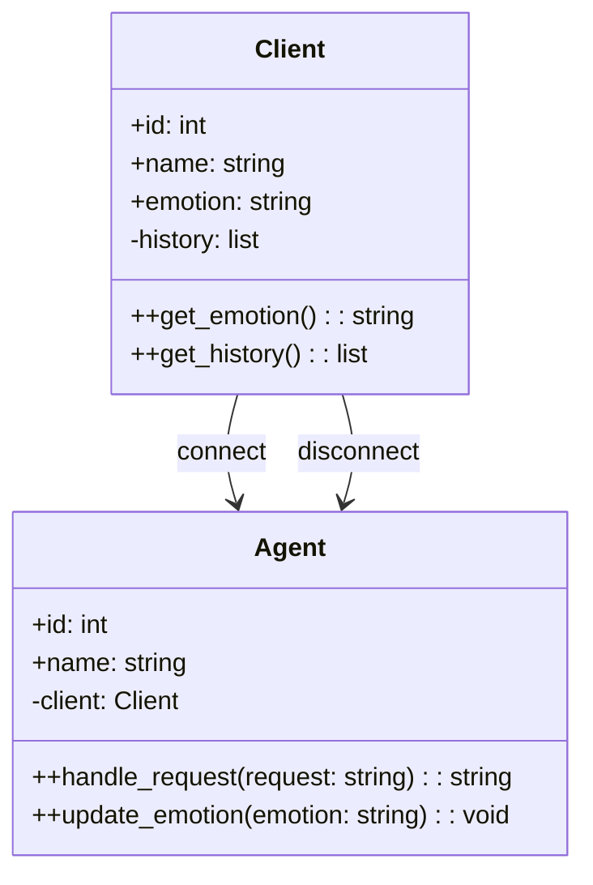
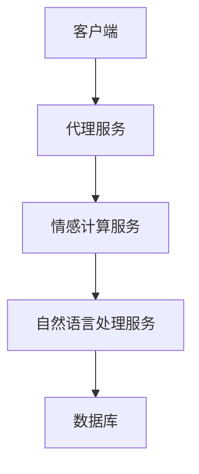
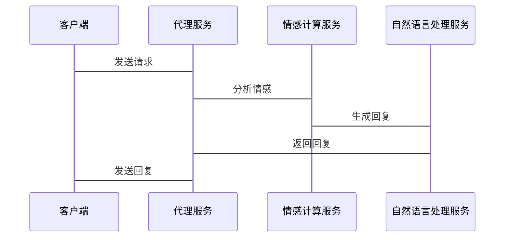
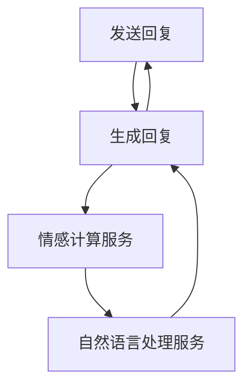

                 


# AI Agent的情感计算在客户服务中的应用

> 关键词：AI Agent，情感计算，客户服务，自然语言处理，机器学习，深度学习

> 摘要：本文探讨了AI Agent在客户服务中的情感计算应用，分析了情感计算的核心技术及其在客户服务中的具体场景。通过详细讲解算法原理、系统架构设计和项目实战，展示了如何利用AI Agent提升客户服务体验。本文还提供了最佳实践和小结，为读者提供了全面的指导。

---

# 第一部分: AI Agent与情感计算基础

## 第1章: 情感计算与AI Agent概述

### 1.1 情感计算的定义与背景

#### 1.1.1 情感计算的定义
情感计算（Affective Computing）是研究如何通过计算手段理解和模拟人类情感的一门学科。它涉及对情感信息的识别、理解和应用，旨在让计算机具备类似人类的感知和情感处理能力。

#### 1.1.2 情感计算的应用场景
情感计算广泛应用于人机交互、教育技术、医疗健康、智能客服等领域。在客户服务中，情感计算可以帮助AI Agent理解客户的情感状态，从而提供更个性化的服务。

#### 1.1.3 情感计算与传统计算的区别
传统计算主要关注逻辑推理和数据处理，而情感计算则强调情感识别和情感驱动的决策。两者的区别在于，传统计算关注“是什么”，而情感计算关注“如何感知和处理情感”。

#### 1.1.4 情感计算的核心要素
情感计算的核心要素包括情感识别、情感理解和情感生成。情感识别是通过传感器或算法获取情感信息；情感理解是对情感信息进行分析和解释；情感生成则是基于情感信息进行反馈和决策。

### 1.2 AI Agent的基本概念

#### 1.2.1 AI Agent的定义
AI Agent（人工智能代理）是一种能够感知环境并采取行动以实现目标的智能实体。它可以是一个软件程序，也可以是一个物理设备，其核心能力包括感知、推理、学习和行动。

#### 1.2.2 AI Agent的分类
AI Agent可以根据功能和智能水平分为以下几类：
- **简单反射型Agent**：基于预定义规则进行简单反应。
- **基于模型的反射型Agent**：利用内部模型进行推理和决策。
- **目标驱动型Agent**：根据目标采取行动。
- **效用驱动型Agent**：通过最大化效用函数来优化决策。

#### 1.2.3 AI Agent的核心功能
AI Agent的核心功能包括：
- **感知环境**：通过传感器或数据输入获取信息。
- **推理与学习**：利用算法对信息进行分析和学习。
- **决策与行动**：基于推理结果采取相应行动。
- **自适应能力**：根据环境变化调整自身行为。

### 1.3 情感计算在AI Agent中的作用

#### 1.3.1 情感计算在AI Agent中的应用
情感计算可以增强AI Agent的感知能力，使其能够理解人类情感并做出相应反应。例如，在智能客服系统中，AI Agent可以通过情感计算识别客户的情绪状态，从而提供更贴心的服务。

#### 1.3.2 情感计算对客户服务的提升
情感计算可以帮助AI Agent更好地理解客户需求和情感状态，从而提高客户满意度和忠诚度。通过情感计算，AI Agent可以实时调整服务策略，提供个性化解决方案。

#### 1.3.3 情感计算与客户满意度的关系
研究表明，客户满意度与情感体验密切相关。情感计算通过优化客户的情感体验，可以显著提高客户满意度和忠诚度。

---

## 第2章: 情感计算的核心技术

### 2.1 情感识别技术

#### 2.1.1 文本情感分析
文本情感分析是通过分析文本内容来判断文本的情感倾向。常用方法包括基于规则的分析和基于机器学习的分析。

#### 2.1.2 声音情感识别
声音情感识别是通过分析语音特征（如音调、语速、语调等）来判断说话人的情感状态。

#### 2.1.3 面部表情识别
面部表情识别是通过分析面部表情特征（如面部肌肉运动、表情特征点）来判断人的感情状态。

### 2.2 自然语言处理技术

#### 2.2.1 语义理解
语义理解是通过自然语言处理技术来理解文本的深层含义。常用的语义理解模型包括词袋模型、n-gram模型和深度学习模型。

#### 2.2.2 情感倾向分析
情感倾向分析是通过分析文本的情感倾向来判断文本是正面、负面还是中性。

#### 2.2.3 对话生成
对话生成是通过自然语言处理技术生成符合上下文和情感需求的对话内容。

### 2.3 机器学习与深度学习

#### 2.3.1 传统机器学习算法
传统机器学习算法包括支持向量机（SVM）、决策树（Decision Tree）、随机森林（Random Forest）等。这些算法在情感计算中被用于分类和回归任务。

#### 2.3.2 深度学习模型
深度学习模型包括卷积神经网络（CNN）、循环神经网络（RNN）、长短时记忆网络（LSTM）等。这些模型在情感计算中被用于文本分类、情感分析和对话生成任务。

#### 2.3.3 情感计算中的特征提取
特征提取是情感计算中的关键步骤。常用的特征包括文本特征、语音特征和面部表情特征。特征提取可以通过手动定义特征或利用自动学习特征的方法进行。

---

## 第3章: AI Agent在客户服务中的应用

### 3.1 客户服务的智能化需求

#### 3.1.1 客户服务的痛点
传统客户服务存在以下痛点：
- **人工成本高**：需要大量人工客服人员。
- **服务效率低**：人工客服响应速度慢，难以满足大规模客户需求。
- **服务质量不稳定**：人工客服情绪波动可能影响服务质量。

#### 3.1.2 AI Agent的解决方案
AI Agent可以通过自动化处理客户需求，提高服务效率和质量。例如，在智能客服系统中，AI Agent可以自动处理客户咨询、解决问题和提供反馈。

#### 3.1.3 情感计算在客户服务中的价值
情感计算可以帮助AI Agent更好地理解客户需求和情感状态，从而提供更贴心的服务。通过情感计算，AI Agent可以实时调整服务策略，提高客户满意度和忠诚度。

### 3.2 AI Agent在客户服务中的具体场景

#### 3.2.1 智能客服对话系统
智能客服对话系统是AI Agent在客户服务中的典型应用。通过自然语言处理技术，AI Agent可以理解和生成人类语言，实现与客户的有效对话。

#### 3.2.2 情感支持与安抚
在某些情况下，客户可能需要情感支持和安抚。AI Agent可以通过情感计算识别客户的情感状态，并提供相应的支持和安抚。

#### 3.2.3 客户反馈分析
AI Agent可以通过情感计算分析客户反馈，识别客户情感倾向，从而优化服务策略。

### 3.3 情感计算在客户服务中的优势

#### 3.3.1 提高客户满意度
通过情感计算，AI Agent可以更好地理解客户需求和情感状态，从而提供更个性化的服务，提高客户满意度。

#### 3.3.2 降低人工成本
AI Agent可以自动化处理大量客户咨询和问题，减少对人工客服的依赖，从而降低人工成本。

#### 3.3.3 提升服务效率
AI Agent可以实时响应客户需求，提高服务效率，减少客户等待时间。

---

## 第4章: 情感计算的算法与实现

### 4.1 情感计算的算法原理

#### 4.1.1 基于规则的情感分析
基于规则的情感分析是通过预定义规则和关键词匹配来判断文本情感倾向。例如，可以通过关键词匹配判断文本是正面、负面还是中性。

#### 4.1.2 基于统计的情感分析
基于统计的情感分析是通过统计特征（如词频、情感词分布）来判断文本情感倾向。常用的统计方法包括支持向量机（SVM）和随机森林（Random Forest）。

#### 4.1.3 基于深度学习的情感分析
基于深度学习的情感分析是通过深度学习模型（如LSTM、Transformer）来学习文本的语义表示，从而判断情感倾向。

#### 4.1.4 情感计算的流程
情感计算的流程包括以下步骤：
1. **数据获取**：获取需要分析的文本、语音或面部表情数据。
2. **特征提取**：从数据中提取相关特征。
3. **情感识别**：通过算法识别情感倾向。
4. **情感理解**：分析情感背后的原因和影响。
5. **情感生成**：基于情感信息生成相应的反馈或决策。

---

## 第5章: 系统分析与架构设计方案

### 5.1 问题场景介绍

#### 5.1.1 客户服务场景
在智能客服系统中，AI Agent需要处理大量的客户咨询和问题。客户的情感状态可能影响他们的需求和期望。

#### 5.1.2 问题描述
传统客服系统存在人工成本高、服务效率低、服务质量不稳定等问题。AI Agent可以通过情感计算解决这些问题，提高客户服务体验。

#### 5.1.3 问题解决
通过情感计算，AI Agent可以实时分析客户情感状态，提供个性化解决方案，提高客户满意度和忠诚度。

#### 5.1.4 边界与外延
AI Agent的情感计算能力是基于情感识别和自然语言处理技术实现的。其边界包括数据输入、情感识别、情感理解和情感生成，外延则涉及具体应用场景的扩展。

### 5.2 项目介绍

#### 5.2.1 项目目标
本项目旨在开发一个基于情感计算的智能客服系统，利用AI Agent提升客户服务体验。

#### 5.2.2 项目范围
项目范围包括系统设计、算法实现、系统集成和测试。

#### 5.2.3 项目计划
项目计划包括需求分析、系统设计、算法实现、系统测试和部署。

### 5.3 系统功能设计

#### 5.3.1 领域模型
领域模型描述了系统的核心功能模块及其交互关系。以下是领域模型的Mermaid类图：



#### 5.3.2 系统架构设计
系统架构设计描述了系统的整体结构和模块划分。以下是系统架构的Mermaid架构图：



#### 5.3.3 系统接口设计
系统接口设计描述了系统模块之间的交互接口。以下是系统接口的Mermaid序列图：



### 5.4 系统交互设计

#### 5.4.1 交互流程
系统交互流程描述了客户与AI Agent之间的交互流程。以下是交互流程的Mermaid流程图：



#### 5.4.2 交互细节
交互细节描述了系统如何根据客户的情感状态调整服务策略。例如，当客户表现出负面情感时，AI Agent会优先处理客户的问题并提供情感支持。

### 5.5 算法实现细节

#### 5.5.1 情感计算算法实现
以下是情感计算算法的Python代码示例：

```python
def calculate_emotion(text):
    # 1. 分词
    words = word_tokenize(text)
    
    # 2. 情感词匹配
    positive_words = ["good", "excellent", "happy"]
    negative_words = ["bad", "terrible", "sad"]
    
    positive_count = sum(1 for word in words if word in positive_words)
    negative_count = sum(1 for word in words if word in negative_words)
    
    # 3. 情感倾向判断
    if positive_count > negative_count:
        return "positive"
    elif negative_count > positive_count:
        return "negative"
    else:
        return "neutral"
```

#### 5.5.2 对话生成算法实现
以下是对话生成算法的Python代码示例：

```python
def generate_response(request):
    # 1. 情感分析
    emotion = calculate_emotion(request)
    
    # 2. 对话生成
    if emotion == "positive":
        response = "Thank you for your positive feedback!"
    elif emotion == "negative":
        response = "I'm sorry to hear about your concerns. Let me help you."
    else:
        response = "How can I assist you today?"
    
    return response
```

---

## 第6章: 项目实战

### 6.1 环境安装

#### 6.1.1 安装Python
需要安装Python 3.6或更高版本。

#### 6.1.2 安装依赖库
需要安装以下依赖库：
- `nltk`：自然语言处理库
- `scikit-learn`：机器学习库
- `transformers`：深度学习模型库

安装命令如下：
```bash
pip install nltk scikit-learn transformers
```

### 6.2 系统核心实现

#### 6.2.1 情感计算实现
以下是情感计算实现的Python代码示例：

```python
from transformers import pipeline

# 初始化情感分析模型
sentiment_pipeline = pipeline("sentiment-analysis")

def analyze_emotion(text):
    result = sentiment_pipeline(text)
    return result[0]["label"]
```

#### 6.2.2 对话生成实现
以下是对话生成实现的Python代码示例：

```python
def generate_response(request):
    emotion = analyze_emotion(request)
    
    if emotion == "POSITIVE":
        response = "Thank you for your positive feedback!"
    elif emotion == "NEGATIVE":
        response = "I'm sorry to hear about your concerns. Let me help you."
    else:
        response = "How can I assist you today?"
    
    return response
```

### 6.3 代码应用解读与分析

#### 6.3.1 情感计算代码解读
上述情感计算代码使用了Hugging Face的`transformers`库中的情感分析模型。`sentiment_pipeline`用于对输入文本进行情感分析，返回情感标签。

#### 6.3.2 对话生成代码解读
对话生成代码基于情感分析结果生成相应的回复。如果客户的情感是正面的，AI Agent会返回感谢的回复；如果是负面的，AI Agent会提供支持和帮助；如果是中性的，AI Agent会询问客户需求。

### 6.4 实际案例分析

#### 6.4.1 案例背景
假设客户发送了以下请求：
"我遇到了一个问题，无法登录系统。"

#### 6.4.2 情感分析
情感计算模型分析客户的情感状态为负面。

#### 6.4.3 对话生成
基于情感分析结果，AI Agent生成以下回复：
"I'm sorry to hear about your concerns. Let me help you."

#### 6.4.4 服务优化
AI Agent可以根据客户的情感状态调整服务策略，例如优先处理负面情感客户的请求，提供更快捷的解决方案。

### 6.5 项目小结

#### 6.5.1 项目总结
通过本项目，我们实现了基于情感计算的智能客服系统，利用AI Agent提升客户服务体验。

#### 6.5.2 项目成果
项目成果包括：
- 开发了一个基于情感计算的智能客服系统。
- 实现了情感计算和对话生成的算法。
- 提供了系统设计和实现的详细文档。

---

## 第7章: 最佳实践与小结

### 7.1 最佳实践

#### 7.1.1 数据质量
情感计算的准确性依赖于数据质量。建议使用高质量的标注数据进行模型训练。

#### 7.1.2 模型选择
根据具体场景选择合适的模型。例如，对于情感分析任务，可以使用预训练的深度学习模型；对于简单的任务，可以使用基于规则的方法。

#### 7.1.3 人机协作
AI Agent可以与人类客服人员协作，共同提供更高质量的服务。例如，AI Agent可以辅助人类客服人员分析客户情感状态，提供个性化的解决方案。

### 7.2 小结

#### 7.2.1 情感计算的重要性
情感计算是AI Agent在客户服务中的核心能力。通过情感计算，AI Agent可以更好地理解客户需求和情感状态，从而提供更个性化的服务。

#### 7.2.2 未来展望
随着深度学习和自然语言处理技术的发展，情感计算在客户服务中的应用将更加广泛和深入。未来的AI Agent将具备更强大的情感理解和生成能力，提供更加智能化的服务。

---

## 第8章: 注意事项与拓展阅读

### 8.1 注意事项

#### 8.1.1 数据隐私
在情感计算中，需要特别注意数据隐私问题。确保客户数据的保密性和安全性。

#### 8.1.2 情感计算的局限性
情感计算目前还存在一些局限性，例如难以处理复杂的情感状态和文化差异。需要在实际应用中不断优化和改进。

#### 8.1.3 技术更新
技术更新非常快，需要持续关注最新的研究成果和技术动态，及时更新和优化系统。

### 8.2 拓展阅读

#### 8.2.1 推荐书籍
- 《Deep Learning》
- 《Affective Computing》

#### 8.2.2 推荐论文
- "A survey on affective computing: A decade of progress"
- "Deep learning for sentiment analysis"

#### 8.2.3 推荐工具
- Hugging Face的Transformers库
- NLTK自然语言处理库

---

## 作者信息

作者：AI天才研究院/AI Genius Institute  
禅与计算机程序设计艺术/Zen And The Art of Computer Programming

---

通过本文，我们详细探讨了AI Agent在客户服务中的情感计算应用，分析了情感计算的核心技术及其在客户服务中的具体场景。通过详细讲解算法原理、系统架构设计和项目实战，展示了如何利用AI Agent提升客户服务体验。希望本文能为读者提供全面的指导和启发。

