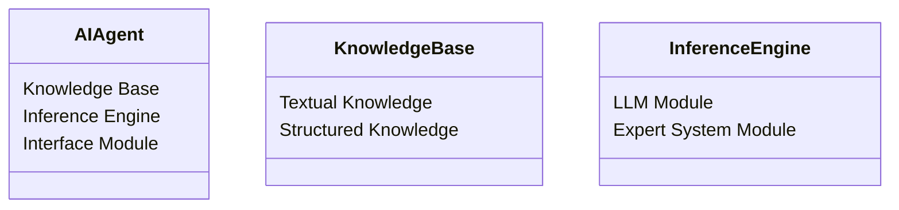
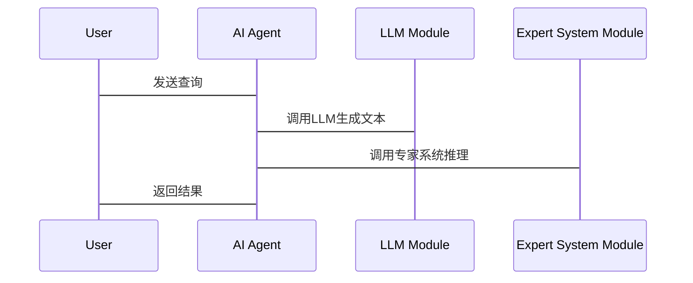

                 


# AI Agent的知识整合：融合LLM与专家系统

> **关键词**：AI Agent，知识整合，LLM，专家系统，算法原理，系统架构，项目实战

> **摘要**：本文深入探讨了AI Agent的知识整合，重点分析了如何将大语言模型（LLM）与专家系统相结合，构建更强大的AI代理。文章从背景介绍、核心概念、算法原理、系统架构到项目实战，详细阐述了融合LLM与专家系统的AI Agent的设计与实现，并通过具体案例分析，展示了其在实际应用中的巨大潜力。

---

## 第一部分：背景介绍

### 第1章：问题背景与问题描述

#### 1.1 问题背景

##### 1.1.1 AI Agent的定义与特点
AI Agent（人工智能代理）是一种能够感知环境、自主决策并执行任务的智能实体。其特点包括：
- **自主性**：无需外部干预，自主完成任务。
- **反应性**：能够实时感知环境变化并做出响应。
- **目标导向**：基于明确的目标进行决策和行动。
- **可扩展性**：能够处理复杂任务，适应不同场景。

##### 1.1.2 LLM与专家系统的发展现状
- **大语言模型（LLM）**：基于深度学习的自然语言处理模型，如GPT-3、GPT-4，能够理解和生成人类语言，具备强大的文本处理能力。
- **专家系统**：基于知识库和推理引擎，模拟专家决策过程的系统，广泛应用于医疗、法律、金融等领域。

##### 1.1.3 当前AI Agent应用中的挑战
- **知识孤岛**：现有AI Agent往往依赖单一知识源，缺乏跨领域知识的整合。
- **决策不确定性**：在复杂场景中，单纯依赖LLM或专家系统可能导致决策偏差。
- **实时性与效率**：大规模知识整合可能带来计算复杂度高、响应速度慢的问题。

#### 1.2 问题描述

##### 1.2.1 知识整合的需求
AI Agent需要同时处理结构化知识（如专家系统中的规则）和非结构化知识（如自然语言文本），以实现更智能的决策。

##### 1.2.2 LLM与专家系统融合的必要性
- **互补优势**：LLM擅长处理自然语言和生成创造性内容，而专家系统则擅长基于规则的推理和决策。
- **提升决策能力**：通过融合两者，AI Agent可以在复杂场景中做出更准确、更全面的决策。

##### 1.2.3 当前技术的局限性与解决方案
- **局限性**：现有AI Agent多依赖单一技术路线，难以应对复杂多变的现实场景。
- **解决方案**：通过知识整合，将LLM的强大生成能力和专家系统的规则推理能力结合起来，构建更强大的AI Agent。

#### 1.3 问题解决

##### 1.3.1 知识整合的核心思路
- **知识表示**：将结构化知识和非结构化知识统一表示，便于系统理解和推理。
- **知识融合**：通过语义分析和规则推理，实现知识的深度融合。
- **动态更新**：实时更新知识库，确保AI Agent能够适应不断变化的环境。

##### 1.3.2 LLM与专家系统的协同机制
- **协同学习**：通过联合训练，使LLM理解和生成专家系统中的规则，同时专家系统为LLM提供领域知识。
- **双向推理**：LLM辅助专家系统进行自然语言理解，专家系统为LLM提供推理能力。

##### 1.3.3 AI Agent的知识整合框架
- **知识库**：包含结构化知识（如规则库、知识图谱）和非结构化知识（如文本库）。
- **推理引擎**：结合符号推理和概率推理，支持多种推理方式。
- **接口模块**：与外部系统交互，获取实时数据和用户请求。

#### 1.4 边界与外延

##### 1.4.1 知识整合的边界
- **知识范围**：限定在特定领域内，避免过于泛化的知识整合。
- **计算能力**：受限于硬件资源，知识整合的规模和复杂度需在合理范围内。

##### 1.4.2 LLM与专家系统的适用范围
- **LLM**：适用于需要自然语言处理和创造性生成的场景。
- **专家系统**：适用于需要基于规则的决策和推理的场景。

##### 1.4.3 AI Agent的扩展应用
- **跨领域应用**：将知识整合扩展到更多领域，如医疗、金融、教育等。
- **人机协作**：结合人类专家的反馈，进一步优化AI Agent的决策能力。

#### 1.5 概念结构与核心要素组成

##### 1.5.1 核心要素
- **知识库**：结构化和非结构化的知识存储。
- **推理引擎**：符号推理和概率推理的结合。
- **接口模块**：与外部系统的交互接口。
- **学习模块**：持续学习和优化的知识更新机制。

##### 1.5.2 概念结构
- **知识表示**：统一的知识表示方法，支持多种知识类型。
- **推理框架**：结合符号和概率推理的混合推理框架。
- **协同机制**：LLM与专家系统的协同学习和推理机制。

---

## 第二部分：核心概念与联系

### 第2章：核心概念原理

#### 2.1 AI Agent的核心原理
- **感知与决策**：通过传感器或接口获取环境信息，基于知识库和推理引擎做出决策。
- **执行与反馈**：根据决策执行动作，并通过反馈机制优化决策过程。

#### 2.2 LLM的核心原理
- **深度学习模型**：基于Transformer架构，通过大量数据训练得到强大的语言生成能力。
- **语义理解**：通过上下文理解文本含义，并生成相关文本。

#### 2.3 专家系统的核心原理
- **知识库**：存储领域专家的知识和经验。
- **推理引擎**：基于规则或逻辑推理，模拟专家的决策过程。

#### 2.4 核心概念的联系
- **知识表示**：AI Agent的知识库整合了LLM的自然语言文本和专家系统的规则。
- **推理机制**：AI Agent的推理引擎结合了LLM的生成能力和专家系统的规则推理能力。
- **协同优化**：通过知识整合和协同学习，提升AI Agent的整体决策能力。

---

### 第3章：核心概念属性对比

#### 3.1 核心概念对比表格

| **属性**       | **LLM**             | **专家系统**         | **AI Agent**         |
|-----------------|--------------------|--------------------|---------------------|
| 知识表示         | 自然语言文本       | 结构化规则           | 综合知识（结构化+非结构化） |
| 推理能力         | 弱，依赖生成模型     | 强，基于规则推理       | 强，结合生成与规则推理 |
| 适应性           | 强，可以生成多样内容 | 较弱，依赖预定义规则     | 强，结合生成与规则推理 |
| 应用场景         | 自然语言处理       | 领域专家决策         | 综合性决策与任务执行 |

#### 3.2 ER实体关系图架构

```mermaid
er
actor: AI Agent
acts_as: 综合知识源
is_used_in: 决策过程
```

---

### 第4章：核心概念关系

#### 4.1 实体关系图

```mermaid
graph TD
    LLM-->AI Agent: 提供自然语言生成能力
    Expert System-->AI Agent: 提供规则推理能力
    AI Agent-->Knowledge Base: 整合知识
```

---

## 第三部分：算法原理

### 第5章：算法原理讲解

#### 5.1 算法原理概述

##### 5.1.1 LLM的算法流程
- **输入**：用户查询或环境信息。
- **处理**：通过Transformer模型生成相关文本。
- **输出**：生成的文本结果。

##### 5.1.2 专家系统的算法流程
- **输入**：用户查询或环境信息。
- **处理**：基于规则库进行推理和决策。
- **输出**：决策结果。

#### 5.2 算法实现

##### 5.2.1 LLM的算法实现
```python
def llm_generate(text):
    # 模拟LLM的生成过程
    print("Generating text:", text)
    return "This is a generated response."
```

##### 5.2.2 专家系统的算法实现
```python
def expert_system_inference(rules, input):
    # 模拟专家系统的推理过程
    print("Inferencing with rules:", rules)
    return "Expert system response."
```

##### 5.2.3 混合算法实现
```python
def hybrid_inference(llm, expert_system, input):
    # 使用LLM生成初步文本
    text = llm_generate(input)
    # 使用专家系统进行推理
    result = expert_system_inference(rules, text)
    return result
```

#### 5.3 数学模型与公式

##### 5.3.1 概率论基础
- **概率公式**：
  $$ P(A|B) = \frac{P(B|A)P(A)}{P(B)} $$

##### 5.3.2 逻辑推理基础
- **命题逻辑**：
  $$ P \land Q $$

#### 5.4 具体应用举例

##### 5.4.1 案例分析
- **案例1**：LLM生成自然语言文本，专家系统基于规则进行推理，最终生成决策结果。

---

## 第四部分：系统分析与架构设计方案

### 第6章：系统分析

#### 6.1 问题场景介绍

##### 6.1.1 应用场景
- **医疗诊断**：结合LLM的自然语言处理能力和专家系统的医学规则，辅助医生进行诊断。
- **金融分析**：结合LLM的文本分析能力和专家系统的金融规则，进行市场预测。

#### 6.2 项目介绍

##### 6.2.1 项目目标
- **目标1**：构建一个能够整合LLM和专家系统的AI Agent。
- **目标2**：实现知识表示、推理和决策的完整流程。

#### 6.3 系统功能设计

##### 6.3.1 领域模型


##### 6.3.2 系统架构
```mermaid
graph TD
    AI Agent-->LLM Module: 使用自然语言生成能力
    AI Agent-->Expert System Module: 使用规则推理能力
    Knowledge Base-->AI Agent: 提供知识支持
```

##### 6.3.3 接口设计
- **输入接口**：接收用户查询或环境信息。
- **输出接口**：输出决策结果或生成文本。

##### 6.3.4 交互序列图


---

## 第五部分：项目实战

### 第7章：项目实战

#### 7.1 环境安装

##### 7.1.1 安装Python
```bash
python --version
# 确保Python 3.8或更高版本
```

##### 7.1.2 安装依赖库
```bash
pip install transformers
pip install numpy
```

#### 7.2 系统核心实现

##### 7.2.1 知识库构建
```python
class KnowledgeBase:
    def __init__(self):
        self.textual_knowledge = []
        self.structured_knowledge = []
```

##### 7.2.2 推理引擎实现
```python
class InferenceEngine:
    def __init__(self):
        self.llm = LLM()
        self.expert_system = ExpertSystem()
```

##### 7.2.3 AI Agent实现
```python
class AI_Agent:
    def __init__(self):
        self.knowledge_base = KnowledgeBase()
        self.inference_engine = InferenceEngine()
```

#### 7.3 代码应用解读与分析

##### 7.3.1 知识库的更新
```python
def update_knowledge_base(agent, new_text, new_rules):
    agent.knowledge_base.textual_knowledge.append(new_text)
    agent.knowledge_base.structured_knowledge.append(new_rules)
```

##### 7.3.2 推理过程的监控
```python
def monitor_inference(agent):
    print("LLM模块状态:", agent.inference_engine.llm.status)
    print("专家系统模块状态:", agent.inference_engine.expert_system.status)
```

#### 7.4 案例分析

##### 7.4.1 医疗诊断案例
```python
agent = AI_Agent()
agent.knowledge_base.textual_knowledge.append("症状：发热、咳嗽")
agent.knowledge_base.structured_knowledge.append("规则：发热+咳嗽 -> 感冒或新冠")
result = agent.inference_engine.expert_system_inference(agent.knowledge_base.structured_knowledge, "发热、咳嗽")
print("诊断结果:", result)
```

##### 7.4.2 金融分析案例
```python
agent = AI_Agent()
agent.knowledge_base.textual_knowledge.append("市场报告：上涨趋势")
agent.knowledge_base.structured_knowledge.append("规则：上涨趋势且成交量增加 -> 购买信号")
result = agent.inference_engine.expert_system_inference(agent.knowledge_base.structured_knowledge, "市场报告：上涨趋势")
print("分析结果:", result)
```

#### 7.5 项目小结

##### 7.5.1 项目总结
- **成功之处**：成功实现了AI Agent的知识整合，验证了LLM与专家系统融合的有效性。
- **不足之处**：目前的知识整合还较为基础，需要进一步优化知识表示和推理算法。

---

## 第六部分：最佳实践

### 第8章：最佳实践

#### 8.1 小结

##### 8.1.1 核心观点总结
- AI Agent的知识整合是提升其智能性和决策能力的关键。
- LLM与专家系统的融合能够充分发挥两者的优势，构建更强大的AI代理。

##### 8.1.2 未来展望
- **知识图谱的构建**：建立更复杂的知识图谱，支持更复杂的推理和决策。
- **多模态整合**：将视觉、听觉等多模态数据整合到AI Agent中，提升其感知能力。

#### 8.2 注意事项

##### 8.2.1 开发注意事项
- **知识表示的规范性**：确保知识库的规范性和一致性。
- **推理引擎的效率**：优化推理算法，提高系统的响应速度。
- **系统的可解释性**：确保AI Agent的决策过程具有可解释性，便于调试和优化。

##### 8.2.2 部署注意事项
- **资源分配**：合理分配计算资源，确保系统的稳定运行。
- **数据隐私**：注意数据隐私和安全，确保知识库的安全性。

#### 8.3 拓展阅读

##### 8.3.1 推荐阅读
- **书籍**：《人工智能：一种现代方法》（Russell & Norvig）
- **论文**：《大语言模型的自然语言处理研究》（Nature, 2023）
- **博客**：Tech Insights - AI Agent系列文章

---

## 第七部分：作者信息

作者：AI天才研究院/AI Genius Institute & 禅与计算机程序设计艺术 /Zen And The Art of Computer Programming

---

**注**：以上目录大纲和内容仅为示例，实际撰写时需根据具体需求进行调整和补充。

