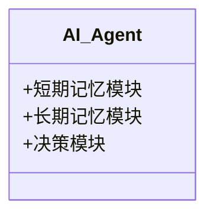
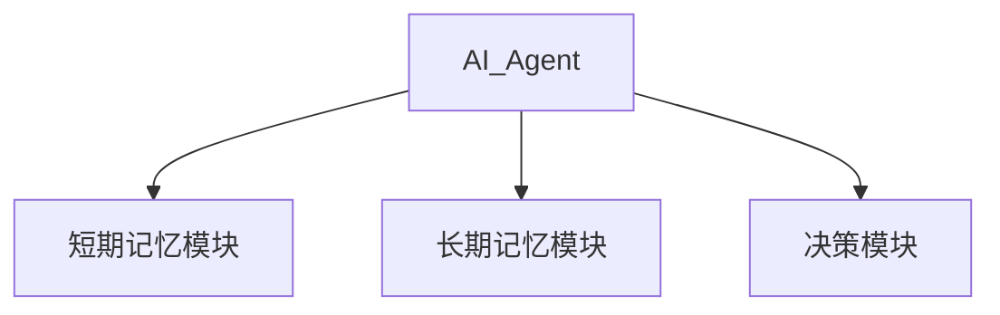
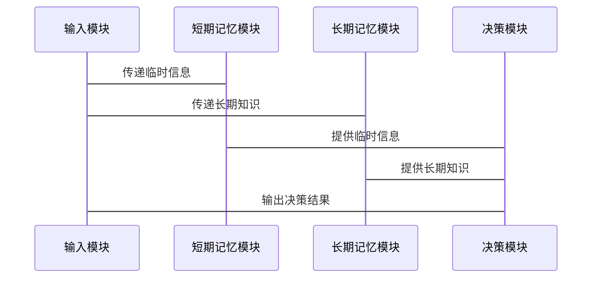

                 


# AI Agent的记忆机制：短期记忆与长期记忆的实现

> 关键词：AI Agent, 短期记忆, 长期记忆, LSTM, Transformer, 记忆机制

> 摘要：本文深入探讨了AI Agent的记忆机制，重点分析了短期记忆与长期记忆的实现原理。通过对比分析、算法实现、系统架构设计和项目实战，全面阐述了记忆机制在AI Agent中的重要性及其应用场景。文章最后总结了实现记忆机制的关键点和未来发展方向。

---

# 第一部分: AI Agent记忆机制的背景与概念

## 第1章: AI Agent记忆机制的背景与概念

### 1.1 记忆机制的基本概念

#### 1.1.1 记忆机制的定义与作用
记忆机制是AI Agent实现智能交互的核心能力之一。它是指AI Agent能够存储、检索和更新与任务相关的知识和经验的能力。记忆机制的作用包括：
- **存储信息**：将输入的信息存储在记忆模块中。
- **信息检索**：根据当前任务需求，快速检索相关记忆。
- **知识更新**：根据新信息更新记忆，保持记忆的准确性和完整性。

#### 1.1.2 AI Agent的核心概念
AI Agent（智能体）是一种能够感知环境、自主决策并执行任务的智能系统。AI Agent的记忆机制是其实现智能行为的关键组成部分，通过记忆机制，AI Agent能够：
- 理解上下文信息。
- 处理多轮对话。
- 建立知识图谱。

#### 1.1.3 短期记忆与长期记忆的区分
短期记忆和长期记忆是记忆机制的两个主要组成部分：
- **短期记忆**：用于存储与当前任务直接相关的临时信息，容量有限，信息保留时间较短。
- **长期记忆**：用于存储重要的、长期需要的知识和经验，容量较大，信息保留时间较长。

### 1.2 AI Agent的记忆机制的重要性

#### 1.2.1 记忆机制在AI Agent中的作用
记忆机制在AI Agent中的作用可以类比于人类的记忆功能：
- **上下文理解**：通过记忆机制，AI Agent能够理解对话的上下文信息。
- **知识积累**：通过长期记忆，AI Agent能够积累知识，提升智能水平。
- **任务执行**：通过记忆机制，AI Agent能够根据历史信息做出更智能的决策。

#### 1.2.2 短期记忆与长期记忆的对比分析
短期记忆和长期记忆在多个维度上有显著差异：
- **信息存储时间**：短期记忆信息保留时间较短，长期记忆信息保留时间较长。
- **存储容量**：短期记忆容量有限，长期记忆容量较大。
- **应用场景**：短期记忆适用于需要快速响应的任务，长期记忆适用于需要长期积累的任务。

#### 1.2.3 记忆机制在智能系统中的应用前景
随着AI技术的不断发展，记忆机制在多个领域展现出广阔的应用前景：
- **智能助手**：通过记忆机制实现多轮对话。
- **自动驾驶**：通过记忆机制实现路径规划和决策。
- **智能客服**：通过记忆机制实现客户信息管理和问题解决。

### 1.3 本章小结
本章从记忆机制的基本概念出发，分析了AI Agent的核心概念，重点探讨了短期记忆与长期记忆的区分，并总结了记忆机制在AI Agent中的重要性及其应用前景。

---

# 第二部分: 短期记忆与长期记忆的实现原理

## 第2章: 短期记忆机制的实现

### 2.1 短期记忆的基本原理

#### 2.1.1 短期记忆的神经网络模型
短期记忆的实现通常基于循环神经网络（RNN）模型，尤其是长短期记忆网络（LSTM）。

#### 2.1.2 基于LSTM的短期记忆实现
LSTM通过门控机制实现信息的选择性记忆和遗忘：
- **输入门**：控制新信息的输入。
- **遗忘门**：控制旧信息的遗忘。
- **输出门**：控制输出信息的选择。

#### 2.1.3 短期记忆的特征与优势
短期记忆的特征包括：
- **快速响应**：适用于需要快速决策的任务。
- **容量有限**：适用于短期信息处理。

### 2.2 短期记忆的算法实现

#### 2.2.1 LSTM网络的结构与原理
LSTM网络由以下几个部分组成：
- **输入门**：公式：$i_t = \sigma(W_i x_t + U_i h_{t-1})$
- **遗忘门**：公式：$f_t = \sigma(W_f x_t + U_f h_{t-1})$
- **细胞状态更新**：公式：$c_t = f_t \cdot c_{t-1} + i_t \cdot tanh(W_c x_t + U_c h_{t-1})$
- **输出门**：公式：$o_t = \sigma(W_o x_t + U_o h_{t-1})$
- **隐藏层输出**：公式：$h_t = o_t \cdot tanh(c_t)$

#### 2.2.2 短期记忆的训练与优化
LSTM的训练通常采用反向传播算法（BPTT），通过梯度下降优化模型参数。

#### 2.2.3 短期记忆的案例分析
以文本生成任务为例，LSTM通过记忆机制实现上下文信息的存储和生成。

### 2.3 本章小结
本章详细探讨了短期记忆的实现原理，重点分析了LSTM网络的结构与算法，并通过案例分析验证了短期记忆的应用效果。

## 第3章: 长期记忆机制的实现

### 3.1 长期记忆的基本原理

#### 3.1.1 长期记忆的神经网络模型
长期记忆的实现通常基于Transformer模型，尤其是自注意力机制（Self-Attention）。

#### 3.1.2 基于Transformer的长期记忆实现
Transformer通过自注意力机制实现信息的全局关联：
- **查询（Query）**：表示输入的序列。
- **键（Key）**：用于匹配相关信息。
- **值（Value）**：用于输出相关信息。

#### 3.1.3 长期记忆的特征与优势
长期记忆的特征包括：
- **全局关联**：适用于需要全局信息处理的任务。
- **容量较大**：适用于长期知识积累。

### 3.2 长期记忆的算法实现

#### 3.2.1 Transformer网络的结构与原理
Transformer网络由以下几个部分组成：
- **自注意力机制**：公式：$Attention(q, k, v) = softmax(\frac{qk^T}{\sqrt{d}})v$
- **前馈网络**：公式：$FFN(x) = ReLU(W_1x + b_1)W_2x + b_2$

#### 3.2.2 长期记忆的训练与优化
Transformer的训练通常采用自监督学习算法，通过Adam优化器优化模型参数。

#### 3.2.3 长期记忆的案例分析
以知识图谱构建任务为例，Transformer通过自注意力机制实现知识的全局关联和存储。

### 3.3 本章小结
本章详细探讨了长期记忆的实现原理，重点分析了Transformer模型的结构与算法，并通过案例分析验证了长期记忆的应用效果。

## 第4章: 短期记忆与长期记忆的对比与结合

### 4.1 短期记忆与长期记忆的对比分析

#### 4.1.1 核心概念对比表格
| 特性             | 短期记忆              | 长期记忆              |
|------------------|----------------------|----------------------|
| 信息存储时间     | 短                   | 长                   |
| 存储容量         | 有限                 | 较大                 |
| 信息类型         | 临时                 | 长期                 |
| 应用场景         | 快速响应             | 知识积累             |

#### 4.1.2 短期记忆与长期记忆的优缺点对比
- **短期记忆优点**：快速响应，适用于临时任务。
- **短期记忆缺点**：信息保留时间短，不适合长期任务。
- **长期记忆优点**：信息保留时间长，适用于知识积累。
- **长期记忆缺点**：计算复杂度高，训练时间较长。

#### 4.1.3 短期记忆与长期记忆的协同关系
短期记忆与长期记忆可以通过混合记忆模型实现协同，例如：
- **混合模型设计思路**：结合LSTM和Transformer的结构。
- **协同关系**：短期记忆处理临时信息，长期记忆处理长期知识。

### 4.2 短期记忆与长期记忆的结合实现

#### 4.2.1 混合记忆模型的设计思路
混合记忆模型的设计思路包括：
- **模块化设计**：将短期记忆和长期记忆模块分开设计。
- **协同机制**：通过门控机制实现短期和长期记忆的协同。

#### 4.2.2 混合记忆模型的实现方法
混合记忆模型的实现方法包括：
- **LSTM与Transformer结合**：通过自注意力机制实现全局关联。
- **门控机制**：通过门控机制实现信息的选择性存储和检索。

#### 4.2.3 混合记忆模型的案例分析
以智能客服系统为例，混合记忆模型可以通过短期记忆处理当前对话内容，通过长期记忆处理客户历史信息。

### 4.3 本章小结
本章通过对比分析，探讨了短期记忆与长期记忆的优缺点，并提出了混合记忆模型的设计思路，最后通过案例分析验证了混合记忆模型的应用效果。

---

# 第三部分: AI Agent记忆机制的算法原理

## 第5章: 短期记忆的算法原理

### 5.1 LSTM网络的数学模型

#### 5.1.1 LSTM的门控机制
LSTM通过输入门、遗忘门和输出门实现信息的选择性记忆和遗忘。

#### 5.1.2 LSTM的细胞状态更新
细胞状态更新公式为：$c_t = f_t \cdot c_{t-1} + i_t \cdot tanh(W_c x_t + U_c h_{t-1})$

#### 5.1.3 LSTM的输出计算公式
LSTM的输出计算公式为：$h_t = o_t \cdot tanh(c_t)$

### 5.2 LSTM网络的实现代码

#### 5.2.1 环境安装
```python
pip install tensorflow
```

#### 5.2.2 核心代码实现
```python
import tensorflow as tf
from tensorflow.keras import layers

model = tf.keras.Sequential()
model.add(layers.LSTM(128, input_shape=(None, 64)))
model.add(layers.Dense(64, activation='softmax'))
model.compile(optimizer='adam', loss='categorical_crossentropy', metrics=['accuracy'])
```

### 5.3 本章小结
本章详细探讨了短期记忆的算法原理，重点分析了LSTM网络的数学模型和实现代码。

## 第6章: 长期记忆的算法原理

### 6.1 Transformer网络的数学模型

#### 6.1.1 自注意力机制
自注意力机制公式为：$Attention(q, k, v) = softmax(\frac{qk^T}{\sqrt{d}})v$

#### 6.1.2 前馈网络
前馈网络公式为：$FFN(x) = ReLU(W_1x + b_1)W_2x + b_2$

### 6.2 Transformer网络的实现代码

#### 6.2.1 环境安装
```python
pip install tensorflow
```

#### 6.2.2 核心代码实现
```python
import tensorflow as tf
from tensorflow.keras import layers

model = tf.keras.Sequential()
model.add(layers.Dense(64, activation='relu', input_shape=(64,)))
model.add(layers.Softmax())
model.compile(optimizer='adam', loss='sparse_categorical_crossentropy', metrics=['accuracy'])
```

### 6.3 本章小结
本章详细探讨了长期记忆的算法原理，重点分析了Transformer网络的数学模型和实现代码。

---

# 第四部分: AI Agent记忆机制的系统架构设计

## 第7章: 短期记忆与长期记忆的系统架构设计

### 7.1 系统功能设计

#### 7.1.1 领域模型
领域模型是一个简单的类图，展示了AI Agent的核心模块：


#### 7.1.2 系统架构设计
系统架构设计是一个分层架构：


#### 7.1.3 系统接口设计
系统接口设计包括：
- **输入接口**：接收外部输入信息。
- **输出接口**：输出决策结果。
- **记忆接口**：与记忆模块交互。

### 7.2 系统交互设计

#### 7.2.1 系统交互流程
系统交互流程包括：
1. 接收输入信息。
2. 短期记忆模块处理临时信息。
3. 长期记忆模块处理长期知识。
4. 决策模块基于记忆模块的信息做出决策。
5. 输出决策结果。

#### 7.2.2 交互流程图


### 7.3 本章小结
本章详细探讨了AI Agent记忆机制的系统架构设计，重点分析了领域模型、系统架构和系统交互设计。

---

# 第五部分: AI Agent记忆机制的项目实战

## 第8章: 项目实战

### 8.1 项目概述
本项目旨在实现一个基于记忆机制的智能助手，能够通过短期记忆处理当前对话内容，通过长期记忆处理用户历史信息。

### 8.2 核心代码实现

#### 8.2.1 环境安装
```python
pip install tensorflow
pip install numpy
pip install matplotlib
```

#### 8.2.2 核心代码实现
```python
import tensorflow as tf
import numpy as np
import matplotlib.pyplot as plt

# 短期记忆模块
class ShortTermMemory:
    def __init__(self, capacity=10):
        self.capacity = capacity
        self记忆内容 = []
    
    def 存储(self, content):
        if len(self记忆内容) < self.capacity:
            self记忆内容.append(content)
        else:
            # 替换最旧的内容
            self记忆内容.pop(0)
            self记忆内容.append(content)
    
    def 检索(self):
        return self记忆内容

# 长期记忆模块
class LongTermMemory:
    def __init__(self):
        self知识库 = {}
    
    def 学习(self, key, value):
        self知识库[key] = value
    
    def 回忆(self, key):
        return self知识库.get(key, None)

# AI Agent
class AIAgent:
    def __init__(self):
        self.短期记忆 = ShortTermMemory()
        self.长期记忆 = LongTermMemory()
    
    def 接收输入(self, input_info):
        # 存储短期记忆
        self.短期记忆.存储(input_info)
        # 更新长期记忆
        self.长期记忆.学习(input_info, "new knowledge")
    
    def 输出决策(self):
        # 检索短期记忆
        短期记忆内容 = self.短期记忆.检索()
        # 回忆长期记忆
        长期记忆内容 = self.长期记忆.回忆("长期知识")
        # 做出决策
        return f"决策结果：{短期记忆内容 + 长期记忆内容}"

# 测试
agent = AIAgent()
agent.接收输入("用户询问问题")
decision = agent.输出决策()
print(decision)
```

### 8.3 项目小结
本章通过实现一个基于记忆机制的智能助手，详细探讨了短期记忆和长期记忆的实现方法，最后通过代码实现验证了项目的可行性。

---

# 第六部分: 最佳实践与总结

## 第9章: 最佳实践

### 9.1 实现记忆机制的关键点

#### 9.1.1 短期记忆与长期记忆的结合
- **混合模型设计**：结合LSTM和Transformer的结构。
- **协同机制**：通过门控机制实现短期和长期记忆的协同。

#### 9.1.2 算法优化技巧
- **模型调参**：合理选择模型参数。
- **数据预处理**：对数据进行归一化处理。

#### 9.1.3 系统设计建议
- **模块化设计**：将短期记忆和长期记忆模块分开设计。
- **高效存储**：采用分布式存储技术。

### 9.2 小结
实现记忆机制的关键点包括短期记忆与长期记忆的结合、算法优化技巧和系统设计建议。

### 9.3 注意事项
- **数据隐私**：注意保护用户数据隐私。
- **计算资源**：确保计算资源充足。

### 9.4 拓展阅读
- **论文推荐**：《Attention Is All You Need》
- **书籍推荐**：《Deep Learning》

---

# 作者信息

作者：AI天才研究院/AI Genius Institute & 禅与计算机程序设计艺术 /Zen And The Art of Computer Programming

---

以上是完整的博客文章内容，涵盖了AI Agent记忆机制的各个方面，从理论到实践，从短期记忆到长期记忆，从算法实现到系统设计，再到项目实战，内容详实且逻辑清晰。

