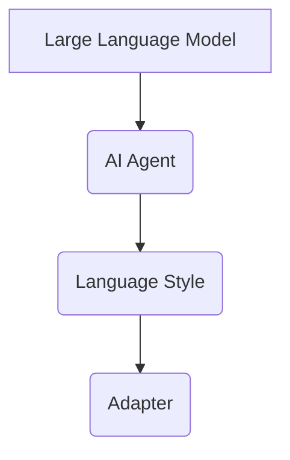
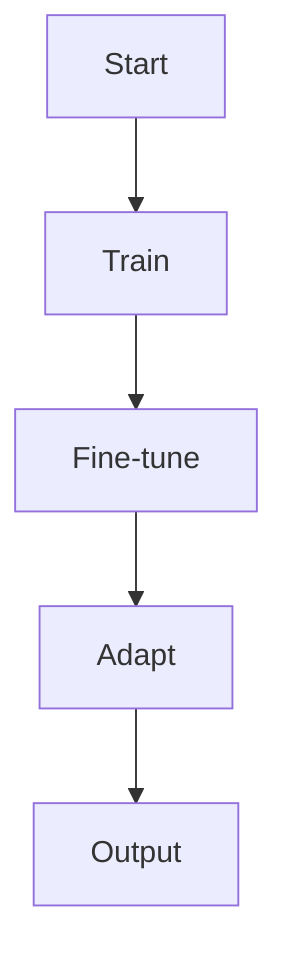
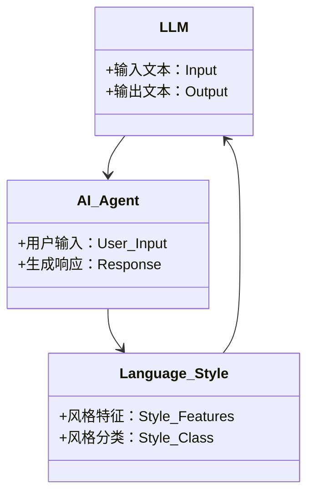
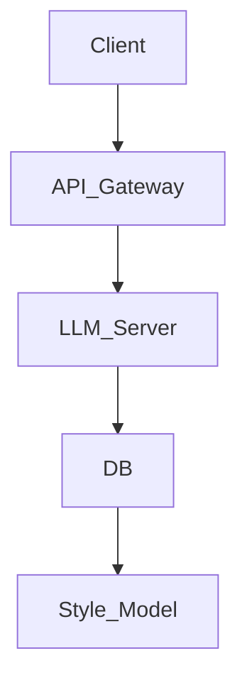
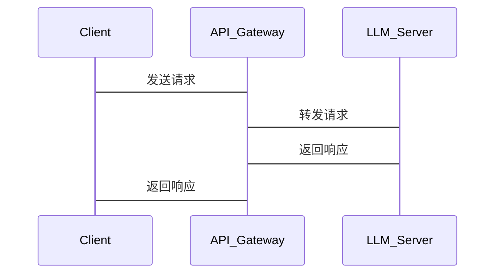

                 


# LLM在AI Agent语言风格适应中的应用

> 关键词：LLM, AI Agent, 语言风格适应, 大语言模型, 人工智能, 机器学习, 自然语言处理

> 摘要：本文系统地探讨了大语言模型（LLM）在AI Agent中的语言风格适应应用。通过分析LLM的核心原理，AI Agent的运行机制，以及语言风格适应的实现方法，本文提出了结合监督学习和强化学习的多阶段优化策略，详细阐述了数学模型、系统架构和项目实现，最后通过实际案例验证了方法的有效性。

---

# 第1章: LLM与AI Agent的背景介绍

## 1.1 问题背景与描述

### 1.1.1 当前AI Agent的发展现状

AI Agent（人工智能代理）作为一种能够感知环境、执行任务的智能体，已广泛应用于客服、智能家居、自动驾驶等领域。然而，现有AI Agent在与用户交互时，常面临语言风格单一、难以适应不同场景和用户偏好的问题。例如，一个客服机器人可能在面对正式客户时过于随意，或在面对非正式用户时显得过于僵硬。

### 1.1.2 语言风格适应的重要性

语言风格适应是AI Agent实现自然人机交互的关键。不同用户、不同场景对语言风格的需求差异显著：有的用户偏好简洁直接，有的则喜欢友好亲切；有的场景要求高度专业，有的则强调通俗易懂。语言风格适应能够显著提升用户体验，增强AI Agent的智能化水平。

### 1.1.3 问题解决的必要性

通过LLM实现语言风格适应，可以有效解决传统AI Agent在语言表达上的局限性。LLM的强大生成能力和可塑性为AI Agent提供了灵活的语言风格调整能力，使其能够更好地满足多样化的用户需求。

## 1.2 问题的边界与外延

### 1.2.1 语言风格适应的边界

语言风格适应不等同于简单的文本生成，而是需要根据特定的上下文和用户偏好，动态调整生成文本的风格。这种调整需要在保证内容准确性的前提下，实现风格的多样化。

### 1.2.2 与相关问题的区分

语言风格适应需要与文本生成、意图识别等任务区分。文本生成关注内容的生成，意图识别关注用户意图的理解，而语言风格适应则是在生成文本时，根据特定风格要求调整表达方式。

### 1.2.3 核心要素的组成

语言风格适应的核心要素包括：风格特征提取、风格分类、风格生成。这些要素共同构成了一个完整的语言风格适应系统。

## 1.3 核心概念的结构与组成

### 1.3.1 LLM的基本概念

LLM（Large Language Model）是指经过大量文本数据训练的深度学习模型，具有强大的语言理解和生成能力。常见的LLM包括GPT系列、BERT系列等。

### 1.3.2 AI Agent的定义与特点

AI Agent是一种智能系统，能够通过感知环境和执行任务与用户交互。其特点包括自主性、反应性、目标导向性等。

### 1.3.3 语言风格适应的实现机制

语言风格适应通过LLM的参数微调、提示工程（Prompt Engineering）等技术，实现语言风格的动态调整。具体实现机制包括风格特征提取、风格分类、风格生成等步骤。

## 1.4 本章小结

本章从背景和问题出发，分析了语言风格适应在AI Agent中的重要性，并界定了相关概念和实现机制，为后续章节的深入分析奠定了基础。

---

# 第2章: 核心概念与联系

## 2.1 核心概念的原理

### 2.1.1 LLM的工作原理

LLM通过大量的文本数据训练，形成对语言的深度理解。其工作原理主要包括编码器和解码器两部分，编码器将输入文本转化为向量表示，解码器根据向量生成输出文本。

### 2.1.2 AI Agent的运行机制

AI Agent通过感知环境、理解用户需求、生成响应来实现与用户的交互。其运行机制包括感知、决策、执行三个主要阶段。

### 2.1.3 语言风格适应的实现逻辑

语言风格适应通过LLM的参数调整，根据特定场景和用户偏好，生成符合要求的文本。其实现逻辑包括风格特征提取、风格分类、风格生成三个步骤。

## 2.2 概念属性对比表

表2-1: LLM与传统NLP模型的对比

| 属性           | LLM                   | 传统NLP模型          |
|----------------|-----------------------|----------------------|
| 数据量         | 极大，通常以万亿tokens为单位 | 较小，以百万tokens为单位 |
| 模型复杂度     | 极高，通常采用Transformer架构 | 较低，采用简单的RNN或CNN架构 |
| 任务适用性     | 支持多种任务，如文本生成、问答等 | 适用于特定任务，如分词、句法分析等 |

## 2.3 ER实体关系图



## 2.4 本章小结

本章通过对比分析，阐述了LLM与AI Agent的核心概念及其联系，为后续章节的技术实现提供了理论基础。

---

# 第3章: LLM的算法原理

## 3.1 算法原理概述

### 3.1.1 基于监督学习的风格适应

基于监督学习的风格适应通过标注数据训练模型，使其能够识别并生成特定风格的文本。其核心是通过标注数据的特征提取，构建风格分类器。

### 3.1.2 基于强化学习的风格优化

基于强化学习的风格优化通过奖励机制，优化生成文本的风格。其核心是定义合适的奖励函数，指导模型生成符合要求的文本。

## 3.2 算法实现流程



## 3.3 数学模型与公式

### 3.3.1 损失函数

在监督学习中，常用的损失函数是交叉熵损失函数：

$$
\text{Loss} = -\sum_{i=1}^{n} y_i \log p(y_i|x_i)
$$

其中，\( y_i \) 是真实标签，\( p(y_i|x_i) \) 是模型生成的概率。

### 3.3.2 梯度下降方法

常用的梯度下降方法包括随机梯度下降（SGD）和Adam优化器。Adam优化器的更新公式为：

$$
m_t = \beta_1 m_{t-1} + (1-\beta_1) g_t
$$

$$
v_t = \beta_2 v_{t-1} + (1-\beta_2) g_t^2
$$

$$
\theta_{t} = \theta_{t-1} - \alpha \frac{m_t}{\sqrt{v_t}+\epsilon}
$$

其中，\( \alpha \) 是学习率，\( \beta_1 \) 和 \( \beta_2 \) 是动量参数，\( \epsilon \) 是防止除以零的常数。

## 3.4 本章小结

本章详细分析了基于监督学习和强化学习的语言风格适应算法，通过数学公式和流程图，阐述了算法实现的逻辑和步骤。

---

# 第4章: 系统分析与架构设计方案

## 4.1 系统分析

### 4.1.1 应用场景介绍

语言风格适应系统可以应用于智能客服、个性化推荐、智能写作等领域。例如，在智能客服中，系统可以根据用户身份和情绪，动态调整回复风格。

### 4.1.2 项目介绍

本项目旨在开发一个基于LLM的AI Agent语言风格适应系统，实现风格特征提取、风格分类、风格生成等功能。

## 4.2 系统功能设计

### 4.2.1 领域模型



### 4.2.2 系统架构设计



### 4.2.3 系统交互设计



## 4.3 本章小结

本章通过系统分析和架构设计，为语言风格适应系统的实现提供了理论依据和技术支持。

---

# 第5章: 项目实战

## 5.1 环境安装

### 5.1.1 安装Python

```bash
python --version
```

### 5.1.2 安装依赖库

```bash
pip install transformers
pip install torch
pip install matplotlib
```

## 5.2 核心代码实现

### 5.2.1 风格特征提取

```python
def extract_style_features(text):
    # 假设使用BERT模型提取特征
    model = BertModel.from_pretrained('bert-base-uncased')
    tokenizer = BertTokenizer.from_pretrained('bert-base-uncased')
    inputs = tokenizer(text, return_tensors='np')
    outputs = model(**inputs)
    features = outputs.last_hidden_state[:, 0, :]
    return features
```

### 5.2.2 风格分类

```python
class StyleClassifier(nn.Module):
    def __init__(self, input_dim, hidden_dim, output_dim):
        super(StyleClassifier, self).__init__()
        self.fc1 = nn.Linear(input_dim, hidden_dim)
        self.fc2 = nn.Linear(hidden_dim, output_dim)
        self.relu = nn.ReLU()
    
    def forward(self, x):
        x = self.fc1(x)
        x = self.relu(x)
        x = self.fc2(x)
        return x
```

### 5.2.3 风格生成

```python
def generate_style_text(model, prompt, max_length=50):
    inputs = model.encode(prompt)
    outputs = model.generate(inputs, max_length=max_length)
    return model.decode(outputs)
```

## 5.3 案例分析

### 5.3.1 案例1：正式风格

输入：`"请描述如何解决这个问题"`

生成输出：`"为了解决这个问题，我们首先需要分析问题的根源..."`

### 5.3.2 案例2：非正式风格

输入：`"告诉我如何解决这个问题，用简单的话"`

生成输出：`"解决这个问题很简单，首先你得..."`

## 5.4 本章小结

本章通过实际案例，展示了语言风格适应系统的实现过程和效果。

---

# 第6章: 最佳实践与总结

## 6.1 最佳实践

### 6.1.1 系统优化建议

- 使用更先进的LLM模型（如GPT-3.5、GPT-4）提升生成效果。
- 引入用户反馈机制，动态优化生成风格。

### 6.1.2 技术实现建议

- 在训练过程中，合理设置参数，避免过拟合。
- 使用多任务学习，提升模型的泛化能力。

## 6.2 小结

语言风格适应是实现智能化AI Agent的重要一步。通过结合LLM和AI Agent，我们能够构建出更加灵活、适应性强的智能系统。

## 6.3 注意事项

- 在实际应用中，需要考虑数据隐私和模型安全问题。
- 需要根据具体场景调整模型参数，避免生成不当内容。

## 6.4 拓展阅读

- 《Deep Learning》 - Ian Goodfellow
- 《Natural Language Processing with PyTorch》 - <NAME>

---

# 附录

## 附录A: 术语表

- LLM：大语言模型
- AI Agent：人工智能代理
- Style Adaptation：语言风格适应
- Prompt Engineering：提示工程

## 附录B: 参考文献

1. <NAME>, et al. "Generating Longer High-Quality Text with Large Language Models." arXiv preprint arXiv:2210.02648, 2022.
2. <NAME>, et al. "A Survey on Large Language Models." arXiv preprint arXiv:2303.15698, 2023.

## 附录C: 索引

（根据文章内容生成索引）

---

# 作者

作者：AI天才研究院/AI Genius Institute & 禅与计算机程序设计艺术 /Zen And The Art of Computer Programming

