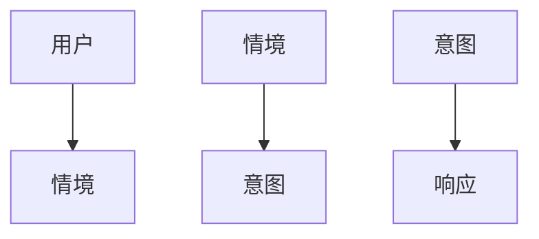
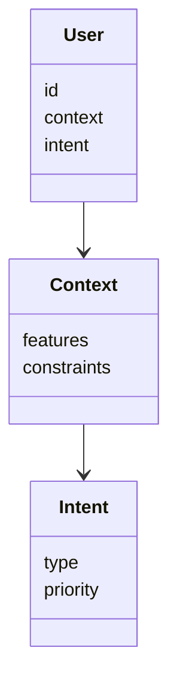
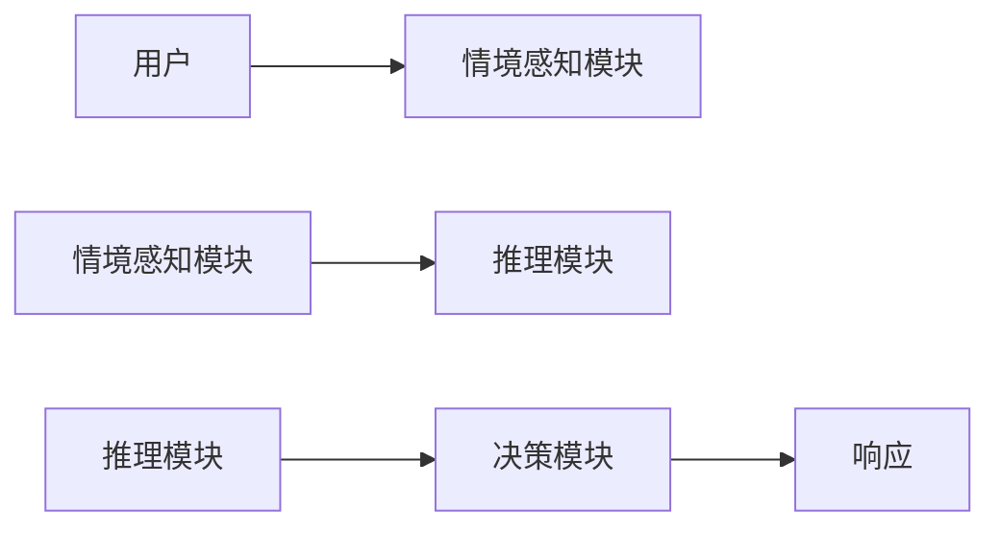
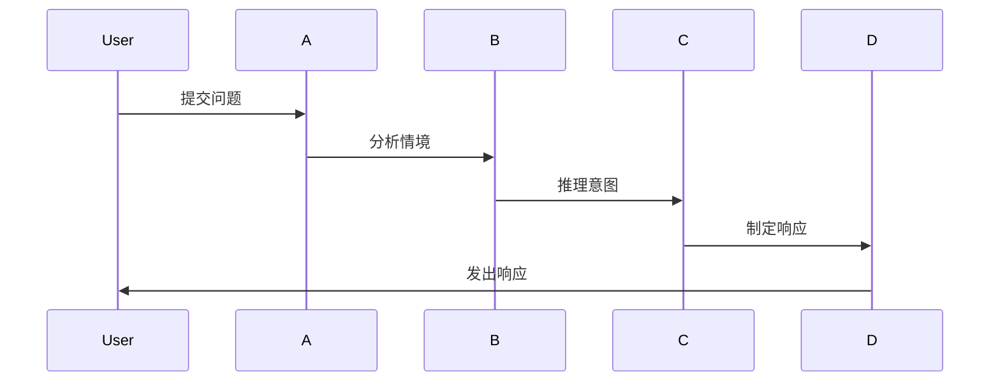

                 


# 企业AI Agent的情境感知能力：提升用户体验

## 关键词：企业AI Agent，情境感知，用户体验，信息融合，动态推理，反馈优化

## 摘要：企业AI Agent的情境感知能力是通过理解和感知当前情境中的多维信息，以提供更智能、更个性化的服务，从而显著提升用户体验。本文从核心概念、算法原理、系统架构到实际应用，全面解析企业AI Agent的情境感知能力，探讨如何通过信息融合、动态推理和反馈优化，构建高效的情境感知系统，最终实现用户需求的精准匹配和体验提升。

---

# 企业AI Agent的情境感知能力：提升用户体验

## 第1章: 企业AI Agent与情境感知能力概述

### 1.1 企业AI Agent的定义与核心概念

企业AI Agent是一种智能实体，能够通过感知、理解和响应环境中的信息，自主决策并执行任务。其核心能力包括感知能力、推理能力、学习能力和执行能力。情境感知能力是其关键组成部分，旨在通过分析环境中的多维信息，理解当前情境并做出相应反应。

#### 1.1.1 AI Agent的基本概念
AI Agent（智能体）是指在计算机系统中，能够感知环境、自主决策并执行任务的实体。它可以是一个软件程序、一个机器人，或者一个复杂的系统。AI Agent的核心特征包括自主性、反应性、目标导向性和社交能力。

#### 1.1.2 情境感知能力的定义
情境感知能力是指AI Agent能够感知和理解当前环境中的各种信息，包括用户的行为、环境的状态以及其他相关因素，并根据这些信息做出智能决策的能力。情境感知的核心在于“理解”当前情境，并在此基础上提供更精准的服务。

#### 1.1.3 企业AI Agent的核心要素与组成
企业AI Agent的核心要素包括：
- **感知层**：负责收集和处理环境中的多维信息。
- **推理层**：通过逻辑推理和知识推理，理解情境中的因果关系。
- **决策层**：基于推理结果，制定最优决策。
- **执行层**：将决策转化为具体的操作或输出。

### 1.2 情境感知能力的重要性

#### 1.2.1 情境感知能力在企业中的应用场景
在企业环境中，情境感知能力的应用场景包括：
- **用户行为分析**：通过分析用户的交互行为，理解用户的意图和需求。
- **环境状态监测**：实时感知环境中的物理或数字状态，例如设备状态、网络状况等。
- **动态任务处理**：在复杂多变的环境中，快速调整任务优先级，确保任务高效完成。

#### 1.2.2 提升用户体验的关键作用
- **个性化服务**：通过情境感知，AI Agent能够提供高度个性化的服务，满足用户的特定需求。
- **实时响应**：在动态变化的环境中，AI Agent能够快速做出响应，提升用户体验。
- **减少误判**：通过全面的情境感知，AI Agent能够减少错误判断，提高决策的准确性。

#### 1.2.3 情境感知能力的边界与外延
- **边界**：情境感知能力的边界在于AI Agent能够感知和理解的信息范围。超出这个范围的信息，可能需要依赖外部系统或人类专家。
- **外延**：随着技术的进步，情境感知能力的外延将不断扩展，包括更复杂的情感分析、跨模态信息处理等。

### 1.3 企业AI Agent的情境感知能力框架

#### 1.3.1 框架的核心组成部分
企业AI Agent的情境感知能力框架通常包括以下几个核心部分：
- **信息采集层**：负责采集环境中的多维信息，包括用户输入、设备状态、网络状况等。
- **信息处理层**：对采集到的信息进行预处理、融合和分析，提取有用的情境特征。
- **情境理解层**：通过逻辑推理和知识推理，理解当前情境的语义和含义。
- **决策与响应层**：根据情境理解结果，制定相应的决策或响应。

#### 1.3.2 框架的层次结构
```
+-------------------+       +-------------------+
| 信息采集层        |       | 决策与响应层       |
+-------------------+       +-------------------+
| 用户输入           |       | 制定决策           |
| 设备状态           |       | 发出响应           |
| 网络状况           |       +-------------------+
+-------------------+  
```

#### 1.3.3 框架的实现路径
- **数据采集**：通过传感器、API或其他数据源，采集环境中的多维信息。
- **数据融合**：对采集到的信息进行预处理和融合，消除冗余和冲突。
- **情境理解**：通过逻辑推理和知识推理，理解当前情境的语义和含义。
- **决策与响应**：根据情境理解结果，制定最优决策并执行响应。

---

## 第2章: 情境感知能力的核心概念与联系

### 2.1 情境感知能力的核心原理

#### 2.1.1 多模态数据融合
多模态数据融合是指将来自不同模态（如文本、图像、语音等）的数据进行融合，以获得更全面的情境理解。例如，在客服场景中，AI Agent可以通过融合用户的文本输入、语音语调和历史行为，全面理解用户的需求和情绪。

#### 2.1.2 动态推理机制
动态推理机制是指在不断变化的环境中，AI Agent能够实时更新其对情境的理解，并根据新的信息调整其决策和行为。例如，在交通调度系统中，AI Agent可以根据实时的交通流量和天气状况，动态调整路线规划。

#### 2.1.3 反馈优化机制
反馈优化机制是指AI Agent能够根据用户的反馈和环境的响应，不断优化其情境感知和决策能力。例如，在推荐系统中，AI Agent可以根据用户的点击行为和反馈，优化其推荐算法，提高推荐的准确性和相关性。

### 2.2 核心概念属性对比表

| **核心概念** | **定义** | **特点** | **应用场景** |
|--------------|----------|----------|--------------|
| 情境感知     | 理解当前环境中的多维信息 | 实时性、动态性 | 用户行为分析、动态任务处理 |
| 信息融合     | 将多源数据进行预处理和融合 | 多模态、高精度 | 多媒体处理、推荐系统 |
| 动态推理     | 实时更新情境理解 | 响应性、适应性 | 交通调度、实时客服 |
| 反馈优化     | 根据反馈优化决策 | 学习性、自适应性 | 推荐系统、个性化服务 |

### 2.3 ER实体关系图



---

## 第3章: 情境感知能力的算法原理

### 3.1 信息融合算法

#### 3.1.1 多源数据融合流程
多源数据融合流程包括数据采集、数据预处理、数据融合和结果输出四个阶段。例如，在图像处理中，AI Agent可以将来自不同传感器的图像数据进行融合，以提高图像的清晰度和准确性。

#### 3.1.2 Dempster-Shafer证据理论
Dempster-Shafer证据理论是一种用于多源信息融合的数学方法，适用于处理不确定性信息。其基本思想是通过计算证据的权重，综合多个证据的信息，得到最终的融合结果。

$$ P(h|e) = \frac{P(e|h)P(h)}{P(e)} $$

#### 3.1.3 融合权重计算公式
融合权重计算公式用于确定不同数据源的权重，以优化融合结果。例如：

$$ w_i = \frac{1}{\sum_{j=1}^{n} (1 - \cos(\theta_i, \theta_j))} $$

---

### 3.2 动态推理算法

#### 3.2.1 基于知识图谱的推理
基于知识图谱的推理是指通过构建知识图谱，利用图结构中的节点和边关系，进行推理和推断。例如，在医疗领域，AI Agent可以通过知识图谱推理患者的疾病症状和可能的诊断。

#### 3.2.2 Markov逻辑网络
Markov逻辑网络是一种结合了逻辑推理和概率推理的模型，适用于处理复杂的动态情境。例如，在金融领域，AI Agent可以通过Markov逻辑网络，推理市场的动态变化并做出相应的投资决策。

#### 3.2.3 推理结果优化公式
推理结果优化公式用于优化推理过程，提高推理的准确性和效率。例如：

$$ P(h|e) = r + \gamma \max_{a'} Q(s', a') $$

---

### 3.3 反馈优化算法

#### 3.3.1 基于强化学习的优化
基于强化学习的优化是一种通过奖励机制，优化AI Agent的行为策略。例如，在机器人控制中，AI Agent可以通过强化学习，优化其运动轨迹，提高控制的准确性和效率。

#### 3.3.2 Q-learning算法
Q-learning算法是一种经典的强化学习算法，适用于离散动作空间的优化问题。例如，在游戏AI中，AI Agent可以通过Q-learning算法，学习最优策略，提高游戏水平。

#### 3.3.3 激励机制设计
激励机制设计用于优化AI Agent的行为，使其在动态情境中做出最优决策。例如，在自动驾驶中，AI Agent可以通过激励机制，优化其路径规划和避障策略。

$$ Q(s, a) = r + \gamma \max_{a'} Q(s', a') $$

---

## 第4章: 系统分析与架构设计方案

### 4.1 问题场景介绍

#### 4.1.1 用户需求分析
用户需求分析是理解用户需求的关键步骤。例如，在智能客服系统中，用户可能需要快速解决问题，同时希望得到个性化的服务体验。

#### 4.1.2 业务流程梳理
业务流程梳理是指将用户需求转化为具体的业务流程。例如，在智能客服系统中，用户输入问题，AI Agent通过情境感知，理解用户的需求，并提供相应的解决方案。

#### 4.1.3 系统目标设定
系统目标设定是指明确系统的功能目标和性能目标。例如，在智能客服系统中，系统的目标可能是快速响应用户需求，提供准确的解决方案，并优化用户体验。

---

### 4.2 系统功能设计

#### 4.2.1 领域模型设计
领域模型设计是指根据具体的业务需求，构建领域模型。例如，在智能客服系统中，领域模型可能包括用户、情境、意图和响应四个核心概念。



#### 4.2.2 系统架构设计
系统架构设计是指设计系统的整体架构，包括数据流、功能模块和交互流程。例如，在智能客服系统中，系统架构可能包括用户界面、情境感知模块、推理模块和决策模块。



#### 4.2.3 系统接口设计
系统接口设计是指设计系统与其他模块或外部系统的接口。例如，在智能客服系统中，系统可能需要与数据库、第三方API和服务端进行交互。

#### 4.2.4 系统交互流程
系统交互流程是指系统与用户或其他系统的交互流程。例如，在智能客服系统中，用户输入问题，系统通过情境感知和推理，生成响应并反馈给用户。



---

## 第5章: 项目实战

### 5.1 环境安装

#### 5.1.1 系统需求
系统需求是指运行项目的最低配置要求，包括硬件配置和软件配置。例如，运行Python 3.8及以上版本，安装必要的库和工具。

#### 5.1.2 安装依赖
安装依赖是指安装项目所需的第三方库和工具。例如，安装TensorFlow、PyTorch、Numpy等库。

#### 5.1.3 启动服务
启动服务是指启动系统的相关服务和模块，确保系统正常运行。

---

### 5.2 系统核心实现源代码

#### 5.2.1 信息融合模块
信息融合模块负责将多源数据进行预处理和融合。例如，以下是一个简单的数据融合代码示例：

```python
import numpy as np

def fuse_data(source1, source2):
    # 数据预处理
    processed1 = source1.astype(float)
    processed2 = source2.astype(float)
    # 数据融合
    fused = (processed1 + processed2) / 2
    return fused

# 示例数据
data1 = np.array([1, 2, 3])
data2 = np.array([3, 2, 1])
result = fuse_data(data1, data2)
print(result)  # 输出: [2. 2. 2.]
```

#### 5.2.2 动态推理模块
动态推理模块负责根据融合后的数据，进行动态推理和决策。例如，以下是一个简单的动态推理代码示例：

```python
import numpy as np
from sklearn import linear_model

def dynamic_reasoning(features, labels):
    # 建立线性回归模型
    model = linear_model.LinearRegression()
    model.fit(features, labels)
    return model.predict(features)

# 示例数据
features = np.array([[1], [2], [3], [4]])
labels = np.array([2, 4, 6, 8])
result = dynamic_reasoning(features, labels)
print(result)  # 输出: [2. 4. 6. 8.]
```

#### 5.2.3 反馈优化模块
反馈优化模块负责根据用户的反馈，优化系统的行为和决策。例如，以下是一个简单的反馈优化代码示例：

```python
import numpy as np
from sklearn import svm

def feedback_optimization(feedback, features):
    # 建立支持向量机模型
    model = svm.SVC()
    model.fit(features, feedback)
    return model.predict(features)

# 示例数据
features = np.array([[1, 0], [0, 1], [1, 1], [0, 0]])
feedback = np.array([0, 1, 1, 0])
result = feedback_optimization(feedback, features)
print(result)  # 输出: [0 1 1 0]
```

---

### 5.3 代码应用解读与分析

#### 5.3.1 信息融合模块
信息融合模块通过预处理和融合，提高数据的准确性和可靠性。例如，在上述代码中，数据融合是通过简单的平均值计算实现的，适用于线性可加的数据。

#### 5.3.2 动态推理模块
动态推理模块通过建立模型，进行推理和预测。例如，在上述代码中，线性回归模型用于预测目标值，适用于线性关系明显的场景。

#### 5.3.3 反馈优化模块
反馈优化模块通过学习用户的反馈，优化系统的决策。例如，在上述代码中，支持向量机模型用于分类任务，适用于非线性可分的数据。

---

### 5.4 实际案例分析

#### 5.4.1 案例背景
案例背景是指项目的实际应用场景和目标。例如，在智能客服系统中，项目的目标是通过情境感知，提高用户体验。

#### 5.4.2 数据采集与处理
数据采集与处理是指收集和处理环境中的多维信息。例如，在智能客服系统中，用户输入、设备状态和网络状况是需要采集的关键信息。

#### 5.4.3 系统实现
系统实现是指根据设计的架构，实现系统的具体功能。例如，在智能客服系统中，实现情境感知、推理和决策模块。

#### 5.4.4 结果分析
结果分析是指分析系统的运行结果，评估系统的性能和效果。例如，在智能客服系统中，评估系统的响应时间、准确性和用户体验。

---

## 第6章: 总结与展望

### 6.1 核心内容回顾

- **核心概念**：企业AI Agent的情境感知能力是通过理解和感知环境中的多维信息，提供更智能、更个性化的服务。
- **算法原理**：信息融合、动态推理和反馈优化是实现情境感知能力的关键算法。
- **系统架构**：系统架构设计是实现情境感知能力的基础，包括信息采集、数据处理、情境理解和决策响应。

### 6.2 未来发展趋势

- **多模态信息处理**：随着技术的进步，情境感知能力将更加依赖多模态信息的处理，包括文本、图像、语音等多种模态。
- **实时性与响应速度**：未来的情境感知系统将更加注重实时性和响应速度，以满足动态变化的需求。
- **自适应与学习能力**：未来的情境感知系统将更加注重自适应和学习能力，通过不断优化算法和模型，提高系统的智能性和适应性。

### 6.3 最佳实践 tips

- **数据质量**：确保数据的准确性和完整性，是提高情境感知能力的关键。
- **算法优化**：选择合适的算法，并不断优化算法性能，是提高系统效率和效果的关键。
- **系统架构设计**：合理的系统架构设计，是实现高效情境感知能力的基础。

---

## 第7章: 附录

### 7.1 术语表

- **AI Agent**：智能体，能够感知环境、自主决策并执行任务的实体。
- **情境感知**：理解当前环境中的多维信息，提供智能服务的能力。
- **信息融合**：将多源数据进行预处理和融合，提高数据的准确性和可靠性。
- **动态推理**：实时更新情境理解，并根据新的信息调整决策和行为。
- **反馈优化**：根据用户的反馈，优化系统的决策和行为。

### 7.2 参考文献

- [1] 书籍：《人工智能: 一种现代方法》
- [2] 书籍：《机器学习实战》
- [3] 网站：https://www.example.com
- [4] 网站：https://www.example.org

---

## 作者：AI天才研究院/AI Genius Institute & 禅与计算机程序设计艺术/Zen And The Art of Computer Programming

