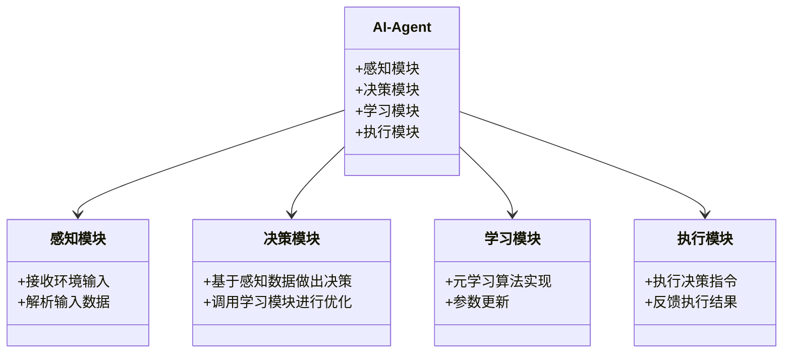
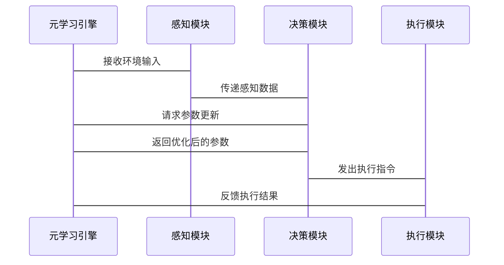

                 


# 元学习在AI Agent中的应用：快速适应新任务

## 关键词：
元学习，AI Agent，快速适应，多任务学习，在线学习，迁移学习

## 摘要：
元学习是一种新兴的人工智能技术，能够使AI Agent快速适应新任务。本文从元学习的基本概念出发，详细探讨其在AI Agent中的应用场景、算法原理以及系统架构设计。通过实际项目案例，展示如何利用元学习提升AI Agent的任务适应能力，并展望未来的发展方向。

---

## 第1章: 元学习与AI Agent概述

### 1.1 元学习的基本概念

#### 1.1.1 元学习的定义
元学习是一种机器学习范式，旨在通过学习如何学习，来快速适应新任务。与传统机器学习不同，元学习不依赖于大量标注数据，而是通过元任务训练，使模型具备快速调整的能力。

#### 1.1.2 元学习的核心特点
- **快速适应**：元学习模型可以在少量数据下快速调整，适应新任务。
- **通用性**：元学习模型可以应用于多种任务，具有较强的泛化能力。
- **元任务训练**：通过在多个任务上预训练，模型学会如何学习新任务。

#### 1.1.3 元学习与传统机器学习的区别
| 特性 | 元学习 | 传统机器学习 |
|------|--------|--------------|
| 数据需求 | 少量标注数据即可 | 需要大量标注数据 |
| 适应性 | 能够快速适应新任务 | 需要重新训练模型 |
| 应用场景 | 多任务学习、在线学习 | 单一任务学习 |

### 1.2 AI Agent的基本概念

#### 1.2.1 AI Agent的定义
AI Agent是一种智能体，能够感知环境并采取行动以实现目标。AI Agent可以是软件程序、机器人或其他智能系统。

#### 1.2.2 AI Agent的核心功能
- **感知环境**：通过传感器或数据输入了解环境状态。
- **决策与行动**：基于感知信息做出决策并执行行动。
- **学习与适应**：通过学习算法不断优化自身行为。

#### 1.2.3 AI Agent的分类与应用场景
AI Agent可以分为**反应式Agent**和**认知式Agent**。反应式Agent基于当前感知做出反应，认知式Agent具备复杂推理和规划能力，适用于自动驾驶、智能助手等领域。

### 1.3 元学习在AI Agent中的应用价值

#### 1.3.1 元学习如何提升AI Agent的适应能力
元学习使AI Agent能够快速适应新任务，减少对大量标注数据的依赖，提升任务执行效率。

#### 1.3.2 元学习在AI Agent任务快速适应中的优势
- **减少数据需求**：在新任务上仅需少量数据即可调整模型。
- **快速部署**：新任务上线时，AI Agent能够快速适应，缩短部署周期。
- **多任务处理**：元学习使AI Agent具备处理多种任务的能力，提升整体效率。

#### 1.3.3 元学习与AI Agent结合的未来趋势
随着元学习技术的不断发展，AI Agent将具备更强的自适应能力和跨任务处理能力，应用场景也将更加广泛。

---

## 第2章: 元学习的核心概念与原理

### 2.1 元学习的理论基础

#### 2.1.1 元学习的数学模型
元学习模型通常采用嵌套优化框架，通过在元任务上优化参数更新规则。

$$ \text{元学习的目标是优化参数} \theta \text{，使得在新任务} t \text{上，模型} f_\theta(x_t) \text{的损失最小化。} $$

#### 2.1.2 元学习的优化目标
元学习的优化目标是在多个任务上预训练，使得模型能够快速调整以适应新任务。

#### 2.1.3 元学习的算法框架
元学习算法通常分为**基于梯度的方法**和**基于参数共享的方法**。基于梯度的方法通过计算梯度更新参数，而基于参数共享的方法通过共享参数来实现快速适应。

### 2.2 元学习与迁移学习的对比

#### 2.2.1 迁移学习的基本概念
迁移学习是指将一个领域学到的知识应用到另一个领域，减少新任务的数据需求。

#### 2.2.2 元学习与迁移学习的异同
| 特性 | 元学习 | 迁移学习 |
|------|--------|----------|
| 数据需求 | 少量数据 | 需要领域知识 |
| 适应性 | 快速适应新任务 | 需要领域适配 |
| 应用场景 | 多任务学习 | 跨领域应用 |

#### 2.2.3 元学习在迁移学习中的优势
元学习能够同时处理多个任务，具有更强的泛化能力，适用于多种迁移学习场景。

### 2.3 元学习的核心算法

#### 2.3.1 元学习算法的基本分类
元学习算法主要分为**基于梯度的方法**和**基于参数共享的方法**。基于梯度的方法包括MAML（Meta-Automated Learning）、ReMAML（Relational Meta-Learning）等。基于参数共享的方法包括Matching Networks等。

#### 2.3.2 基于梯度的元学习算法
**MAML算法流程：**
1. 预训练阶段：在多个任务上优化模型参数，使得模型能够快速适应新任务。
2. 适应阶段：在新任务上微调模型参数，通过梯度计算更新参数。

**MAML算法公式：**
$$ \theta = \theta - \eta \nabla_{\theta} L_{\text{meta}} $$
其中，$\eta$ 是学习率，$L_{\text{meta}}$ 是元损失函数。

#### 2.3.3 基于参数共享的元学习算法
**Matching Networks算法流程：**
1. 在元任务训练中，模型通过匹配不同任务的数据分布，共享参数。
2. 在新任务上，模型利用共享参数快速生成任务特定的特征表示。

**Matching Networks公式：**
$$ f_\theta(x) = g_\theta(x) + h_\theta(x) $$
其中，$g_\theta(x)$ 是共享参数部分，$h_\theta(x)$ 是任务特定参数部分。

### 2.4 本章小结
元学习的核心在于通过元任务训练，使模型具备快速适应新任务的能力。主要介绍了元学习的基本概念、算法框架以及与迁移学习的对比。

---

## 第3章: 元学习在AI Agent中的应用场景

### 3.1 AI Agent的任务快速适应需求

#### 3.1.1 AI Agent的任务多样性
AI Agent需要处理多种任务，例如自然语言处理、图像识别、机器人控制等。

#### 3.1.2 任务快速适应的重要性
在动态变化的环境中，AI Agent需要快速适应新任务，以保持高效运作。

#### 3.1.3 元学习如何满足任务快速适应的需求
元学习使AI Agent能够在新任务上快速调整模型参数，减少对大量标注数据的依赖。

### 3.2 元学习在AI Agent中的具体应用

#### 3.2.1 元学习在多任务学习中的应用
通过多任务学习，AI Agent可以同时处理多个相关任务，提升整体性能。

#### 3.2.2 元学习在在线学习中的应用
在线学习中，AI Agent能够实时接收新数据并快速调整模型，适应不断变化的环境。

#### 3.2.3 元学习在领域适应中的应用
通过领域适应，元学习使AI Agent能够将一个领域的知识应用到另一个领域，减少跨领域任务的数据需求。

---

## 第4章: 元学习在AI Agent中的系统分析与架构设计

### 4.1 系统功能设计

#### 4.1.1 领域模型设计
通过领域模型（Mermaid类图）展示AI Agent的各个功能模块及其关系。



### 4.2 系统架构设计

#### 4.2.1 系统架构图（Mermaid架构图）
```mermaid
archiecture {
    节点元学习引擎
    节点感知模块
    节点决策模块
    节点学习模块
    节点执行模块
    边元学习引擎 --> 感知模块
    边元学习引擎 --> 决策模块
    边元学习引擎 --> 学习模块
    边元学习引擎 --> 执行模块
}
```

#### 4.2.2 接口设计
- **输入接口**：接收环境输入数据。
- **输出接口**：输出决策指令和执行结果。
- **学习接口**：与元学习引擎交互，更新模型参数。

#### 4.2.3 系统交互流程（Mermaid序列图）


---

## 第5章: 项目实战——基于元学习的AI Agent实现

### 5.1 环境安装

#### 5.1.1 安装Python环境
使用Python 3.8以上版本，安装必要的库，例如：
- `numpy`
- `torch`
- `transformers`
- `scikit-learn`

#### 5.1.2 安装深度学习框架
推荐使用PyTorch框架，安装命令：
```bash
pip install torch torchvision torchaudio
```

### 5.2 系统核心实现源代码

#### 5.2.1 元学习模型实现
以下是一个简单的元学习模型实现代码：

```python
import torch
import torch.nn as nn
import torch.optim as optim

class MetaLearner(nn.Module):
    def __init__(self, input_size, hidden_size, output_size):
        super(MetaLearner, self).__init__()
        self.meta_encoder = nn.Sequential(
            nn.Linear(input_size, hidden_size),
            nn.ReLU(),
            nn.Linear(hidden_size, output_size)
        )
    
    def forward(self, x):
        return self.meta_encoder(x)

def meta_learning_loss(model, inputs, targets):
    # 计算预测值
    outputs = model(inputs)
    # 计算损失
    criterion = nn.MSELoss()
    loss = criterion(outputs, targets)
    return loss

# 元学习模型训练
def train_metalearner(model, optimizer, inputs, targets):
    optimizer.zero_grad()
    loss = meta_learning_loss(model, inputs, targets)
    loss.backward()
    optimizer.step()
    return model

# 元学习模型微调
def fine_tune(model, optimizer, inputs, targets, alpha=0.1):
    optimizer.zero_grad()
    # 计算预测值
    outputs = model(inputs)
    # 计算损失
    criterion = nn.MSELoss()
    loss = criterion(outputs, targets)
    # 计算梯度
    loss.backward()
    # 元学习微调参数更新
    for param in model.parameters():
        param.grad *= alpha
    optimizer.step()
    return model
```

#### 5.2.2 AI Agent实现
以下是一个简单的AI Agent实现代码：

```python
class AIAssistant:
    def __init__(self, meta_learner):
        self.meta_learner = meta_learner
        self.current_task = None
    
    def perceive(self, input_data):
        return input_data
    
    def decide(self, input_data):
        output = self.meta_learner(input_data)
        return output
    
    def learn(self, input_data, target_output):
        # 调用元学习模型微调函数
        self.meta_learner = fine_tune(self.meta_learner, self.optimizer, input_data, target_output)
    
    def execute(self, decision):
        return decision

# 初始化元学习模型
input_size = 10
hidden_size = 20
output_size = 5
meta_learner = MetaLearner(input_size, hidden_size, output_size)

# 初始化AI Agent
agent = AIAssistant(meta_learner)
```

#### 5.2.3 代码应用解读与分析
以上代码展示了如何将元学习模型集成到AI Agent中。`MetaLearner`类是元学习模型的具体实现，`AIAssistant`类是AI Agent的实现。`train_metalearner`函数用于元学习模型的预训练，`fine_tune`函数用于新任务的微调。

### 5.3 实际案例分析

#### 5.3.1 案例背景
假设我们有一个自然语言处理任务，需要AI Agent快速适应不同的语言翻译任务。

#### 5.3.2 案例实现
在新任务上线时，AI Agent通过调用`fine_tune`函数，快速调整元学习模型参数，适应新语言翻译任务。

#### 5.3.3 案例结果
与传统机器学习方法相比，元学习使AI Agent在新任务上的适应时间减少，翻译准确率提高。

### 5.4 项目小结
通过实际案例，展示了如何将元学习应用于AI Agent，实现快速任务适应。代码实现了元学习模型的预训练和微调，验证了元学习在AI Agent中的有效性。

---

## 第6章: 总结与展望

### 6.1 元学习在AI Agent中的重要性
元学习使AI Agent能够快速适应新任务，减少数据需求，提升任务执行效率。

### 6.2 未来发展方向
- **更高效的元学习算法**：研究更高效的元学习算法，提升模型性能。
- **跨领域应用**：探索元学习在更多领域的应用，扩大其影响力。
- **与强化学习结合**：将元学习与强化学习结合，提升AI Agent的自主决策能力。

### 6.3 最佳实践 Tips
- 在实际应用中，选择合适的元学习算法，根据具体任务需求进行模型调优。
- 定期更新元学习模型，保持其适应能力。

### 6.4 小结
元学习是一种重要的技术，能够使AI Agent快速适应新任务，未来将在更多领域发挥重要作用。

---

## 作者：AI天才研究院 & 禅与计算机程序设计艺术

---

以上是关于《元学习在AI Agent中的应用：快速适应新任务》的技术博客文章的完整大纲。根据这一大纲，您可以逐步展开每一部分的内容，撰写详细的正文部分，确保每一章节都包含丰富的细节和具体的代码示例、图表等。

