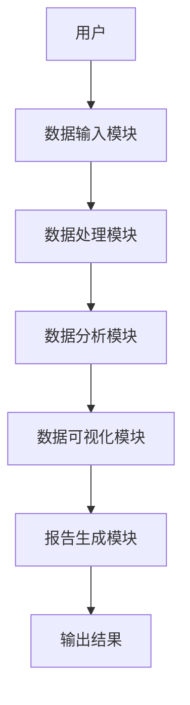

                 


# 彼得林奇对公司产品线的分析

## 关键词：彼得林奇，产品线分析，投资分析，企业战略，风险管理

## 摘要：  
本文深入分析了彼得·林奇对公司产品线的分析方法及其在投资决策中的应用。通过详细阐述产品线分析的核心概念、算法原理、系统架构设计和实际案例，本文为投资者和企业提供了实用的分析工具和策略。文章结构清晰，内容详实，结合理论与实践，帮助读者全面理解如何通过产品线分析优化投资决策。

---

# 第一部分: 彼得林奇对公司产品线分析的背景与概述

## 第1章: 彼得林奇的投资理念与产品线分析概述

### 1.1 彼得林奇的投资理念  
彼得·林奇是全球最著名的投资家之一，他的投资理念以“价值投资”为核心，注重通过对企业基本面的深入分析来寻找被低估的投资机会。他强调，投资者应该关注企业的产品线、市场地位、财务状况以及管理团队等多个方面，以全面评估企业的投资价值。

#### 1.1.1 价值投资的核心思想  
- **长期投资**：林奇主张长期投资，而非短期投机。他认为，只有通过长期持有优质资产，才能获得稳定的收益。  
- **基本面分析**：林奇强调对企业基本面的深入研究，包括企业的收入、利润、资产负债表等财务数据。  
- **风险管理**：林奇认为，投资的核心是管理风险，而非追求高收益。他主张通过分散投资和严格筛选企业来降低风险。

#### 1.1.2 产品线分析在投资中的重要性  
- 产品线是企业的核心资产，直接决定企业的收入和利润。  
- 通过分析产品线的市场地位、竞争力、生命周期等，投资者可以更好地判断企业的未来发展潜力。  
- 产品线分析是企业战略的重要组成部分，能够帮助企业优化产品组合，提升市场竞争力。

#### 1.1.3 彼得林奇的投资策略与风格  
- **集中投资**：林奇倾向于集中投资少数优质企业，而非分散投资。他认为，集中投资可以更深入地研究企业，提高投资效率。  
- **逆向投资**：林奇喜欢在市场低迷时买入优质资产，在市场高估时卖出，从而获取超额收益。  
- **长期持有**：林奇主张长期持有优质股票，避免频繁交易，以减少交易成本和税务负担。

### 1.2 产品线分析的背景与重要性  

#### 1.2.1 产品线分析的背景  
- 随着市场竞争的加剧，企业的产品线日益复杂，涵盖多个产品类别和市场细分。  
- 产品线分析帮助企业更好地理解市场需求，优化资源配置，提升竞争力。  
- 在投资领域，产品线分析是评估企业价值的重要工具，能够帮助投资者识别高增长潜力的企业。

#### 1.2.2 产品线分析的重要性  
- **企业战略**：产品线分析是企业制定战略的重要依据。通过分析产品线的市场地位、竞争力和生命周期，企业可以更好地调整产品组合，优化资源配置。  
- **投资决策**：对于投资者来说，产品线分析是评估企业价值的关键指标。通过分析产品线的市场表现、盈利能力和发展潜力，投资者可以更好地判断企业的投资价值。  
- **风险管理**：产品线分析能够帮助企业识别潜在风险，例如市场需求下降、产品过时等问题，从而提前采取应对措施。

---

# 第二部分: 产品线分析的核心概念与方法论

## 第2章: 产品线分析的核心概念与联系  

### 2.1 产品线分析的核心概念  

#### 2.1.1 产品线的定义与分类  
- **定义**：产品线是指一组具有相似功能、技术或市场定位的产品，通常服务于相同的目标市场或客户群体。  
- **分类**：产品线可以按照不同的标准进行分类，例如按产品类型（消费品、工业品）、市场阶段（成熟产品、新产品）等。

#### 2.1.2 产品线分析的核心要素  
- **市场占有率**：产品线在目标市场中的份额，反映了产品的市场竞争力。  
- **盈利能力**：产品线的收入和利润表现，是评估企业财务健康的重要指标。  
- **产品生命周期**：产品从引入市场到退出市场的全过程，包括导入期、成长期、成熟期和衰退期。

#### 2.1.3 产品线分析的关键指标  
- **收入增长率**：产品线收入的年增长率，反映了市场需求的变化。  
- **利润率**：产品线的毛利率、净利率，反映了产品的盈利能力。  
- **市场反馈**：消费者对产品的满意度、忠诚度等，反映了产品的市场接受度。

### 2.2 产品线分析的方法与工具  

#### 2.2.1 产品线分析的步骤  
1. **收集数据**：包括产品线的市场数据、财务数据、竞争对手数据等。  
2. **数据清洗与整理**：对数据进行预处理，确保数据的准确性和完整性。  
3. **数据分析**：通过统计分析、趋势分析等方法，评估产品线的市场表现和财务表现。  
4. **竞争对手分析**：比较产品线与竞争对手的差异，找出竞争优势和劣势。  
5. **制定策略**：根据分析结果，制定产品线优化策略，例如产品升级、市场扩展等。

#### 2.2.2 产品线分析的工具  
- **数据分析工具**：如Excel、Python、R等，用于数据清洗、统计分析等。  
- **市场研究工具**：如Market Research、Gartner等，用于获取市场数据和行业报告。  
- **可视化工具**：如Tableau、Power BI等，用于数据可视化和报告呈现。

---

## 第3章: 产品线分析的算法原理与实现  

### 3.1 产品线分析的算法原理  

#### 3.1.1 数据预处理与清洗  
- **数据收集**：从企业内部数据库、公开市场数据等来源获取产品线数据。  
- **数据清洗**：处理缺失值、异常值，确保数据的准确性和一致性。  
- **数据转换**：将数据转换为适合分析的格式，例如标准化、归一化等。

#### 3.1.2 产品线竞争力评估模型  
- **指标权重分配**：根据产品线的核心指标（如市场占有率、利润率）分配权重，构建评估模型。  
- **综合评分**：通过加权评分法，计算产品线的综合竞争力评分。  
- **趋势分析**：通过时间序列分析，评估产品线的市场表现趋势。

#### 3.1.3 竞争对手分析算法  
- **市场份额比较**：计算产品线与竞争对手的市场份额差异，找出竞争优势。  
- **产品差异分析**：比较产品线与竞争对手的产品特点，评估产品的独特性和竞争力。  
- **定价策略分析**：分析产品线与竞争对手的定价策略，找出价格优势。

### 3.2 产品线分析的算法实现  

#### 3.2.1 基于Python的实现  
- **数据预处理**：使用Pandas库进行数据清洗和转换。  
- **数据分析**：使用NumPy库进行数值计算，使用Scipy库进行统计分析。  
- **数据可视化**：使用Matplotlib或Seaborn库进行数据可视化，例如绘制产品线的市场占有率趋势图。

#### 3.2.2 算法实现代码示例  
```python
import pandas as pd
import numpy as np
import matplotlib.pyplot as plt

# 示例数据：产品线A和竞争对手B的市场占有率
data = {
    'Product Line': ['A', 'A', 'A', 'A', 'A'],
    'Market Share': [25, 30, 28, 32, 29],
    'Competitor B': [20, 25, 27, 26, 28]
}

df = pd.DataFrame(data)

# 绘制市场占有率趋势图
plt.figure(figsize=(10, 6))
plt.plot(df['Market Share'], label='Product Line A', linestyle='-', marker='o')
plt.plot(df['Competitor B'], label='Competitor B', linestyle='-', marker='o')
plt.xlabel('Time')
plt.ylabel('Market Share (%)')
plt.title('Market Share Trend Analysis')
plt.legend()
plt.show()
```

#### 3.2.3 算法原理的数学模型  
- **加权评分模型**：  
  $$ \text{综合评分} = \sum_{i=1}^{n} w_i \cdot x_i $$  
  其中，\( w_i \) 是指标 \( i \) 的权重，\( x_i \) 是指标 \( i \) 的评分。  
- **趋势分析模型**：  
  $$ \text{趋势} = \sum_{i=1}^{m} (y_i - \text{平均值})^2 $$  
  其中，\( y_i \) 是第 \( i \) 个时间点的市场占有率，\( \text{平均值} \) 是市场占有率的平均值。

---

## 第4章: 产品线分析的系统架构设计  

### 4.1 系统架构设计  

#### 4.1.1 系统功能设计  
- **数据输入**：支持多种数据格式的导入，例如CSV、Excel等。  
- **数据处理**：包括数据清洗、转换和预处理功能。  
- **数据分析**：提供多种分析工具，例如趋势分析、竞争对手分析等。  
- **数据可视化**：生成多种图表，例如折线图、柱状图等，帮助用户直观理解数据。

#### 4.1.2 系统架构图  


#### 4.1.3 系统接口设计  
- **输入接口**：支持文件上传、数据库连接等多种数据输入方式。  
- **输出接口**：生成分析报告、数据可视化图表等，支持多种格式输出。  
- **用户界面**：提供友好的用户界面，方便用户操作和结果查看。

---

## 第5章: 产品线分析的项目实战  

### 5.1 项目背景与目标  

#### 5.1.1 项目背景  
- 某企业希望对其产品线进行深入分析，优化产品组合，提升市场竞争力。  
- 通过分析产品线的市场表现、竞争对手情况等，制定科学的投资和运营策略。

#### 5.1.2 项目目标  
- 评估产品线的市场竞争力，找出优势和劣势。  
- 分析竞争对手的产品策略，制定差异化竞争策略。  
- 提供优化建议，例如产品升级、市场扩展等。

### 5.2 项目实施步骤  

#### 5.2.1 环境安装与配置  
- **安装Python**：安装Python 3.x，确保环境配置正确。  
- **安装依赖库**：安装Pandas、NumPy、Matplotlib等数据分析和可视化库。  
- **数据准备**：收集产品线的市场数据、财务数据等，确保数据格式一致。

#### 5.2.2 核心代码实现  
- **数据清洗与处理**：  
  ```python
  import pandas as pd
  import numpy as np

  # 读取数据
  df = pd.read_csv('product_line.csv')

  # 数据清洗
  df.dropna(inplace=True)
  df['Market Share'] = df['Market Share'].astype(float)
  ```

- **数据分析与可视化**：  
  ```python
  import matplotlib.pyplot as plt

  # 绘制市场占有率趋势图
  plt.figure(figsize=(10, 6))
  plt.plot(df['Market Share'], label='Market Share', linestyle='-', marker='o')
  plt.xlabel('Time')
  plt.ylabel('Market Share (%)')
  plt.title('Market Share Trend Analysis')
  plt.legend()
  plt.show()
  ```

#### 5.2.3 案例分析与解读  
- **案例分析**：通过实际数据，分析产品线的市场表现，找出关键问题。  
- **优化建议**：根据分析结果，提出优化建议，例如调整产品线结构、加强市场推广等。  
- **效果评估**：评估优化建议的实施效果，验证分析的准确性。

---

## 第6章: 产品线分析的最佳实践与总结  

### 6.1 最佳实践  

#### 6.1.1 数据收集与清洗  
- 确保数据的准确性和完整性，避免因数据问题导致分析误差。  
- 使用自动化工具进行数据清洗，提高效率。

#### 6.1.2 数据分析与可视化  
- 选择合适的分析方法和工具，确保分析结果的准确性和可视化效果。  
- 使用图表和报告清晰呈现分析结果，方便用户理解和决策。

#### 6.1.3 优化与改进  
- 根据分析结果，制定切实可行的优化策略，例如产品升级、市场扩展等。  
- 定期回顾和评估优化效果，持续改进产品线分析方法。

### 6.2 项目总结与展望  

#### 6.2.1 项目总结  
- 通过产品线分析，帮助企业优化产品组合，提升市场竞争力。  
- 提供科学的投资决策依据，帮助投资者识别高增长潜力的企业。  

#### 6.2.2 未来展望  
- 随着人工智能和大数据技术的发展，产品线分析将更加智能化和精准化。  
- 未来的研究方向包括：实时数据分析、预测性分析、多维度竞争分析等。

---

# 第七章: 产品线分析的注意事项与拓展阅读  

## 7.1 注意事项  

### 7.1.1 数据质量  
- 数据质量直接影响分析结果，确保数据的准确性和完整性是关键。  
- 数据清洗和预处理是分析的前提条件，不能忽视。

### 7.1.2 分析模型的选择  
- 根据具体需求选择合适的分析模型，避免盲目使用复杂算法。  
- 简单的模型可能更适用于实际问题，复杂模型需要更多的数据支持。

### 7.1.3 结果验证  
- 分析结果需要通过实际数据验证，确保模型的有效性和可靠性。  
- 定期回顾和优化分析方法，适应市场变化和企业需求。

## 7.2 拓展阅读  

### 7.2.1 经典书籍  
- 《彼得·林奇的投资哲学》  
- 《企业战略管理》  
- 《数据驱动的决策》  

### 7.2.2 在线资源  
- 彼得·林奇的演讲和采访视频。  
- 数据分析与可视化工具的官方文档和教程。  

---

# 结语  

彼得·林奇的产品线分析方法为投资者和企业提供了一个强大的工具，帮助他们在复杂多变的市场中找到优质的投资机会。通过本文的深入分析，读者可以更好地理解产品线分析的核心概念、算法原理和实际应用。未来，随着技术的进步，产品线分析将更加智能化和精准化，为企业和投资者创造更大的价值。

---

**作者：AI天才研究院/AI Genius Institute & 禅与计算机程序设计艺术 /Zen And The Art of Computer Programming**

