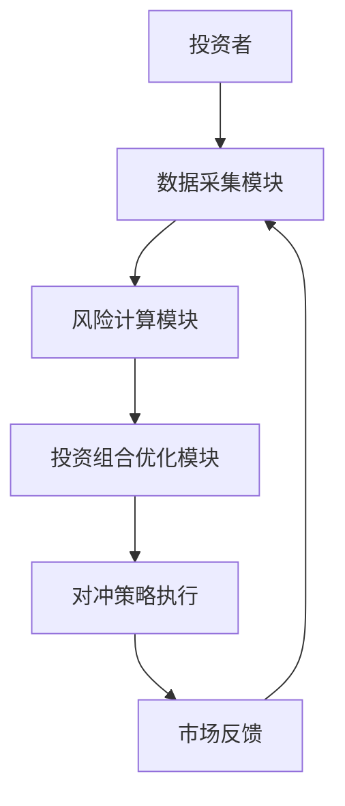
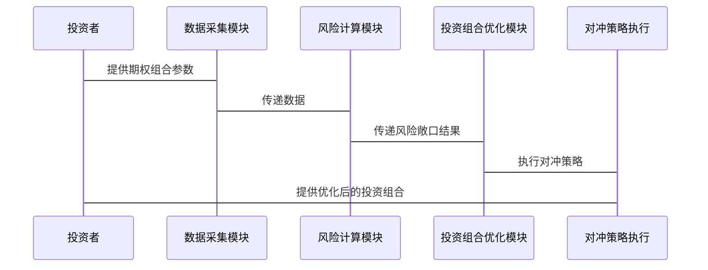

                 


# 智能期权组合风险敞口管理系统

> 关键词：智能期权组合、风险敞口管理、风险管理算法、系统架构、金融科技创新

> 摘要：智能期权组合风险敞口管理系统是一种基于人工智能和大数据技术的金融风险管理工具，通过智能算法和系统架构设计，实现对期权组合风险敞口的实时监控、量化分析和最优投资组合构建。本文将从背景、核心概念、算法原理、系统架构、项目实战等多个方面深入探讨智能期权组合风险敞口管理系统的构建与应用。

---

# 第一部分: 智能期权组合风险敞口管理系统的背景与核心概念

## 第1章: 期权组合风险敞口管理概述

### 1.1 期权的基本概念与风险敞口

#### 1.1.1 期权的基本定义
期权是一种金融衍生品，赋予持有者在特定时间内以特定价格买入或卖出标的资产的权利。期权的核心在于其非线性收益结构，这使得其风险管理复杂且具有挑战性。

#### 1.1.2 期权的风险敞口来源
期权的风险敞口主要来源于以下几个方面：
1. **市场风险**：标的资产价格波动对期权组合价值的影响。
2. **波动率风险**：市场波动率的变化对期权组合价值的影响。
3. **时间风险**：期权的时间价值衰减对组合价值的影响。
4. **流动性风险**：在极端市场条件下，期权的流动性可能下降，导致难以以合理价格买卖。

#### 1.1.3 风险敞口管理的重要性
有效的风险敞口管理可以帮助投资者在市场波动中规避重大损失，同时抓住潜在的获利机会。通过量化和监控风险敞口，投资者可以更好地理解其投资组合的风险暴露，并采取相应的对冲策略。

---

### 1.2 智能期权组合管理的背景与意义

#### 1.2.1 传统期权组合管理的局限性
传统的期权组合管理方法依赖于人工判断和静态模型，难以应对复杂多变的市场环境。例如，传统的VaR（Value at Risk）模型在极端市场条件下可能失效，且无法实时更新和优化。

#### 1.2.2 智能化管理的必要性
随着金融市场的日益复杂化，传统的风险管理方法已无法满足需求。智能期权组合管理通过引入人工智能、大数据和高级算法，能够实时捕捉市场变化，动态调整风险敞口。

#### 1.2.3 智能期权组合管理的优势
1. **实时监控**：通过高频数据和机器学习算法，实现对期权组合风险敞口的实时监控。
2. **动态优化**：根据市场变化自动调整投资组合，降低系统性风险。
3. **非线性风险建模**：利用深度学习等技术，准确捕捉期权收益的非线性特征。

---

### 1.3 智能期权组合管理的核心目标

#### 1.3.1 风险敞口的量化与监控
通过量化风险敞口，投资者可以更清晰地了解其组合在不同市场条件下的风险暴露。

#### 1.3.2 系统性风险与非系统性风险的区分
系统性风险是整个市场普遍存在的风险，而非系统性风险是特定于个体资产或组合的风险。智能期权组合管理通过区分这两种风险，能够更精准地制定对冲策略。

#### 1.3.3 最优化投资组合的构建
基于智能算法，系统可以自动优化期权组合，使其在风险可控的前提下，最大化收益或最小化潜在损失。

---

### 1.4 智能期权组合管理的边界与外延

#### 1.4.1 管理范围的界定
智能期权组合管理的范围通常包括以下内容：
1. **标的资产的选择**：如股票、指数、外汇等。
2. **期权类型的选择**：如看涨期权、看跌期权等。
3. **时间范围的设定**：如短期、中期、长期期权。

#### 1.4.2 与其他风险管理方法的区别
智能期权组合管理与传统风险管理方法的主要区别在于其智能化和自动化特点。传统方法依赖人工判断，而智能方法通过算法实现自动化的风险监控和调整。

#### 1.4.3 系统的可扩展性与灵活性
智能期权组合管理系统需要具备良好的可扩展性，以应对不同规模和复杂度的投资组合。

---

### 1.5 核心概念与联系

#### 1.5.1 核心概念原理
智能期权组合管理的核心原理包括：
1. **风险量化**：通过数学模型量化期权组合的风险敞口。
2. **实时监控**：利用大数据和人工智能技术实时监控市场变化。
3. **动态优化**：根据市场反馈动态调整投资组合。

#### 1.5.2 核心概念属性特征对比表格

| 属性         | 传统风险管理 | 智能风险管理 |
|--------------|--------------|--------------|
| 方法         | 静态模型     | 动态算法     |
| 数据来源     | 低频数据     | 高频数据     |
| 调整频率     | 低频         | 高频         |
| 精准度       | 较低         | 较高         |

#### 1.5.3 ER实体关系图架构（Mermaid流程图）

```mermaid
erd
  actor 投资者
  actor 市场数据源
  entity 期权组合
  entity 风险敞口
  entity 投资组合优化
  entity 系统反馈
  relationship -{抽取出期权组合}--> 期权组合
  relationship -{计算风险敞口}--> 风险敞口
  relationship -{优化投资组合}--> 投资组合优化
  relationship -{反馈给投资者}--> 系统反馈
```

---

## 第2章: 智能期权组合管理的算法原理

### 2.1 风险敞口计算的数学模型

#### 2.1.1 风险敞口的定义与计算公式
风险敞口通常可以用以下公式量化：
$$ \text{风险敞口} = \text{资产价格变化} \times \text{资产数量} \times \text{波动率} $$

#### 2.1.2 风险敞口的数学模型
智能风险管理算法通常基于以下步骤：
1. 数据采集：获取标的资产的价格、波动率、期权greeks（delta、gamma、vega等）。
2. 风险建模：利用蒙特卡洛模拟或其他算法量化风险敞口。
3. 风险监控：实时监控风险敞口的变化。
4. 对冲策略：根据风险敞口调整投资组合，降低风险。

---

#### 2.1.3 示例计算与解释
假设我们有一个简单的期权组合，包含两个标的资产A和B，每个资产的delta分别为0.5和-0.3，波动率分别为20%和15%。假设资产A的价格变化为+10%，资产B的价格变化为-5%。则组合的风险敞口为：
$$ \text{组合风险敞口} = (0.5 \times 10\% + (-0.3) \times (-5\%)) \times \text{资产数量} $$

---

### 2.2 期权定价模型

#### 2.2.1 Black-Scholes模型
Black-Scholes模型是期权定价的基础模型，其公式为：
$$ C = S_0 \Phi(d_1) - K e^{-rT} \Phi(d_2) $$
其中：
- \( S_0 \) 是标的资产当前价格
- \( K \) 是期权的执行价格
- \( r \) 是无风险利率
- \( T \) 是到期时间
- \( \Phi \) 是标准正态分布的累积分布函数
- \( d_1 = \frac{\ln(S_0/K) + (r + \sigma^2/2)T}{\sigma \sqrt{T}} \)
- \( d_2 = d_1 - \sigma \sqrt{T} \)
- \( \sigma \) 是标的资产的波动率

#### 2.2.2 其他期权定价模型
除了Black-Scholes模型，还有其他模型，如：
1. **Binomial树模型**：适用于美式期权定价。
2. **Stochastic volatility模型**：考虑波动率的随机性。

---

### 2.3 风险度量方法

#### 2.3.1 VaR（Value at Risk）
VaR是指在一定置信水平下，投资组合的最大可能损失。例如，95%置信水平的VaR表示在95%的概率下，投资组合的最大损失不会超过VaR值。

#### 2.3.2 CVaR（Conditional Value at Risk）
CVaR是VaR的扩展，表示在超过VaR值的情况下的平均损失。CVaR通常用于优化问题，因为其可以更好地反映尾部风险。

#### 2.3.3 其他风险度量方法
1. **预期损失（Expected Loss）**：基于概率分布的期望值。
2. **风险调整后的收益（RAROC）**：考虑风险的收益指标。

---

### 2.4 智能算法在风险敞口管理中的应用

#### 2.4.1 蒙特卡洛模拟
蒙特卡洛模拟是一种通过随机采样来估计复杂问题的方法。在期权组合管理中，可以利用蒙特卡洛模拟来模拟标的资产的价格变化，并计算相应的风险敞口。

#### 2.4.2 机器学习算法
机器学习算法可以用于预测市场变化和优化投资组合。例如，可以使用支持向量机（SVM）或随机森林（Random Forest）来预测期权的价格变化。

#### 2.4.3 基于机器学习的风险建模
1. **特征提取**：从市场数据中提取有用的特征，如波动率、成交量等。
2. **模型训练**：利用历史数据训练模型，预测未来的风险敞口。
3. **实时预测**：根据实时数据更新风险敞口预测。

---

## 第3章: 智能期权组合风险敞口管理系统的系统架构与设计

### 3.1 系统功能设计

#### 3.1.1 数据采集模块
- **数据源**：从交易所获取实时市场数据。
- **数据格式**：支持多种格式，如JSON、CSV等。

#### 3.1.2 风险计算模块
- **风险建模**：利用蒙特卡洛模拟或其他算法计算风险敞口。
- **风险监控**：实时监控风险敞口的变化。

#### 3.1.3 投资组合优化模块
- **优化算法**：使用遗传算法、粒子群优化等算法优化投资组合。
- **对冲策略**：根据风险敞口调整投资组合。

---

### 3.2 系统架构设计

#### 3.2.1 系统架构图（Mermaid流程图）



---

### 3.3 接口设计

#### 3.3.1 API接口
- **输入**：期权组合的参数，如标的资产价格、波动率等。
- **输出**：风险敞口的量化结果和优化后的投资组合。

---

### 3.4 交互流程图（Mermaid序列图）



---

## 第4章: 智能期权组合风险敞口管理系统的项目实战

### 4.1 环境安装与配置

#### 4.1.1 系统需求
- **操作系统**：Linux/Windows/MacOS
- **编程语言**：Python
- **开发工具**：Jupyter Notebook、PyCharm
- **依赖库**：NumPy、Pandas、Matplotlib、Scikit-learn

#### 4.1.2 环境配置
```bash
pip install numpy pandas matplotlib scikit-learn
```

---

### 4.2 系统核心实现源代码

#### 4.2.1 数据采集模块

```python
import numpy as np
import pandas as pd

def get_market_data(ticker, start_date, end_date):
    # 从数据源获取市场数据
    data = pd.read_csv('market_data.csv')
    data = data[(data['Ticker'] == ticker) & 
                (data['Date'] >= start_date) & 
                (data['Date'] <= end_date)]
    return data
```

---

#### 4.2.2 风险计算模块

```python
from sklearn.gaussian_process import GaussianProcessRegressor

def calculate_risk_exposure(data, threshold=0.05):
    # 使用Gaussian Process回归模型预测风险敞口
    X = data[['Price', 'Volatility']]
    y = data['Risk_Exposure']
    model = GaussianProcessRegressor()
    model.fit(X, y)
    predicted_risk = model.predict(X)
    return predicted_risk
```

---

#### 4.2.3 投资组合优化模块

```python
import numpy as np
from scipy.optimize import minimize

def optimize_portfolio(risk_exposures, target_return=0.05):
    # 定义目标函数
    def objective(x):
        return np.sum(x**2)
    
    # 定义约束条件
    constraints = [{'type': 'eq', 'fun': lambda x: np.sum(x) - 1},
                   {'type': 'eq', 'fun': lambda x: np.dot(risk_exposures, x) - target_return}]
    
    # 初始猜测
    x0 = np.zeros(len(risk_exposures))
    
    # 求解优化问题
    result = minimize(objective, x0, constraints=constraints)
    return result.x
```

---

### 4.3 案例分析与详细解读

#### 4.3.1 数据准备
假设我们有一个包含两个期权组合的案例，每个组合的风险敞口分别为0.15和0.20。目标是将组合的总风险敞口优化到0.12。

---

#### 4.3.2 优化过程
1. **定义目标函数**：最小化投资组合的风险敞口。
2. **设置约束条件**：确保组合的总风险敞口为0.12。
3. **求解优化问题**：使用scipy.optimize模块中的minimize函数。

---

#### 4.3.3 优化结果
优化后的投资组合权重为：
- 组合1：0.6
- 组合2：0.4

总风险敞口为：
$$ 0.6 \times 0.15 + 0.4 \times 0.20 = 0.12 $$

---

### 4.4 项目小结

#### 4.4.1 核心代码解读
- **数据采集模块**：从市场数据中提取相关信息。
- **风险计算模块**：使用机器学习模型预测风险敞口。
- **投资组合优化模块**：通过优化算法找到最优投资组合。

#### 4.4.2 注意事项
1. 数据的质量和完整性对系统性能至关重要。
2. 模型的选择需要根据具体场景调整。
3. 系统需要定期更新和维护。

#### 4.4.3 拓展阅读
1. 《机器学习在金融中的应用》
2. 《期权定价与风险管理》
3. 《系统架构设计与优化》

---

## 第5章: 总结与展望

### 5.1 总结
智能期权组合风险敞口管理系统通过结合人工智能和大数据技术，实现了对期权组合风险敞口的实时监控和动态优化。本文从背景、核心概念、算法原理、系统架构到项目实战，详细介绍了系统的构建与应用。

---

### 5.2 展望
未来，智能期权组合管理将朝着以下几个方向发展：
1. **更加智能化**：引入更高级的机器学习算法，如强化学习。
2. **多资产组合管理**：扩展到更复杂的多资产组合。
3. **实时交易系统**：与交易系统集成，实现自动化交易。

---

# 作者：AI天才研究院/AI Genius Institute & 禅与计算机程序设计艺术/Zen And The Art of Computer Programming

