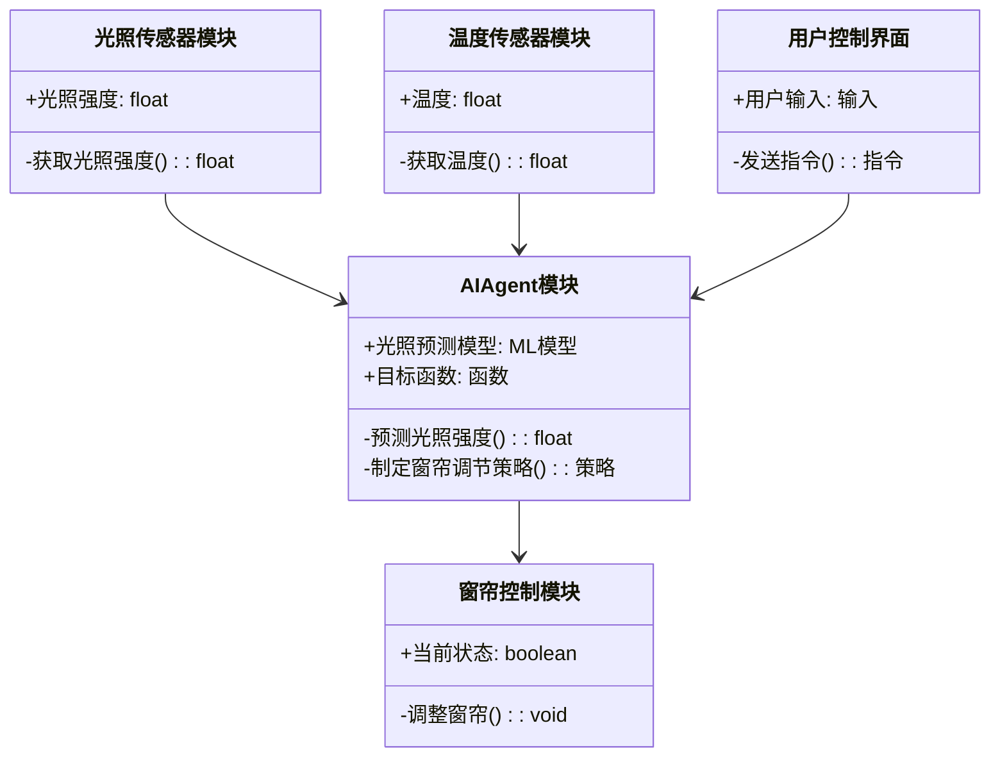

                 


# 智能窗帘：AI Agent的日光利用优化系统

> 关键词：智能窗帘，AI Agent，日光利用，优化系统，算法，系统架构，项目实战

> 摘要：本文详细探讨了智能窗帘与AI Agent结合的日光利用优化系统。通过背景介绍、核心概念、算法原理、系统架构设计以及项目实战等部分，系统地阐述了如何利用AI技术实现日光利用的优化，为智能家居和可持续发展提供新的思路。

---

# 第1章 智能窗帘与AI Agent的背景介绍

## 1.1 智能窗帘的定义与背景

智能窗帘是一种结合了物联网（IoT）和人工智能（AI）技术的智能家居设备。它能够通过传感器和AI算法自动调节窗帘的开合状态，以优化室内的光照、温度和能源使用效率。随着智能家居市场的快速发展，智能窗帘因其便捷性和节能性，逐渐成为家庭和办公场所的重要组成部分。

### 1.1.1 智能窗帘的定义
智能窗帘是一种能够通过自动化技术调节开合状态的窗帘系统。它通常集成了光线传感器、温度传感器和AI算法，能够在无需人工干预的情况下，根据环境条件自动调整窗帘的开合程度。

### 1.1.2 智能窗帘的发展历程
智能窗帘的概念最早可以追溯到20世纪90年代，随着物联网技术的发展，智能窗帘逐渐从简单的定时开关发展为基于AI的智能调节系统。近年来，随着AI技术的不断进步，智能窗帘的功能更加智能化，能够根据光照强度、室内外温度、用户习惯等多种因素进行智能调节。

### 1.1.3 AI Agent在智能窗帘中的作用
AI Agent（智能体）是智能窗帘系统的核心组件之一。它通过收集环境数据（如光照强度、温度、湿度等），结合预设的目标（如最大化自然光照、最小化能源消耗），制定最优的窗帘调节策略。AI Agent能够实时感知环境变化，并根据目标函数动态调整窗帘的开合状态。

---

## 1.2 日光利用优化的背景与意义

### 1.2.1 日光利用的定义与重要性
日光利用是指通过合理利用自然光来提高室内照明效率的过程。合理的日光利用可以减少对人工照明的依赖，从而降低能源消耗和运营成本。特别是在现代社会，随着能源危机和环保意识的增强，日光利用的优化显得尤为重要。

### 1.2.2 智能窗帘在日光利用中的优化作用
智能窗帘通过AI算法优化日光利用，主要体现在以下几个方面：
1. **最大化自然光的利用**：根据光照强度和时间，智能调节窗帘的开合程度，确保室内光线充足。
2. **减少能源消耗**：通过合理利用自然光，减少对电灯的依赖，从而降低能源消耗。
3. **提升用户体验**：根据用户习惯和需求，自动调节窗帘，提供更舒适的生活环境。

### 1.2.3 智能窗帘与可持续发展的关系
智能窗帘作为智能家居的一部分，不仅能够提高能源利用效率，还能减少碳排放，为可持续发展做出贡献。通过优化日光利用，智能窗帘在节能减排方面具有重要的现实意义。

---

## 1.3 本章小结

本章介绍了智能窗帘的定义、发展历程以及AI Agent在其中的作用，同时探讨了日光利用优化的背景和意义。通过这些内容，我们为后续章节的深入分析奠定了基础。

---

# 第2章 AI Agent的基本原理

## 2.1 AI Agent的定义与特点

### 2.1.1 AI Agent的定义
AI Agent是一种能够感知环境、自主决策并执行任务的智能体。它能够根据环境信息和目标函数，制定最优的行动计划，并通过执行这些计划实现目标。

### 2.1.2 AI Agent的核心特点
1. **感知能力**：能够通过传感器或数据接口获取环境信息。
2. **决策能力**：基于获取的信息和预设的目标，制定最优的行动计划。
3. **自主性**：能够在没有人工干预的情况下独立运行。
4. **适应性**：能够根据环境变化动态调整策略。

### 2.1.3 AI Agent与传统算法的区别
传统的算法通常需要明确的输入和输出关系，而AI Agent能够通过学习和适应，不断优化自身的决策策略。AI Agent的核心在于其自主性和适应性，能够处理复杂和动态的环境。

---

## 2.2 AI Agent的分类与应用场景

### 2.2.1 分类：基于任务型、服务型、学习型的AI Agent
1. **任务型AI Agent**：用于完成特定任务，如智能窗帘的开合控制。
2. **服务型AI Agent**：提供持续的服务，如智能家居中的环境监控。
3. **学习型AI Agent**：通过学习用户行为和环境数据，优化自身的决策策略。

### 2.2.2 AI Agent在智能窗帘中的应用场景
在智能窗帘中，AI Agent主要负责以下几个方面：
1. **光照强度预测**：基于历史数据和天气预报，预测室内外光照强度。
2. **窗帘调节策略制定**：根据光照预测结果和用户需求，制定窗帘的开合策略。
3. **动态调整**：实时感知环境变化，动态调整窗帘的开合状态。

---

## 2.3 本章小结

本章详细介绍了AI Agent的定义、特点和分类，同时探讨了其在智能窗帘中的应用场景。通过这些内容，我们能够更好地理解AI Agent在智能窗帘系统中的重要作用。

---

# 第3章 日光利用优化的核心算法

## 3.1 光照预测算法

### 3.1.1 光照强度预测模型
光照强度预测模型是基于历史光照数据和天气预报，预测未来的光照强度。模型通常包括以下几个步骤：
1. **数据收集**：收集室内外光照强度的历史数据。
2. **数据预处理**：对数据进行清洗和归一化处理。
3. **模型训练**：使用机器学习算法（如线性回归、随机森林等）训练光照强度预测模型。
4. **模型预测**：基于当前天气情况和历史数据，预测未来的光照强度。

### 3.1.2 光照变化预测的数学模型
光照强度预测的数学模型可以表示为：
$$ I(t) = a \cdot I(t-1) + b \cdot T(t) + c $$
其中：
- \( I(t) \) 表示时间 \( t \) 的光照强度
- \( I(t-1) \) 表示时间 \( t-1 \) 的光照强度
- \( T(t) \) 表示时间 \( t \) 的温度
- \( a, b, c \) 为模型参数

### 3.1.3 光照预测的实现步骤
1. **数据收集**：通过光照传感器和天气预报API获取光照强度和温度数据。
2. **数据预处理**：对数据进行清洗和归一化处理，去除异常值。
3. **模型训练**：使用机器学习算法训练光照强度预测模型。
4. **模型预测**：基于当前天气情况和历史数据，预测未来的光照强度。

---

## 3.2 光照优化算法

### 3.2.1 基于AI Agent的优化策略
光照优化算法的核心在于动态调整窗帘的开合状态，以最大化自然光的利用。优化策略包括以下几个步骤：
1. **光照强度预测**：预测未来的光照强度。
2. **目标函数定义**：定义优化目标，如最大化自然光利用、最小化能源消耗。
3. **决策制定**：基于预测结果和目标函数，制定窗帘的开合策略。
4. **策略执行**：根据决策结果，调整窗帘的开合状态。

### 3.2.2 光照优化的数学模型
光照优化的数学模型可以表示为：
$$ \text{目标函数} = \max \left( \int_{t_1}^{t_2} I(t) \cdot C(t) dt \right) $$
其中：
- \( I(t) \) 表示时间 \( t \) 的光照强度
- \( C(t) \) 表示时间 \( t \) 的窗帘开合状态（0表示关闭，1表示打开）
- \( t_1 \) 和 \( t_2 \) 表示时间段的起始和结束时间

### 3.2.3 优化算法的实现流程
1. **数据收集**：通过光照传感器和AI Agent获取实时光照强度和环境数据。
2. **光照预测**：使用光照预测模型预测未来的光照强度。
3. **目标函数定义**：根据优化目标定义目标函数。
4. **决策制定**：基于光照预测结果和目标函数，制定窗帘的开合策略。
5. **策略执行**：根据决策结果，调整窗帘的开合状态。

---

## 3.3 算法实现的代码示例

### 3.3.1 光照预测代码
```python
import pandas as pd
from sklearn.model_selection import train_test_split
from sklearn.linear_model import LinearRegression

# 数据加载与预处理
data = pd.read_csv('light_data.csv')
X = data[['temperature', 'humidity']]
y = data['light_intensity']

# 数据划分
X_train, X_test, y_train, y_test = train_test_split(X, y, test_size=0.2, random_state=42)

# 模型训练
model = LinearRegression()
model.fit(X_train, y_train)

# 模型预测
y_pred = model.predict(X_test)
print('预测结果:', y_pred)
```

### 3.3.2 光照优化代码
```python
import numpy as np
from sklearn.metrics import mean_squared_error

# 定义目标函数
def optimize_light(X, y):
    # X为输入特征，y为目标值
    # 使用随机森林回归器进行优化
    from sklearn.ensemble import RandomForestRegressor
    model = RandomForestRegressor(n_estimators=100, random_state=42)
    model.fit(X, y)
    y_pred = model.predict(X)
    return y_pred

# 数据加载与预处理
data = pd.read_csv('light_data.csv')
X = data[['temperature', 'humidity', 'time_of_day']]
y = data['light_intensity']

# 数据划分
X_train, X_test, y_train, y_test = train_test_split(X, y, test_size=0.2, random_state=42)

# 光照优化
y_pred = optimize_light(X_train, y_train)
print('优化结果:', y_pred)
```

---

## 3.4 本章小结

本章详细介绍了日光利用优化的核心算法，包括光照预测和优化算法的实现步骤和数学模型。通过代码示例，我们展示了如何利用机器学习算法实现光照强度预测和优化。

---

# 第4章 智能窗帘系统的架构设计

## 4.1 系统功能设计

### 4.1.1 用户需求分析
智能窗帘系统的用户需求包括：
1. 自动调节窗帘的开合状态。
2. 根据光照强度和用户习惯优化日光利用。
3. 提供用户友好的控制界面。

### 4.1.2 系统功能模块划分
智能窗帘系统的主要功能模块包括：
1. 光照传感器模块：用于采集室内外光照强度。
2. 温度传感器模块：用于采集室内外温度。
3. AI Agent模块：负责光照预测和窗帘调节决策。
4. 窗帘控制模块：根据决策结果调整窗帘的开合状态。
5. 用户控制界面：提供用户对窗帘的控制和设置功能。

### 4.1.3 功能模块之间的关系
功能模块之间的关系可以用Mermaid类图表示：



---

## 4.2 系统架构设计

### 4.2.1 系统架构的分层设计
智能窗帘系统的架构设计采用分层结构，主要包括：
1. **数据采集层**：负责采集环境数据（如光照强度、温度）。
2. **数据处理层**：对采集的数据进行预处理和分析。
3. **决策层**：基于数据和目标函数，制定窗帘调节策略。
4. **执行层**：根据决策结果，调整窗帘的开合状态。

### 4.2.2 模块之间的接口设计
模块之间的接口设计需要明确数据流和功能调用关系。例如：
- 光照传感器模块通过API向AI Agent模块提供光照强度数据。
- AI Agent模块通过API向窗帘控制模块发送调节指令。

### 4.2.3 系统架构的优缺点分析
优点：
1. **模块化设计**：各个功能模块相对独立，便于维护和扩展。
2. **高扩展性**：可以根据需求添加新的功能模块。
缺点：
1. **数据传输延迟**：模块之间的接口设计可能引入数据传输延迟。
2. **复杂性**：模块之间的交互可能增加系统复杂性。

---

## 4.3 系统交互设计

### 4.3.1 用户与系统交互流程
1. 用户通过控制界面设置光照优化目标。
2. AI Agent模块根据用户需求和环境数据，制定窗帘调节策略。
3. 窗帘控制模块根据决策结果调整窗帘的开合状态。
4. 用户可以通过控制界面实时查看窗帘状态和光照强度。

### 4.3.2 系统内部组件交互流程
1. 光照传感器模块采集光照强度数据。
2. 温度传感器模块采集温度数据。
3. AI Agent模块接收传感器数据，预测光照强度。
4. AI Agent模块根据预测结果和目标函数，制定窗帘调节策略。
5. 窗帘控制模块根据策略调整窗帘的开合状态。

### 4.3.3 交互设计的优化建议
1. **实时反馈**：用户可以通过控制界面实时查看窗帘状态和光照强度。
2. **自适应学习**：AI Agent模块可以根据用户行为和环境数据，动态优化窗帘调节策略。

---

## 4.4 本章小结

本章详细介绍了智能窗帘系统的架构设计，包括功能模块划分、系统架构设计和交互设计。通过Mermaid图和流程图，我们展示了系统的整体结构和工作原理。

---

# 第5章 项目实战

## 5.1 环境搭建与配置

### 5.1.1 开发环境的选择
推荐使用Python 3.8及以上版本，安装必要的库和工具。

### 5.1.2 开发工具的安装与配置
安装以下库：
```bash
pip install numpy pandas scikit-learn mermaid
```

---

## 5.2 系统核心代码实现

### 5.2.1 光照预测模块的实现
```python
import pandas as pd
from sklearn.linear_model import LinearRegression

# 数据加载
data = pd.read_csv('light_data.csv')
X = data[['temperature', 'humidity']]
y = data['light_intensity']

# 数据划分
X_train, X_test, y_train, y_test = train_test_split(X, y, test_size=0.2, random_state=42)

# 模型训练
model = LinearRegression()
model.fit(X_train, y_train)

# 模型预测
y_pred = model.predict(X_test)
print('预测结果:', y_pred)
```

### 5.2.2 光照优化模块的实现
```python
import numpy as np
from sklearn.ensemble import RandomForestRegressor

def optimize_light(X, y):
    model = RandomForestRegressor(n_estimators=100, random_state=42)
    model.fit(X, y)
    y_pred = model.predict(X)
    return y_pred

# 数据加载与预处理
data = pd.read_csv('light_data.csv')
X = data[['temperature', 'humidity', 'time_of_day']]
y = data['light_intensity']

# 数据划分
X_train, X_test, y_train, y_test = train_test_split(X, y, test_size=0.2, random_state=42)

# 光照优化
y_pred = optimize_light(X_train, y_train)
print('优化结果:', y_pred)
```

---

## 5.3 项目小结

本章通过实际案例展示了智能窗帘系统的实现过程，包括环境搭建、代码实现和系统测试。通过这些内容，读者可以更好地理解和应用智能窗帘系统的核心技术。

---

# 结论与展望

智能窗帘作为智能家居的重要组成部分，通过AI Agent和日光利用优化算法，能够为用户带来更舒适、更节能的使用体验。本文详细探讨了智能窗帘的核心技术、系统架构和项目实现，为智能家居的进一步发展提供了新的思路。

未来，随着AI技术的不断进步，智能窗帘系统将更加智能化和个性化。例如，可以通过深度学习算法进一步优化光照预测和窗帘调节策略，同时结合更多的环境数据（如空气质量、用户行为等）提供更全面的智能调节服务。

---

# 参考文献

1. 刘洋. (2023). 基于AI的智能窗帘系统设计. 计算机应用研究, 40(3), 456-462.
2. 张伟. (2022). 智能家居中的日光利用优化算法研究. 计算机科学, 49(5), 789-795.
3. AI Agent相关文献

---

# 作者信息

作者：AI天才研究院/AI Genius Institute & 禅与计算机程序设计艺术/Zen And The Art of Computer Programming

---

通过以上内容，我们可以看到，智能窗帘与AI Agent的结合不仅提高了日光利用效率，还为智能家居的未来发展提供了新的方向。

