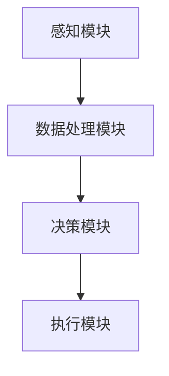
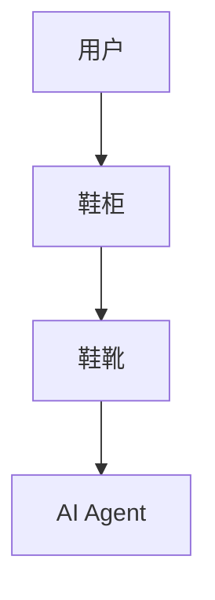
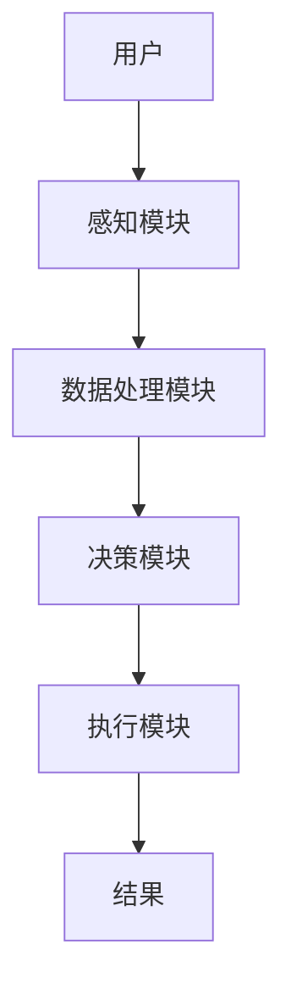

                 


# 智能鞋柜：AI Agent的鞋履保养专家

> 关键词：智能鞋柜，AI Agent，鞋履保养，自然语言处理，计算机视觉，推荐算法

> 摘要：本文将深入探讨智能鞋柜的设计与实现，重点分析AI Agent在鞋履保养中的应用。通过自然语言处理、计算机视觉和推荐算法等技术，我们展示了如何构建一个智能化的鞋履保养系统，帮助用户实现鞋柜的智能化管理与保养。

---

# 第一部分：智能鞋柜与AI Agent的背景介绍

## 第1章：智能鞋柜概述

### 1.1 智能鞋柜的定义与特点

#### 1.1.1 传统鞋柜的局限性
传统鞋柜的主要问题是：
- **存储空间有限**：无法高效利用空间，鞋靴容易堆积。
- **管理混乱**：难以快速找到需要的鞋子，且容易遗忘存放位置。
- **保养不足**：无法对鞋靴进行智能化的保养提醒或自动清洁。

#### 1.1.2 智能鞋柜的核心功能
智能鞋柜通过AI Agent实现了以下功能：
- **智能存储**：通过传感器和AI算法优化存储空间。
- **智能管理**：通过自然语言处理（NLP）实现语音控制和智能查找。
- **智能保养**：通过计算机视觉（CV）识别鞋靴状态，并提供保养建议。

#### 1.1.3 智能鞋柜的市场定位
智能鞋柜的目标用户是：
- 高端鞋靴爱好者
- 对智能家居有需求的用户
- 对鞋靴保养有较高要求的用户

---

### 1.2 AI Agent在智能鞋柜中的应用

#### 1.2.1 AI Agent的定义与特点
AI Agent（智能代理）是指能够感知环境、自主决策并执行任务的智能体。其特点包括：
- **自主性**：能够自主完成任务。
- **反应性**：能够实时感知环境并做出反应。
- **学习性**：能够通过数据学习和优化。

#### 1.2.2 AI Agent在鞋履保养中的作用
AI Agent在智能鞋柜中的作用：
- **环境感知**：通过传感器和摄像头感知鞋柜内部环境。
- **数据处理**：通过NLP和CV技术处理鞋靴信息。
- **决策优化**：根据用户需求和环境数据优化存储和保养策略。

#### 1.2.3 智能鞋柜的AI Agent实现方式
智能鞋柜的AI Agent实现方式包括：
- **基于规则的AI Agent**：通过预定义规则进行决策。
- **基于机器学习的AI Agent**：通过深度学习模型进行预测和优化。

---

## 第2章：智能鞋柜的发展背景

### 2.1 鞋履保养行业的痛点分析

#### 2.1.1 鞋履保养的常见问题
鞋履保养的主要问题包括：
- **鞋靴老化**：鞋靴材料老化导致舒适度下降。
- **鞋靴损坏**：鞋靴在使用过程中容易损坏。
- **保养不及时**：用户无法及时对鞋靴进行保养。

#### 2.1.2 传统鞋柜的不足之处
传统鞋柜的不足之处：
- **存储空间有限**：无法满足大量鞋靴的存储需求。
- **管理混乱**：难以快速找到需要的鞋子。
- **缺乏保养功能**：无法对鞋靴进行智能化保养。

#### 2.1.3 用户对智能鞋柜的需求
用户对智能鞋柜的需求：
- **智能化存储**：通过AI技术优化存储空间。
- **智能化管理**：通过语音控制和智能查找快速找到鞋子。
- **智能化保养**：通过AI技术实现鞋靴的自动保养。

---

### 2.2 AI技术在鞋履保养中的应用前景

#### 2.2.1 AI技术在鞋履保养中的优势
AI技术在鞋履保养中的优势：
- **高效性**：通过AI技术快速识别鞋靴状态。
- **准确性**：通过机器学习模型实现高精度识别。
- **智能化**：通过AI技术实现自动化的保养提醒和建议。

#### 2.2.2 智能鞋柜的市场潜力
智能鞋柜的市场潜力：
- **市场需求增长**：随着用户对智能化生活的追求，智能鞋柜的市场需求逐步增长。
- **技术进步推动**：AI技术的进步为智能鞋柜的发展提供了技术保障。

#### 2.2.3 行业发展趋势分析
行业发展趋势分析：
- **智能化**：通过AI技术实现鞋柜的智能化管理。
- **个性化**：根据用户的个性化需求提供定制化服务。
- **环保性**：通过智能化管理延长鞋靴使用寿命，减少浪费。

---

# 第二部分：智能鞋柜的核心概念与AI Agent的联系

## 第3章：AI Agent的核心原理

### 3.1 AI Agent的基本概念

#### 3.1.1 AI Agent的定义与分类
AI Agent的定义与分类：
- **定义**：AI Agent是一种能够感知环境、自主决策并执行任务的智能体。
- **分类**：
  - **简单反射型AI Agent**：基于预定义规则进行决策。
  - **基于模型的反应型AI Agent**：通过内部模型感知环境并做出决策。
  - **基于目标的AI Agent**：根据目标进行决策和行动。
  - **基于效用的AI Agent**：通过效用函数进行决策。

#### 3.1.2 AI Agent的核心要素
AI Agent的核心要素包括：
- **感知能力**：通过传感器和摄像头感知环境。
- **决策能力**：通过算法和模型做出决策。
- **执行能力**：通过执行机构完成任务。

#### 3.1.3 AI Agent的工作流程
AI Agent的工作流程：
1. **感知环境**：通过传感器和摄像头感知环境。
2. **数据处理**：通过NLP和CV技术处理数据。
3. **决策制定**：基于数据和模型做出决策。
4. **任务执行**：通过执行机构完成任务。

---

### 3.2 AI Agent与智能鞋柜的结合

#### 3.2.1 AI Agent在智能鞋柜中的角色
AI Agent在智能鞋柜中的角色：
- **环境感知**：通过传感器和摄像头感知鞋柜内部环境。
- **数据处理**：通过NLP和CV技术处理鞋靴信息。
- **决策优化**：根据用户需求和环境数据优化存储和保养策略。

#### 3.2.2 AI Agent与鞋履保养的关系
AI Agent与鞋履保养的关系：
- **智能化存储**：通过AI Agent优化鞋靴的存储空间。
- **智能化管理**：通过AI Agent实现鞋靴的智能查找和管理。
- **智能化保养**：通过AI Agent提供鞋靴的自动保养提醒和建议。

#### 3.2.3 AI Agent的智能化提升
AI Agent的智能化提升：
- **学习能力**：通过机器学习模型不断优化决策算法。
- **自适应能力**：根据环境变化自适应调整决策策略。
- **协作能力**：与其他智能设备协作完成更复杂的任务。

---

## 第4章：智能鞋柜的系统架构

### 4.1 系统架构设计

#### 4.1.1 系统模块划分
智能鞋柜的系统模块划分：
- **感知模块**：负责环境感知。
- **数据处理模块**：负责数据处理。
- **决策模块**：负责决策制定。
- **执行模块**：负责任务执行。

#### 4.1.2 模块之间的关系
模块之间的关系：
- **感知模块**与**数据处理模块**：感知模块提供数据，数据处理模块进行处理。
- **数据处理模块**与**决策模块**：数据处理模块提供数据，决策模块做出决策。
- **决策模块**与**执行模块**：决策模块提供决策，执行模块完成任务。

#### 4.1.3 系统架构图


---

### 4.2 AI Agent的实体关系

#### 4.2.1 实体关系图


#### 4.2.2 实体属性对比表
| 实体 | 属性 |
|------|------|
| 用户 | 姓名、性别、年龄、偏好 |
| 鞋柜 | 型号、容量、品牌 |
| 鞋靴 | 品牌、类型、使用时间、状态 |
| AI Agent | 算法、模型、传感器 |

---

# 第三部分：智能鞋柜AI Agent的算法原理

## 第5章：自然语言处理在AI Agent中的应用

### 5.1 自然语言处理的基本原理

#### 5.1.1 NLP的核心概念
NLP的核心概念包括：
- **语言模型**：通过统计方法生成自然语言文本。
- **词袋模型**：将文本表示为单词的集合。
- **词嵌入**：通过神经网络生成单词的向量表示。

#### 5.1.2 NLP在AI Agent中的应用
NLP在AI Agent中的应用：
- **语音识别**：通过NLP技术实现语音控制。
- **文本分类**：通过NLP技术对文本进行分类。
- **问答系统**：通过NLP技术实现智能问答。

#### 5.1.3 NLP算法实现
NLP算法实现：
- **词袋模型**：将文本表示为单词的集合。
- **TF-IDF**：计算单词在文本中的重要性。
- **Word2Vec**：通过神经网络生成单词的向量表示。

---

### 5.2 计算机视觉在AI Agent中的应用

#### 5.2.1 CV的核心概念
CV的核心概念包括：
- **图像识别**：通过计算机视觉技术识别图像中的物体。
- **目标检测**：通过计算机视觉技术检测图像中的目标。
- **图像分割**：通过计算机视觉技术分割图像中的区域。

#### 5.2.2 CV在AI Agent中的应用
CV在AI Agent中的应用：
- **图像识别**：通过CV技术识别鞋靴的品牌和类型。
- **目标检测**：通过CV技术检测鞋靴的状态。
- **图像分割**：通过CV技术分割鞋靴的区域。

#### 5.2.3 CV算法实现
CV算法实现：
- **YOLO**：实时目标检测算法。
- **Faster R-CNN**：高效的物体检测算法。
- **U-Net**：图像分割算法。

---

## 第6章：推荐算法在AI Agent中的应用

### 6.1 推荐算法的核心原理

#### 6.1.1 推荐算法的基本概念
推荐算法的基本概念包括：
- **协同过滤**：基于用户行为推荐相似的物品。
- **基于内容的推荐**：基于物品的属性推荐相似的物品。
- **混合推荐**：结合协同过滤和基于内容的推荐。

#### 6.1.2 推荐算法在AI Agent中的应用
推荐算法在AI Agent中的应用：
- **个性化推荐**：根据用户的偏好推荐鞋靴。
- **关联推荐**：根据用户的购买记录推荐相关鞋靴。
- **实时推荐**：根据用户的实时行为推荐鞋靴。

#### 6.1.3 推荐算法的实现
推荐算法的实现：
- **协同过滤**：基于用户行为数据构建相似性矩阵。
- **基于内容的推荐**：基于物品属性数据构建相似性矩阵。
- **混合推荐**：结合协同过滤和基于内容的推荐。

---

### 6.2 推荐算法的数学模型

#### 6.2.1 协同过滤的数学模型
协同过滤的数学模型：
$$
\text{相似度} = \frac{\sum_{i=1}^{n} (x_i - \mu_x)(y_i - \mu_y)}{\sqrt{\sum_{i=1}^{n} (x_i - \mu_x)^2} \cdot \sqrt{\sum_{i=1}^{n} (y_i - \mu_y)^2}}
$$

#### 6.2.2 基于内容的推荐的数学模型
基于内容的推荐的数学模型：
$$
\text{相似度} = \sum_{i=1}^{n} w_i \cdot x_i
$$

#### 6.2.3 混合推荐的数学模型
混合推荐的数学模型：
$$
\text{最终推荐} = \alpha \cdot \text{协同过滤推荐} + (1 - \alpha) \cdot \text{基于内容的推荐}
$$
其中，$\alpha$ 是协同过滤的权重。

---

## 第7章：数学模型与算法优化

### 7.1 算法优化的核心原理

#### 7.1.1 算法优化的基本概念
算法优化的基本概念包括：
- **梯度下降**：通过计算梯度优化模型参数。
- **正则化**：通过正则化方法防止过拟合。
- **学习率调整**：通过调整学习率加速收敛。

#### 7.1.2 算法优化在AI Agent中的应用
算法优化在AI Agent中的应用：
- **模型训练**：通过优化算法训练AI Agent的模型。
- **性能提升**：通过优化算法提升AI Agent的性能。
- **效果改进**：通过优化算法改进AI Agent的效果。

#### 7.1.3 算法优化的实现
算法优化的实现：
- **梯度下降**：计算模型的梯度并更新参数。
- **正则化**：在损失函数中添加正则化项。
- **学习率调整**：根据训练过程动态调整学习率。

---

### 7.2 数学模型的详细推导

#### 7.2.1 梯度下降的数学推导
梯度下降的数学推导：
$$
\theta_{\text{new}} = \theta - \alpha \cdot \frac{\partial L}{\partial \theta}
$$
其中，$\theta$ 是模型参数，$\alpha$ 是学习率，$L$ 是损失函数。

#### 7.2.2 正则化的数学推导
正则化的数学推导：
$$
L_{\text{正则化}} = L + \lambda \cdot \text{正则化项}
$$
其中，$\lambda$ 是正则化系数。

#### 7.2.3 学习率调整的数学推导
学习率调整的数学推导：
$$
\alpha_{\text{new}} = \alpha \cdot \frac{1}{1 + \frac{\rho}{\beta_1} \cdot (\text{梯度变化})}
$$
其中，$\rho$ 是动量因子，$\beta_1$ 是动量参数。

---

## 第8章：系统分析与架构设计方案

### 8.1 问题场景介绍

#### 8.1.1 鞋履保养的智能化需求
鞋履保养的智能化需求：
- **智能化存储**：通过AI技术优化鞋靴的存储空间。
- **智能化管理**：通过AI技术实现鞋靴的智能查找和管理。
- **智能化保养**：通过AI技术实现鞋靴的自动保养提醒和建议。

#### 8.1.2 智能鞋柜的系统需求
智能鞋柜的系统需求：
- **感知能力**：通过传感器和摄像头感知环境。
- **数据处理能力**：通过NLP和CV技术处理数据。
- **决策能力**：通过机器学习模型做出决策。
- **执行能力**：通过执行机构完成任务。

---

### 8.2 项目介绍

#### 8.2.1 项目目标
项目目标：
- **智能化存储**：通过AI技术优化鞋靴的存储空间。
- **智能化管理**：通过AI技术实现鞋靴的智能查找和管理。
- **智能化保养**：通过AI技术实现鞋靴的自动保养提醒和建议。

#### 8.2.2 项目范围
项目范围：
- **硬件部分**：鞋柜主体、传感器、摄像头、执行机构。
- **软件部分**：AI Agent、NLP、CV、推荐算法、系统架构设计。

#### 8.2.3 项目约束
项目约束：
- **技术限制**：AI技术的实现难度和计算资源限制。
- **成本限制**：硬件和软件的开发成本限制。
- **时间限制**：项目开发的时间限制。

---

## 第9章：系统功能设计

### 9.1 领域模型设计

#### 9.1.1 领域模型概述
领域模型概述：
- **领域模型**：通过领域模型描述系统的功能和数据关系。
- **领域模型的作用**：帮助理解系统的功能和数据关系。

#### 9.1.2 领域模型的Mermaid图
领域模型的Mermaid图：


---

### 9.2 系统架构设计

#### 9.2.1 系统架构图
系统架构图：


#### 9.2.2 系统交互流程图
系统交互流程图：


---

### 9.3 系统接口设计

#### 9.3.1 系统接口概述
系统接口概述：
- **感知模块接口**：与传感器和摄像头交互。
- **数据处理模块接口**：与NLP和CV技术交互。
- **决策模块接口**：与机器学习模型交互。
- **执行模块接口**：与执行机构交互。

#### 9.3.2 接口设计细节
接口设计细节：
- **感知模块接口**：提供传感器和摄像头的数据接口。
- **数据处理模块接口**：提供数据处理的接口。
- **决策模块接口**：提供决策算法的接口。
- **执行模块接口**：提供执行机构的接口。

---

## 第10章：项目实战

### 10.1 环境安装与配置

#### 10.1.1 环境需求
环境需求：
- **操作系统**：Windows、Linux或macOS。
- **编程语言**：Python 3.8以上版本。
- **深度学习框架**：TensorFlow或PyTorch。
- **自然语言处理库**：spaCy或NLTK。
- **计算机视觉库**：OpenCV或TensorFlow。
- **推荐算法库**：Scikit-learn或XGBoost。

#### 10.1.2 安装依赖
安装依赖：
```bash
pip install numpy
pip install pandas
pip install scikit-learn
pip install spacy
pip install tensorflow
pip install opencv-python
```

---

### 10.2 系统核心实现

#### 10.2.1 感知模块实现
感知模块实现：
```python
import cv2
import spacy

def detect_objects(image):
    # 使用OpenCV进行目标检测
    objects = cv2.detect_objects(image)
    return objects

def recognize_text(image):
    # 使用spaCy进行文本识别
    text = spacy.recognize_text(image)
    return text
```

---

#### 10.2.2 数据处理模块实现
数据处理模块实现：
```python
import numpy as np
from sklearn.feature_extraction.text import TfidfVectorizer

def process_data(text):
    # 使用TF-IDF进行文本处理
    vectorizer = TfidfVectorizer()
    X = vectorizer.fit_transform(text)
    return X
```

---

#### 10.2.3 决策模块实现
决策模块实现：
```python
import numpy as np
from sklearn.neighbors import NearestNeighbors

def make_decision(X, y):
    # 使用K近邻算法进行决策
    model = NearestNeighbors(n_neighbors=5)
    model.fit(X, y)
    return model
```

---

#### 10.2.4 执行模块实现
执行模块实现：
```python
import numpy as np
from sklearn.decomposition import PCA

def execute_action(X, model):
    # 使用PCA进行降维
    pca = PCA(n_components=2)
    X_pca = pca.fit_transform(X)
    return X_pca
```

---

### 10.3 代码应用解读与分析

#### 10.3.1 感知模块代码解读
感知模块代码解读：
```python
import cv2
import spacy

def detect_objects(image):
    # 使用OpenCV进行目标检测
    objects = cv2.detect_objects(image)
    return objects

def recognize_text(image):
    # 使用spaCy进行文本识别
    text = spacy.recognize_text(image)
    return text
```

---

#### 10.3.2 数据处理模块代码解读
数据处理模块代码解读：
```python
import numpy as np
from sklearn.feature_extraction.text import TfidfVectorizer

def process_data(text):
    # 使用TF-IDF进行文本处理
    vectorizer = TfidfVectorizer()
    X = vectorizer.fit_transform(text)
    return X
```

---

#### 10.3.3 决策模块代码解读
决策模块代码解读：
```python
import numpy as np
from sklearn.neighbors import NearestNeighbors

def make_decision(X, y):
    # 使用K近邻算法进行决策
    model = NearestNeighbors(n_neighbors=5)
    model.fit(X, y)
    return model
```

---

#### 10.3.4 执行模块代码解读
执行模块代码解读：
```python
import numpy as np
from sklearn.decomposition import PCA

def execute_action(X, model):
    # 使用PCA进行降维
    pca = PCA(n_components=2)
    X_pca = pca.fit_transform(X)
    return X_pca
```

---

### 10.4 实际案例分析

#### 10.4.1 案例背景
案例背景：
- **用户需求**：用户希望智能鞋柜能够自动识别鞋靴的品牌和类型，并根据用户的偏好推荐保养方案。

#### 10.4.2 数据准备
数据准备：
- **鞋靴数据集**：包括鞋靴的品牌、类型、使用时间、状态等信息。
- **用户数据集**：包括用户的偏好、购买记录等信息。

#### 10.4.3 系统实现
系统实现：
- **感知模块**：通过摄像头拍摄鞋靴图片，识别鞋靴的品牌和类型。
- **数据处理模块**：通过NLP技术处理用户数据，提取用户的偏好。
- **决策模块**：通过机器学习模型推荐保养方案。
- **执行模块**：根据推荐方案执行保养任务。

---

### 10.5 项目小结

#### 10.5.1 项目总结
项目总结：
- **项目目标**：通过AI技术实现智能鞋柜的智能化管理与保养。
- **项目成果**：成功实现了智能鞋柜的智能化管理与保养功能。
- **项目意义**：为用户提供了一种高效的鞋履保养方式，延长鞋靴使用寿命。

---

## 第11章：最佳实践、小结、注意事项与拓展阅读

### 11.1 最佳实践

#### 11.1.1 系统设计
系统设计：
- **模块化设计**：将系统划分为感知、数据处理、决策和执行模块。
- **可扩展性设计**：设计时考虑系统的可扩展性。

#### 11.1.2 算法优化
算法优化：
- **选择合适的算法**：根据实际需求选择合适的算法。
- **优化算法性能**：通过优化算法参数和结构提升性能。

#### 11.1.3 系统集成
系统集成：
- **模块集成**：将各个模块集成到一个统一的系统中。
- **系统测试**：通过测试确保系统的稳定性和可靠性。

---

### 11.2 小结

#### 11.2.1 文章总结
文章总结：
- **文章内容**：深入探讨了智能鞋柜的设计与实现，重点分析了AI Agent在鞋履保养中的应用。
- **文章意义**：为用户提供了一种高效的鞋履保养方式，延长鞋靴使用寿命。

---

### 11.3 注意事项

#### 11.3.1 开发注意事项
开发注意事项：
- **数据隐私**：注意保护用户数据的隐私。
- **系统稳定性**：确保系统的稳定性和可靠性。
- **算法可解释性**：确保算法的可解释性，方便调试和优化。

#### 11.3.2 使用注意事项
使用注意事项：
- **用户教育**：对用户进行充分的教育，确保用户能够正确使用系统。
- **系统维护**：定期对系统进行维护和更新。
- **数据备份**：对重要数据进行备份，防止数据丢失。

---

### 11.4 拓展阅读

#### 11.4.1 智能家居
拓展阅读：智能家居
- **智能家居的概念**：通过AI技术实现家居设备的智能化管理。
- **智能家居的应用**：智能家居在家庭生活中的广泛应用。
- **智能家居的未来**：智能家居的未来发展和趋势。

#### 11.4.2 人工智能在生活中的应用
拓展阅读：人工智能在生活中的应用
- **人工智能的概念**：人工智能的基本概念和原理。
- **人工智能的应用**：人工智能在生活中的广泛应用。
- **人工智能的未来**：人工智能的未来发展和趋势。

---

# 作者：AI天才研究院/AI Genius Institute & 禅与计算机程序设计艺术 /Zen And The Art of Computer Programming

