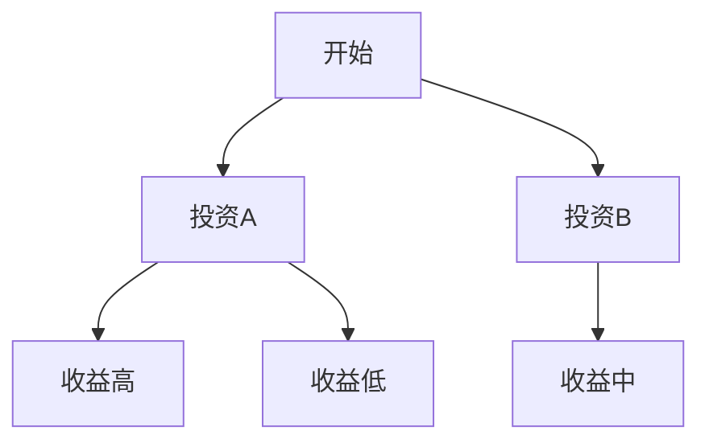

                 

# 芒格的"极端后果"思维：在投资中考虑最坏情况

> 关键词：芒格、极端后果思维、投资、风险管理、决策模型、概率思维、逆向思维

> 摘要：芒格的“极端后果”思维是一种以风险为核心的投资理念，强调在决策过程中考虑最坏情况，从而避免重大损失。本文从芒格的哲学基础出发，详细分析了极端后果思维的定义、特点、决策模型和风险管理策略，并通过实际案例展示了该思维在投资中的应用。文章还探讨了极端后果思维与概率思维、逆向思维的关系，并提出了系统化的投资决策框架，为投资者提供了一套在复杂市场环境中保持理性和稳健的投资方法。

---

# 第1章：芒格“极端后果”思维的概述

## 1.1 芒格“极端后果”思维的定义与特点

### 1.1.1 什么是“极端后果”思维

“极端后果”思维是一种以风险为核心的投资理念，强调在决策过程中考虑最坏情况，从而避免重大损失。芒格认为，投资者应该始终思考“如果发生最糟糕的情况，我会如何应对？”这种思维方式帮助投资者在面对不确定性时保持冷静，并做出更理性的决策。

**关键点：**

- 强调极端情况下的风险控制
- 避免因乐观偏见导致的决策失误
- 帮助投资者在危机中保持稳健

### 1.1.2 极端后果思维的核心特点

1. **逆向思维**：芒格倡导从最坏的情况出发，反向思考问题，从而避免陷入乐观陷阱。
2. **概率导向**：极端后果思维注重概率分析，强调通过量化风险来评估决策的可行性。
3. **稳健性**：在决策过程中，始终考虑最坏情况下的应对方案，确保投资组合的稳健性。

### 1.1.3 与其他投资思维的对比

| 思维方式 | 描述 | 优缺点 |
|----------|------|--------|
| 价值投资 | 以内在价值为导向，寻找被市场低估的企业 | 优点：长期稳健；缺点：需要对企业有深刻理解 |
| 技术分析 | 通过技术指标预测市场走势 | 优点：短期操作性强；缺点：忽视基本面风险 |
| 极端后果思维 | 以风险为核心，考虑最坏情况 | 优点：稳健性高；缺点：可能错过短期机会 |

---

## 1.2 芒格“极端后果”思维的哲学基础

### 1.2.1 芒格的生平与思想体系

查理·芒格（Charlie Munger）是伯克希尔·哈撒韦公司（Berkshire Hathaway）的副主席，被誉为“巴菲特的导师”。他的投资哲学深受心理学、经济学和哲学的影响，强调理性思考和风险控制。

**关键点：**

- 芒格的思想体系以理性为核心
- 强调避免情绪化决策
- 注重长期投资和价值发现

### 1.2.2 芒格思维中的理性与非理性

芒格认为，人类决策过程中存在许多非理性的因素，如情绪、偏见和认知错误。极端后果思维正是对这些非理性因素的反思和修正。

**关键点：**

- 识别并克服认知偏差
- 在决策中保持理性
- 避免情绪化决策

### 1.2.3 芒格思想对现代投资理论的影响

芒格的思想对现代投资理论有深远影响，尤其是在风险管理、概率分析和逆向思维方面，为投资者提供了新的视角。

**关键点：**

- 强调风险管理的重要性
- 提供了概率导向的投资方法
- 影响了许多投资策略的开发

---

## 1.3 极端后果思维在投资中的重要性

### 1.3.1 投资中的常见错误与芒格思维的解决方案

1. **过度乐观**：投资者往往高估自己的判断能力，忽视潜在风险。
2. **情绪化决策**：市场波动容易引发非理性行为。
3. **忽视尾部风险**：极端事件的概率虽低，但影响巨大。

**解决方案：**

- 通过极端后果思维识别潜在风险
- 制定应对极端情况的策略
- 保持长期投资纪律

### 1.3.2 极端后果思维如何帮助投资者避免重大损失

极端后果思维通过分析最坏情况，帮助投资者制定稳健的投资策略，避免因忽视风险而导致的重大损失。

**关键点：**

- 极端后果思维帮助投资者建立风险底线
- 在市场恐慌时保持冷静
- 避免因盲目跟风导致的重大损失

### 1.3.3 极端后果思维在不同市场环境下的应用

1. **牛市**：警惕市场泡沫，避免过度投资。
2. **熊市**：寻找被低估的投资机会，避免恐慌性抛售。
3. **危机时期**：制定应对计划，保护投资组合。

---

## 总结

芒格的“极端后果”思维是一种以风险为核心的投资理念，强调在决策过程中考虑最坏情况，从而避免重大损失。通过分析芒格的哲学基础、极端后果思维的定义与特点，以及其在投资中的重要性，我们可以更好地理解这一思维方式的核心价值。接下来，我们将深入探讨极端后果思维的理论基础，包括概率思维和逆向思维，以及如何将这一思维应用于实际投资决策中。

---

# 第2章：芒格“极端后果”思维的理论基础

## 2.1 概率思维与决策

### 2.1.1 概率思维的基本概念

概率思维是芒格极端后果思维的重要组成部分，通过量化分析，帮助投资者评估不同结果的可能性。

**关键点：**

- 概率思维是理性决策的基础
- 通过概率分析，投资者可以更好地理解风险和收益之间的关系
- 概率分析需要结合具体数据和市场环境

### 2.1.2 概率思维在投资决策中的应用

1. **风险评估**：通过概率分析，评估投资项目的潜在风险。
2. **收益预测**：基于概率分布，预测投资收益。
3. **决策优化**：通过概率分析，优化投资组合。

### 2.1.3 如何通过概率思维评估投资风险

**步骤：**

1. **收集数据**：分析历史数据，了解市场波动。
2. **建立模型**：构建概率模型，量化风险。
3. **评估结果**：根据概率分布，评估风险和收益。

**公式示例：**

$$ P(\text{收益}) = \sum_{i=1}^{n} P_i \times R_i $$

其中，$P_i$ 是第 $i$ 种情况发生的概率，$R_i$ 是对应的收益。

---

## 2.2 逆向思维与风险管理

### 2.2.1 逆向思维的定义与特点

逆向思维是芒格极端后果思维的重要组成部分，通过反向思考问题，帮助投资者避免常见错误。

**关键点：**

- 逆向思维帮助投资者发现潜在风险
- 在决策中，通过反向思考，避免陷入认知偏差
- 逆向思维需要结合具体情境

### 2.2.2 逆向思维在投资风险管理中的应用

1. **识别潜在风险**：通过逆向思考，发现可能被忽视的风险因素。
2. **制定应对策略**：在极端情况下，提前制定应对计划。
3. **优化风险管理框架**：通过逆向思维，不断优化风险管理策略。

---

## 2.3 极端后果思维与决策树分析

### 2.3.1 决策树的基本概念

决策树是一种用于分析决策问题的工具，通过树状结构展示所有可能的决策路径及其结果。

### 2.3.2 如何构建极端后果思维的决策树

1. **定义问题**：明确决策的目标和范围。
2. **分析可能的决策路径**：列出所有可能的决策选项。
3. **评估结果**：对每种决策路径进行概率和收益分析。
4. **选择最优方案**：根据分析结果，选择最佳决策。

**决策树示例：**

---

## 总结

通过概率思维和逆向思维，芒格的极端后果思维为投资者提供了强大的理论支持。概率思维帮助投资者量化风险，逆向思维则帮助投资者发现潜在风险。接下来，我们将深入探讨极端后果思维的决策框架，包括决策模型的构建和风险管理策略的制定。

---

# 第3章：芒格“极端后果”思维的决策框架

## 3.1 极端后果思维的决策模型

### 3.1.1 极端后果思维的决策模型构建

**步骤：**

1. **定义决策目标**：明确投资目标和风险承受能力。
2. **分析潜在风险**：识别可能影响投资的极端事件。
3. **评估结果**：对每种极端情况下的结果进行概率和收益分析。
4. **制定应对策略**：根据分析结果，制定应对极端情况的策略。

### 3.1.2 模型中的关键变量与假设

1. **变量**：市场波动、经济周期、公司基本面等。
2. **假设**：极端情况下的市场反应、政策变化等。

### 3.1.3 决策模型的优化与验证

1. **模型优化**：通过历史数据验证模型的准确性。
2. **模型验证**：定期更新模型，确保其有效性。

---

## 3.2 极端后果思维的决策流程

### 3.2.1 识别潜在风险

1. **市场风险**：如市场崩盘、经济衰退等。
2. **公司风险**：如财务危机、管理问题等。
3. **政策风险**：如政策变化、监管加强等。

### 3.2.2 评估风险影响

1. **概率分析**：评估每种风险发生的概率。
2. **影响分析**：评估每种风险对投资的影响程度。

### 3.2.3 制定应对策略

1. **风险规避**：通过分散投资降低风险。
2. **风险对冲**：利用金融工具对冲风险。
3. **风险接受**：在可接受范围内承担风险。

---

## 3.3 极端后果思维的案例分析

### 3.3.1 价值投资中的极端后果思维

**案例：购买被低估的股票**

- **分析**：评估公司的基本面，考虑最坏情况下的股价波动。
- **应对策略**：制定买入和卖出的界限，避免过度波动。

### 3.3.2 成长投资中的极端后果思维

**案例：投资高增长企业**

- **分析**：评估公司的增长潜力，考虑市场饱和和竞争风险。
- **应对策略**：分散投资，避免过度依赖单一企业。

### 3.3.3 危机投资中的极端后果思维

**案例：金融危机期间的投资**

- **分析**：评估市场的极端波动，识别被低估的投资机会。
- **应对策略**：制定买入计划，避免恐慌性抛售。

---

## 总结

通过构建极端后果思维的决策模型，投资者可以在复杂市场环境中做出更理性的决策。接下来，我们将探讨如何在实际投资中应用极端后果思维，包括风险管理、心理因素和系统化方法等内容。

---

# 第4章：芒格“极端后果”思维的心理因素

## 4.1 投资者心理偏差与极端后果思维

### 4.1.1 行为偏差的影响

1. **过度自信**：投资者高估自己的判断能力，导致决策失误。
2. **损失厌恶**：投资者对损失的敏感性高于收益。
3. **从众心理**：投资者跟随市场潮流，忽视独立判断。

### 4.1.2 如何克服心理偏差

1. **理性思考**：通过概率分析，避免情绪化决策。
2. **独立判断**：保持独立思考，避免从众心理。
3. **定期反思**：通过反思，识别并克服认知偏差。

---

## 4.2 极端后果思维与情绪管理

### 4.2.1 情绪化决策的危害

1. **市场恐慌**：投资者在市场下跌时恐慌抛售。
2. **市场狂热**：投资者在市场上涨时盲目追涨。

### 4.2.2 如何通过极端后果思维管理情绪

1. **制定投资计划**：明确投资目标和策略。
2. **严格执行纪律**：在市场波动中保持冷静。
3. **定期评估**：通过定期评估，调整投资策略。

---

## 4.3 极端后果思维与决策疲劳

### 4.3.1 决策疲劳的影响

1. **决策疲劳**：投资者因信息过载而难以做出决策。
2. **决策疲劳的解决方案**：通过简化决策过程，减少信息干扰。

### 4.3.2 如何在投资中避免决策疲劳

1. **制定决策框架**：通过极端后果思维，简化决策过程。
2. **依赖系统化方法**：通过系统化方法，减少人为干扰。

---

## 总结

极端后果思维不仅是一种投资方法，更是一种心理调节工具。通过克服心理偏差，投资者可以在复杂市场环境中保持理性。接下来，我们将探讨极端后果思维的风险管理策略，包括风险评估、对冲策略和压力测试等内容。

---

# 第5章：芒格“极端后果”思维的风险管理

## 5.1 风险评估与管理

### 5.1.1 风险评估的基本步骤

1. **识别风险**：识别可能影响投资的潜在风险。
2. **评估风险**：通过概率分析，评估每种风险的影响程度。
3. **制定应对策略**：根据风险评估结果，制定应对策略。

### 5.1.2 风险管理的工具与方法

1. **风险对冲**：利用金融工具对冲风险。
2. **风险分散**：通过分散投资降低风险。
3. **风险预警**：建立风险预警机制，及时发现潜在风险。

---

## 5.2 极端后果思维与对冲策略

### 5.2.1 对冲策略的基本概念

对冲策略是一种通过相反交易来降低风险的投资策略，常用于对冲市场波动。

### 5.2.2 如何通过极端后果思维制定对冲策略

1. **分析潜在风险**：识别可能影响投资的极端事件。
2. **评估风险影响**：对每种极端事件进行概率和影响分析。
3. **制定对冲计划**：根据分析结果，制定对冲策略。

---

## 5.3 极端后果思维与压力测试

### 5.3.1 压力测试的基本概念

压力测试是一种通过模拟极端市场环境，评估投资组合在极端情况下的表现。

### 5.3.2 如何通过极端后果思维进行压力测试

1. **模拟极端市场环境**：设定极端市场条件，如市场崩盘、经济衰退等。
2. **评估投资组合表现**：在模拟的极端环境中，评估投资组合的收益和风险。
3. **优化投资组合**：根据压力测试结果，优化投资组合。

---

## 总结

通过风险管理和对冲策略，投资者可以在复杂市场环境中降低风险。接下来，我们将探讨极端后果思维的实际应用，包括经典案例分析和系统化投资策略等内容。

---

# 第6章：芒格“极端后果”思维的案例分析

## 6.1 经典案例分析

### 6.1.1 价值投资案例

**案例：巴菲特投资可口可乐**

- **分析**：评估公司的基本面，考虑最坏情况下的股价波动。
- **应对策略**：制定买入和卖出的界限，避免过度波动。

### 6.1.2 成长投资案例

**案例：芒格投资苹果公司**

- **分析**：评估公司的增长潜力，考虑市场饱和和竞争风险。
- **应对策略**：分散投资，避免过度依赖单一企业。

### 6.1.3 危机投资案例

**案例：金融危机期间的投资**

- **分析**：评估市场的极端波动，识别被低估的投资机会。
- **应对策略**：制定买入计划，避免恐慌性抛售。

---

## 6.2 投资组合管理中的极端后果思维

### 6.2.1 投资组合的构建

1. **资产配置**：根据风险承受能力和收益目标，配置不同资产。
2. **风险分散**：通过分散投资，降低投资组合的整体风险。

### 6.2.2 投资组合的动态调整

1. **定期评估**：根据市场变化，动态调整投资组合。
2. **应对极端情况**：在极端情况下，及时调整投资策略。

---

## 总结

通过实际案例分析，我们可以更好地理解极端后果思维在投资中的应用。接下来，我们将探讨如何系统化地应用极端后果思维，包括投资决策框架、风险管理策略和动态调整方法等内容。

---

# 第7章：芒格“极端后果”思维的系统化应用

## 7.1 投资决策框架

### 7.1.1 框架的构建

1. **目标设定**：明确投资目标和风险承受能力。
2. **风险识别**：识别可能影响投资的潜在风险。
3. **决策制定**：根据风险评估结果，制定投资策略。

### 7.1.2 框架的优化

1. **定期评估**：根据市场变化，优化投资策略。
2. **动态调整**：在极端情况下，及时调整投资组合。

---

## 7.2 风险管理策略

### 7.2.1 风险对冲

1. **对冲工具**：利用金融衍生品对冲风险。
2. **对冲策略**：根据市场环境，调整对冲比例。

### 7.2.2 风险分散

1. **资产配置**：通过分散投资，降低整体风险。
2. **行业选择**：选择不同行业的股票，降低行业风险。

---

## 7.3 投资组合的动态调整

### 7.3.1 动态调整的必要性

1. **市场变化**：根据市场变化，调整投资策略。
2. **风险变化**：根据风险评估结果，调整投资组合。

### 7.3.2 动态调整的方法

1. **定期评估**：每季度或半年评估一次投资组合。
2. **及时应对**：在极端情况下，迅速调整投资策略。

---

## 总结

通过系统化应用极端后果思维，投资者可以在复杂市场环境中保持稳健。接下来，我们将总结全书内容，并展望未来的投资趋势。

---

# 第8章：总结与展望

## 8.1 全书内容回顾

1. **芒格“极端后果”思维的定义与特点**
2. **极端后果思维的理论基础**
3. **极端后果思维的决策框架**
4. **极端后果思维的心理因素**
5. **极端后果思维的风险管理**
6. **极端后果思维的案例分析**
7. **极端后果思维的系统化应用**

---

## 8.2 未来的投资趋势

### 8.2.1 投资趋势分析

1. **科技投资**：随着科技的发展，科技股将成为未来投资的重要方向。
2. **可持续投资**：环保和可持续发展将成为未来投资的重要考量。
3. **全球化与本地化**：投资者需要在全球化与本地化之间找到平衡。

### 8.2.2 极端后果思维的未来发展

1. **技术进步**：随着人工智能和大数据技术的发展，极端后果思维将得到更广泛的应用。
2. **市场变化**：极端后果思维将继续在复杂市场环境中发挥重要作用。

---

## 总结

芒格的“极端后果”思维是一种以风险为核心的投资理念，强调在决策过程中考虑最坏情况，从而避免重大损失。通过系统化应用极端后果思维，投资者可以在复杂市场环境中保持稳健。未来，随着科技的发展和市场的变化，极端后果思维将继续在投资领域发挥重要作用。

---

# 作者：AI天才研究院/AI Genius Institute & 禅与计算机程序设计艺术/Zen And The Art of Computer Programming

---

**全文完。**

