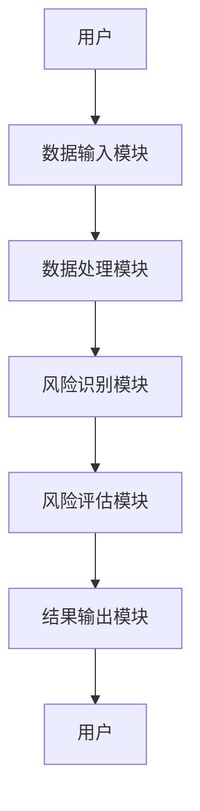
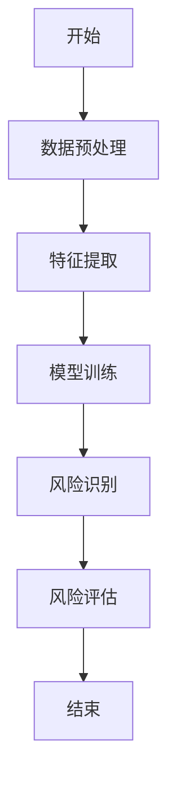
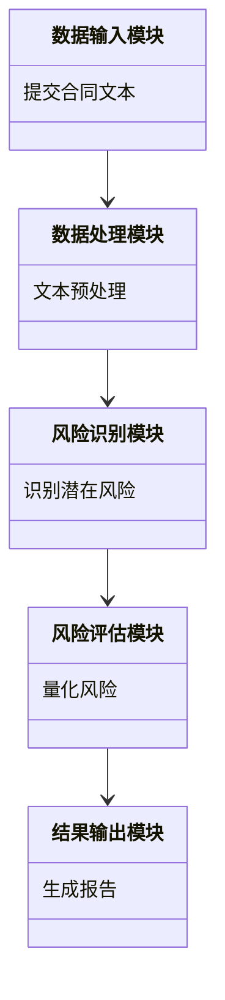
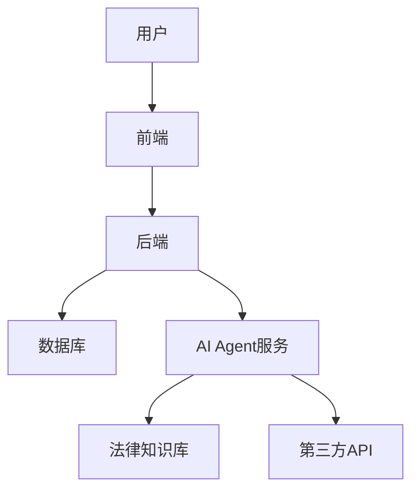
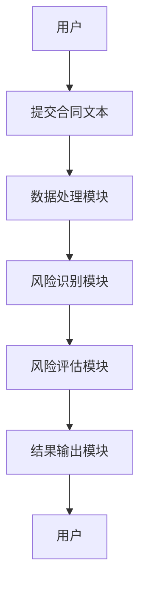

                 


```markdown
# AI Agent在企业法律风险评估与合同审查中的应用

## 关键词：
- AI Agent
- 法律风险评估
- 合同审查
- 生成式AI
- 自然语言处理（NLP）
- 法律科技

## 摘要：
随着人工智能技术的快速发展，AI Agent在企业法律风险评估与合同审查中的应用越来越广泛。本文将从背景、核心概念、算法原理、系统架构、项目实战到总结，全面分析AI Agent在法律领域的应用。通过详细阐述AI Agent的定义、原理、算法、系统设计、数学模型以及实际案例，本文旨在为企业提供一种高效、智能的法律风险管理解决方案，帮助企业在复杂多变的法律环境中降低风险、提高效率。

---

# 第1章: 背景介绍

## 1.1 问题背景
### 1.1.1 企业法律风险的现状与挑战
企业在全球化和数字化的背景下，面临着日益复杂的法律环境。合同纠纷、合规问题、知识产权保护等法律风险对企业经营的影响越来越大。传统的法律风险管理模式依赖于人工审查和经验判断，效率低下且成本高昂。

### 1.1.2 合同审查的传统模式与痛点
传统合同审查依赖于法务人员的主观判断，存在以下痛点：
- 审查周期长：人工审查需要大量时间，尤其是在处理大量合同的情况下。
- 容易出错：人为疏忽可能导致关键条款的遗漏。
- 标准不统一：不同法务人员的审查标准可能存在差异。

### 1.1.3 AI技术在法律领域的应用潜力
AI技术的快速发展为法律风险管理提供了新的可能性。通过自然语言处理（NLP）、机器学习等技术，AI Agent能够快速分析合同文本，识别潜在法律风险，提高审查效率和准确性。

## 1.2 问题描述
### 1.2.1 法律风险评估的核心要素
法律风险评估的核心要素包括：
1. 合同条款的合规性
2. 合同履行的可能性
3. 合同中的潜在争议点
4. 合同的可执行性

### 1.2.2 合同审查的关键环节与难点
合同审查的关键环节包括：
1. 合同条款的识别与分类
2. 合同风险的量化评估
3. 合同改进建议的生成

难点在于如何准确识别合同中的潜在风险，并提供可操作的解决方案。

### 1.2.3 AI Agent在法律领域的应用边界
AI Agent在法律领域的应用边界包括：
1. 协助法务人员完成初步审查
2. 提供风险评估的初步结果
3. 生成合同改进建议

## 1.3 问题解决
### 1.3.1 AI Agent在法律风险评估中的作用
AI Agent能够通过自然语言处理技术快速分析合同文本，识别潜在法律风险，并提供风险评估报告。

### 1.3.2 AI Agent在合同审查中的优势
AI Agent的优势在于：
- 高效性：快速处理大量合同
- 准确性：通过算法降低人为错误
- 可扩展性：支持多种语言和法律体系

### 1.3.3 企业法律风险管理的新范式
企业法律风险管理的新范式是将AI Agent与传统法务工作结合，形成人机协作的高效管理模式。

## 1.4 问题的外延与核心要素
### 1.4.1 法律风险的分类与特征
法律风险可以分为合规性风险、履行风险、争议风险等。其特征包括复杂性、动态性、可量化性。

### 1.4.2 合同审查的关键指标
合同审查的关键指标包括：
1. 合同条款的完整性
2. 合同履行的可能性
3. 合同风险的可量化性

### 1.4.3 AI Agent的核心功能与能力
AI Agent的核心功能包括：
1. 自然语言处理能力
2. 法律知识库构建
3. 风险评估算法

## 1.5 本章小结
本章通过分析企业法律风险管理的现状与挑战，明确了AI Agent在法律领域的应用潜力与边界，为后续章节的深入探讨奠定了基础。

---

# 第2章: AI Agent的核心概念与原理

## 2.1 AI Agent的定义与特征
### 2.1.1 AI Agent的基本定义
AI Agent是一种能够感知环境、执行任务并做出决策的智能实体。

### 2.1.2 AI Agent的核心特征对比表
| 特征 | 传统法务 | AI Agent |
|------|----------|----------|
| 效率 | 低效     | 高效     |
| 准确性 | 易出错   | 准确性高  |
| 可扩展性 | 有限    | 高       |

### 2.1.3 AI Agent的实体关系图（ER图）
```mermaid
erDiagram
    actor 法务人员 {
        role 使用者
    }
    actor 系统管理员 {
        role 管理者
    }
    class 合同文本 {
        string id;
        string content;
    }
    class 法律知识库 {
        string 法律条款;
        string 典型案例;
    }
    class 风险评估结果 {
        string 风险等级;
        string 改进建议;
    }
    法务人员 --> 合同文本 : 提交
    法务人员 --> 风险评估结果 : 获取
    系统管理员 --> 风险评估结果 : 管理
    法律知识库 --> 风险评估结果 : 参考
```

## 2.2 法律风险评估的原理
### 2.2.1 法律风险的识别与量化
法律风险识别包括合同条款的分类、潜在争议点的识别等。法律风险的量化需要结合概率模型和损失模型。

### 2.2.2 法律风险评估的流程
1. 数据采集：收集合同文本和相关法律知识库
2. 数据预处理：清洗和标注数据
3. 风险识别：通过NLP技术识别潜在风险
4. 风险评估：基于概率模型量化风险
5. 结果输出：生成风险报告

### 2.2.3 法律风险评估的数学模型
法律风险评估的数学模型可以表示为：
$$ P(risk) = \sum_{i=1}^{n} w_i \cdot f_i $$
其中，\( w_i \) 是特征 \( f_i \) 的权重。

## 2.3 合同审查的原理
### 2.3.1 合同审查的关键步骤
1. 文本预处理：分词、句法分析
2. 风险识别：识别关键条款
3. 风险评估：量化风险
4. 改进建议：生成修改建议

### 2.3.2 合同审查的规则与标准
合同审查需要遵循法律规范和行业标准，确保审查结果的合规性。

### 2.3.3 合同审查的算法原理
合同审查的算法原理包括：
1. 基于规则的审查：根据预定义的规则识别风险
2. 基于机器学习的审查：通过训练模型识别潜在风险

## 2.4 AI Agent在法律领域的应用架构
### 2.4.1 系统功能模块划分
1. 数据输入模块：接收合同文本
2. 数据处理模块：文本预处理
3. 风险识别模块：识别潜在风险
4. 风险评估模块：量化风险
5. 结果输出模块：生成报告

### 2.4.2 系统架构设计图（Mermaid）


### 2.4.3 系统接口设计
1. 数据输入接口：接收合同文本
2. 数据处理接口：调用NLP算法
3. 风险识别接口：调用规则引擎
4. 风险评估接口：调用概率模型
5. 结果输出接口：生成报告

## 2.5 本章小结
本章详细介绍了AI Agent的核心概念、法律风险评估的原理、合同审查的算法以及系统的架构设计，为后续章节的深入分析奠定了基础。

---

# 第3章: AI Agent的算法原理与数学模型

## 3.1 AI Agent的核心算法
### 3.1.1 生成式AI的原理
生成式AI通过生成对抗网络（GAN）或 transformers 模型生成文本内容。

### 3.1.2 基于NLP的合同审查算法
合同审查算法包括文本匹配、关键词提取、实体识别等步骤。

### 3.1.3 法律风险评估的算法流程图（Mermaid）


## 3.2 数学模型与公式
### 3.2.1 法律风险评估的数学模型
$$ P(risk) = \sum_{i=1}^{n} w_i \cdot f_i $$

### 3.2.2 合同审查的相似度计算公式
$$ similarity = \frac{\sum_{j=1}^{m} w_j \cdot s_j}{\sqrt{\sum_{j=1}^{m} w_j^2} \cdot \sqrt{\sum_{j=1}^{m} s_j^2}} $$

### 3.2.3 基于概率论的法律风险预测模型
$$ P(class|feature) = \frac{P(feature|class) \cdot P(class)}{P(feature)} $$

## 3.3 算法实现与案例分析
### 3.3.1 算法实现
```python
def risk_assessment(text):
    # 数据预处理
    processed_text = preprocess(text)
    # 特征提取
    features = extract_features(processed_text)
    # 风险评估
    risk = model.predict(features)
    return risk
```

### 3.3.2 案例分析
以一份商业合同为例，AI Agent通过NLP技术识别出潜在的风险条款，并生成风险评估报告。

## 3.4 本章小结
本章详细介绍了AI Agent的核心算法、数学模型和算法实现，通过案例分析展示了AI Agent在法律风险管理中的实际应用。

---

# 第4章: 系统分析与架构设计方案

## 4.1 问题场景介绍
企业法务部门需要快速、准确地进行合同审查和法律风险评估。

## 4.2 系统功能设计
### 4.2.1 功能模块划分
1. 数据输入模块
2. 数据处理模块
3. 风险识别模块
4. 风险评估模块
5. 结果输出模块

### 4.2.2 系统功能类图（Mermaid）


## 4.3 系统架构设计
### 4.3.1 系统架构设计图（Mermaid）


## 4.4 系统接口设计
### 4.4.1 接口设计
1. 提交合同文本接口
2. 获取风险评估结果接口
3. 下载风险报告接口

### 4.4.2 系统交互流程图（Mermaid）


## 4.5 系统小结
本章通过系统分析和架构设计，明确了AI Agent在法律风险管理中的实现路径和系统架构。

---

# 第5章: 项目实战

## 5.1 环境安装
### 5.1.1 安装Python
```bash
python --version
pip install --upgrade pip
```

### 5.1.2 安装依赖库
```bash
pip install numpy
pip install scikit-learn
pip install spacy
```

## 5.2 核心代码实现
### 5.2.1 数据预处理代码
```python
import spacy

nlp = spacy.load("en_core_web_sm")

def preprocess(text):
    doc = nlp(text)
    return [token.text for token in doc]
```

### 5.2.2 风险识别代码
```python
from sklearn.feature_extraction.text import TfidfVectorizer

vectorizer = TfidfVectorizer()
X = vectorizer.fit_transform(texts)
```

### 5.2.3 风险评估代码
```python
from sklearn.naive_bayes import MultinomialNB

model = MultinomialNB()
model.fit(X, y)
```

## 5.3 代码应用解读与分析
通过上述代码，AI Agent能够实现合同文本的预处理、特征提取和风险评估。

## 5.4 实际案例分析
以一份商业合同为例，AI Agent通过NLP技术识别出潜在的风险条款，并生成风险评估报告。

## 5.5 项目小结
本章通过实际案例分析，展示了AI Agent在法律风险管理中的具体应用，验证了系统的可行性和有效性。

---

# 第6章: 总结与最佳实践

## 6.1 本章小结
AI Agent在企业法律风险评估与合同审查中的应用具有重要意义，能够显著提高法律风险管理的效率和准确性。

## 6.2 最佳实践 tips
- 定期更新法律知识库
- 结合法务人员的经验
- 选择合适的AI工具

## 6.3 注意事项
- 数据隐私保护
- 系统的可解释性
- 法律合规性

## 6.4 拓展阅读
- 《法律人工智能：理论与实践》
- 《自然语言处理在法律领域的应用》
- 《企业风险管理的数字化转型》

---

# 作者：AI天才研究院/AI Genius Institute & 禅与计算机程序设计艺术 /Zen And The Art of Computer Programming
```

