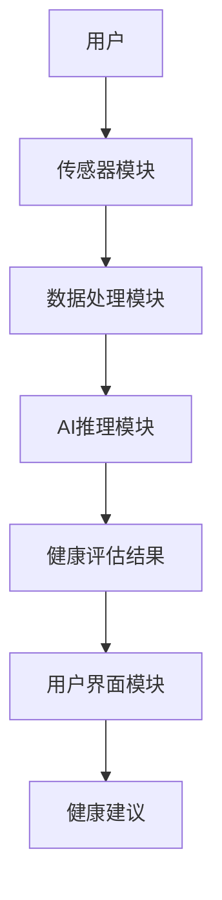
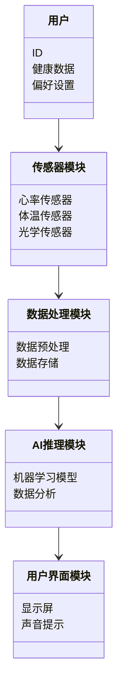

                 


# AI Agent在智能浴室镜中的每日健康检查

**关键词：AI Agent，智能浴室镜，健康检查，传感器，机器学习**

**摘要：**  
本文探讨了AI Agent在智能浴室镜中的应用，重点分析了其在每日健康检查中的功能与实现。通过传感器数据采集、AI算法分析以及系统架构设计，详细阐述了AI Agent如何帮助用户实现个性化的健康监测与管理。

---

# 第1章: AI Agent与智能浴室镜的背景介绍

## 1.1 AI Agent的基本概念

### 1.1.1 AI Agent的定义与特点

AI Agent（人工智能代理）是指能够感知环境、自主决策并执行任务的智能实体。其特点包括：

1. **自主性**：能够在没有外部干预的情况下独立运行。
2. **反应性**：能够实时感知环境变化并做出反应。
3. **学习性**：通过数据和经验不断优化自身的算法和决策能力。
4. **交互性**：能够与用户或其他系统进行有效交互。

### 1.1.2 AI Agent的核心功能与作用

AI Agent的核心功能包括数据采集、分析、推理、决策和反馈。其作用在于通过智能化的处理和分析，为用户提供个性化的服务和解决方案。

### 1.1.3 AI Agent与传统计算机程序的区别

AI Agent与传统程序的主要区别在于其具备学习和自适应能力。传统程序依赖预设的规则和逻辑，而AI Agent能够通过数据学习，不断优化自身的算法和决策策略。

---

## 1.2 智能浴室镜的概念与应用

### 1.2.1 智能浴室镜的定义与组成

智能浴室镜是一种结合了物联网（IoT）和人工智能技术的智能设备，通常由镜子、传感器、摄像头、显示屏和嵌入式系统组成。它能够通过传感器采集用户的生理数据，并通过AI算法分析这些数据，提供个性化的健康建议。

### 1.2.2 智能浴室镜的功能与应用场景

智能浴室镜的主要功能包括：

1. **健康监测**：通过传感器采集用户的心率、体温、皮肤状况等生理数据。
2. **健康评估**：基于AI算法对数据进行分析，评估用户的健康状况。
3. **健康建议**：根据评估结果，提供个性化的健康建议，如饮食建议、运动计划等。
4. **数据记录**：记录用户的健康数据，生成健康报告。

智能浴室镜的应用场景包括家庭、健身房、医疗机构等。

### 1.2.3 智能浴室镜的用户需求与痛点

用户需求：

1. 实时健康监测。
2. 个性化的健康建议。
3. 方便的数据记录与分析。

用户痛点：

1. 隐私问题：用户担心健康数据的安全性。
2. 设备兼容性：不同设备之间的数据互通问题。
3. 数据准确性：传感器和算法的准确性直接影响用户体验。

---

## 1.3 AI Agent在智能浴室镜中的作用

### 1.3.1 AI Agent如何提升智能浴室镜的功能

AI Agent通过实时分析传感器数据，能够快速识别用户的健康状况，提供及时的健康建议和预警。

### 1.3.2 AI Agent在健康检查中的具体应用

AI Agent在智能浴室镜中的具体应用包括：

1. 数据采集与处理：通过传感器采集用户的生理数据，并进行预处理。
2. 数据分析与推理：利用机器学习算法分析数据，识别健康问题。
3. 结果输出与反馈：将分析结果反馈给用户，并提供个性化的健康建议。

### 1.3.3 AI Agent与智能浴室镜的结合方式

AI Agent与智能浴室镜的结合主要通过嵌入式系统实现。AI Agent运行在智能浴室镜的本地设备或云端服务器上，通过传感器和用户交互界面与用户进行实时互动。

---

## 1.4 本章小结

本章介绍了AI Agent的基本概念、智能浴室镜的功能与应用场景，以及AI Agent在智能浴室镜中的作用。通过这些内容，我们可以理解AI Agent在智能浴室镜中的重要性及其在健康检查中的潜力。

---

# 第2章: AI Agent的核心原理与技术

## 2.1 AI Agent的核心原理

### 2.1.1 AI Agent的感知与决策机制

AI Agent通过传感器和摄像头等设备感知环境，并基于感知到的数据进行分析和推理。感知过程包括数据采集、特征提取和数据预处理。

### 2.1.2 AI Agent的推理与学习方法

AI Agent通过机器学习算法进行推理和学习。常用的算法包括支持向量机（SVM）、随机森林（Random Forest）和神经网络（如CNN、RNN）。

### 2.1.3 AI Agent的自适应能力

AI Agent能够通过在线学习和离线学习两种方式不断优化自身的算法和决策策略。在线学习是指在运行过程中实时更新模型参数，离线学习则是指定期批量更新模型参数。

---

## 2.2 AI Agent的关键技术

### 2.2.1 机器学习与深度学习

机器学习是AI Agent的核心技术之一，它通过训练数据模型，使模型能够从数据中学习规律并进行预测。深度学习是一种机器学习技术，通过多层神经网络实现特征提取和模式识别。

### 2.2.2 自然语言处理

自然语言处理（NLP）技术用于AI Agent与用户的自然语言交互。通过NLP，AI Agent能够理解用户的意图并生成自然的回复。

### 2.2.3 计算机视觉

计算机视觉技术用于AI Agent对图像的处理和分析。例如，通过摄像头捕捉用户的面部表情，分析用户的情绪状态。

---

## 2.3 AI Agent在智能浴室镜中的技术实现

### 2.3.1 数据采集与处理

AI Agent通过传感器和摄像头采集用户的生理数据和图像数据，并进行预处理。预处理步骤包括数据清洗、归一化和特征提取。

### 2.3.2 数据分析与推理

AI Agent利用机器学习算法对数据进行分析和推理。例如，通过训练好的模型对用户的心率数据进行分类，识别用户是否处于健康状态。

### 2.3.3 结果输出与反馈

AI Agent将分析结果反馈给用户，提供个性化的健康建议和预警信息。例如，如果用户的心率异常，AI Agent会提醒用户及时就医。

---

## 2.4 本章小结

本章详细介绍了AI Agent的核心原理与关键技术，包括感知与决策机制、推理与学习方法以及自适应能力。同时，还探讨了AI Agent在智能浴室镜中的技术实现，为后续章节的系统设计和实现奠定了基础。

---

# 第3章: 智能浴室镜的传感器与数据采集

## 3.1 智能浴室镜中的传感器类型

### 3.1.1 常见传感器类型与功能

智能浴室镜中常用的传感器包括：

1. **心率传感器**：用于测量用户的心率。
2. **温度传感器**：用于测量环境温度和用户体温。
3. **光学传感器**：用于检测用户的面部表情和皮肤状况。
4. **加速度传感器**：用于测量用户的运动状态。

### 3.1.2 传感器的选择与配置

传感器的选择需要考虑其精度、响应时间、功耗等因素。配置传感器时需要确保各传感器之间的协同工作，以实现全面的健康监测。

### 3.1.3 传感器的安装与调试

传感器的安装需要考虑其在智能浴室镜中的位置和角度，以确保数据采集的准确性和稳定性。调试阶段需要对传感器进行校准和参数优化。

---

## 3.2 数据采集的原理与流程

### 3.2.1 数据采集的基本流程

数据采集的基本流程包括：

1. **传感器触发**：用户进入智能浴室镜的区域，传感器开始采集数据。
2. **数据传输**：传感器将采集到的数据传输到智能浴室镜的主控系统。
3. **数据预处理**：主控系统对数据进行清洗、归一化等预处理。
4. **数据存储**：预处理后的数据存储在本地或云端数据库中。

### 3.2.2 数据采集的标准化与预处理

数据标准化是指将不同来源和格式的数据转换为统一的格式。数据预处理包括数据清洗（去除噪声）、特征提取和数据增强。

### 3.2.3 数据采集的实时性与稳定性

数据采集的实时性是指传感器能够实时采集和传输数据。数据采集的稳定性是指传感器在长时间运行中保持数据的准确性和一致性。

---

## 3.3 数据采集的挑战与解决方案

### 3.3.1 数据采集中的常见问题

数据采集过程中可能会遇到以下问题：

1. **传感器噪声**：传感器在采集数据时可能会受到环境噪声的影响。
2. **数据丢失**：由于网络或其他设备故障，可能导致数据丢失。
3. **传感器漂移**：传感器在长时间运行中可能会出现数据漂移现象。

### 3.3.2 数据采集的优化方法

数据采集的优化方法包括：

1. **传感器校准**：定期对传感器进行校准，确保数据的准确性。
2. **数据融合**：通过多传感器数据融合，提高数据的准确性和可靠性。
3. **抗干扰技术**：采用抗干扰技术，减少环境噪声对数据采集的影响。

### 3.3.3 数据采集的可靠性与安全性

数据采集的可靠性是指传感器在各种环境下都能够准确采集数据。数据采集的安全性是指传感器数据的安全存储和传输，防止数据泄露和篡改。

---

## 3.4 本章小结

本章详细介绍了智能浴室镜中传感器的类型、数据采集的原理与流程，以及数据采集的挑战与解决方案。通过这些内容，我们可以理解如何通过传感器实现智能浴室镜的数据采集功能。

---

# 第4章: AI Agent的算法原理与数学模型

## 4.1 AI Agent的算法原理

### 4.1.1 机器学习算法的分类

机器学习算法可以分为监督学习、无监督学习、半监督学习和强化学习四种类型。在智能浴室镜中，监督学习和无监督学习是常用的算法类型。

### 4.1.2 机器学习算法的选择与优化

算法选择需要考虑数据类型、任务类型和性能要求。算法优化包括参数调优和模型压缩。

### 4.1.3 机器学习算法的实现步骤

机器学习算法的实现步骤包括数据准备、模型训练、模型评估和模型部署。

---

## 4.2 AI Agent的数学模型

### 4.2.1 机器学习模型的数学表示

机器学习模型可以通过数学公式进行表示。例如，线性回归模型可以表示为：

$$ y = \beta_0 + \beta_1 x + \epsilon $$

其中，$y$ 是目标变量，$\beta_0$ 和 $\beta_1$ 是模型参数，$\epsilon$ 是误差项。

### 4.2.2 神经网络模型的数学表示

神经网络模型的数学表示较为复杂，通常包括输入层、隐藏层和输出层。神经网络的训练过程涉及到前向传播和反向传播，其中反向传播使用链式法则计算梯度。

### 4.2.3 优化算法的数学表示

常用的优化算法包括随机梯度下降（SGD）和Adam优化器。Adam优化器的数学表示如下：

$$ \theta_{t+1} = \theta_t - \eta \frac{g_t}{\beta_1 (1 - \beta_1^{t}) + \beta_2 (1 - \beta_2^{t})} $$

其中，$\theta$ 是参数，$\eta$ 是学习率，$g_t$ 是梯度，$\beta_1$ 和 $\beta_2$ 是动量系数。

---

## 4.3 本章小结

本章详细介绍了AI Agent的算法原理与数学模型，包括机器学习算法的分类、数学模型的表示以及优化算法的实现。这些内容为后续章节的系统设计和实现提供了理论基础。

---

# 第5章: 智能浴室镜的系统架构与设计

## 5.1 系统架构设计

### 5.1.1 系统组成与功能划分

智能浴室镜系统由以下几个部分组成：

1. **传感器模块**：负责采集用户的生理数据。
2. **数据处理模块**：负责对数据进行预处理和分析。
3. **AI推理模块**：负责基于AI算法对数据进行推理和预测。
4. **用户界面模块**：负责与用户进行交互，展示健康评估结果和健康建议。

### 5.1.2 系统架构的Mermaid图



### 5.1.3 系统架构的优缺点

优点：

1. 结构清晰，各模块独立，便于维护和扩展。
2. 可扩展性强，可以根据需求增加新的传感器或算法模块。

缺点：

1. 系统复杂度较高，需要协调多个模块的工作。
2. 数据传输和处理的延迟可能会影响用户体验。

---

## 5.2 系统功能设计

### 5.2.1 领域模型的Mermaid图



### 5.2.2 系统功能的详细说明

1. **数据采集**：传感器模块通过多种传感器采集用户的生理数据。
2. **数据处理**：数据处理模块对采集到的数据进行预处理和存储。
3. **AI推理**：AI推理模块基于机器学习模型对数据进行分析和推理，生成健康评估结果。
4. **用户交互**：用户界面模块将健康评估结果和健康建议以用户友好的形式展示给用户。

---

## 5.3 系统接口设计

### 5.3.1 系统接口的定义

系统接口包括传感器接口、数据处理接口和用户界面接口。传感器接口用于与传感器模块进行数据交互，数据处理接口用于与数据处理模块进行数据交互，用户界面接口用于与用户进行交互。

### 5.3.2 接口的实现方式

传感器接口可以通过串口、I2C或SPI等通信协议实现。数据处理接口可以通过REST API或消息队列实现。用户界面接口可以通过图形用户界面（GUI）或声音提示实现。

---

## 5.4 本章小结

本章详细介绍了智能浴室镜的系统架构与设计，包括系统架构设计、领域模型设计、系统功能设计和系统接口设计。通过这些内容，我们可以理解如何通过系统设计实现AI Agent在智能浴室镜中的应用。

---

# 第6章: 项目实战与实现

## 6.1 项目环境的安装与配置

### 6.1.1 系统环境的安装

需要安装的操作系统包括：

1. **操作系统**：Windows、Linux或macOS。
2. **开发工具**：Python、Jupyter Notebook、Visual Studio Code等。
3. **机器学习框架**：TensorFlow、Keras、Scikit-learn等。

### 6.1.2 传感器的安装与配置

传感器的安装需要按照传感器厂商提供的文档进行。配置传感器的驱动程序和API接口。

### 6.1.3 数据库的安装与配置

数据库可以选择MySQL、MongoDB或Redis。需要配置数据库的连接参数和存储结构。

---

## 6.2 系统核心实现

### 6.2.1 数据采集的实现

数据采集的实现步骤：

1. **传感器初始化**：通过代码初始化传感器模块。
2. **数据采集**：调用传感器API获取数据。
3. **数据预处理**：对采集到的数据进行清洗和归一化。

### 6.2.2 数据分析的实现

数据分析的实现步骤：

1. **数据加载**：将预处理后的数据加载到机器学习模型中。
2. **模型训练**：训练机器学习模型。
3. **模型预测**：利用训练好的模型对数据进行预测。

### 6.2.3 结果输出的实现

结果输出的实现步骤：

1. **结果展示**：将模型预测结果通过显示屏或声音提示展示给用户。
2. **健康建议生成**：根据预测结果生成个性化的健康建议。
3. **数据存储**：将健康评估结果存储到数据库中。

---

## 6.3 项目实战的代码实现

### 6.3.1 数据采集的Python代码实现

```python
import numpy as np
import pandas as pd

# 数据采集函数
def collect_data(sensor_type):
    if sensor_type == 'heart_rate':
        return np.random.normal(70, 5, 100)
    elif sensor_type == 'temperature':
        return np.random.normal(36.5, 0.2, 100)
    else:
        return None

# 数据预处理函数
def preprocess_data(data):
    return (data - np.mean(data)) / np.std(data)

# 数据采集与预处理
heart_rate_data = collect_data('heart_rate')
temperature_data = collect_data('temperature')

heart_rate_preprocessed = preprocess_data(heart_rate_data)
temperature_preprocessed = preprocess_data(temperature_data)

print("Heart Rate Data:", heart_rate_preprocessed)
print("Temperature Data:", temperature_preprocessed)
```

### 6.3.2 数据分析的Python代码实现

```python
from sklearn.model_selection import train_test_split
from sklearn.linear_model import LinearRegression
from sklearn.metrics import mean_squared_error

# 数据加载与分割
X = pd.DataFrame({'heart_rate': heart_rate_preprocessed, 'temperature': temperature_preprocessed})
y = pd.Series(np.random.randint(0, 2, 100))  # 假设y是健康状态标签（0表示正常，1表示异常）

X_train, X_test, y_train, y_test = train_test_split(X, y, test_size=0.2, random_state=42)

# 模型训练
model = LinearRegression()
model.fit(X_train, y_train)

# 模型预测
y_pred = model.predict(X_test)

# 模型评估
mse = mean_squared_error(y_test, y_pred)
print("均方误差:", mse)
print("预测结果:", y_pred[:10])
```

---

## 6.4 实际案例分析

### 6.4.1 案例背景

假设用户A在早晨使用智能浴室镜进行健康检查，传感器采集到其心率为75次/分钟，体温为36.8摄氏度。

### 6.4.2 数据分析过程

1. **数据预处理**：将采集到的心率和体温数据进行标准化处理。
2. **模型训练**：利用训练好的机器学习模型对数据进行分析。
3. **结果预测**：模型预测用户A的心率和体温是否异常。

### 6.4.3 健康建议生成

根据模型预测结果，如果用户的心率和体温均在正常范围内，则生成正常的健康建议；如果发现异常，则生成异常的健康建议并提醒用户就医。

---

## 6.5 本章小结

本章通过实际案例分析，详细展示了AI Agent在智能浴室镜中的项目实现过程，包括数据采集、数据分析和结果输出的实现步骤。通过代码示例和案例分析，读者可以更好地理解如何将AI Agent应用于智能浴室镜的健康检查中。

---

# 第7章: 总结与展望

## 7.1 本项目的核心总结

本项目通过AI Agent实现了智能浴室镜的每日健康检查功能，利用传感器数据采集、机器学习算法分析和用户友好的界面展示，为用户提供个性化的健康监测服务。

## 7.2 项目的优势与不足

优势：

1. **实时监测**：用户可以实时了解自己的健康状况。
2. **个性化建议**：根据用户的健康数据，提供个性化的健康建议。
3. **数据安全**：通过数据加密和访问控制，确保用户数据的安全性。

不足：

1. **数据准确性**：传感器和算法的准确性直接影响用户体验。
2. **设备兼容性**：不同设备之间的数据互通问题尚未完全解决。
3. **用户隐私**：用户对健康数据的隐私保护意识较强，需要加强隐私保护措施。

## 7.3 未来的展望

未来，随着AI技术的不断发展，智能浴室镜的功能将更加智能化和个性化。可能的发展方向包括：

1. **多模态数据融合**：结合多种传感器数据，提高健康监测的准确性。
2. **实时健康预警**：通过实时分析数据，实现健康问题的早期预警。
3. **健康数据共享**：实现用户健康数据在不同设备和平台之间的共享与互通。

---

# 作者：AI天才研究院/AI Genius Institute & 禅与计算机程序设计艺术 /Zen And The Art of Computer Programming

---

以上是《AI Agent在智能浴室镜中的每日健康检查》的技术博客文章的完整目录和内容概要。

