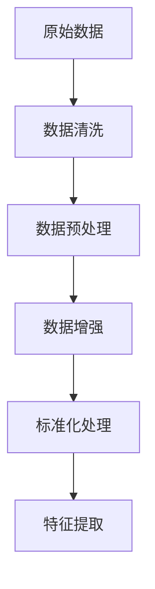
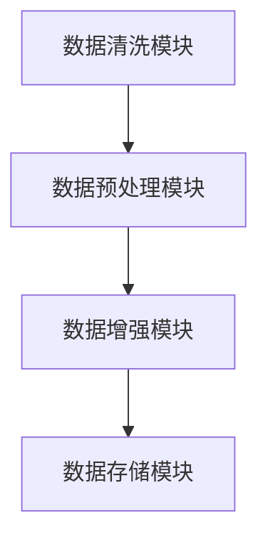
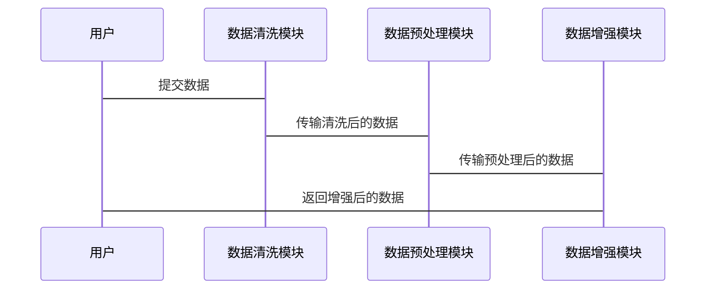

                 


# AI模型训练数据收集与处理技巧

## 关键词：AI模型训练、数据收集、数据处理、数据清洗、数据预处理、数据增强

## 摘要：AI模型的训练离不开高质量的数据。本文详细探讨了AI模型训练数据的收集与处理技巧，包括数据收集的基础知识、数据处理的核心技术和算法、系统的架构设计与实现、实际项目中的应用案例以及优化建议。通过本文，读者可以全面了解AI模型训练数据的处理流程，并掌握实用的数据处理技巧。

---

## 第一部分: AI模型训练数据收集与处理基础

## 第1章: 数据收集与处理概述

### 1.1 数据的基本概念

#### 1.1.1 数据的定义与分类
数据是AI模型训练的基础，可以分为结构化数据（如表格数据）、非结构化数据（如文本、图像）和半结构化数据（如JSON格式的数据）。数据的质量直接影响模型的性能。

#### 1.1.2 数据在AI模型中的作用
数据是模型训练的原料，决定了模型的学习能力和表现。高质量的数据能够提升模型的准确性和泛化能力。

#### 1.1.3 数据收集的背景与意义
随着AI技术的快速发展，数据收集的重要性日益凸显。高质量的数据收集是模型训练的前提，也是模型优化的关键。

### 1.2 数据收集的基本方法

#### 1.2.1 数据来源的多样性
数据可以来自公开数据集（如Kaggle）、爬取数据、用户输入数据等多种渠道。每种数据来源都有其优缺点，需根据具体需求选择合适的方式。

#### 1.2.2 数据收集的常见方式
包括API接口调用、网络爬虫、传感器数据采集等方法。数据收集需注意合规性，遵守相关法律法规。

#### 1.2.3 数据收集的工具与平台
推荐使用Python的requests库进行API调用，使用BeautifulSoup或Scrapy进行网页爬虫。数据存储可以使用数据库或CSV文件。

### 1.3 数据处理的基本流程

#### 1.3.1 数据清洗的概念与步骤
数据清洗是去除噪声数据，确保数据完整性和一致性的过程。步骤包括去重、处理缺失值、去除异常值。

#### 1.3.2 数据预处理的核心任务
数据预处理包括数据标准化、归一化、特征提取等，为后续模型训练做好准备。

#### 1.3.3 数据增强的原理与方法
数据增强通过增加数据多样性，提升模型的鲁棒性。常用方法包括图像旋转、翻转、裁剪等。

### 1.4 数据质量控制

#### 1.4.1 数据质量评估指标
包括完整性、一致性、准确性、相关性等指标。通过评估指标，找出数据中的问题。

#### 1.4.2 数据清洗的常见问题与解决方案
处理缺失值时，可以使用均值、中位数或删除数据；处理异常值时，可以使用Z-score方法。

#### 1.4.3 数据标注的准确性与一致性
确保标注数据的准确性和一致性，可以通过交叉验证和人工审核的方式实现。

### 1.5 本章小结
本章介绍了数据收集与处理的基本概念、方法和流程，为后续的深入学习奠定了基础。

---

## 第二部分: 数据处理的核心概念与技术

## 第2章: 数据处理的核心概念

### 2.1 数据处理的原理与流程

#### 2.1.1 数据处理的基本原理
数据处理是对数据进行清洗、转换和增强的过程，旨在提高数据质量，使其更适合模型训练。

#### 2.1.2 数据处理的流程图


### 2.2 数据处理的关键技术

#### 2.2.1 数据清洗的实现方法
- **基于规则的清洗**：根据预定义的规则（如重复数据）进行清洗。
- **基于统计的清洗**：通过统计方法（如均值、中位数）处理异常值。
- **基于机器学习的清洗**：使用聚类算法识别异常值。

#### 2.2.2 数据预处理的算法原理
- **数据归一化**：将数据按比例缩放到0-1范围。
  $$ x' = \frac{x - \min}{\max - \min} $$
- **数据标准化**：将数据转换为均值为0，标准差为1的分布。
  $$ x' = \frac{x - \mu}{\sigma} $$
- **数据降维**：使用主成分分析（PCA）减少数据维度。

#### 2.2.3 数据增强的策略与技巧
- **图像增强**：旋转、翻转、调整亮度。
- **文本增强**：同义词替换、句式变化。
- **时间序列增强**：添加噪声、改变采样频率。

### 2.3 数据处理的数学模型

#### 2.3.1 数据标准化的公式
$$ x' = \frac{x - \mu}{\sigma} $$
其中，$\mu$是均值，$\sigma$是标准差。

#### 2.3.2 数据归一化的公式
$$ x' = \frac{x - \min}{\max - \min} $$
其中，$\min$和$\max$是数据的最小值和最大值。

#### 2.3.3 数据增强的线性变换示例
例如，对图像进行水平翻转：
$$ x' = width - x $$

### 2.4 数据处理的案例分析

#### 2.4.1 图像数据的处理流程
1. 数据清洗：去除模糊或损坏的图像。
2. 数据预处理：归一化图像像素值。
3. 数据增强：旋转和翻转图像。

#### 2.4.2 文本数据的处理流程
1. 数据清洗：去除特殊字符和停用词。
2. 数据预处理：分词和词向量化。
3. 数据增强：同义词替换。

#### 2.4.3 结构化数据的处理流程
1. 数据清洗：处理缺失值和异常值。
2. 数据预处理：标准化数值型数据。
3. 数据增强：添加特征组合。

### 2.5 本章小结
本章详细讲解了数据处理的核心概念和技术，包括清洗、预处理和增强的实现方法。

---

## 第三部分: 数据处理的算法与实现

## 第3章: 数据预处理算法

### 3.1 数据清洗算法

#### 3.1.1 基于规则的清洗算法
例如，使用Python的pandas库删除重复行：
```python
import pandas

df.drop_duplicates(inplace=True)
```

#### 3.1.2 基于统计的清洗算法
例如，使用Z-score方法识别异常值：
$$ Z = \frac{x - \mu}{\sigma} $$
如果$|Z| > 3$，则认为是异常值。

#### 3.1.3 基于机器学习的清洗算法
例如，使用聚类算法（如K-means）识别异常值。

### 3.2 数据预处理算法

#### 3.2.1 数据归一化算法
```python
def normalize_data(data):
    return (data - data.min()) / (data.max() - data.min())
```

#### 3.2.2 数据标准化算法
```python
from sklearn.preprocessing import StandardScaler

scaler = StandardScaler()
data_normalized = scaler.fit_transform(data)
```

#### 3.2.3 数据降维算法（PCA）
```python
from sklearn.decomposition import PCA

pca = PCA(n_components=2)
data_pca = pca.fit_transform(data)
```

### 3.3 数据增强算法

#### 3.3.1 图像数据增强算法
使用Keras的ImageDataGenerator进行数据增强：
```python
from tensorflow.keras.preprocessing.image import ImageDataGenerator

datagen = ImageDataGenerator(rotation_range=40, horizontal_flip=True)
```

#### 3.3.2 文本数据增强算法
使用同义词替换库（如WordNet）进行文本增强。

#### 3.3.3 时间序列数据增强算法
对时间序列数据添加随机噪声：
$$ x' = x + \epsilon $$
其中，$\epsilon$是均值为0，标准差为0.1的正态分布随机数。

### 3.4 数据处理算法的实现

#### 3.4.1 数据清洗的Python代码实现
```python
import pandas as pd

# 读取数据
df = pd.read_csv('data.csv')

# 删除重复行
df.drop_duplicates(inplace=True)

# 处理缺失值
df.fillna(df.mean(), inplace=True)

# 去除异常值
z = (df - df.mean()).abs() / df.std()
df = df[(z < 3).all(axis=1)]
```

#### 3.4.2 数据预处理的Python代码实现
```python
from sklearn.preprocessing import StandardScaler

# 标准化处理
scaler = StandardScaler()
data_normalized = scaler.fit_transform(df)

# 特征提取
from sklearn.decomposition import PCA

pca = PCA(n_components=2)
data_pca = pca.fit_transform(data_normalized)
```

#### 3.4.3 数据增强的Python代码实现
```python
import numpy as np
from PIL import Image

# 图像翻转增强
def flip_image(image):
    return image.transpose(Image.FLIP_LEFT_RIGHT)

# 文本增强
from wordnet import wordnet Lemmatizer

def enhance_text(text):
    lemmatizer = WordNetLemmatizer()
    return ' '.join([lemmatizer.lemmatize(word) for word in text.split()])
```

### 3.5 本章小结
本章通过具体的Python代码实现，详细讲解了数据清洗、预处理和增强的算法实现。

---

## 第四部分: 数据处理的系统架构与设计

## 第4章: 数据处理系统的架构设计

### 4.1 问题场景介绍
在实际项目中，数据处理通常需要处理大量数据，需要高效的系统架构设计。

### 4.2 系统功能设计

#### 4.2.1 数据清洗模块
负责去除噪声数据，处理缺失值和异常值。

#### 4.2.2 数据预处理模块
负责数据的标准化、归一化和特征提取。

#### 4.2.3 数据增强模块
负责增加数据的多样性和丰富性，提升模型的泛化能力。

### 4.3 系统架构设计

#### 4.3.1 系统架构图


#### 4.3.2 系统交互图


### 4.4 系统接口设计

#### 4.4.1 数据清洗模块接口
```python
def clean_data(data):
    # 数据清洗逻辑
    return cleaned_data
```

#### 4.4.2 数据预处理模块接口
```python
def preprocess_data(data):
    # 数据预处理逻辑
    return processed_data
```

#### 4.4.3 数据增强模块接口
```python
def enhance_data(data):
    # 数据增强逻辑
    return enhanced_data
```

### 4.5 本章小结
本章通过系统架构设计，展示了如何高效地进行数据处理。

---

## 第五部分: 数据处理的项目实战

## 第5章: 数据处理的实际案例

### 5.1 环境安装与配置

#### 5.1.1 安装必要的库
```bash
pip install pandas numpy scikit-learn tensorflow keras
```

### 5.2 系统核心实现

#### 5.2.1 数据清洗的实现
```python
def clean_data(df):
    # 去除重复行
    df.drop_duplicates(inplace=True)
    # 处理缺失值
    df.fillna(df.mean(), inplace=True)
    # 去除异常值
    z = (df - df.mean()).abs() / df.std()
    df = df[(z < 3).all(axis=1)]
    return df
```

#### 5.2.2 数据预处理的实现
```python
from sklearn.preprocessing import StandardScaler

def preprocess_data(df):
    scaler = StandardScaler()
    data_normalized = scaler.fit_transform(df)
    return data_normalized
```

#### 5.2.3 数据增强的实现
```python
from tensorflow.keras.preprocessing.image import ImageDataGenerator

def enhance_images(images):
    datagen = ImageDataGenerator(rotation_range=40, horizontal_flip=True)
    return datagen.flow(images, batch_size=32)
```

### 5.3 代码应用解读与分析
通过具体代码实现，展示数据处理的完整流程，包括数据清洗、预处理和增强。

### 5.4 实际案例分析
以图像分类任务为例，展示数据处理对模型性能的影响。

### 5.5 项目小结
总结项目实施的经验和教训，强调数据处理的重要性。

---

## 第六部分: 数据处理的优化与提升

## 第6章: 数据处理的优化建议

### 6.1 数据处理的优化方法

#### 6.1.1 并行处理
使用多线程或分布式计算加速数据处理。

#### 6.1.2 分布式数据处理
利用分布式计算框架（如Spark）处理大规模数据。

#### 6.1.3 模块化设计
将数据处理模块化，便于维护和扩展。

### 6.2 数据处理的工具推荐

#### 6.2.1 数据清洗工具
推荐使用pandas库进行数据清洗。

#### 6.2.2 数据预处理工具
推荐使用scikit-learn库进行数据预处理。

#### 6.2.3 数据增强工具
推荐使用Keras的ImageDataGenerator进行数据增强。

### 6.3 数据处理的未来趋势

#### 6.3.1 自动化数据处理
未来的数据处理将更加自动化，减少人工干预。

#### 6.3.2 智能化数据处理
利用AI技术优化数据处理流程，提高数据质量。

### 6.4 本章小结
本章提供了数据处理的优化建议，帮助读者进一步提升数据处理效率和质量。

---

## 结语

数据处理是AI模型训练的关键环节，直接影响模型的性能。通过本文的详细讲解，读者可以掌握数据收集与处理的核心技巧，并在实际项目中灵活运用。未来，随着技术的进步，数据处理将更加智能化和自动化，为AI模型的训练提供更强大的支持。

## 作者：AI天才研究院 & 禅与计算机程序设计艺术

--- 

希望这篇文章能够为您提供有价值的信息，并帮助您更好地理解和掌握AI模型训练数据的收集与处理技巧。如果需要进一步的讨论或深入学习，欢迎随时交流。

