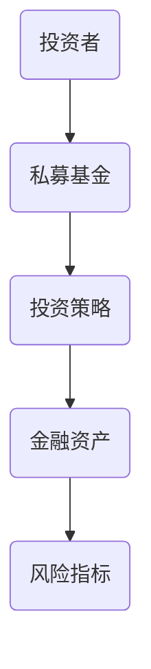
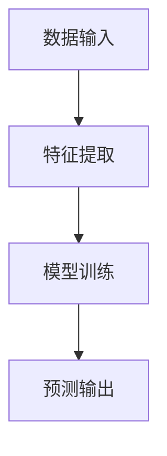
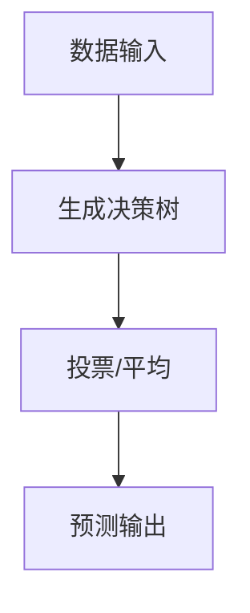
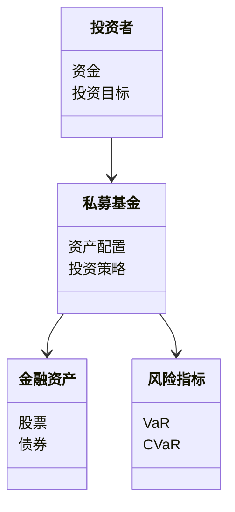
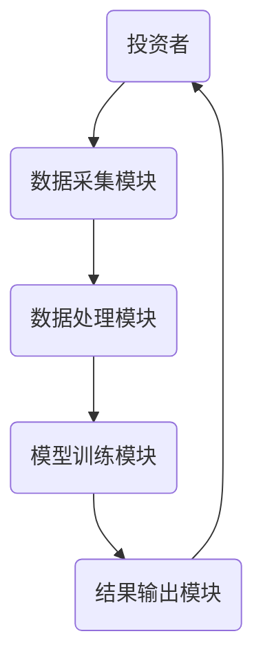
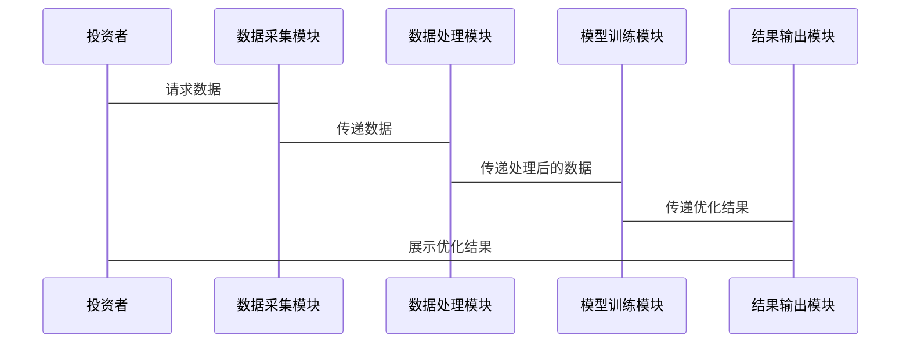

                 


# AI驱动的私募股权投资组合构建与管理

> **关键词**：AI驱动、私募股权投资、投资组合构建、风险管理、机器学习、金融模型

> **摘要**：本文探讨了如何利用人工智能技术驱动私募股权投资组合的构建与管理。通过分析私募股权投资的核心问题，结合机器学习算法与金融数学模型，提出了一种基于AI的投资组合优化方法。文章详细阐述了AI在私募股权投资中的应用价值、算法原理、系统架构设计及项目实战，最后给出了最佳实践建议。

---

# {{此处是文章标题}}

> **关键词**：{{此处列出文章的5-7个核心关键词}}

> **摘要**：{{此处给出文章的核心内容和主题思想}}

---

# 第一部分: AI驱动的私募股权投资背景与基础

# 第1章: 私募股权投资与AI驱动的概述

## 1.1 私募股权投资的定义与特点
### 1.1.1 私募股权的基本概念
私募股权投资是指通过投资于非公开交易的公司股权，以获得资本增值和分红收益的投资方式。其核心特征包括：
- 投资期限较长
- 投资对象主要是未上市企业或中小企业
- 投资策略多样化（如成长型、价值型、控股型等）

### 1.1.2 私募股权投资的核心特点
- **高风险高收益**：私募股权的投资回报通常高于公开市场，但风险也更高。
- **非流动性**：私募股权的投资资金通常需要较长时间才能退出，流动性较差。
- **专业性**：私募股权的投资决策需要专业的行业知识和市场洞察。

### 1.1.3 私募股权的运作模式
私募股权的运作模式通常包括以下几个阶段：
1. **募资阶段**：通过吸引机构投资者或高净值个人资金。
2. **投资阶段**：对目标企业进行尽职调查，评估其价值并决定投资金额。
3. **管理阶段**：对被投企业进行战略指导、资源整合和增值服务。
4. **退出阶段**：通过企业上市、并购等方式实现资金退出。

## 1.2 AI在金融领域的应用现状
### 1.2.1 AI在金融领域的应用领域
AI技术在金融领域的应用非常广泛，包括：
- **智能投顾**：通过算法推荐投资组合。
- **风险管理**：利用AI模型预测市场风险。
- **量化交易**：基于算法进行高频交易。

### 1.2.2 AI在私募股权投资中的潜在价值
AI技术可以为私募股权投资带来以下优势：
- **数据驱动决策**：通过分析海量数据，识别潜在投资机会。
- **自动化与智能化**：利用机器学习算法优化投资组合。
- **实时监控与风险控制**：通过实时数据监控，降低投资风险。

### 1.2.3 当前AI技术的局限性与挑战
尽管AI技术在金融领域的应用前景广阔，但仍面临以下挑战：
- **数据质量**：私募股权投资涉及大量非结构化数据，数据清洗和预处理成本较高。
- **模型解释性**：复杂的AI模型（如深度学习模型）通常缺乏可解释性，难以满足监管要求。
- **技术与业务结合的难度**：AI技术与私募股权投资业务的结合需要专业的知识和经验。

## 1.3 本章小结
本章介绍了私募股权投资的基本概念、运作模式以及AI技术在金融领域的应用现状。通过分析AI在私募股权投资中的潜在价值和挑战，为后续章节的深入探讨奠定了基础。

---

# 第2章: 私募股权投资组合构建的核心问题

## 2.1 投资组合优化的数学模型
### 2.1.1 Markowitz均值-方差模型
Markowitz均值-方差模型是投资组合优化的基石。其基本思想是通过优化投资组合的收益与风险之间的关系，找到最优的投资组合。

公式如下：
$$
\min_{w} \frac{1}{2} w^T \Sigma w \quad \text{subject to} \quad w^T \mu = \text{target return}, \quad w^T 1 = 1
$$

其中：
- $w$：投资权重向量
- $\Sigma$：资产间的协方差矩阵
- $\mu$：资产收益均值向量

### 2.1.2 CAPM模型与投资组合优化
CAPM（资本资产定价模型）用于评估资产的预期收益。在投资组合优化中，CAPM可以帮助确定资产的风险溢价。

公式如下：
$$
E(r_i) = r_f + \beta_i (E(r_m) - r_f)
$$

其中：
- $E(r_i)$：资产$i$的预期收益
- $r_f$：无风险利率
- $\beta_i$：资产$i$的贝塔系数
- $E(r_m)$：市场预期收益

### 2.1.3 风险调整后的收益优化
在投资组合优化中，风险调整后的收益可以通过引入风险惩罚项来实现。例如，使用风险调整后的夏普比率作为优化目标。

公式如下：
$$
\max_{w} \frac{E(r_p) - r_f}{\sqrt{Var(r_p)}}
$$

其中：
- $E(r_p)$：投资组合的预期收益
- $r_f$：无风险利率
- $Var(r_p)$：投资组合收益的方差

## 2.2 数据驱动的投资决策
### 2.2.1 数据来源与特征提取
私募股权投资中的数据来源包括：
- **历史市场数据**：股票价格、指数表现等。
- **财务数据**：公司财务报表、现金流等。
- **文本数据**：新闻、公告等。

特征提取方法包括：
- **统计方法**：均值、标准差等。
- **机器学习方法**：主成分分析（PCA）、LDA等。

### 2.2.2 数据清洗与预处理
数据清洗步骤包括：
1. **去除缺失值**：对缺失数据进行插值或删除。
2. **标准化/归一化**：对数据进行标准化处理，消除量纲影响。
3. **异常值处理**：通过统计方法识别并处理异常值。

### 2.2.3 数据驱动的投资策略
基于数据驱动的投资策略包括：
- **因子投资策略**：基于特定因子（如价值因子、动量因子）构建投资组合。
- **量化交易策略**：基于算法进行高频交易。

## 2.3 AI在投资组合优化中的应用
### 2.3.1 机器学习在组合优化中的作用
机器学习在投资组合优化中的应用包括：
- **预测收益**：利用回归模型预测资产收益。
- **风险预测**：利用聚类模型预测市场风险。
- **组合优化**：利用强化学习优化投资组合。

### 2.3.2 基于AI的动态再平衡策略
动态再平衡策略通过实时调整投资组合，以应对市场变化。例如，使用强化学习算法动态调整资产配置。

### 2.3.3 AI驱动的组合风险控制
AI可以通过实时监控市场风险，动态调整投资组合的风险敞口。例如，利用VaR（在险价值）模型进行风险控制。

## 2.4 本章小结
本章详细介绍了私募股权投资组合优化的数学模型、数据驱动的投资决策以及AI在投资组合优化中的应用。通过分析AI技术在投资组合优化中的优势与挑战，为后续章节的深入探讨奠定了基础。

---

# 第3章: AI驱动私募股权投资组合构建的核心概念与联系

## 3.1 核心概念原理
### 3.1.1 投资组合优化的数学模型
投资组合优化的数学模型是AI驱动私募股权投资的核心基础。例如，Markowitz均值-方差模型通过优化投资组合的收益与风险关系，实现最优资产配置。

### 3.1.2 机器学习在组合优化中的应用
机器学习算法（如随机森林、梯度提升树）可以用于预测资产收益和风险，从而辅助投资组合优化。

### 3.1.3 风险管理与组合优化的关系
风险管理是投资组合优化的重要组成部分。例如，VaR模型可以帮助投资者量化投资组合的潜在损失。

## 3.2 核心概念属性特征对比表
| 概念 | 属性 | 特征 |
|------|------|------|
| 投资组合 | 风险 | 方差 |
| 机器学习模型 | 算法 | 线性回归、随机森林 |
| 风险管理 | 方法 | VaR、CVaR |

## 3.3 ER实体关系图


## 3.4 本章小结
本章通过对比分析私募股权投资组合构建的核心概念，揭示了各概念之间的联系与区别。通过ER实体关系图，展示了投资者、私募基金、投资策略、金融资产和风险指标之间的关系。

---

# 第4章: AI驱动私募股权投资组合构建的算法原理

## 4.1 常见算法及其流程图
### 4.1.1 线性回归算法
线性回归算法用于预测资产收益。其流程如下：
1. 数据清洗与预处理
2. 特征提取与选择
3. 模型训练
4. 模型预测

流程图：


### 4.1.2 随机森林算法
随机森林算法用于分类和回归问题。其流程如下：
1. 生成多个决策树
2. 对每个样本进行投票或平均
3. 输出最终结果

流程图：


## 4.2 算法实现的Python代码
以下是一个基于随机森林算法的投资组合优化示例：

```python
import pandas as pd
from sklearn.ensemble import RandomForestRegressor
from sklearn.metrics import mean_squared_error

# 数据加载
data = pd.read_csv('investment_data.csv')

# 特征与目标分离
X = data.drop('target', axis=1)
y = data['target']

# 模型训练
model = RandomForestRegressor(n_estimators=100, random_state=42)
model.fit(X, y)

# 模型预测
y_pred = model.predict(X)

# 模型评估
mse = mean_squared_error(y, y_pred)
print(f'Mean Squared Error: {mse}')
```

## 4.3 算法的数学模型与公式
随机森林算法的数学模型可以通过以下公式表示：
$$
y = \sum_{i=1}^{n} w_i x_i
$$

其中：
- $y$：预测目标
- $w_i$：特征权重
- $x_i$：输入特征

## 4.4 本章小结
本章详细介绍了AI驱动私募股权投资组合构建中常用的算法及其流程图。通过Python代码和数学公式的展示，帮助读者更好地理解算法的实现与应用。

---

# 第5章: 系统分析与架构设计

## 5.1 系统应用场景
AI驱动的私募股权投资系统可以应用于以下场景：
- **投资决策支持**：帮助投资者制定投资策略。
- **风险监控与预警**：实时监控市场风险，预警潜在风险。
- **动态再平衡**：根据市场变化动态调整投资组合。

## 5.2 系统功能设计
### 5.2.1 领域模型


### 5.2.2 系统架构设计


### 5.2.3 接口设计
系统接口包括：
- 数据接口：与数据源对接，获取实时数据。
- 模型接口：与第三方机器学习模型对接，获取预测结果。
- 用户接口：提供用户交互界面，展示投资组合优化结果。

### 5.2.4 交互流程图


## 5.3 本章小结
本章通过系统分析与架构设计，展示了AI驱动私募股权投资系统的应用场景、功能模块及系统架构。通过交互流程图，清晰地展示了系统的数据流与功能模块之间的关系。

---

# 第6章: 项目实战

## 6.1 项目背景与目标
本项目旨在利用AI技术构建一个私募股权投资组合优化系统，帮助投资者实现自动化、智能化的投资决策。

## 6.2 核心代码实现
### 6.2.1 环境安装
```bash
pip install numpy pandas scikit-learn
```

### 6.2.2 核心代码
```python
import numpy as np
import pandas as pd
from sklearn.ensemble import RandomForestRegressor
from sklearn.metrics import mean_squared_error

# 数据加载
data = pd.read_csv('investment_data.csv')

# 特征与目标分离
X = data.drop('target', axis=1)
y = data['target']

# 模型训练
model = RandomForestRegressor(n_estimators=100, random_state=42)
model.fit(X, y)

# 模型预测
y_pred = model.predict(X)

# 模型评估
mse = mean_squared_error(y, y_pred)
print(f'Mean Squared Error: {mse}')
```

### 6.2.3 代码解读与分析
上述代码展示了如何利用随机森林算法进行投资组合优化。首先，数据加载与预处理，然后进行模型训练，最后输出模型预测结果及评估指标。

## 6.3 实际案例分析
假设我们有一个包含历史股票数据和财务指标的CSV文件，可以通过上述代码进行投资组合优化。例如，预测某只股票的未来收益并优化投资组合。

## 6.4 项目小结
本章通过项目实战，展示了如何利用Python代码实现AI驱动的私募股权投资组合优化。通过实际案例分析，帮助读者更好地理解AI技术在私募股权投资中的应用。

---

# 第7章: 最佳实践与注意事项

## 7.1 最佳实践
### 7.1.1 数据质量的重要性
数据质量直接影响模型的性能。建议在数据预处理阶段，仔细清洗和筛选数据。

### 7.1.2 模型的可解释性
复杂的AI模型通常缺乏可解释性。建议在实际应用中，优先选择可解释性较强的模型。

### 7.1.3 风险管理
风险管理是私募股权投资的核心。建议在投资组合优化中，引入风险控制机制，如VaR模型。

## 7.2 小结
本章总结了AI驱动私募股权投资组合构建与管理的最佳实践，并给出了注意事项和建议。通过这些实践，可以帮助投资者更好地利用AI技术实现投资目标。

---

# 结语

本文详细探讨了AI驱动的私募股权投资组合构建与管理的核心问题、算法原理及系统架构设计。通过实际案例分析和项目实战，展示了AI技术在私募股权投资中的应用价值。未来，随着AI技术的不断发展，私募股权投资将更加智能化和自动化。

---

**作者：AI天才研究院/AI Genius Institute & 禅与计算机程序设计艺术 /Zen And The Art of Computer Programming**

