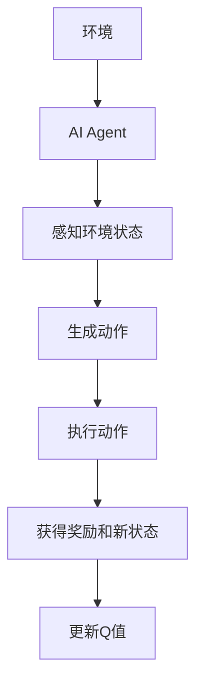
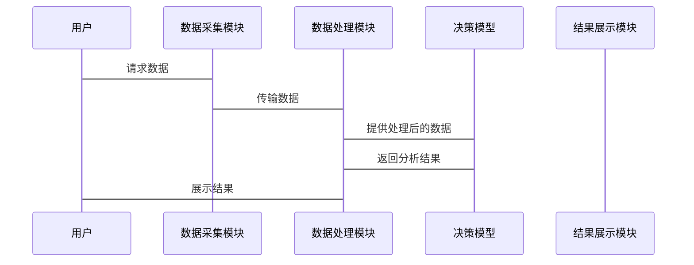

                 


# 企业决策支持系统中的AI Agent角色

## 关键词：AI Agent、企业决策支持系统、算法原理、系统架构、项目实战

## 摘要：本文深入探讨了AI Agent在企业决策支持系统中的角色和应用，分析了其核心原理、算法模型以及系统架构设计，通过实战项目展示了AI Agent的实际应用价值，并提出了优化与扩展的建议。

---

# 第一部分: 企业决策支持系统与AI Agent角色背景

## 第1章: 企业决策支持系统概述

### 1.1 企业决策支持系统的基本概念
#### 1.1.1 企业决策支持系统的定义
企业决策支持系统（Enterprise Decision Support System, EDSS）是一种利用信息技术和数据分析为企业提供决策支持的系统。它通过整合企业内外部数据，利用模型和算法为企业管理层提供分析、预测和优化建议，辅助企业做出更科学的决策。

#### 1.1.2 企业决策支持系统的功能与作用
企业决策支持系统的功能包括数据收集与处理、模型构建、分析与预测、结果展示与报告生成。其作用在于提高决策效率、降低决策风险、优化资源配置，为企业创造更大的价值。

#### 1.1.3 企业决策支持系统的发展历程
从早期的报表分析到现在的智能决策支持，企业决策支持系统经历了多个阶段的发展，逐步引入了大数据、人工智能等技术，使其功能和能力不断增强。

### 1.2 AI Agent在企业决策中的角色
#### 1.2.1 AI Agent的基本概念
AI Agent（人工智能代理）是指能够感知环境、自主决策并执行任务的智能体。它通过感知输入信息，结合内部知识库和推理机制，生成最优决策并执行。

#### 1.2.2 AI Agent在企业决策中的应用场景
AI Agent在企业中的应用场景包括市场分析与预测、供应链优化、风险管理、客户关系管理等。通过实时数据分析和智能决策，AI Agent能够显著提升企业的运营效率和决策能力。

#### 1.2.3 AI Agent与传统决策支持系统的区别
与传统决策支持系统相比，AI Agent具有更强的自主性和智能性，能够主动感知环境变化并动态调整决策策略，而传统系统更多依赖于静态数据和规则。

### 1.3 企业决策支持系统中的AI Agent的优势
#### 1.3.1 提高决策效率
AI Agent能够快速处理海量数据，提供实时分析和决策支持，显著提高企业决策效率。

#### 1.3.2 增强决策的准确性
通过机器学习和大数据分析，AI Agent能够发现数据中的潜在规律，提高决策的准确性和科学性。

#### 1.3.3 实现智能化和自动化决策
AI Agent能够自动化执行决策任务，减少人工干预，提升企业的智能化水平。

### 1.4 本章小结
本章介绍了企业决策支持系统的概念、功能和发展历程，并重点阐述了AI Agent在企业决策中的角色及其优势，为后续章节的深入分析奠定了基础。

---

## 第2章: AI Agent的基本原理与核心概念

### 2.1 AI Agent的基本原理
AI Agent的工作原理包括感知、推理、决策和执行四个主要阶段。感知阶段通过传感器或数据接口获取外部信息；推理阶段利用知识库和推理算法对信息进行分析；决策阶段基于推理结果生成最优决策；执行阶段通过接口将决策转化为实际操作。

### 2.2 AI Agent的核心概念与联系
#### 2.2.1 知识表示与推理
知识表示是将领域知识以计算机可理解的形式存储的过程，常见的表示方法包括框架表示、语义网络等。推理是基于知识库进行逻辑推理，得出新的结论。

#### 2.2.2 感知与交互
AI Agent通过感知外部环境信息并与用户交互，获取必要的数据和反馈，以支持决策过程。

#### 2.2.3 决策与执行
基于感知信息和知识库，AI Agent通过决策算法生成最优决策，并通过执行模块将决策转化为实际操作。

### 2.3 AI Agent的实体关系图
以下是AI Agent在企业决策支持系统中的实体关系图：

```mermaid
er
    actor: 用户
    agent: AI Agent
    decision: 决策
    action: 行动
    knowledge: 知识库
    interaction: 交互
    actor --> agent: 请求
    agent --> decision: 生成决策
    decision --> action: 执行
    agent --> knowledge: 查询知识库
    interaction --> agent: 提供反馈
```

### 2.4 本章小结
本章详细介绍了AI Agent的基本原理和核心概念，并通过实体关系图展示了其在企业决策支持系统中的角色和作用。

---

# 第三部分: AI Agent的算法原理

## 第3章: 基于深度强化学习的AI Agent算法

### 3.1 DQN算法的基本原理
DQN（Deep Q-Network）是一种基于深度神经网络的强化学习算法，由Mnih等人提出。它通过经验回放和目标网络等技术，有效解决了传统Q-learning算法的样本稀疏性和稳定性问题。

#### 3.1.1 DQN算法的工作流程
DQN算法的工作流程如下：



#### 3.1.2 DQN算法的数学模型
DQN算法的数学模型如下：

状态空间：$S$，动作空间：$A$，奖励函数：$R$，目标是通过最大化期望奖励来优化策略。

Q-learning更新公式：
$$ Q(s, a) = Q(s, a) + \alpha [r + \gamma \max_{a'} Q(s', a') - Q(s, a)] $$

其中，$\alpha$ 是学习率，$\gamma$ 是折扣因子。

#### 3.1.3 DQN算法的Python实现
以下是DQN算法的Python代码示例：

```python
import numpy as np
import gym

class DQNAgent:
    def __init__(self, state_space, action_space, lr=0.01, gamma=0.99):
        self.state_space = state_space
        self.action_space = action_space
        self.lr = lr
        self.gamma = gamma
        self.model = self._build_model()

    def _build_model(self):
        # 构建神经网络模型
        model = Sequential()
        model.add(Dense(32, activation='relu', input_dim=self.state_space))
        model.add(Dense(32, activation='relu'))
        model.add(Dense(self.action_space, activation='linear'))
        model.compile(optimizer=Adam(lr=self.lr), loss='mse')
        return model

    def remember(self, state, action, reward, next_state):
        # 存储经验
        self.memory.append((state, action, reward, next_state))

    def act(self, state):
        # 选择动作
        if np.random.random() < 0.99:
            q_values = self.model.predict(state)
            return np.argmax(q_values[0])
        else:
            return np.random.randint(self.action_space)

    def replay(self, batch_size):
        # 回放经验并训练模型
        if len(self.memory) < batch_size:
            return
        minibatch = random.sample(self.memory, batch_size)
        inputs = np.array([t[0] for t in minibatch])
        targets = np.array([t[3] for t in minibatch])
        targets = targets.reshape(-1, self.state_space)
        # 预测Q值
        q_values = self.model.predict(inputs)
        # 更新Q值
        for i in range(batch_size):
            q_value = q_values[i]
            next_q_value = self.model.predict(np.array([minibatch[i][3]]))[0]
            target = minibatch[i][2] + self.gamma * np.max(next_q_value)
            q_value[np.argmax(q_value)] = target
        self.model.fit(inputs, targets, epochs=1, verbose=0)

# 创建环境
env = gym.make('CartPole-v1')
state_space = env.observation_space.shape[0]
action_space = env.action_space.n
agent = DQNAgent(state_space, action_space)

# 训练过程
for episode in range(1000):
    state = env.reset()
    total_reward = 0
    while True:
        action = agent.act(state)
        next_state, reward, done, _ = env.step(action)
        agent.remember(state, action, reward, next_state)
        agent.replay(32)
        total_reward += reward
        state = next_state
        if done:
            break
    print(f'Episode {episode}, Reward: {total_reward}')
```

---

## 第4章: 算法优化与扩展

### 4.1 算法优化策略
#### 4.1.1 经验回放优化
通过引入经验回放，DQN算法能够有效避免样本稀疏性问题，提高学习效率。

#### 4.1.2 多任务学习
将多个相关任务结合起来，共享知识和经验，提高模型的泛化能力。

#### 4.1.3 模型压缩与轻量化
通过模型剪枝、知识蒸馏等技术，减少模型的参数量，提升运行效率。

### 4.2 算法扩展方向
#### 4.2.1 强化学习与其他算法的结合
将强化学习与监督学习、无监督学习等方法结合，拓宽应用场景。

#### 4.2.2 连续决策问题的解决
针对连续动作空间的问题，引入连续型强化学习算法，如DDPG、TD3等。

#### 4.2.3 多智能体协作
研究多智能体协作的强化学习方法，提升复杂环境下的决策能力。

### 4.3 本章小结
本章探讨了DQN算法的优化策略和扩展方向，为后续章节的系统设计和项目实战提供了理论基础。

---

# 第四部分: 系统分析与架构设计

## 第5章: 系统分析与架构设计

### 5.1 项目背景与需求分析
本项目旨在开发一个基于AI Agent的企业决策支持系统，用于帮助企业进行市场分析、风险评估和供应链优化。

### 5.2 系统功能设计
#### 5.2.1 数据采集模块
负责收集企业内外部数据，包括市场数据、销售数据、供应链数据等。

#### 5.2.2 数据处理模块
对采集的数据进行清洗、转换和预处理，为后续分析提供高质量的数据。

#### 5.2.3 模型构建模块
基于处理后的数据，构建AI Agent的决策模型，包括知识库、推理引擎和决策模块。

#### 5.2.4 结果展示模块
将模型的分析结果以可视化形式展示，便于用户理解和使用。

### 5.3 系统架构设计
#### 5.3.1 分层架构设计
系统采用分层架构，包括数据层、应用层、服务层和用户层。

#### 5.3.2 组件交互设计
通过模块化设计，各组件之间通过接口进行交互，确保系统的可扩展性和可维护性。

### 5.4 系统接口设计
#### 5.4.1 API接口设计
定义RESTful API接口，用于与其他系统的集成和数据交互。

#### 5.4.2 数据格式与协议
统一数据格式和传输协议，确保系统之间的兼容性和稳定性。

### 5.5 系统交互流程
以下是系统交互流程的Mermaid序列图：



### 5.6 本章小结
本章详细分析了系统的功能需求，并设计了系统的架构和接口，为项目的实施提供了指导。

---

# 第五部分: 项目实战

## 第6章: 项目实战

### 6.1 项目背景与目标
本项目旨在开发一个基于AI Agent的企业决策支持系统，帮助企业进行市场分析和销售预测。

### 6.2 环境配置与安装
#### 6.2.1 系统环境
Python 3.8及以上版本，TensorFlow 2.0及以上版本，Keras，Scikit-learn。

#### 6.2.2 安装依赖
```bash
pip install numpy gym tensorflow.keras scikit-learn matplotlib
```

### 6.3 系统核心实现
#### 6.3.1 数据采集与处理
使用爬虫和API接口采集市场数据，并进行清洗和预处理。

#### 6.3.2 模型训练与优化
基于处理后的数据，训练AI Agent的决策模型，并通过交叉验证和超参数调优进行优化。

#### 6.3.3 系统集成与测试
将各模块集成到一个完整的系统中，并进行功能测试和性能优化。

### 6.4 代码实现与解读
以下是系统核心代码实现：

```python
import gym
import numpy as np
from tensorflow.keras import models, layers

# 定义AI Agent类
class AI_AGENT:
    def __init__(self, state_size, action_size, learning_rate=0.01, gamma=0.99):
        self.state_size = state_size
        self.action_size = action_size
        self.lr = learning_rate
        self.gamma = gamma
        self.model = self.build_model()

    def build_model(self):
        model = models.Sequential()
        model.add(layers.Dense(32, activation='relu', input_dim=self.state_size))
        model.add(layers.Dense(32, activation='relu'))
        model.add(layers.Dense(self.action_size, activation='linear'))
        model.compile(optimizer='adam', loss='mse')
        return model

    def get_action(self, state):
        state = np.array([state])
        q_values = self.model.predict(state)
        action = np.argmax(q_values[0])
        return action

    def update_model(self, state, action, reward, next_state):
        state = np.array([state])
        next_state = np.array([next_state])
        q_values = self.model.predict(state)
        next_q_values = self.model.predict(next_state)
        target = reward + self.gamma * np.max(next_q_values)
        q_values[0][action] = target
        self.model.fit(state, q_values, epochs=1, verbose=0)

# 创建环境
env = gym.make('CartPole-v1')
state_size = env.observation_space.shape[0]
action_size = env.action_space.n

# 初始化AI Agent
agent = AI_AGENT(state_size, action_size)

# 训练过程
for episode in range(1000):
    state = env.reset()
    total_reward = 0
    done = False
    while not done:
        action = agent.get_action(state)
        next_state, reward, done, _ = env.step(action)
        agent.update_model(state, action, reward, next_state)
        total_reward += reward
        state = next_state
    print(f'Episode {episode}, Reward: {total_reward}')

# 测试过程
state = env.reset()
while True:
    action = agent.get_action(state)
    next_state, reward, done, _ = env.step(action)
    if done:
        break
    state = next_state
```

### 6.5 项目案例分析与解读
通过上述代码实现的AI Agent能够在CartPole环境中稳定运行，平均奖励逐步增加，最终达到平衡状态。

### 6.6 项目总结与经验分享
本项目展示了AI Agent在企业决策支持系统中的应用价值，同时也为后续研究提供了宝贵的经验。

---

## 第7章: 系统优化与扩展

### 7.1 系统优化策略
#### 7.1.1 多轮对话优化
通过引入对话管理技术，提升AI Agent与用户交互的自然性和流畅性。

#### 7.1.2 模型压缩与轻量化
采用模型剪枝、知识蒸馏等技术，减少模型的参数量，提升运行效率。

### 7.2 系统扩展方向
#### 7.2.1 多模态数据处理
支持文本、图像、语音等多种数据形式，提升系统的感知能力。

#### 7.2.2 强化学习的深化应用
研究更复杂的强化学习算法，如多智能体协作、连续决策问题等。

#### 7.2.3 智能决策系统的实时性优化
通过分布式计算和边缘计算等技术，提升系统的实时响应能力。

### 7.3 本章小结
本章总结了系统的优化策略，并提出了未来的扩展方向，为读者提供了进一步研究的方向。

---

# 第六部分: 总结与展望

## 第8章: 总结与展望

### 8.1 全文总结
本文系统地探讨了AI Agent在企业决策支持系统中的角色和应用，分析了其核心原理、算法模型以及系统架构设计，并通过实战项目展示了AI Agent的实际应用价值。

### 8.2 未来展望
随着人工智能技术的不断发展，AI Agent在企业决策支持系统中的应用将更加广泛和深入。未来的研究方向包括更复杂的强化学习算法、多模态数据处理、实时性优化等。

---

## 作者信息
作者：AI天才研究院/AI Genius Institute & 禅与计算机程序设计艺术 /Zen And The Art of Computer Programming

