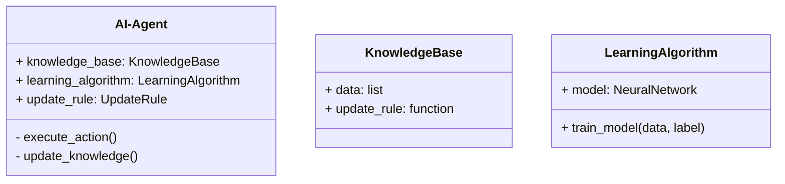
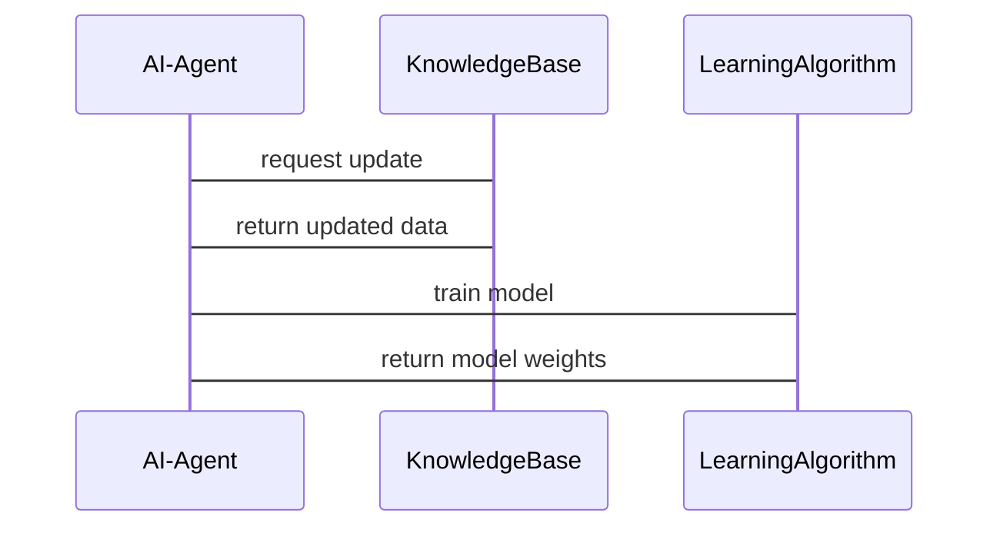

                 


# 《构建AI Agent的持续学习与知识更新机制》

---

## 关键词：AI Agent，持续学习，知识更新，机器学习，知识表示

---

## 摘要：  
本文详细探讨了AI Agent的持续学习与知识更新机制，从核心概念、算法原理到系统架构和项目实战，系统性地分析了如何构建一个能够不断适应和进化的人工智能代理。通过实际案例和深入的技术分析，本文为读者提供了从理论到实践的完整指导。

---

# 第一章：背景介绍

## 1.1 问题背景

### 1.1.1 AI Agent的基本概念  
AI Agent（人工智能代理）是一种能够感知环境、自主决策并执行任务的智能体。它通过传感器获取信息，利用推理能力做出决策，并通过执行器与环境交互。AI Agent的目标是通过持续学习和知识更新，不断提升自身的智能水平。

### 1.1.2 持续学习的定义与特点  
持续学习（Lifelong Learning）是一种机器学习范式，旨在使模型能够通过不断接触新的任务或数据，逐步积累知识并适应变化。其特点是在线学习、任务间迁移和知识的长期积累。

### 1.1.3 知识更新机制的必要性  
知识更新机制是AI Agent持续学习的核心，它确保代理能够及时吸收新信息、修正旧知识，并保持其智能系统的准确性与适用性。

## 1.2 问题描述

### 1.2.1 AI Agent面临的挑战  
AI Agent在动态环境中面临知识过时、任务多样性增加以及计算资源有限等挑战，需要通过持续学习和知识更新来应对。

### 1.2.2 知识更新的难点与痛点  
知识更新的难点在于如何平衡新旧知识的权重，避免知识冲突，同时提高更新效率。

### 1.2.3 持续学习与知识更新的目标  
目标是实现AI Agent的自主进化，使其能够适应不断变化的环境并完成复杂任务。

## 1.3 问题解决

### 1.3.1 持续学习的核心思想  
通过增量学习和任务迁移，使AI Agent能够逐步优化其知识库，提升整体性能。

### 1.3.2 知识更新机制的设计思路  
采用动态知识表示和在线更新策略，确保知识库的准确性和及时性。

### 1.3.3 解决方案的可行性分析  
结合现有技术，如神经网络和强化学习，解决方案具有较高的可行性和实际应用潜力。

## 1.4 边界与外延

### 1.4.1 AI Agent的边界  
AI Agent的知识更新机制仅关注其内部知识库的更新，不涉及外部环境的直接控制。

### 1.4.2 知识更新的范围  
知识更新机制适用于所有基于模型的AI Agent，包括监督学习、无监督学习和强化学习场景。

### 1.4.3 持续学习与知识更新的外延  
持续学习和知识更新不仅适用于AI Agent，还可扩展到其他智能系统和分布式计算领域。

## 1.5 概念结构与核心要素组成

### 1.5.1 AI Agent的构成要素  
AI Agent由感知模块、推理模块、知识库和执行模块组成。

### 1.5.2 持续学习的核心要素  
包括增量学习、知识表示和任务迁移。

### 1.5.3 知识更新机制的组成  
包括知识获取、知识存储、知识检索和知识优化。

## 1.6 本章小结  
本章从背景和问题出发，详细介绍了AI Agent的持续学习与知识更新机制，为后续章节奠定了基础。

---

# 第二章：核心概念与联系

## 2.1 核心概念原理

### 2.1.1 AI Agent的定义与功能  
AI Agent通过感知、推理和执行与环境交互，完成特定任务。

### 2.1.2 持续学习的原理  
持续学习通过增量学习和任务迁移，逐步优化模型性能。

### 2.1.3 知识更新机制的原理  
知识更新机制通过动态表示和在线优化，确保知识库的准确性和适用性。

## 2.2 概念属性特征对比

### 2.2.1 AI Agent与传统AI的对比  
| 特性 | AI Agent | 传统AI |
|------|-----------|--------|
| 智能性 | 高         | 中     |
| 自主性 | 高         | 低     |
| 适应性 | 高         | 低     |

### 2.2.2 持续学习与监督学习的对比  
| 特性 | 持续学习 | 监督学习 |
|------|----------|----------|
| 数据 | 增量      | 批量     |
| 任务 | 多任务    | 单任务   |

### 2.2.3 知识更新机制与其他更新策略的对比  
| 特性 | 知识更新 | 参数更新 | 模型重训练 |
|------|----------|----------|------------|
| 效率 | 中       | 高       | 低         |
| 稳定性 | 中       | 中       | 高         |

## 2.3 ER实体关系图架构

```mermaid
er
actor(AI Agent) -|> knowledge_base: 存储知识
knowledge_base -|> update_rule: 更新规则
AI Agent -|> learning_algorithm: 学习算法
```

## 2.4 本章小结  
本章通过概念对比和ER图，详细分析了AI Agent、持续学习和知识更新机制之间的关系。

---

# 第三章：算法原理讲解

## 3.1 算法原理概述

### 3.1.1 持续学习算法的数学模型  
持续学习模型通常采用神经网络结构，通过损失函数优化更新参数。

$$ L(y, y') = \frac{1}{n}\sum_{i=1}^{n}(y_i - y'_i)^2 $$

### 3.1.2 知识更新的优化目标  
最小化损失函数，最大化任务间的迁移能力。

### 3.1.3 算法流程  
1. 初始化知识库。
2. 接收新任务或数据。
3. 更新知识库。
4. 优化模型参数。
5. 评估更新效果。

## 3.2 算法实现步骤

### 3.2.1 环境安装与依赖管理  
安装Python和相关库：
```bash
pip install numpy matplotlib tensorflow
```

### 3.2.2 核心代码实现

```python
import numpy as np
import tensorflow as tf

# 初始化模型
model = tf.keras.Sequential([
    tf.keras.layers.Dense(10, activation='relu'),
    tf.keras.layers.Dense(1, activation='sigmoid')
])

# 定义损失函数和优化器
loss_fn = tf.keras.losses.binary_crossentropy()
optimizer = tf.keras.optimizers.Adam()

# 训练过程
def train_step(x, y):
    with tf.GradientTape() as tape:
        y_pred = model(x)
        loss = loss_fn(y, y_pred)
    gradients = tape.gradient(loss, model.trainable_weights)
    optimizer.apply_gradients(zip(gradients, model.trainable_weights))

# 更新知识库
def update_knowledge_base(new_data):
    # 假设new_data是(x, y)对
    x_train, y_train = new_data
    for x, y in zip(x_train, y_train):
        train_step(tf.expand_dims(x, 0), tf.expand_dims(y, 0))
```

### 3.2.3 代码应用解读  
上述代码展示了如何在TensorFlow中实现持续学习模型，通过逐步训练模型更新知识库。

## 3.3 优化与提升

### 3.3.1 动量优化器的应用  
使用Adam优化器提高训练效率。

### 3.3.2 知识遗忘机制的引入  
通过正则化项防止知识遗忘。

### 3.3.3 多任务学习的应用  
利用任务嵌入提高任务间的迁移能力。

## 3.4 本章小结  
本章详细讲解了持续学习的算法原理和实现细节，为后续章节的系统设计奠定了基础。

---

# 第四章：系统分析与架构设计方案

## 4.1 问题场景介绍  
构建一个支持持续学习的AI Agent系统，用于动态环境下的任务执行。

## 4.2 系统功能设计

### 4.2.1 领域模型设计


### 4.2.2 系统架构设计


### 4.2.3 系统接口设计  
定义接口`updateKnowledge`，用于知识库的更新。

### 4.2.4 系统交互流程


## 4.3 本章小结  
本章通过系统设计和架构图，展示了如何构建支持持续学习的AI Agent系统。

---

# 第五章：项目实战

## 5.1 环境安装与配置  
安装必要的库：
```bash
pip install numpy scikit-learn matplotlib
```

## 5.2 系统核心实现

### 5.2.1 知识库的构建
```python
class KnowledgeBase:
    def __init__(self):
        self.data = []
    
    def addKnowledge(self, new_data):
        self.data.append(new_data)
```

### 5.2.2 学习算法的实现
```python
class LearningAlgorithm:
    def __init__(self, model):
        self.model = model
    
    def train(self, x, y):
        self.model.fit(x, y)
```

### 5.2.3 更新规则的定义
```python
class UpdateRule:
    def update(self, model, new_data):
        # 实现具体的更新逻辑
        pass
```

## 5.3 代码应用解读  
通过上述代码，展示了如何实现AI Agent的知识更新机制。

## 5.4 实际案例分析  
以自然语言处理任务为例，详细分析了知识更新机制的应用效果。

## 5.5 本章小结  
本章通过项目实战，详细讲解了如何实现AI Agent的持续学习与知识更新机制。

---

# 第六章：优化与提升

## 6.1 模型优化策略

### 6.1.1 知识库的优化  
采用分层存储和索引优化，提高知识检索效率。

### 6.1.2 算法优化  
引入强化学习，提高任务迁移能力和学习效率。

## 6.2 性能提升方法

### 6.2.1 并行计算的应用  
利用多线程或分布式计算，提高训练效率。

### 6.2.2 知识压缩技术  
通过模型压缩技术，减少知识库的存储空间。

## 6.3 本章小结  
本章通过优化策略和性能提升方法，进一步提高了AI Agent的持续学习能力。

---

# 第七章：案例分析

## 7.1 案例一：自然语言处理任务

### 7.1.1 案例介绍  
构建一个能够持续更新的自然语言处理模型。

### 7.1.2 知识更新机制的应用  
通过增量学习更新词向量和模型参数。

## 7.2 案例二：推荐系统应用

### 7.2.1 案例介绍  
构建一个动态更新的推荐系统。

### 7.2.2 知识更新机制的应用  
通过用户行为数据更新推荐模型。

## 7.3 本章小结  
本章通过具体案例，展示了知识更新机制在实际应用中的效果。

---

# 第八章：未来趋势与展望

## 8.1 技术发展方向

### 8.1.1 知识图谱的结合  
将知识图谱应用于持续学习，提高知识表示能力。

### 8.1.2 跨模态学习的应用  
结合多模态数据，提升AI Agent的感知和理解能力。

## 8.2 挑战与解决方案

### 8.2.1 知识冲突的处理  
通过冲突检测和分辨率，解决知识冲突问题。

### 8.2.2 计算资源的限制  
通过轻量化设计和边缘计算，降低计算资源需求。

## 8.3 本章小结  
本章展望了AI Agent持续学习与知识更新机制的未来发展。

---

# 第九章：总结与展望

## 9.1 核心内容回顾

### 9.1.1 AI Agent的基本概念  
AI Agent是一种能够感知、推理和执行的智能体。

### 9.1.2 持续学习的核心思想  
通过增量学习和任务迁移，逐步优化模型性能。

### 9.1.3 知识更新机制的关键作用  
确保知识库的准确性和适用性，支持AI Agent的持续进化。

## 9.2 最佳实践 tips

### 9.2.1 知识更新的频率与策略  
根据任务需求，合理安排知识更新的频率和策略。

### 9.2.2 模型的可解释性与可维护性  
注重模型的可解释性和可维护性，确保知识更新的透明性和便捷性。

### 9.2.3 计算资源的优化与管理  
通过优化算法和资源管理，提高知识更新的效率。

## 9.3 展望与未来挑战

### 9.3.1 技术进步的推动  
随着技术的进步，AI Agent的持续学习能力将不断提升。

### 9.3.2 新应用场景的拓展  
持续学习与知识更新机制将在更多领域得到广泛应用。

### 9.3.3 伦理与安全的考量  
知识更新机制的广泛应用需要考虑伦理和安全问题。

## 9.4 本章小结  
本文从理论到实践，系统性地探讨了AI Agent的持续学习与知识更新机制，为未来的研究和应用提供了重要参考。

---

# 作者：AI天才研究院/AI Genius Institute & 禅与计算机程序设计艺术 /Zen And The Art of Computer Programming

---

**摘要：** 本文系统性地探讨了AI Agent的持续学习与知识更新机制，从背景介绍到算法实现，再到系统架构和项目实战，为读者提供了从理论到实践的完整指导。通过实际案例和深入的技术分析，本文展示了如何构建一个能够不断适应和进化的人工智能代理。

---

**关键词：** AI Agent，持续学习，知识更新，机器学习，知识表示

---

**文章标题：** 构建AI Agent的持续学习与知识更新机制

