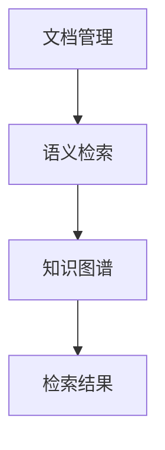
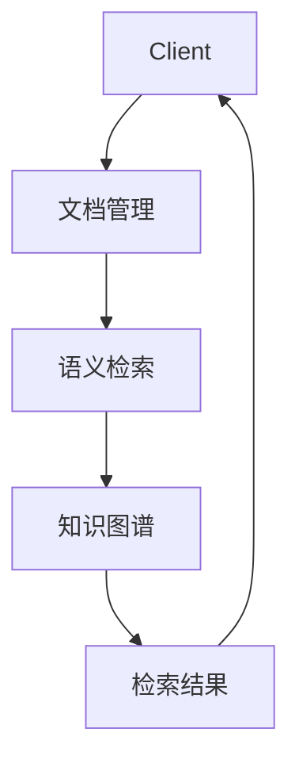
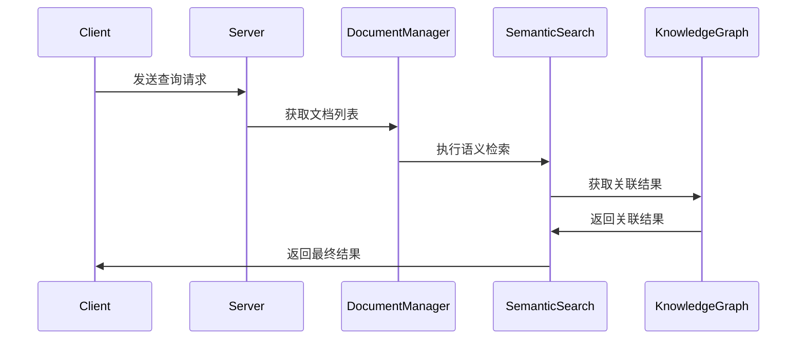

                 


# 构建智能企业文档管理系统：语义检索与知识链接

> 关键词：智能文档管理，语义检索，知识图谱，企业信息化，技术实现

> 摘要：本文详细探讨了构建智能企业文档管理系统的关键技术和实现方案。通过分析企业文档管理的痛点，结合语义检索和知识图谱技术，提出了一种创新的解决方案。文章从问题背景、核心概念、算法原理、系统架构到项目实战，全面解析了智能文档管理系统的构建过程，为企业信息化提供了一种高效、智能的管理方式。

---

## 第1章 问题背景与需求分析

### 1.1 问题背景

#### 1.1.1 传统文档管理系统的局限性
- **信息孤岛**：文档分散在不同的系统中，难以统一检索和管理。
- **语义理解不足**：基于关键词的检索无法准确理解用户意图。
- **知识关联性差**：文档之间的关系难以有效建立和利用。

#### 1.1.2 企业文档管理中的痛点
- **文档数量庞大**：企业积累的文档数量快速增长，人工管理效率低下。
- **信息查找困难**：用户难以快速找到所需信息，影响工作效率。
- **知识共享不足**：文档分散导致知识无法有效共享和复用。

#### 1.1.3 语义检索与知识链接的必要性
- **提升检索效率**：通过语义理解实现更精准的文档检索。
- **增强知识关联**：通过知识图谱建立文档之间的语义关联，提升知识共享效率。

### 1.2 问题描述

#### 1.2.1 文档管理的复杂性
- 文档类型多样：包括文本、图片、表格等多种形式。
- 文档生命周期长：从生成到归档、销毁，涉及多个环节。

#### 1.2.2 知识关联的需求
- 文档之间的关联性：例如，合同与项目之间的关系。
- 知识的动态更新：文档内容和关联关系需要动态维护。

#### 1.2.3 语义检索的实现挑战
- **语义理解的准确性**：如何准确理解用户的查询意图。
- **计算资源的消耗**：语义检索需要大量的计算资源。
- **实时性要求**：如何在实时场景中高效实现语义检索。

### 1.3 问题解决思路

#### 1.3.1 引入语义检索技术
- 使用自然语言处理技术，提升检索的准确性。
- 通过向量化技术，将文档转换为可计算的向量表示。

#### 1.3.2 构建知识图谱
- 通过知识抽取、构建和推理，建立文档之间的语义关联。
- 使用图数据库存储和管理知识图谱。

#### 1.3.3 实现文档间的关系链接
- 基于知识图谱，建立文档之间的语义关系。
- 通过关系推理，扩展检索结果的关联性。

### 1.4 问题的边界与外延

#### 1.4.1 系统功能边界
- **文档管理**：包括文档的存储、检索、归档等基本功能。
- **语义检索**：仅限于基于文档内容的语义理解。
- **知识图谱**：仅限于文档之间的语义关联。

#### 1.4.2 与相关系统的区别
- 与传统文档管理系统的区别：引入语义检索和知识图谱技术。
- 与搜索引擎的区别：专注于企业文档的管理。

#### 1.4.3 适用场景与限制
- 适用于需要高效文档管理和知识共享的企业场景。
- 限制：仅支持文档内容的语义检索，不支持其他类型数据。

### 1.5 核心概念与组成要素

#### 1.5.1 核心概念的定义
- **语义检索**：基于文档内容的语义理解进行检索。
- **知识图谱**：通过构建语义网络，表示文档之间的关系。

#### 1.5.2 组成要素的对比
- **语义检索**：依赖于向量化技术。
- **知识图谱**：依赖于知识抽取和推理技术。

---

## 第2章 语义检索与知识图谱的核心概念

### 2.1 语义检索的基本原理

#### 2.1.1 传统检索与语义检索的区别
- **传统检索**：基于关键词匹配，无法理解语义。
- **语义检索**：基于向量空间模型，理解文档内容的语义。

#### 2.1.2 基于向量的语义检索
- **向量化技术**：将文档转换为向量表示。
- **余弦相似度**：通过计算向量之间的相似度进行检索。

#### 2.1.3 语义检索的关键技术
- **自然语言处理**：包括分词、句法分析、语义理解等。
- **向量索引**：包括ANN（Approximate Nearest Neighbor）索引技术。

### 2.2 知识图谱的构建与应用

#### 2.2.1 知识图谱的定义与特点
- **知识图谱**：一种图结构的数据，表示实体及其关系。
- **特点**：语义丰富、结构化、可扩展。

#### 2.2.2 知识图谱的构建流程
- **知识抽取**：从文档中提取实体、关系和属性。
- **知识融合**：将多个来源的知识进行整合。
- **知识存储**：使用图数据库存储知识图谱。

#### 2.2.3 知识图谱在文档管理中的应用
- **语义检索**：通过知识图谱进行语义关联检索。
- **知识共享**：通过知识图谱实现文档之间的知识共享。

### 2.3 语义检索与知识图谱的关联

#### 2.3.1 语义检索如何利用知识图谱
- **语义理解**：通过知识图谱理解文档内容。
- **关系推理**：通过知识图谱进行关系推理，扩展检索结果。

#### 2.3.2 知识图谱如何增强语义检索
- **语义扩展**：通过知识图谱实现语义的扩展检索。
- **关联推理**：通过知识图谱进行关联推理，提升检索的准确性。

#### 2.3.3 两者的结合方式
- **嵌入式结合**：将知识图谱嵌入语义检索系统中。
- **分层结合**：分别实现语义检索和知识图谱，再进行结合。

### 2.4 核心概念的对比分析

#### 2.4.1 语义检索与全文检索的对比
- **全文检索**：基于关键词匹配，无法理解语义。
- **语义检索**：基于向量空间模型，理解文档内容的语义。

#### 2.4.2 知识图谱与传统数据库的对比
- **传统数据库**：存储结构化数据，无法表示语义关系。
- **知识图谱**：通过图结构表示语义关系，支持复杂的语义查询。

#### 2.4.3 语义检索与知识图谱的优缺点
- **语义检索**：优点是理解能力强，缺点是计算资源消耗大。
- **知识图谱**：优点是语义丰富，缺点是构建和维护成本高。

---

## 第3章 语义检索算法原理与实现

### 3.1 语义检索的基本算法

#### 3.1.1 基于余弦相似度的检索
- **余弦相似度公式**
$$ \text{余弦相似度} = \frac{\vec{A} \cdot \vec{B}}{|\vec{A}| |\vec{B}|} $$

#### 3.1.2 基于BM25的检索算法
- **BM25公式**
$$ BM25 = \frac{tf \cdot (k_1 + 1)}{tf + k_1} \cdot \frac{k_2 + 1}{dw} $$

#### 3.1.3 基于深度学习的检索算法
- **预训练语言模型**：如BERT、RoBERTa等。
- **相似度计算**：使用模型的输出向量计算余弦相似度。

### 3.2 基于向量的语义检索流程

#### 3.2.1 文档向量化过程
- **分词**：将文档分割成词语或短语。
- **编码**：使用预训练模型对分词后的文本进行编码，生成向量表示。

#### 3.2.2 向量索引的构建
- **ANN索引**：使用LSH（局部敏感哈希）或树状结构构建索引。
- **向量存储**：将向量存储到数据库中，支持高效的查询。

#### 3.2.3 查询向量的生成与匹配
- **查询处理**：将查询文本编码为向量。
- **相似度计算**：计算查询向量与索引中向量的相似度。
- **结果排序**：根据相似度排序，返回最相关的文档。

### 3.3 算法实现的详细步骤

#### 3.3.1 文档预处理
```python
def preprocess_document(doc):
    tokens = tokenizer.encode(doc)
    return tokens
```

#### 3.3.2 向量计算
```python
def get_vector(tokens):
    vector = model.encode(tokens)
    return vector
```

#### 3.3.3 索引构建与查询
```python
def build_index(documents):
    vectors = [get_vector(doc) for doc in documents]
    index = AnnIndex(vectors)
    return index

def search_index(query, index):
    query_vector = get_vector(query)
    results = index.query(query_vector, top_k=5)
    return results
```

### 3.4 算法的数学模型与公式

#### 3.4.1 余弦相似度公式
$$ \text{余弦相似度} = \frac{\vec{A} \cdot \vec{B}}{|\vec{A}| |\vec{B}|} $$

#### 3.4.2 BM25公式
$$ BM25 = \frac{tf \cdot (k_1 + 1)}{tf + k_1} \cdot \frac{k_2 + 1}{dw} $$

---

## 第4章 知识图谱

### 4.1 知识图谱的构建与应用

#### 4.1.1 知识图谱的定义与特点
- **定义**：一种图结构的数据，表示实体及其关系。
- **特点**：语义丰富、结构化、可扩展。

#### 4.1.2 知识图谱的构建流程
- **知识抽取**：从文档中提取实体、关系和属性。
- **知识融合**：将多个来源的知识进行整合。
- **知识存储**：使用图数据库存储知识图谱。

#### 4.1.3 知识图谱在文档管理中的应用
- **语义检索**：通过知识图谱进行语义关联检索。
- **知识共享**：通过知识图谱实现文档之间的知识共享。

### 4.2 语义检索与知识图谱的结合

#### 4.2.1 语义检索如何利用知识图谱
- **语义理解**：通过知识图谱理解文档内容。
- **关系推理**：通过知识图谱进行关系推理，扩展检索结果。

#### 4.2.2 知识图谱如何增强语义检索
- **语义扩展**：通过知识图谱实现语义的扩展检索。
- **关联推理**：通过知识图谱进行关联推理，提升检索的准确性。

#### 4.2.3 两者的结合方式
- **嵌入式结合**：将知识图谱嵌入语义检索系统中。
- **分层结合**：分别实现语义检索和知识图谱，再进行结合。

### 4.3 知识图谱的构建与实现

#### 4.3.1 知识抽取
```python
def extract Entities(doc):
    entities = []
    # 使用NLP工具提取实体
    for entity in entities:
        entities.append(entity)
    return entities
```

#### 4.3.2 知识融合
```python
def merge Knowledge(knowledge1, knowledge2):
    merged_knowledge = {}
    merged_knowledge['entities'] = knowledge1['entities'] + knowledge2['entities']
    merged_knowledge['relations'] = knowledge1['relations'] + knowledge2['relations']
    return merged_knowledge
```

#### 4.3.3 知识存储
```python
def store Knowledge(knowledge):
    graph_db.add_entities(knowledge['entities'])
    graph_db.add_relations(knowledge['relations'])
```

---

## 第5章 项目实战

### 5.1 环境安装与配置

#### 5.1.1 安装依赖
```bash
pip install numpy spacy transformers networkx
```

#### 5.1.2 环境配置
```bash
# 配置Spacy中文模型
python -m spacy download zh_core_web_sm
```

### 5.2 系统功能设计

#### 5.2.1 功能模块划分
- **文档管理模块**：负责文档的存储和管理。
- **语义检索模块**：负责基于向量的语义检索。
- **知识图谱模块**：负责知识图谱的构建和应用。

#### 5.2.2 功能流程图


### 5.3 系统架构设计

#### 5.3.1 系统架构图


### 5.4 系统接口设计

#### 5.4.1 接口定义
- **文档上传接口**：`POST /api/upload`
- **语义检索接口**：`POST /api/search`
- **知识图谱构建接口**：`POST /api/knowledge`

#### 5.4.2 接口示例
```json
{
    "query": "项目计划书",
    "top_k": 5
}
```

### 5.5 系统交互流程

#### 5.5.1 交互序列图


---

## 第6章 最佳实践与总结

### 6.1 最佳实践

#### 6.1.1 技术选型
- **向量化模型**：选择合适的预训练模型，如BERT、RoBERTa。
- **图数据库**：选择支持复杂查询的图数据库，如Neo4j、OrientDB。

#### 6.1.2 性能优化
- **索引优化**：使用ANN索引优化向量检索效率。
- **分片与并行**：通过分片和并行计算提升系统性能。

### 6.2 注意事项

#### 6.2.1 数据安全
- 确保文档数据的安全性，防止数据泄露。
- 遵守相关法律法规，保护用户隐私。

#### 6.2.2 系统维护
- 定期更新知识图谱，保持知识的准确性。
- 监控系统性能，及时优化系统架构。

### 6.3 项目小结

#### 6.3.1 核心成果
- 成功构建了一个基于语义检索和知识图谱的企业文档管理系统。
- 提供了高效的文档检索和知识共享功能。

#### 6.3.2 经验总结
- 语义检索和知识图谱的结合能够显著提升文档管理的效率。
- 系统的设计需要充分考虑可扩展性和可维护性。

---

## 作者

作者：AI天才研究院/AI Genius Institute & 禅与计算机程序设计艺术/Zen And The Art of Computer Programming

