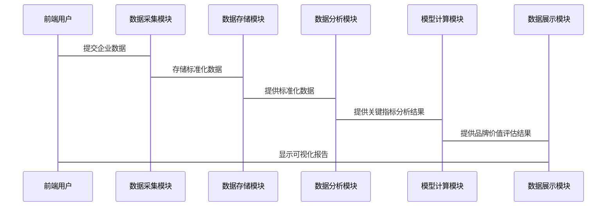

                 


# 沃伦·巴菲特的品牌价值评估方法

## 关键词：品牌价值评估，巴菲特，经济护城河，投资策略，价值投资，企业评估

## 摘要

沃伦·巴菲特是全球最著名的投资者之一，他的价值投资理念深刻影响了全球的投资者和企业。本文将探讨巴菲特的品牌价值评估方法，从核心概念到实际应用，结合技术背景和系统设计，详细分析如何通过巴菲特的方法来评估品牌价值。文章将涵盖品牌价值评估的背景、核心概念、数学模型、系统架构和实战案例，帮助读者全面理解并应用这些方法。

---

## 第一部分：品牌价值评估的背景与重要性

### 第1章：背景介绍

#### 1.1 品牌价值评估的基本概念

- **1.1.1 品牌的定义与内涵**
  - 品牌是企业与消费者之间建立的长期关系，是企业核心竞争力的体现。
  - 品牌价值是品牌在市场中所能创造的超额收益，是企业长期竞争优势的反映。

- **1.1.2 品牌价值的定义**
  - 品牌价值是品牌在企业资产中所占的比例，是企业长期盈利能力的体现。
  - 品牌价值不仅包括品牌知名度，还包括品牌忠诚度和品牌强度。

- **1.1.3 品牌价值评估的重要性**
  - 品牌价值评估是企业战略决策的重要依据，能够帮助企业在收购、合并和投资中做出明智决策。
  - 品牌价值评估是投资者评估企业长期价值的重要工具，能够帮助投资者发现具有长期竞争优势的企业。

#### 1.2 沃伦·巴菲特的投资哲学

- **1.2.1 巴菲特的生平简介**
  - 巴菲特是美国著名投资者，伯克希尔·哈撒韦公司创始人，以其长期的价值投资策略闻名。
  - 巴菲特强调长期投资，寻找具有强大竞争优势的企业，这些企业通常具有强大的品牌价值和经济护城河。

- **1.2.2 巴菲特的价值投资理念**
  - 巴菲特认为，投资的本质是寻找具有长期竞争优势的企业，这些企业能够在市场中持续创造价值。
  - 他强调企业的护城河，包括成本优势、品牌优势、技术优势等，这些因素能够保护企业在竞争中保持领先地位。

- **1.2.3 品牌价值在巴菲特投资中的地位**
  - 巴菲特认为，品牌是企业的重要资产，强大的品牌能够为企业带来长期的超额收益。
  - 品牌价值是企业长期竞争优势的重要体现，是巴菲特选择投资对象的重要标准。

#### 1.3 品牌在企业中的战略地位

- **1.3.1 品牌作为企业核心资产**
  - 品牌是企业的核心资产之一，是企业长期竞争优势的集中体现。
  - 强大的品牌能够为企业带来更高的客户忠诚度和市场占有率，从而提高企业的盈利能力。

- **1.3.2 品牌对股东价值的影响**
  - 品牌价值是股东价值的重要组成部分，是企业长期盈利能力的体现。
  - 品牌价值高的企业通常具有更高的股价和市场估值，能够为股东带来更高的回报。

- **1.3.3 品牌在长期投资中的作用**
  - 品牌是企业长期投资的核心考量因素，是企业抵御短期市场波动的重要保障。
  - 强大的品牌能够为企业在市场波动中提供稳定性，帮助企业在长期投资中保持价值。

---

## 第二部分：品牌价值评估的核心概念

### 第2章：品牌价值评估的核心概念

#### 2.1 品牌资产的构成

- **2.1.1 品牌认知度**
  - 品牌认知度是品牌在市场中的知名度，是品牌被消费者识别和记忆的能力。
  - 认知度高的品牌通常具有更高的市场占有率和客户忠诚度。

- **2.1.2 品牌忠诚度**
  - 品牌忠诚度是消费者对品牌的情感依赖和持续购买意愿的体现。
  - 忠诚度高的品牌通常能够在市场竞争中保持优势，获得更高的市场份额。

- **2.1.3 品牌联想**
  - 品牌联想是指消费者对品牌的情感和文化联想，是品牌在消费者心中形成的形象和价值。
  - 强大的品牌联想能够增强品牌的价值，提升品牌的市场地位。

#### 2.2 品牌强度分析

- **2.2.1 品牌强度的定义**
  - 品牌强度是品牌在市场上竞争力的体现，是品牌抵御市场竞争的能力。
  - 强度高的品牌通常具有强大的市场地位和竞争优势，能够在市场中保持长期的盈利能力。

- **2.2.2 品牌强度的影响因素**
  - 品牌强度受多种因素影响，包括市场占有率、品牌认知度、品牌忠诚度、品牌联想等。
  - 品牌强度高的企业通常具有更强的市场影响力和消费者忠诚度。

- **2.2.3 品牌强度与企业竞争力的关系**
  - 品牌强度是企业竞争力的重要组成部分，是企业在市场中保持领先地位的关键因素。
  - 强大的品牌强度能够为企业带来更高的市场占有率和盈利能力，是企业长期竞争优势的重要体现。

#### 2.3 品牌生命周期

- **2.3.1 品牌生命周期的阶段划分**
  - 品牌生命周期通常分为导入期、成长期、成熟期和衰退期四个阶段。
  - 不同阶段的品牌价值和市场表现有所不同，品牌价值在成熟期达到峰值，衰退期逐渐下降。

- **2.3.2 不同阶段的品牌价值评估**
  - 在导入期，品牌价值较低，但具有较高的增长潜力。
  - 在成长期，品牌价值逐渐提升，市场占有率稳步增长。
  - 在成熟期，品牌价值达到峰值，市场占有率稳定。
  - 在衰退期，品牌价值逐渐下降，市场占有率逐渐被竞争对手侵蚀。

- **2.3.3 品牌生命周期对企业战略的影响**
  - 企业需要根据品牌生命周期的不同阶段制定相应的战略，以维持或提升品牌价值。
  - 在导入期和成长期，企业需要加大品牌推广和市场拓展力度，提升品牌认知度和市场占有率。
  - 在成熟期和衰退期，企业需要采取品牌重塑或多元化战略，以延缓品牌衰退，提升品牌价值。

---

## 第三部分：巴菲特的品牌价值评估方法

### 第3章：巴菲特品牌评估的核心指标

#### 3.1 经济护城河分析

- **3.1.1 经济护城河的定义**
  - 经济护城河是企业竞争对手难以模仿或超越的竞争优势，是企业长期盈利能力的保障。
  - 经济护城河可以是成本优势、品牌优势、技术优势、网络效应等。

- **3.1.2 不同类型的经济护城河**
  - 成本优势：企业通过规模经济或技术创新降低成本，提高盈利能力。
  - 品牌优势：强大的品牌能够吸引更多的消费者，提高市场占有率。
  - 技术优势：企业通过技术创新获得竞争优势，提升产品附加值。
  - 网络效应：产品或服务的用户数量越多，其价值越大，形成正反馈循环。

- **3.1.3 经济护城河与品牌价值的关系**
  - 经济护城河是品牌价值的重要来源，强大的护城河能够为企业带来长期的超额收益。
  - 经济护城河越强大，品牌价值越高，企业的长期竞争优势越明显。

#### 3.2 核心竞争力分析

- **3.2.1 核心竞争力的定义**
  - 核心竞争力是企业能够长期为客户创造价值的关键能力，是品牌价值的重要来源。
  - 核心竞争力通常体现在企业的技术、管理、品牌、渠道等方面。

- **3.2.2 核心竞争力的评估维度**
  - 技术创新能力：企业是否具有持续的技术创新能力，能够推出新产品或改进现有产品。
  - 品牌影响力：企业品牌在市场中的认知度和忠诚度，是否具有强大的品牌影响力。
  - 成本控制能力：企业是否能够通过规模经济或技术创新降低成本，提高盈利能力。
  - 市场占有率：企业在目标市场中的占有率，是否具有明显的竞争优势。

- **3.2.3 核心竞争力与品牌价值的关系**
  - 核心竞争力是品牌价值的重要来源，强大的核心竞争力能够为企业带来长期的超额收益。
  - 核心竞争力越强大，品牌价值越高，企业的长期竞争优势越明显。

#### 3.3 财务指标分析

- **3.3.1 净利润率**
  - 净利润率是企业净利润与营业收入的比率，是衡量企业盈利能力的重要指标。
  - 净利润率高的企业通常具有较强的盈利能力，能够为股东创造更高的价值。

- **3.3.2 投资回报率（ROE）**
  - 投资回报率是企业净利润与 shareholders' equity 的比率，是衡量企业使用股东资金效率的重要指标。
  - 投资回报率高的企业通常具有较高的股东价值，能够为股东带来更高的回报。

- **3.3.3 财务健康状况对品牌价值的影响**
  - 财务健康状况是企业品牌价值的重要影响因素，健康的财务状况能够提升企业的信用评级和市场形象。
  - 强大的财务实力是企业应对市场波动和经济衰退的重要保障，能够增强品牌价值。

---

### 第4章：巴菲特的品牌价值评估方法论

#### 4.1 品牌价值的定性评估

- **4.1.1 企业商业模式分析**
  - 企业的商业模式是其价值创造的核心，强大的商业模式能够为企业带来持续的盈利能力。
  - 企业商业模式的分析包括收入来源、成本结构、关键资源和能力等方面。

- **4.1.2 企业竞争优势分析**
  - 企业竞争优势是品牌价值的重要来源，强大的竞争优势能够为企业带来长期的超额收益。
  - 企业竞争优势的分析包括成本优势、品牌优势、技术优势、网络效应等方面。

- **4.1.3 企业治理结构分析**
  - 企业治理结构是企业长期发展的基础，良好的治理结构能够保障企业的稳定发展。
  - 企业治理结构的分析包括董事会结构、高管团队、股权结构等方面。

#### 4.2 品牌价值的定量评估

- **4.2.1 品牌价值的数学模型**
  - 品牌价值可以通过多种数学模型进行评估，常见的模型包括市场价值法、DCF模型、经济增加值法等。
  - 市场价值法：基于企业的市场价值和行业平均市盈率进行评估。
  - DCF模型：基于企业的未来现金流折现值进行评估。
  - 经济增加值法：基于企业的净利润与资本成本的差异进行评估。

- **4.2.2 品牌价值的评估指标**
  - 品牌价值的评估指标包括品牌认知度、品牌忠诚度、品牌强度、经济护城河、核心竞争力等。
  - 这些指标可以通过定量和定性方法进行综合评估，得出企业的品牌价值。

#### 4.3 综合评估与决策

- **4.3.1 综合评估方法**
  - 综合评估方法是将定性和定量评估结果进行综合，得出企业的品牌价值。
  - 综合评估方法通常包括加权平均、层次分析法等，能够将多种因素进行综合考虑。

- **4.3.2 品牌价值的决策应用**
  - 品牌价值评估是企业战略决策的重要依据，能够帮助企业制定收购、合并、投资等重大决策。
  - 品牌价值评估也是投资者评估企业长期价值的重要工具，能够帮助投资者发现具有长期竞争优势的企业。

---

## 第五部分：系统设计与实现

### 第5章：系统架构设计

#### 5.1 问题场景介绍

- 企业需要进行品牌价值评估，以支持战略决策和投资评估。
- 传统的品牌价值评估方法通常依赖于定性分析，缺乏系统性和量化能力。
- 需要构建一个智能化的品牌价值评估系统，能够将定性和定量因素结合起来，提供准确的品牌价值评估结果。

#### 5.2 系统功能设计

- **领域模型设计（Mermaid 类图）**
  ```mermaid
  classDiagram
      class 品牌价值评估系统 {
          输入参数：企业数据
          输出结果：品牌价值
          功能模块：数据采集、数据分析、模型计算、结果展示
      }
      class 数据采集模块 {
          输入：企业财务数据、市场数据、行业数据
          输出：标准化数据
      }
      class 数据分析模块 {
          输入：标准化数据
          输出：关键指标分析结果
      }
      class 模型计算模块 {
          输入：关键指标分析结果
          输出：品牌价值评估结果
      }
      class 结果展示模块 {
          输入：品牌价值评估结果
          输出：可视化报告
      }
      品牌价值评估系统 --> 数据采集模块
      品牌价值评估系统 --> 数据分析模块
      品牌价值评估系统 --> 模型计算模块
      品牌价值评估系统 --> 结果展示模块
  ```

- **系统架构设计（Mermaid 上下文图）**
  ```mermaid
  context 品牌价值评估系统 {
      前端界面 --> 数据采集模块
      数据采集模块 --> 数据存储模块
      数据存储模块 --> 数据分析模块
      数据分析模块 --> 模型计算模块
      模型计算模块 --> 结果展示模块
      结果展示模块 --> 前端界面
  }
  ```

#### 5.3 系统接口设计

- **输入接口**
  - 数据采集模块：企业财务数据、市场数据、行业数据
  - 数据分析模块：标准化数据
  - 模型计算模块：关键指标分析结果

- **输出接口**
  - 数据展示模块：品牌价值评估结果
  - 前端界面：可视化报告

#### 5.4 系统交互设计（Mermaid 序列图）



---

## 第六部分：项目实战

### 第6章：品牌价值评估系统实现

#### 6.1 环境安装

- 需要安装Python、Jupyter Notebook、Pandas、NumPy、Matplotlib等工具。
- 安装步骤：
  ```bash
  pip install pandas numpy matplotlib
  ```

#### 6.2 核心代码实现

```python
import pandas as pd
import numpy as np
import matplotlib.pyplot as plt

# 数据采集模块
def collect_data():
    # 示例：从CSV文件读取数据
    data = pd.read_csv('brand_value.csv')
    return data

# 数据分析模块
def analyze_data(data):
    # 示例：计算品牌价值的关键指标
    roe = data['ROE'].mean()
    net_profit_margin = data['Net Profit Margin'].mean()
    return roe, net_profit_margin

# 模型计算模块
def calculate_brand_value(roe, net_profit_margin):
    # 示例：使用简单的加权模型计算品牌价值
    brand_value = (roe * 0.5) + (net_profit_margin * 0.5)
    return brand_value

# 结果展示模块
def display_results(brand_value):
    plt.figure(figsize=(6, 4))
    plt.title('Brand Value Analysis')
    plt.bar('Brand Value', brand_value)
    plt.show()

# 主程序
def main():
    data = collect_data()
    roe, net_profit_margin = analyze_data(data)
    brand_value = calculate_brand_value(roe, net_profit_margin)
    display_results(brand_value)

if __name__ == "__main__":
    main()
```

#### 6.3 案例分析

- **案例背景**
  - 某公司是一家知名的消费品企业，需要评估其品牌价值。
  - 数据包括ROE、净利润率、市场占有率等。

- **数据处理**
  - 使用Pandas读取数据并进行清洗和标准化处理。
  - 计算关键指标，包括ROE、净利润率、市场占有率等。

- **模型计算**
  - 使用加权模型计算品牌价值，权重根据指标的重要性进行调整。
  - 示例：ROE权重为0.5，净利润率权重为0.5，品牌价值=ROE*0.5 + 净利润率*0.5。

- **结果展示**
  - 使用Matplotlib绘制柱状图，展示品牌价值评估结果。
  - 提供可视化报告，包括品牌价值排名、关键指标分析等。

---

## 第七部分：总结与展望

### 第7章：总结与展望

#### 7.1 总结

- 本文详细探讨了巴菲特的品牌价值评估方法，从核心概念到实际应用，结合技术背景和系统设计，帮助读者全面理解并应用这些方法。
- 通过系统的分析和实战案例，展示了如何将巴菲特的评估方法转化为技术实现，为企业的品牌价值评估提供了新的思路和工具。

#### 7.2 最佳实践 tips

- 在实际应用中，建议企业结合自身特点和行业特点，选择合适的品牌价值评估方法。
- 系统设计中，建议企业结合数据驱动的方法，利用大数据和人工智能技术，提升品牌价值评估的准确性和效率。

#### 7.3 注意事项

- 品牌价值评估是一项复杂的工作，需要结合定性和定量因素进行综合评估。
- 在实际应用中，需要注意数据的准确性和完整性，避免因数据问题导致评估结果偏差。

#### 7.4 拓展阅读

- 建议读者进一步阅读巴菲特的著作，深入了解其投资哲学和价值评估方法。
- 参考相关技术书籍，学习大数据和人工智能技术在品牌价值评估中的应用。

---

## 作者信息

作者：AI天才研究院/AI Genius Institute & 禅与计算机程序设计艺术/Zen And The Art of Computer Programming

